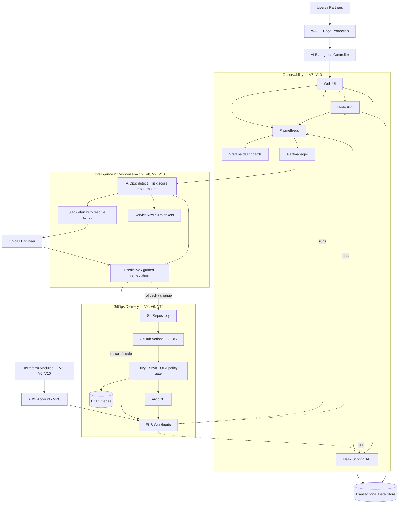

# Express Reliability Platform — Learning Program

## Welcome

When you use a banking app to transfer money at midnight, or a hospital system checks a patient's records before surgery, there is a complete technology system running silently in the background. That system must stay online 24 hours a day, protect sensitive data, recover automatically when something breaks, and alert engineers immediately when something goes wrong.

This program teaches you to build exactly that kind of system — step by step, starting from zero.

**No prior experience required.** You will install tools, write code, break things on purpose, and fix them. By the final version, you will have a complete platform that a bank or healthcare company can review and deploy.

---

## What Is a Reliability Platform?

Think of your platform like a hospital building:

- The **foundation** (V1–V3) is the concrete and steel — local app, container image, then a multi-service stack — it must be solid before anything else is added.
- The **cloud and observability layer** (V4–V6) puts the platform on AWS, instruments it with metrics and alerts, then organizes infrastructure into reusable, cost-aware modules with Helm.
- The **operational intelligence layer** (V7–V8) detects, scores, summarizes, and routes incidents — into Slack, ServiceNow, and Jira — and exercises the pipeline with chaos drills.
- The **automation layer** (V9–V10) is the self-operating equipment — V9 adds predictive remediation, and V10 closes the loop with AIOps, GitOps (ArgoCD), and observability/alerting that routes incidents to Slack with the exact script an engineer runs to resolve them.
- The **capstone** is a standalone, self-contained platform — it bundles the application services, CI/CD (GitHub Actions), GitOps (ArgoCD), AIOps, observability and alerting, and FinOps into one deployable project you present in interviews and to clients.

---

## Who Is This For?

| You are... | This program works for you |
|---|---|
| Completely new to technology | Yes — start at Version 1 and follow every step |
| A student or recent graduate | Yes — this builds a real portfolio |
| An IT support or helpdesk professional | Yes — this is the bridge to engineering roles |
| A working engineer | Yes — later versions fill skill gaps fast |
| A hiring manager or team lead | Yes — engineers who finish this are job-ready |

---

## Key Concepts in Plain Language

You will see these words throughout the program. You do not need to memorize them now. Read through once, then refer back any time something is unclear.

| Word | What It Means |
|---|---|
| **Program / Application** | A set of instructions a computer follows — like a recipe the computer executes |
| **Server** | A computer that runs programs other people can access over the internet |
| **Service** | A program that does one specific job — for example: "check user login" or "calculate a risk score" |
| **API** | How two programs talk to each other — like a waiter who takes your order to the kitchen and brings back your food |
| **Terminal / Command Line** | A text window where you type instructions directly to your computer — faster and more powerful than clicking buttons |
| **Cloud** | Computers you rent from Amazon, Microsoft, or Google to run your programs — instead of buying your own servers |
| **Docker / Container** | A box that holds your program and everything it needs to run — so it works the same on every computer |
| **Terraform** | A tool that creates cloud infrastructure by reading code files — instead of clicking through websites manually |
| **Kubernetes** | A system that manages many containers at once and automatically restarts them if they crash |
| **Monitoring** | Watching your system's numbers in real time — like a car dashboard showing speed, fuel, and engine temperature |
| **SLO (Service Level Objective)** | A performance promise — for example: "99.9% of requests will respond in under 500 milliseconds" |
| **Incident** | When part of your system breaks or behaves unexpectedly |
| **Runbook** | A step-by-step guide engineers follow to fix a specific kind of incident — like a fire drill procedure |
| **Chaos Engineering** | Intentionally breaking your system in a controlled way to find weaknesses before users are affected |
| **AIOps** | Automation that detects incidents, scores their risk, and suggests fixes — faster than any human alone |
| **ITSM** | A ticketing system (ServiceNow, Jira) that tracks every incident so nothing gets lost and auditors can review |
| **CI/CD** | Automatic testing and deployment — every code change is tested and deployed without manual steps |
| **IaC (Infrastructure as Code)** | Writing server and cloud setup as code files — so it is repeatable, reviewable, and version-controlled |
| **Slack Webhook** | A URL your system calls to post a message into a Slack channel automatically |
| **SSH Key** | A secure digital key that proves your identity when connecting to servers or GitHub — safer than a password |

---

## What to Install (Before You Start Version 1)

Install these free tools. Each row includes the download link. You do not need everything on day one — each version tells you exactly what is needed.

| Tool | What It Does | Where to Get It |
|---|---|---|
| **Node.js LTS** | Runs JavaScript programs | https://nodejs.org |
| **Git** | Saves and shares your code | https://git-scm.com |
| **VS Code** | Free code editor | https://code.visualstudio.com |
| **Docker Desktop** | Runs containers on your laptop | https://www.docker.com/products/docker-desktop |
| **Terraform** | Builds cloud infrastructure from code | https://developer.hashicorp.com/terraform/install |
| **AWS CLI** | Controls Amazon Web Services from your terminal | https://aws.amazon.com/cli |
| **kubectl** | Controls Kubernetes clusters from your terminal | https://kubernetes.io/docs/tasks/tools |
| **Python 3** | Runs Python scripts | https://www.python.org/downloads |

---

## Course Map

Each version builds directly on the previous one. **Never skip a version.**

| Version | What You Learn | Real-World Value |
|---|---|---|
| **V1** | Run your first program on your laptop | Every engineer does this before touching a shared server |
| **V2** | Containerize the single service with Docker | Same artifact runs identically on every machine |
| **V3** | Orchestrate Node API, Flask API, and Web UI with Docker Compose | One command brings up the full local platform |
| **V4** | Deploy to AWS: ECR, ECS, VPC, ALB, S3, DynamoDB | Rebuild the entire cloud stack from code in minutes |
| **V5** | Monitoring with Prometheus, Grafana, Alertmanager — plus an intro to Terraform | See response time, error rate, saturation, and provision the cloud with code |
| **V6** | Apps, platform, Helm charts, and operational scripts | Disciplined, repeatable infrastructure any engineer can recreate |
| **V7** | AIOps incident scoring, summaries, and Slack routing | Score and triage incidents automatically |
| **V8** | ServiceNow + Jira ticket automation and chaos drills | File tickets in 60 seconds, not 10 minutes — and exercise the full pipeline |
| **V9** | Healthcare telemetry and predictive remediation | Detect, alert, ticket, and begin recovery before a human pages |
| **V10** | AIOps + GitOps (ArgoCD) + Observability/Alerting with resolve-by-script | Detect, deploy, alert, and resolve incidents end to end — the operating brain |
| **Capstone** | Standalone platform: apps + CI/CD + GitOps + AIOps + Observability/Alerting + FinOps | A finished, self-contained system ready for enterprise delivery or an interview |

---

## Platform Architecture

The diagram below is the architecture you build incrementally across V1–V10 and present from the
capstone. Users hit an edge-protected ingress; GitOps (ArgoCD) delivers the workloads from Git;
observability watches the golden signals; and the intelligence layer turns alerts into incidents that
are routed to Slack with a one-command fix and reconciled back to Git state.



> Full written breakdown: [capstone reference architecture](express-reliability-platform-capstone/docs/reference-architecture.md).

---

## The 5 Phases

```
Phase 1 — Local Foundations (V1–V3)
  Run the app, containerize it, orchestrate the three services on Docker Compose.

Phase 2 — Cloud + Observability (V4–V6)
  Deploy to AWS, instrument with Prometheus/Grafana, organize infrastructure with Helm.

Phase 3 — Operational Intelligence (V7–V8)
  Score incidents with AIOps, route to Slack, auto-file ServiceNow/Jira tickets, run chaos drills.

Phase 4 — Predictive Remediation (V9)
  Healthcare telemetry feeds predictive remediation that recovers before a human pages.

Phase 5 — The Operating Brain (V10)
  AIOps detection + scoring, GitOps delivery with ArgoCD, and observability/alerting that
  routes incidents to Slack with the exact script the engineer runs to resolve them.

Capstone — Standalone Platform
  A self-contained project bundling the apps, CI/CD (GitHub Actions), GitOps (ArgoCD), AIOps,
  observability + alerting, and FinOps into one documented, presentable system.
```

---

## The Training Loop (Used in Every Version)

Every version follows the same 8-step loop. This is exactly how senior engineers work:

| Step | What You Do |
|---|---|
| **1 — Understand** | Read the purpose and key concepts before touching anything |
| **2 — Build** | Follow exact commands in exact order |
| **3 — Test** | Confirm expected output at every step |
| **4 — Break** | Intentionally cause a failure in a safe, controlled environment |
| **5 — Fix** | Use real tools — logs, metrics, alerts — to restore service |
| **6 — Explain** | Write down what failed, why, and what fixed it |
| **7 — Automate** | Turn the fix into a script so it never needs to be done manually again |
| **8 — Improve** | Make the system harder to break and faster to recover |

---

## How to Progress Between Versions

Never rebuild from scratch. Copy the previous version and extend it:

```sh
# Replace X with the current version number and Y with the next
git clone https://github.com/YOUR_USERNAME/express-reliability-platform-v0X.git
mv express-reliability-platform-v0X express-reliability-platform-v0Y
cd express-reliability-platform-v0Y
```

---

## Rule: Always Test Locally Before the Cloud

Before every cloud deployment, run the local test and confirm it passes:

```sh
cd ../express-reliability-platform-v03
docker compose up --build -d
curl http://localhost:8080/api/health
docker compose down
```

**If this fails, fix it locally before touching cloud infrastructure.** This is a non-negotiable rule used by every serious engineering team.

---

## Daily Practice

| Activity | Suggested Time |
|---|---|
| Read the version README | 15 minutes |
| Build and run the steps | 60–90 minutes |
| Break something on purpose | 15 minutes |
| Fix it and write down what happened | 30 minutes |
| Push your work to GitHub | 10 minutes |

---

## What You Will Be Able to Do After This Program

- Build and deploy distributed systems from scratch
- Deploy secure cloud infrastructure using code
- Monitor, alert, and respond to production incidents
- Automate recovery workflows
- Present a complete working platform backed by evidence from every drill

---

## Career Roles This Prepares You For

- DevOps Engineer
- Site Reliability Engineer (SRE)
- Cloud Engineer
- Platform Engineer
- DevSecOps Engineer

---

## Enterprise Tool Stack

| Category | Tools |
|---|---|
| DevOps | GitHub, GitLab, GitHub Actions, Docker |
| Cloud | AWS (primary), Azure, Google Cloud |
| Infrastructure as Code | Terraform with modular environments |
| Orchestration | Docker Compose (local), Kubernetes, AWS EKS |
| GitOps | ArgoCD |
| Security | IAM, secrets management, OPA/Sentinel, Trivy, Checkov |
| Observability | Prometheus, Grafana, Loki, Jaeger, OpenTelemetry |
| Alerting | Slack Incoming Webhooks |
| ITSM | ServiceNow (REST API), Jira (REST API v3) |
| AIOps | Anomaly detection, risk scoring, AI-assisted summaries |
| Chaos Engineering | Controlled injection, blast radius testing, pipeline drills |

---

## Source of Truth

Use this curriculum repository for all scripts and canonical structure:

- https://github.com/Here2ServeU/express-reliability-platform-course

If a file is missing in your personal copy, get it from the matching version folder here.

---

## License

This repository is licensed under [LICENSE](LICENSE).

