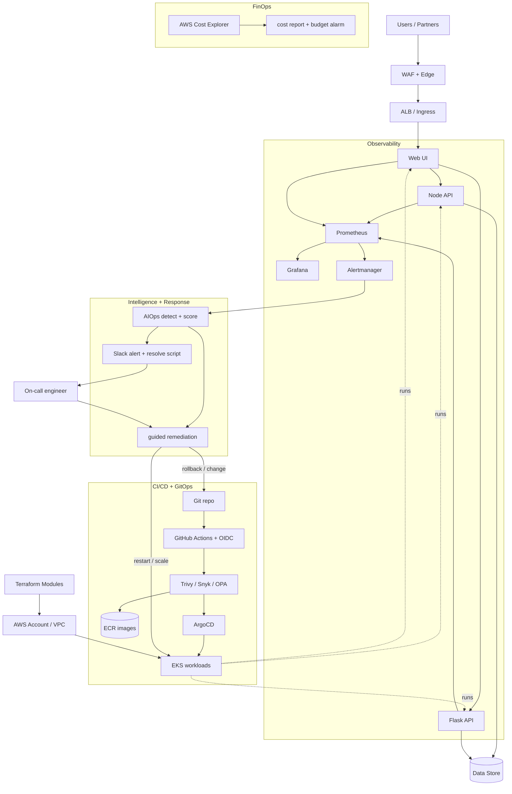

# Express Reliability Platform — Capstone

A **standalone, self-contained reliability platform**. It is the final project of the Express
Reliability Platform program: the consolidated system you deploy, operate, and present in interviews
and to clients.

Unlike the V1–V10 learning versions (each of which teaches one capability in isolation), the capstone
**physically contains a complete, working platform** in one repository: the application services, the
intelligence layer, GitOps delivery, observability and alerting, FinOps, and the CI/CD pipeline that
ties them together.

---

## 1) What the Capstone Includes

| Domain | What's here | Path |
|---|---|---|
| **Application services** | Node API, Flask scoring API, Web UI (with Dockerfiles) | `apps/` |
| **CI/CD (GitHub Actions)** | Scan → build → push → GitOps sync → compliance | `.github/workflows/ci-cd-pipeline.yaml` |
| **GitOps (ArgoCD)** | AppProject, ApplicationSet, per-app manifests, Helm charts, Terraform (EKS/VPC) | `infrastructure/`, `policies/` |
| **AIOps (intelligence)** | Anomaly detection + risk scoring + incident summary (evidence JSON) | `aiops/` |
| **Observability** | Prometheus, Alertmanager, Grafana dashboards, golden-signal alert rules | `monitoring/` |
| **Alerting + resolve** | Alertmanager→Slack bridge, AIOps Slack alerts, one-command remediation | `alerting/`, `remediation/` |
| **FinOps** | AWS Cost Explorer reporting, cost visualization, budget alarms | `finops/` |
| **Compliance & SRE** | Controls matrix, evidence pack, runbook + SLO/SLI templates | `docs/`, `artifacts/` |

---

## 2) What the Capstone Proves

A complete platform that is:

- **Reliable by design** — SLOs, runbooks, validated recovery.
- **Secure by default** — least-privilege IAM, OIDC CI/CD, policy-as-code (OPA), scanned images.
- **Observable end-to-end** — golden signals, dashboards, and alerts tied to SLOs.
- **Intelligent** — AIOps detection, scoring, and summaries that drive every alert.
- **Self-healing** — GitOps delivery (ArgoCD) that reconciles and rolls back automatically.
- **Cost-governed** — FinOps reporting and budget guardrails.
- **Auditable** — every change in Git, every incident documented, evidence packaged.

---

## 3) Architecture



A deeper written breakdown lives in [docs/reference-architecture.md](docs/reference-architecture.md).

---

## 4) Project Structure

```text
express-reliability-platform-capstone/
├── README.md
├── apps/
│   ├── node-api/        (Dockerfile, index.js, package.json, public/)
│   ├── flask-api/       (Dockerfile, app.py, requirements.txt, templates/)
│   └── web-ui/          (Dockerfile, index.html — capstone scorecard console)
├── aiops/
│   ├── detect_anomaly.py
│   └── score_and_summarize.py
├── alerting/
│   ├── alertmanager_webhook.py
│   └── send_slack_alert.py
├── remediation/
│   └── resolve_incident.sh
├── monitoring/
│   ├── prometheus.yml
│   ├── alert.rules.yml
│   ├── alertmanager/alertmanager.yml
│   └── grafana-dashboard*.json
├── finops/
│   ├── check_costs.py
│   ├── visualize_costs.py
│   └── setup_cost_alarm.sh
├── infrastructure/      (ArgoCD + Helm charts + Terraform)
├── policies/opa/        (policy-as-code enforced in CI)
├── .github/workflows/
│   └── ci-cd-pipeline.yaml
├── scripts/
│   ├── deploy_all.sh
│   ├── run_intelligence_loop.sh
│   └── simulate_*.py
├── artifacts/
│   ├── compliance/evidence-pack-checklist.md
│   ├── runbooks/incident-runbook-template.md
│   ├── sre/slo-sli-catalog-template.md
│   └── evidence/        (generated incident evidence JSON)
└── docs/
    ├── reference-architecture.md
    ├── controls-matrix.md
    ├── implementation-roadmap.md
    └── interview-and-client-playbook.md
```

---

## 5) Quick Start

```sh
# 0) One-shot guided walk (dry-run first to preview every step)
DRY_RUN=1 ./scripts/deploy_all.sh
./scripts/deploy_all.sh

# 1) Run the AIOps intelligence loop (no credentials needed — dry-runs Slack)
chmod +x scripts/run_intelligence_loop.sh remediation/resolve_incident.sh
./scripts/run_intelligence_loop.sh latency node-api

# 2) Bring up observability
docker compose -f docker-compose.observability.yml up -d
python3 alerting/alertmanager_webhook.py        # Alertmanager -> Slack bridge

# 3) Resolve an incident with the command named in the Slack alert
DRY_RUN=1 ./remediation/resolve_incident.sh latency node-api   # preview
./remediation/resolve_incident.sh latency node-api             # execute

# 4) FinOps cost report (requires AWS credentials)
python3 finops/check_costs.py

# 5) GitOps deploy on a cluster
kubectl apply -f infrastructure/argocd/project.yaml
kubectl apply -f infrastructure/argocd/applicationsets/platform-services.yaml
```

Set `SLACK_WEBHOOK_URL` to send real Slack alerts; without it, alerting dry-runs safely.

---

## 6) The Incident Loop

A single signal travels the whole platform without anyone hunting for the runbook:

**detect** (`aiops/detect_anomaly.py`) → **score + summarize** (`aiops/score_and_summarize.py`,
writes evidence JSON) → **alert** (`alerting/` posts to Slack, naming the fix) → **resolve**
(`remediation/resolve_incident.sh`) → **self-heal** (ArgoCD reconciles the cluster back to Git).

---

## 7) Capstone Exit Criteria (Golden Standard)

- [ ] Architecture diagram matches deployed reality.
- [ ] SLO/SLI definitions exist per critical service (`artifacts/sre/`).
- [ ] Alerting, runbooks, and escalation path are tested (resolve-by-script demonstrated).
- [ ] CI/CD + GitOps workflow is reproducible and self-healing.
- [ ] Security controls and evidence artifacts are documented (`docs/controls-matrix.md`).
- [ ] AIOps detect → score → alert → resolve loop runs end to end.
- [ ] FinOps cost report and budget alarm are configured.
- [ ] Interview/client walkthrough can be delivered in 15 minutes (`docs/interview-and-client-playbook.md`).

---

## 8) Source of Truth

- Course root: https://github.com/Here2ServeU/express-reliability-platform-course
- The learning versions `express-reliability-platform-v01 … v10` teach each capability step by step;
  this capstone is the consolidated, standalone result.
