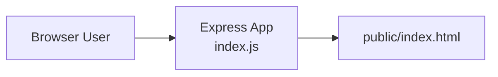

# Express Reliability Platform V1 — Local Foundation

## 1) Version Purpose

Build and run your first working reliability service on your computer, then create your own GitHub copy so you own the project from day one.

## 2) Chapters Covered

- Chapter 1: What You Are Building and Why It Matters
- Chapter 2: Running the App on Your Computer
- Chapter 3: From Shared Platform to Your Working Version

## 3) What You Will Build

- A local Node.js Express service that responds in a browser.
- A personal GitHub repository for your V1 working baseline.

## 4) Architecture Diagram (Mermaid)



## 5) Project Structure

```text
express-reliability-platform-v01/
├── index.js
├── package.json
├── public/
│   └── index.html
└── README.md
```

## 6) Run Steps

1. Install tools: Node.js LTS, Git, and VS Code.
2. Open a terminal in this folder.
3. Install dependencies:

   ```sh
   npm install
   ```

4. Start the service:

   ```sh
   npm start
   ```

5. Open [http://localhost:3000](http://localhost:3000).

### Make Your Own GitHub Copy

```sh
git init
git add .
git commit -m "V1 local foundation"
git branch -M main
git remote add origin https://github.com/YOUR_USERNAME/express-reliability-platform-v1.git
git push -u origin main
```

## 7) Validation Checklist

- [ ] `npm install` runs successfully.
- [ ] `npm start` starts without errors.
- [ ] Browser opens `http://localhost:3000` and shows the app.
- [ ] Repository is pushed to your own GitHub account.

## 8) Troubleshooting

- Port in use: stop the process on port 3000, then run again.
- `npm` command not found: reinstall Node.js LTS.
- Git push denied: verify repository URL and GitHub authentication.

## 9) Cleanup

- Press `Ctrl + C` to stop the local server.

## 10) Next Version Preview

In V2, you package this app with Docker and evolve from a single app into a 3-service platform structure (Node API, Flask API, Web UI).
