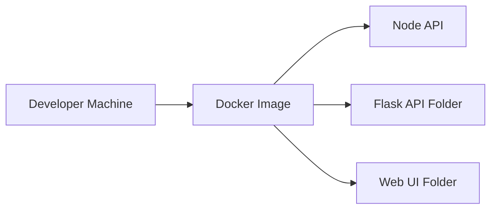

# Express Reliability Platform V2 — Portable Containerized System

## 1) Version Purpose

Move from local-only execution to a portable container image and establish a platform layout with separate service folders.

## 2) Chapters Covered

- Chapter 4: From “It Works on My Machine” to Cloud-Ready
- Chapter 5: From Application to Platform Structure

## 3) What You Will Build

- A Docker image that runs your service consistently across machines.
- A multi-service folder layout for Node API, Flask API, and Web UI.

## 4) Architecture Diagram (Mermaid)



## 5) Project Structure

```text
express-reliability-platform-v02/
├── Dockerfile
├── apps/
│   ├── node-api/
│   ├── flask-api/
│   └── web-ui/
└── README.md
```

## 6) Run Steps

1. Install Docker Desktop.
2. Open a terminal in this folder.
3. Build the image:

   ```sh
   docker build -t express-reliability-platform-v2 .
   ```

4. Run the container:

   ```sh
   docker run --rm -p 3000:3000 express-reliability-platform-v2
   ```

5. Open [http://localhost:3000](http://localhost:3000).

## 7) Validation Checklist

- [ ] Docker image builds without errors.
- [ ] Container starts and binds to port 3000.
- [ ] Browser request to `localhost:3000` succeeds.
- [ ] `apps/node-api`, `apps/flask-api`, and `apps/web-ui` folders are present.

## 8) Troubleshooting

- Docker daemon not running: open Docker Desktop and retry.
- Port 3000 busy: use another port, for example `-p 3005:3000`.
- Build failure: verify Dockerfile context and file paths.

## 9) Cleanup

```sh
docker ps
docker stop <container_id>
docker image rm express-reliability-platform-v2
```

## 10) Next Version Preview

In V3, you orchestrate all services together with Docker Compose, then add AWS IAM/OIDC and ECS + ALB deployment.
