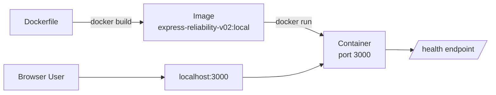

# Express Reliability Platform V2: Containerize a Single Service

## 1) Builds on V1

Before you start V2, copy your personal V1 repository to your local machine and rename it to V2:

```sh
git clone https://github.com/YOUR_USERNAME/express-reliability-platform-v01.git
mv express-reliability-platform-v01 express-reliability-platform-v02
cd express-reliability-platform-v02
```

Use the main class repository for scripts and canonical structure:

- https://github.com/Here2ServeU/express-reliability-platform-course

## 2) Version Purpose

V1 ran the Express service directly on your laptop with `npm start`. That works for one engineer on one machine: until the laptop changes, the Node version changes, or someone else tries to run it.

V2 wraps the same service in a Docker container. The container has the runtime, the dependencies, and the start command baked in. The image you build on your laptop is byte-for-byte the same image that will run on a CI runner, on a teammate's machine, or on an AWS Fargate task.

**V2 Goal:** Build a Docker image for the single Express service, run it as a container, see the health endpoint respond, then stop it cleanly.

---

## 3) Plain Language Context

**What is this version teaching you?**
You take the V1 app and put it inside a box that already contains everything it needs to run. That box (the container image) is portable: any computer with Docker can open the box and get exactly the same service. You stop worrying about whose laptop has which Node version.

**How does a bank or hospital use this?**
A bug that only shows up on one engineer's machine but not on the production server can corrupt transactions or patient records. Docker eliminates that whole class of problem by making the runtime identical everywhere. Every regulated platform ships as container images for this reason.

**Key terms in plain language:**

| Term | What It Means |
|---|---|
| **Docker** | A tool that packages a program plus its runtime and dependencies into a single artifact |
| **Image** | The packaged artifact: a recipe + ingredients in one file |
| **Container** | A running instance of an image: like a process, but isolated from the host |
| **Dockerfile** | The text file that describes how to build the image, step by step |
| **Tag** | A label on an image: `myapp:v2` is the `v2` tag of the `myapp` image |
| **Port mapping** | `-p 3000:3000` forwards your laptop's port 3000 into the container's port 3000 |
| **Healthcheck** | A command Docker runs inside the container to confirm the service is still answering |
| **`.dockerignore`** | Tells the build to skip files (like `node_modules`) when copying into the image |

**Expected result at the end of this version:**
- `docker build` produces an image named `express-reliability-v02:local`.
- `docker run -p 3000:3000 express-reliability-v02:local` starts the service.
- `http://localhost:3000` shows the V2 page.
- `curl http://localhost:3000/health` returns `{"status":"ok","service":"web-service","version":"v2"}`.
- `docker ps` shows the container as healthy.
- The cleanup script removes both the container and the image.

---

## 4) Training Workflow (Understand → Build → Test → Break → Fix → Explain → Automate → Improve)

1. **Understand:** Read sections 2 and 3 before touching anything.
2. **Build:** Follow the `Run Steps` exactly.
3. **Test:** Use the `Validation Checklist` to confirm each step.
4. **Break:** `docker stop` the container while a request is in flight.
5. **Fix:** Use `docker logs` to see what happened, then `docker start` to recover.
6. **Explain:** Write down what you saw and why the healthcheck mattered.
7. **Automate:** Use the scripts in `scripts/` so the workflow is one command, not five.
8. **Improve:** Try a multi-stage Dockerfile, then compare image sizes.

## 5) What You Will Build

- A `Dockerfile` for the single Express service.
- A `.dockerignore` so build context stays small.
- A built image tagged `express-reliability-v02:local`.
- A running container exposing port 3000 with a healthcheck.
- Three scripts: `build.sh`, `run.sh`, `cleanup_v2.sh`.

## 6) Architecture Diagram (Mermaid)



## 7) Project Structure

```text
express-reliability-platform-v02/
├── Dockerfile
├── .dockerignore
├── .gitignore
├── index.js
├── package.json
├── public/
│   └── index.html
├── scripts/
│   ├── build.sh
│   ├── run.sh
│   └── cleanup_v2.sh
└── README.md
```

## 8) Run Steps

### Step 1: Confirm Docker is installed

```sh
docker --version
docker info
```

If `docker info` errors, start Docker Desktop and re-run.

### Step 2: Build the image

```sh
./scripts/build.sh
```

Or manually:

```sh
docker build --platform linux/amd64 -t express-reliability-v02:local .
```

Confirm:

```sh
docker images express-reliability-v02
```

### Step 3: Run the container

```sh
./scripts/run.sh
```

Or manually:

```sh
docker run -d --name erp-v02 -p 3000:3000 --restart unless-stopped express-reliability-v02:local
```

### Step 4: Verify the service

```sh
docker ps --filter "name=erp-v02"
curl http://localhost:3000/health
```

Open [http://localhost:3000](http://localhost:3000) in your browser.

Expected `/health` response:

```json
{ "status": "ok", "service": "web-service", "version": "v2" }
```

### Step 5: Watch the logs

```sh
docker logs -f erp-v02
```

Press `Ctrl + C` to detach (the container keeps running).

### Step 6: Stop and remove

```sh
./scripts/cleanup_v2.sh
```

Or manually:

```sh
docker rm -f erp-v02
docker rmi express-reliability-v02:local
```

## 9) Break and Fix Drill

1. With the container running, in another terminal: `docker stop erp-v02`.
2. Refresh the browser: the page fails to load.
3. Run `docker ps -a` and note the container is `Exited`.
4. Recover: `docker start erp-v02`.
5. Refresh again: the page loads. The `--restart unless-stopped` flag would also have brought it back on Docker daemon restart.

Write 3:5 sentences in your notes: what failed, what you observed, what fixed it.

## 10) Validation Checklist

- [ ] `docker build` completes with no errors.
- [ ] `docker images express-reliability-v02` lists the `local` tag.
- [ ] `docker run` starts the container and `docker ps` shows it as `healthy` after ~15 seconds.
- [ ] `curl http://localhost:3000/health` returns the expected JSON.
- [ ] `http://localhost:3000` renders the V2 page with the "Version 2: Containerized Service" badge.
- [ ] `docker logs erp-v02` shows the `Server running on port 3000` startup line.
- [ ] `./scripts/cleanup_v2.sh` removes both the container and the image.

## 11) Troubleshooting

- **`Cannot connect to the Docker daemon`:** start Docker Desktop and re-run.
- **`port is already allocated`:** another process holds port 3000. `lsof -i :3000` then either stop it or set `HOST_PORT=3001 ./scripts/run.sh`.
- **Container exits immediately:** `docker logs erp-v02` shows the error. Most often a typo in `index.js` or a missing dependency in `package.json`.
- **`exec format error` on Apple Silicon:** rebuild with `--platform linux/amd64` (the build script already does this).
- **Healthcheck stuck on `starting`:** wait 15:20 seconds; the first probe happens after the `--start-period`.

## 12) Cleanup

```sh
./scripts/cleanup_v2.sh
```

This removes the container and the local image. No cloud resources were created in V2.

## 13) Next Version Preview

In **V3**, you stop running one container by hand and orchestrate three services together: a Node API, a Flask API, and a Web UI: with Docker Compose. The single-service skills from V2 (Dockerfile, build, run, healthcheck, logs) become the building blocks for the multi-service platform.
