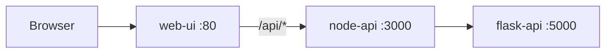

# Express Reliability Platform V3: Local Orchestration with Docker Compose

## 1) Version Purpose

Version 3 takes the single containerized service from V2 and orchestrates a three-service platform: Node API, Flask API, and Web UI: with Docker Compose, so one command brings the whole stack up locally.

---

## 2) Plain Language Context

**What is this version teaching you?**
You will wrap your three services inside Docker containers so they all start with one command and run identically on any computer. This is like putting each ingredient of a recipe into a labeled package, then bundling all the packages into one box: anyone can open the box and follow the same instructions.

**How does a bank or hospital use this?**
Financial institutions and hospitals require that code behaves identically in development, testing, and production. A bug that only appears on one engineer's laptop but not on the server can cause transactions to fail or patient data to be corrupted. Docker eliminates that problem by guaranteeing the environment is always the same.

**Key terms in plain language:**

| Term | What It Means |
|---|---|
| **Docker** | A tool that packages your program and all its dependencies into a self-contained box called a container |
| **Container** | A running instance of a packaged program: isolated from everything else on the computer |
| **Docker Image** | The blueprint for a container: like a recipe. Running the image creates a container |
| **Docker Compose** | A tool that starts multiple containers together with a single command using a `docker-compose.yml` file |
| **docker-compose.yml** | A configuration file that describes every service, what image it uses, and how services connect to each other |
| **Port mapping** | Connecting a port inside a container to a port on your computer: `8080:80` means "when my browser hits port 8080, forward it to port 80 inside the container" |

**Expected result at the end of this version:**
- `docker compose up --build -d` starts all three services with no errors.
- `http://localhost:8080` shows the web UI.
- `curl http://localhost:8080/api/health` returns `{"status": "ok"}`.

---

## 3) Builds on V2

Before you start V3, copy your personal V2 repository to your local machine and rename it to V3:

```sh
git clone https://github.com/YOUR_USERNAME/express-reliability-platform-v02.git
mv express-reliability-platform-v02 express-reliability-platform-v03
cd express-reliability-platform-v03
```

Then sync your folder structure with the class repository V3 layout: V3 adds the Flask API and Web UI alongside the V2 Node service, and replaces `docker run` with `docker compose`.

Class repository (scripts and canonical structure):

- https://github.com/Here2ServeU/express-reliability-platform-course


## 4) Training Workflow (Understand -> Build -> Test -> Break -> Fix -> Explain -> Automate -> Improve)

1. Understand: Read `Version Purpose` and `Plain Language Context`.
2. Build: Complete the container setup steps in order.
3. Test: Validate UI and API endpoints from this README.
4. Break: Stop one service container intentionally (for example, `docker compose stop flask-api`).
5. Fix: Use `docker compose logs` and restart the failed service.
6. Explain: Document what failed, why it failed, and what fixed it.
7. Automate: Add script-based checks for startup and health validation.
8. Improve: Re-run end-to-end checks and update reliability guardrails.

## 5) What You Will Build

- `node-api` (Express): receives `/health` and `/score` requests
- `flask-api` (Flask): computes a simple risk score used by `node-api`

## 6) Use Cases (V3)

- Local reliability demo for interview, classroom, or architecture walkthroughs.
- Integration testing across UI, Node, and Flask layers using one `docker compose` stack.
- API observability and troubleshooting practice with container logs and health checks.
- Safe sandbox for trying resilience ideas (timeouts, retries, fallback behavior) before production systems.

## 7) Architecture Diagram (Mermaid)



## 8) Project Structure

```text
express-reliability-platform-v03/
├── docker-compose.yml
├── apps/
│   ├── flask-api/
│   │   ├── app.py
│   │   ├── requirements.txt
│   │   └── Dockerfile
│   ├── node-api/
│   │   ├── index.js
│   │   ├── package.json
│   │   └── Dockerfile
│   └── web-ui/
│       ├── index.html
│       ├── nginx.conf
│       └── Dockerfile
└── README.md
```

## 9) Linux Prerequisites

Install:
- Docker Engine
- Docker Compose plugin (`docker compose`)
- `curl`

Optional tools used in troubleshooting:
- `lsof`
- `wget`

## 10) Quick Start (Linux)

1. Move into the v03 directory:

```sh
cd express-reliability-platform-v03
```

2. Build and start all services in detached mode:

```sh
docker compose up --build -d
```

3. Open the UI:

```text
http://localhost:8080
```

4. Validate end-to-end flow:

```sh
curl http://localhost:8080/api/health
curl "http://localhost:8080/api/score?input=test"
```

Expected example response:

```json
{
  "version": "v2",
  "flask_response": {
    "input": "test",
    "risk_score": 28,
    "logic": "Risk based on input length (placeholder)"
  }
}
```

## 11) Promotion Path

V3 is your local test gate with Docker Compose: the last fully-local stop before V4 pushes the same stack to AWS.

1. Pass all local checks in this README.
2. Commit your changes.
3. Move to V4 to start your first AWS deployment (ECR, ECS, VPC, ALB, S3, DynamoDB).

## 12) Day-2 Operations

Check running services:

```sh
docker compose ps
```

View logs:

```sh
docker compose logs -f
docker compose logs -f node-api
docker compose logs -f flask-api
docker compose logs -f web-ui
```

Stop everything:

```sh
docker compose down
```

## 13) Service-Level Validation

Run a request through full stack:

```sh
curl "http://localhost:8080/api/score?input=reliability"
```

Validate Node to Flask networking from inside the Node container:

```sh
docker exec node-api wget -qO- http://flask-api:5000/health
docker exec node-api wget -qO- "http://flask-api:5000/score?input=reliability"
```

## 14) Troubleshooting

Port `8080` already in use:

- Change mapping in `docker-compose.yml` from `8080:80` to `8090:80`
- Relaunch with:

```sh
docker compose up --build -d
```

Port `5000` already in use on host:

```sh
lsof -i :5000
kill -9 <PID>
```

On macOS, port `5000` is often used by Control Center / AirPlay Receiver. This V3 Compose file maps Flask to host port `5001` while keeping container port `5000` unchanged:

```yaml
ports:
  - "5001:5000"
```

Use `http://localhost:5001` from your browser or host terminal when calling Flask directly. Inside Docker, services still call `http://flask-api:5000`.

API fails even though containers are up:

```sh
docker compose logs -f node-api
docker compose logs -f flask-api
docker compose ps
```

Force clean rebuild:

```sh
docker compose down --volumes --remove-orphans
docker system prune -af
docker compose up --build -d
```

## 15) Cleanup

```sh
docker compose down --remove-orphans
docker image prune -f
```

---
## 16) Linux Command Reference

This section explains every Linux command used in this README.

`cd express-reliability-platform-v03`
- `cd`: changes the current shell directory.
- Used to run all subsequent Docker commands from the v03 project root.

`docker compose up --build -d`
- `docker compose up`: creates and starts services from `docker-compose.yml`.
- `--build`: rebuilds images before starting containers.
- `-d`: runs containers in detached (background) mode.

`curl http://localhost:8080/api/health`
- `curl`: sends HTTP requests from terminal.
- Used to verify the API endpoint is reachable via the UI proxy.

`curl "http://localhost:8080/api/score?input=test"`
- Same `curl` behavior, but this request includes a query string (`input=test`).
- Used to test the reliability scoring flow.

`docker compose ps`
- Lists compose-managed containers and current states (`Up`, `Exited`, etc.).
- Used for quick health checks of all services.

`docker compose logs -f`
- Shows logs from all services.
- `-f`: follow mode (stream logs live).

`docker compose logs -f node-api`
- Streams logs only for the `node-api` service.
- Used when debugging Express-side failures.

`docker compose logs -f flask-api`
- Streams logs only for the `flask-api` service.
- Used when debugging scoring logic or Flask errors.

`docker compose logs -f web-ui`
- Streams logs for the Nginx UI container.
- Used to debug reverse proxy or static file issues.

`docker compose down`
- Stops and removes compose resources for the current project.

`docker exec node-api wget -qO- http://flask-api:5000/health`
- `docker exec`: runs a command inside an existing container.
- `node-api`: target container name.
- `wget -qO- <url>`:
  - `-q`: quiet output (no progress noise).
  - `-O-`: write response body to stdout.
- Used to test container-to-container network calls from Node to Flask.

`docker exec node-api wget -qO- "http://flask-api:5000/score?input=reliability"`
- Same as above, but tests the Flask `/score` endpoint with query params.

`lsof -i :5000`
- `lsof`: lists open files/process handles.
- `-i :5000`: filters to processes listening/using port `5000`.
- Used to find port conflicts on Linux hosts.

`kill -9 <PID>`
- Sends signal `9` (`SIGKILL`) to force-stop a process.
- Used only when a process blocks required ports and does not stop gracefully.

`docker compose down --volumes --remove-orphans`
- `--volumes`: removes attached named and anonymous volumes.
- `--remove-orphans`: removes containers not defined in current compose file.
- Used to reset state when stale data or old containers cause failures.

`docker system prune -af`
- Removes unused Docker data (images, containers, networks, build cache).
- `-a`: includes unused images, not only dangling ones.
- `-f`: skips confirmation prompt.
- Used to recover disk space and force fresh image rebuilds.

`docker compose down --remove-orphans`
- Standard shutdown plus orphan cleanup.

`docker image prune -f`
- Removes dangling/unused images to reclaim storage.
- `-f`: skips interactive confirmation.

---

## 17) Web UI Guide: `apps/web-ui/index.html`

### Platform Continuity

V3 is the baseline multi-service user experience for the course platform. The `index.html` introduces the regulated readiness console, the four scoring domains, the V3 → V10 growth path, the market-inspired capability map, and the capstone creator preview. Later versions keep this same platform shell and add one new maturity layer at a time.

### What the V3 UI Does

The V3 `index.html` is the first multi-service version of the T2S regulated platform readiness console. It gives students a simple browser-based way to explain what the platform is checking for in fintech and healthcare environments:

- Reliability: availability, latency, and incident posture.
- Cost efficiency: cloud spend discipline and utilization awareness.
- Security and compliance: evidence, access, and audit controls.
- Intelligence: early AI, AIOps, and MLOps maturity.

The page also keeps the original V2 backend integration through the **Call Score** button. That button calls:

```text
/api/score?input=<platform-name>
```

### What It Is Used For

Use the V3 UI to introduce the platform concept to students, interviewers, or clients before the system becomes more advanced in later versions. It is intentionally simple: students enter a platform name, choose a few readiness options, and generate a JSON scorecard.

This version is useful for:

- Demonstrating the UI -> Node API -> Flask API request path.
- Explaining why regulated organizations care about reliability, cost, security, and intelligent operations.
- Showing the full V3 → V10 learning path from the first working UI.

### How to Read the Results

The readiness output is JSON so students can practice reading structured operational evidence.

Key fields:

| Field | Meaning |
|---|---|
| `readiness_score` | Overall score from 0 to 100 across the four domains. |
| `readiness_grade` | Plain-language interpretation such as `controlled pilot` or `production ready`. |
| `domains.reliability` | How ready the platform is from a stability and availability perspective. |
| `domains.cost_efficiency` | Whether spend and utilization look controlled. |
| `domains.security_compliance` | Whether audit evidence and security controls are strong enough. |
| `domains.intelligence_aiops_mlops` | Whether the platform has automation, AIOps, or MLOps maturity. |
| `next_student_builds` | What students will add in later versions. |

Suggested interpretation:

- `85-100`: Strong candidate for production-style discussion.
- `70-84`: Good controlled pilot; document remaining gaps.
- `55-69`: Needs targeted improvement before regulated use.
- `<55`: High risk; fix reliability, evidence, or automation gaps first.
