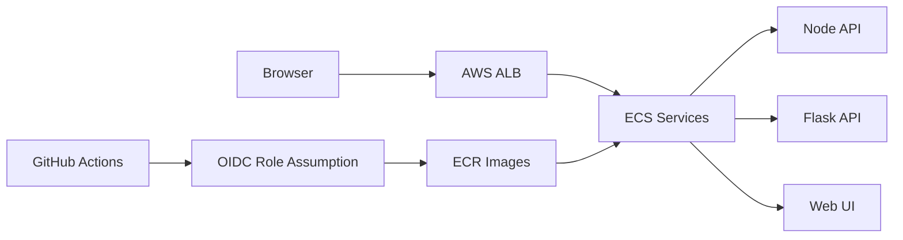

# Express Reliability Platform V3 — Orchestration + Identity Foundations

## 1) Version Purpose

Coordinate all services together locally, then establish secure cloud identity and deploy the platform to ECS behind an Application Load Balancer.

## 2) Chapters Covered

- Chapter 6 (Part 1): Local Orchestration with Docker Compose
- Chapter 7 (Part 2): Cloud Identity Foundations (AWS IAM + OIDC)
- Chapter 8 (Part 3): Cloud Orchestration with ECS + ALB

## 3) What You Will Build

- A 3-service local stack with one command.
- IAM/OIDC setup for secure CI/CD access.
- ECS deployment flow supported by scripts in `scripts/`.

## 4) Architecture Diagram (Mermaid)



## 5) Project Structure

```text
express-reliability-platform-v03/
├── apps/
│   ├── node-api/
│   ├── flask-api/
│   └── web-ui/
├── docker-compose.yml
├── scripts/
│   ├── provision_iam_oidc.sh
│   ├── create_ecr_repos.sh
│   ├── build_tag_push_ecr.sh
│   ├── create_ecs_cluster_and_tasks.py
│   └── deploy_to_ecs.sh
└── README.md
```

## 6) Run Steps

### Part 1 — Local Compose

```sh
docker compose up --build
```

Endpoints:

- Node API: `http://localhost:3000`
- Flask API: `http://localhost:5000`
- Web UI: `http://localhost:8080`

Stop stack:

```sh
docker compose down
```

### Part 2 — IAM + OIDC Foundation

1. Create AWS IAM users/groups with least privilege.
2. Configure GitHub OIDC trust for your repository.
3. Use `scripts/provision_iam_oidc.sh` as your bootstrap helper.

### Part 3 — ECS + ALB Deployment

Run scripts in order:

```sh
./scripts/create_ecr_repos.sh
./scripts/build_tag_push_ecr.sh
python3 scripts/create_ecs_cluster_and_tasks.py
./scripts/deploy_to_ecs.sh
```

## 7) Validation Checklist

- [ ] Compose starts all 3 services.
- [ ] Local endpoints return expected responses.
- [ ] ECR repositories are created.
- [ ] ECS services become healthy and reachable through ALB.
- [ ] OIDC-based deployment authentication works from CI/CD.

## 8) Troubleshooting

- Compose fails: run `docker compose logs` and fix the first service error.
- AWS auth errors: verify role trust policy and region configuration.
- ECS health check fails: confirm container port mappings and task definition.

## 9) Cleanup

- Local: `docker compose down`.
- Cloud: remove ECS services/tasks, ALB, and test ECR images when done.

## 10) Next Version Preview

In V4, you add Prometheus + Grafana and begin reliability simulation through stress and failure scenarios.
