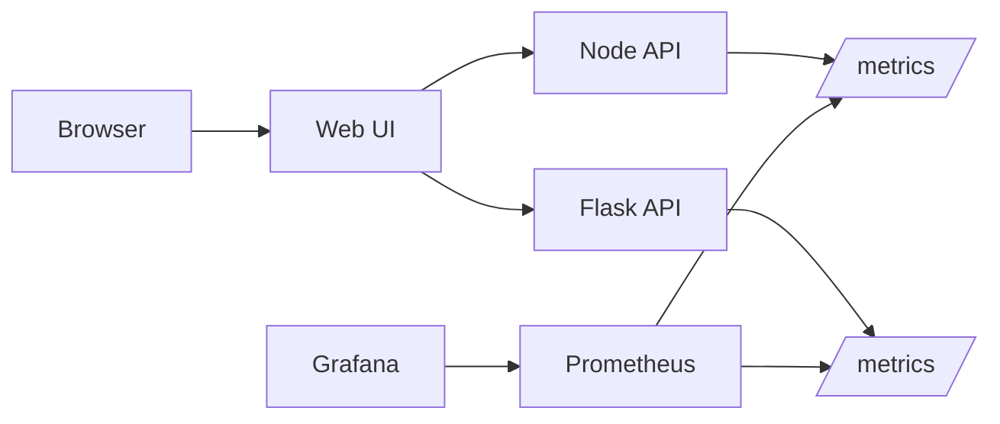

# Express Reliability Platform V4 — Observability + Real-World Simulation

## 1) Version Purpose

Add observability to the platform and practice reliability engineering with controlled stress and failure scenarios.

## 2) Chapters Covered

- Chapter 9 (Part 1): Prometheus + Grafana First
- Chapter 10 (Part 2): Stress, Failure, Responsibility

## 3) What You Will Build

- A monitored stack with service metrics in Prometheus.
- Dashboards in Grafana for reliability visibility.
- A repeatable method to test latency/error behavior.

## 4) Architecture Diagram (Mermaid)



## 5) Project Structure

```text
express-reliability-platform-v04/
├── apps/
│   ├── node-api/
│   ├── flask-api/
│   └── web-ui/
├── monitoring/
│   └── prometheus.yml
├── docker-compose.yml
└── README.md
```

## 6) Run Steps

1. Start all services:

   ```sh
   docker compose up --build
   ```

2. Open endpoints:
   - App UI: `http://localhost:8080`
   - Node API: `http://localhost:3000`
   - Flask API: `http://localhost:5000`
   - Prometheus: `http://localhost:9090`
   - Grafana: `http://localhost:3001`

3. Generate load with any HTTP tool (`hey`, `ab`, or browser refresh loops).
4. Repeat the same checks in cloud environments after deployment to compare local vs cloud behavior.
5. Observe latency, request count, and error trends in Grafana.

## 7) Validation Checklist

- [ ] Compose launches all app and monitoring services.
- [ ] Prometheus targets show app services as `UP`.
- [ ] Grafana can query Prometheus data source.
- [ ] You can observe metric changes while generating load.

## 8) Troubleshooting

- Prometheus target down: verify service name and port in `monitoring/prometheus.yml`.
- Grafana empty dashboards: confirm Prometheus datasource URL.
- Container restart loops: inspect logs with `docker compose logs <service>`.

## 9) Cleanup

```sh
docker compose down
```

- If you provisioned cloud resources for this version, destroy non-shared test resources after validation.

## 10) Next Version Preview

In V5, you move to Kubernetes on EKS and add self-healing and autoscaling concepts.
