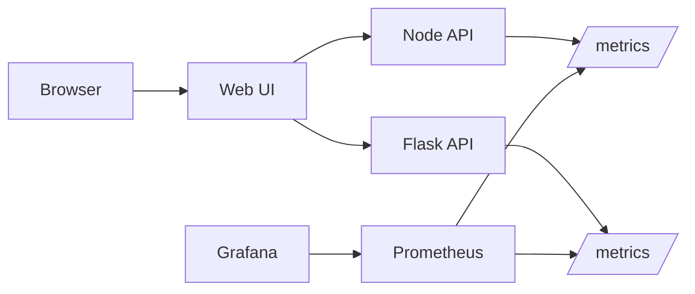

# Express Reliability Platform V4 — Observability + Real-World Simulation

## Builds on V3

Before you start V4, copy your personal V3 repository to your local machine and rename it to V4:

```sh
git clone https://github.com/YOUR_USERNAME/express-reliability-platform-v03.git
mv express-reliability-platform-v03 express-reliability-platform-v04
cd express-reliability-platform-v04
```

Use the main class repository for scripts and canonical structure:

- https://github.com/Here2ServeU/express-reliability-platform-course

## 1) Version Purpose

Add observability to the platform and practice reliability engineering with controlled stress and failure scenarios.

---

## Plain Language Context

**What is this version teaching you?**
You add a live dashboard to your platform so you can see exactly what is happening inside it at any moment — how fast it is responding, how many errors it is producing, and whether it is healthy. Without this, running a platform is like driving a car with no dashboard: you have no idea how fast you are going or when you are about to run out of fuel.

**How does a bank or hospital use this?**
Banks monitor transaction response times in real time. A sudden spike in latency can indicate fraud traffic, a server overload, or a network failure. A hospital monitoring platform tracks whether patient-record requests are succeeding. When a metric crosses a threshold, engineers get an alert immediately — not an hour later when users start calling.

**Key terms in plain language:**

| Term | What It Means |
|---|---|
| **Prometheus** | A program that collects numbers from your services every few seconds and stores them — like a health monitor taking readings continuously |
| **Metrics** | Numbers that describe how your system is performing — request rate, error rate, response time, memory usage |
| **Grafana** | A tool that draws metrics as charts and dashboards — like turning a spreadsheet of numbers into a visual graph |
| **SLI (Service Level Indicator)** | The actual measured value — for example, the real p95 response time right now |
| **SLO (Service Level Objective)** | The target you promise — for example, "p95 response time must stay under 500ms" |
| **p95 (95th percentile)** | The response time that 95% of requests are faster than — so if p95 is 400ms, 95 out of 100 requests finished in 400ms or less |
| **Alertmanager** | A tool connected to Prometheus that sends notifications when a metric crosses a threshold |
| **Load generation** | Sending many requests to your system to observe how it behaves under real traffic |

**Expected result at the end of this version:**
- `http://localhost:9090` shows Prometheus with your services listed as targets.
- `http://localhost:3001` shows Grafana with a working datasource.
- You can see metric values change in Grafana while generating load.

---


## Training Workflow (Understand -> Build -> Test -> Break -> Fix -> Explain -> Automate -> Improve)

1. Understand: Read monitoring architecture and metric goals.
2. Build: Start the monitored stack and configure dashboards.
3. Test: Confirm targets are up and metrics change under load.
4. Break: Trigger a controlled fault or stress event.
5. Fix: Use metrics, logs, and alerts to recover.
6. Explain: Document what failed, why it failed, and what fixed it.
7. Automate: Add repeatable stress tests and alert checks.
8. Improve: Tune SLI/SLO thresholds and alert quality.

## 3) What You Will Build

- A monitored stack with service metrics in Prometheus.
- Dashboards in Grafana for reliability visibility.
- A repeatable method to test latency/error behavior.

## 4) Architecture Diagram (Mermaid)



## 5) Project Structure

```text
express-reliability-platform-v04/
├── apps/
│   ├── node-api/
│   ├── flask-api/
│   └── web-ui/
├── monitoring/
│   └── prometheus.yml
├── docker-compose.yml
└── README.md
```

## 6) Run Steps

1. Run the local Docker Compose gate first:

   ```sh
   docker compose up --build
   ```

2. Open endpoints:
   - App UI: `http://localhost:8080`
   - Node API: `http://localhost:3000`
   - Flask API: `http://localhost:5000`
   - Prometheus: `http://localhost:9090`
   - Grafana: `http://localhost:3001`

3. Generate load with any HTTP tool (`hey`, `ab`, or browser refresh loops).
4. Observe latency, request count, and error trends in Grafana.
5. After local validation passes, promote to cloud in order: `dev -> staging -> prod`.

## 7) Validation Checklist

- [ ] Compose launches all app and monitoring services.
- [ ] Prometheus targets show app services as `UP`.
- [ ] Grafana can query Prometheus data source.
- [ ] You can observe metric changes while generating load.

## 8) Troubleshooting

- Prometheus target down: verify service name and port in `monitoring/prometheus.yml`.
- Grafana empty dashboards: confirm Prometheus datasource URL.
- Container restart loops: inspect logs with `docker compose logs <service>`.

## 9) Cleanup

```sh
docker compose down
```

- If you provisioned cloud resources for this version, destroy non-shared test resources after validation.

## 10) Next Version Preview

In V5, you build on V4 by moving to Kubernetes on EKS and adding self-healing and autoscaling concepts.
