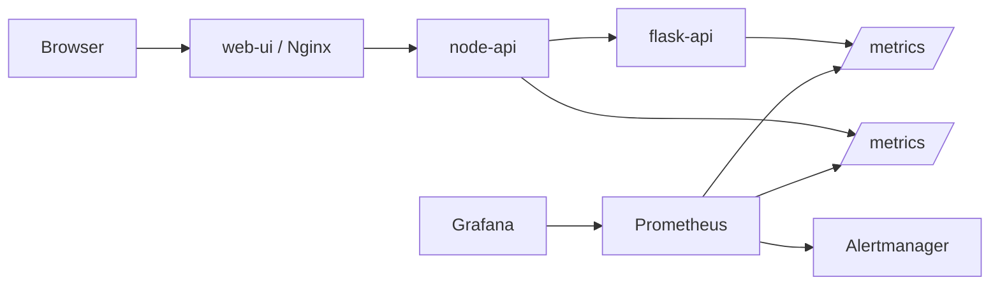

# Express Reliability Platform V5 — Monitoring with Prometheus, Grafana, and Alertmanager

## Builds on V4

Before you start V5, copy your personal V4 repository to your local machine and rename it to V5:

```sh
git clone https://github.com/YOUR_USERNAME/express-reliability-platform-v04.git
mv express-reliability-platform-v04 express-reliability-platform-v05
cd express-reliability-platform-v05
mkdir -p monitoring/alertmanager
```

Use the main class repository for scripts and canonical structure:

- https://github.com/Here2ServeU/express-reliability-platform-course

## 1) Version Purpose

Install Prometheus, Grafana, and Alertmanager. Instrument Node API with `prom-client`. Build a live dashboard. Write three alert rules. Prove that `ServiceDown` fires when a container stops.

---

## Plain Language Context

**What is this version teaching you?**
Your platform runs, but right now you are flying blind. If a container crashes at 2am, you learn about it from an angry user email the next morning. Monitoring changes that. Prometheus collects numbers from your services every 15 seconds. Grafana turns those numbers into live graphs. Alertmanager pages you the moment a threshold is crossed. You catch problems in seconds instead of hours.

**How does a bank or hospital use this?**
Banks watch transaction latency in real time — a sudden spike can mean fraud, server overload, or a network issue. Hospitals watch patient-portal request success rates. In both cases, a human gets alerted the moment a metric crosses a threshold, not an hour later when users start calling.

**The four golden signals (Google SRE):**

| Signal | What It Answers |
|---|---|
| **Latency** | How long do requests take? Watch p95 and p99. |
| **Traffic** | How many requests per second? Sudden drops or spikes warn of trouble. |
| **Errors** | What fraction of requests fail? 1% on 10k req/min = 100 angry users per minute. |
| **Saturation** | How full is the system? CPU at 100%? Memory at 95%? |

**Key terms in plain language:**

| Term | What It Means |
|---|---|
| **Prometheus** | Scrapes `/metrics` from each service every 15 seconds and stores as time series |
| **Grafana** | Reads Prometheus data and draws live charts, graphs, and gauges |
| **Alertmanager** | Receives alerts fired by Prometheus, groups them, and routes to Slack/email/webhooks |
| **prom-client** | The npm package that adds metric tracking and the `/metrics` endpoint to Node.js |
| **Counter** | A metric that only increases — total requests, total errors |
| **Gauge** | A metric that goes up and down — memory used, active connections |
| **Histogram** | Bucketed observations used to calculate p50, p95, p99 latency |
| **Label** | A key=value tag on a metric, e.g. `{method="GET", status="200"}` |
| **`up`** | Built-in metric: 1 = Prometheus can scrape this service, 0 = cannot reach it |
| **firing** | An alert whose condition has been true longer than its `for:` duration |

**Expected result at the end of this version:**
- `http://localhost:9090/targets` shows `node-api` and `flask-api` as **UP**.
- `http://localhost:3001` shows a Grafana dashboard with request rate, p95 latency, error rate, and service health panels.
- `http://localhost:9090/alerts` lists three alert rules (ServiceDown, HighErrorRate, HighLatency), all **inactive**.
- Stopping `flask-api` causes the `ServiceDown` alert to fire within ~35 seconds.

---

## Training Workflow (Understand -> Build -> Test -> Break -> Fix -> Explain -> Automate -> Improve)

1. Understand: Read the four golden signals and how Prometheus scrapes metrics.
2. Build: Start the stack, confirm `/metrics` is exposed, configure Grafana.
3. Test: Generate traffic and watch panels populate in Grafana.
4. Break: Stop `flask-api` and observe `ServiceDown` fire in Prometheus.
5. Fix: Restart `flask-api` and watch the alert resolve.
6. Explain: Document what the alert saw and when it cleared.
7. Automate: Use the traffic loop to regularly validate alert quality.
8. Improve: Tune bucket boundaries, alert thresholds, and `for:` durations.

## 3) What You Will Build

- Three monitoring containers (Prometheus, Grafana, Alertmanager) added to the existing three-app Compose stack.
- Instrumentation in Node API: counter, histogram, middleware, and a `/metrics` route.
- A Grafana dashboard with four panels: request rate, p95 latency, error rate, service health.
- Three production-style alert rules with severity labels.

## 4) Architecture Diagram (Mermaid)



## 5) Project Structure

```text
express-reliability-platform-v05/
├── apps/
│   ├── flask-api/
│   ├── node-api/          ← instrumented with prom-client
│   └── web-ui/
├── monitoring/
│   ├── prometheus.yml     ← scrape config + rule_files + alerting
│   ├── alert.rules.yml    ← ServiceDown, HighErrorRate, HighLatency
│   ├── alertmanager/
│   │   └── alertmanager.yml
│   └── grafana-dashboard.json
├── docker-compose.yml     ← 3 apps + prometheus + grafana + alertmanager
├── terraform/             ← inherited from V4 (bootstrap + platform)
├── scripts/
│   ├── tf_deploy.sh       ← inherited from V4
│   └── cleanup_v5.sh
└── README.md
```

## 6) Run Steps

1. Start the full stack:

   ```sh
   docker compose up --build -d
   docker compose ps
   ```

   Expect six containers running: `flask-api`, `node-api`, `web-ui`, `prometheus`, `grafana`, `alertmanager`.

2. Generate traffic so Prometheus has data to scrape:

   ```sh
   for i in $(seq 1 100); do curl -s http://localhost:8080/api/health > /dev/null; done
   for i in $(seq 1 100); do curl -s 'http://localhost:8080/api/score?input=monitoring-test' > /dev/null; done
   ```

3. Open the monitoring UIs:
   - Prometheus: `http://localhost:9090` — check **Status → Targets** (both UP) and **Alerts** (3 rules, inactive)
   - Grafana: `http://localhost:3001` — login `admin` / `admin`
   - Alertmanager: `http://localhost:9093`
   - App UI: `http://localhost:8080`

4. Configure Grafana:
   - **Connections → Data Sources → Add data source → Prometheus**
   - URL: `http://prometheus:9090` (NOT `localhost` — Grafana resolves by container name inside Docker)
   - **Save and test**

5. Build the dashboard (four panels — PromQL queries below):

   | Panel | Query |
   |---|---|
   | Request Rate (req/sec) | `rate(http_requests_total{job="node-api"}[5m])` |
   | p95 Latency (seconds)  | `histogram_quantile(0.95, rate(http_request_duration_seconds_bucket{job="node-api"}[5m]))` |
   | Error Rate (%)         | `100 * rate(http_requests_total{job="node-api",status=~"5.."}[5m]) / rate(http_requests_total{job="node-api"}[5m])` |
   | Service Health (Stat)  | `up{job=~"node-api\|flask-api"}` |

   Save as **Platform Overview**.

6. Prove the alerting pipeline works:

   ```sh
   docker compose stop flask-api
   # Wait ~35 seconds
   # Open http://localhost:9090/alerts
   # Expect: ServiceDown for flask-api is FIRING (red)
   docker compose start flask-api
   ```

## 7) Validation Checklist

- [ ] `docker compose ps` shows all six containers running.
- [ ] Prometheus UI loads at `http://localhost:9090`.
- [ ] Both scrape targets show **State: UP** in Status → Targets.
- [ ] `curl http://localhost:3000/metrics` returns Prometheus text (including `http_requests_total`).
- [ ] `rate(http_requests_total{job="node-api"}[5m])` returns values in the Prometheus query UI.
- [ ] Three alert rules (`ServiceDown`, `HighErrorRate`, `HighLatency`) are loaded and **inactive**.
- [ ] Grafana **Platform Overview** dashboard shows live data after traffic generation.
- [ ] Stopping `flask-api` causes `ServiceDown` to fire within ~35 seconds.

## 8) Troubleshooting

- **Prometheus target DOWN**: `container_name` in `docker-compose.yml` must match the `targets:` list in `monitoring/prometheus.yml` exactly.
- **`/metrics` returns 404**: You skipped `npm install prom-client` or did not add the `/metrics` route to `apps/node-api/index.js`.
- **`/metrics` returns empty**: No requests have been made yet. Run the traffic loop.
- **No alert rules in Prometheus UI**: `alert.rules.yml` is not mounted. Check the `volumes:` section of the `prometheus` service.
- **Grafana can't reach Prometheus**: Use `http://prometheus:9090` (Docker DNS), not `http://localhost:9090`.
- **Dashboards vanished after restart**: The `grafana-data` named volume was removed. Avoid `docker volume rm` unless you mean to reset Grafana.
- **Container restart loops**: `docker compose logs <service>` shows the crash reason — YAML indentation errors in `prometheus.yml` are common.

## 9) Cleanup

The `grafana-data` named volume persists after `docker compose down`. Use the script to remove it explicitly so dashboards do not carry over:

```sh
./scripts/cleanup_v5.sh
```

The script also runs `terraform -chdir=terraform/platform destroy` to clean up any lingering V4 AWS resources while keeping the bootstrap S3 + DynamoDB (shared across V4–V10).

## 10) Next Version Preview

In V6, you replace ECS with Kubernetes on EKS — a system that self-heals (automatically restarts crashed pods) and auto-scales (adds more pods when traffic rises). You will use the monitoring stack from V5 to watch the new cluster in real time.
