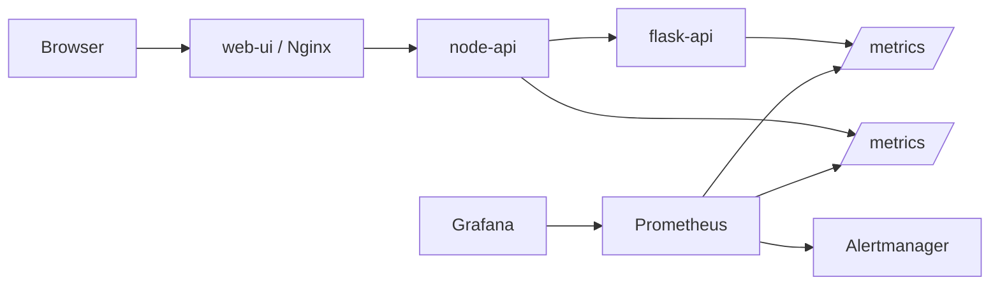
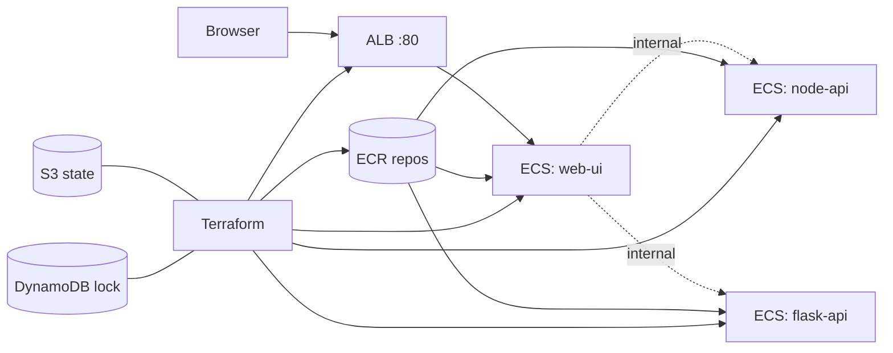

# Express Reliability Platform V5 — Monitoring with Prometheus, Grafana, and Alertmanager

## 1) Builds on V4

Before you start V5, copy your personal V4 repository to your local machine and rename it to V5:

```sh
git clone https://github.com/YOUR_USERNAME/express-reliability-platform-v04.git
mv express-reliability-platform-v04 express-reliability-platform-v05
cd express-reliability-platform-v05
mkdir -p monitoring/alertmanager
```

Use the main class repository for scripts and canonical structure:

- https://github.com/Here2ServeU/express-reliability-platform-course

## 2) Version Purpose

Install Prometheus, Grafana, and Alertmanager. Instrument Node API with `prom-client`. Build a live dashboard. Write three alert rules. Prove that `ServiceDown` fires when a container stops. Then re-deploy the application tier on AWS using the same Terraform stacks you used in V4 — now upgraded with a dedicated VPC, `linux/amd64` builds, and a full-teardown cleanup.

---

## 3) Plain Language Context

**What is this version teaching you?**
Your platform runs, but right now you are flying blind. If a container crashes at 2am, you learn about it from an angry user email the next morning. Monitoring changes that. Prometheus collects numbers from your services every 15 seconds. Grafana turns those numbers into live graphs. Alertmanager pages you the moment a threshold is crossed. You catch problems in seconds instead of hours.

**How does a bank or hospital use this?**
Banks watch transaction latency in real time — a sudden spike can mean fraud, server overload, or a network issue. Hospitals watch patient-portal request success rates. In both cases, a human gets alerted the moment a metric crosses a threshold, not an hour later when users start calling.

**The four golden signals (Google SRE):**

| Signal | What It Answers |
|---|---|
| **Latency** | How long do requests take? Watch p95 and p99. |
| **Traffic** | How many requests per second? Sudden drops or spikes warn of trouble. |
| **Errors** | What fraction of requests fail? 1% on 10k req/min = 100 angry users per minute. |
| **Saturation** | How full is the system? CPU at 100%? Memory at 95%? |

**Key terms in plain language:**

| Term | What It Means |
|---|---|
| **Prometheus** | Scrapes `/metrics` from each service every 15 seconds and stores as time series |
| **Grafana** | Reads Prometheus data and draws live charts, graphs, and gauges |
| **Alertmanager** | Receives alerts fired by Prometheus, groups them, and routes to Slack/email/webhooks |
| **prom-client** | The npm package that adds metric tracking and the `/metrics` endpoint to Node.js |
| **Counter** | A metric that only increases — total requests, total errors |
| **Gauge** | A metric that goes up and down — memory used, active connections |
| **Histogram** | Bucketed observations used to calculate p50, p95, p99 latency |
| **Label** | A key=value tag on a metric, e.g. `{method="GET", status="200"}` |
| **`up`** | Built-in metric: 1 = Prometheus can scrape this service, 0 = cannot reach it |
| **firing** | An alert whose condition has been true longer than its `for:` duration |
| **ECR** | AWS Elastic Container Registry — a private Docker registry that ECS pulls images from |
| **ECS Fargate** | AWS-managed container runtime — give it a task definition and it runs the container without you managing servers |
| **ALB** | Application Load Balancer — a public AWS endpoint that forwards HTTP traffic to your ECS tasks |

**Expected result at the end of this version:**
- `http://localhost:9090/targets` shows `node-api` and `flask-api` as **UP**.
- `http://localhost:3001` shows a Grafana dashboard with request rate, p95 latency, error rate, and service health panels.
- `http://localhost:9090/alerts` lists three alert rules (ServiceDown, HighErrorRate, HighLatency), all **inactive**.
- Stopping `flask-api` causes the `ServiceDown` alert to fire within ~35 seconds.
- After AWS deploy, the ALB DNS name returns the V5 Web UI in a browser.

---

## 4) Training Workflow (Understand -> Build -> Test -> Break -> Fix -> Explain -> Automate -> Improve)

1. Understand: Read the four golden signals and how Prometheus scrapes metrics.
2. Build: Start the stack, confirm `/metrics` is exposed, configure Grafana.
3. Test: Generate traffic and watch panels populate in Grafana.
4. Break: Stop `flask-api` and observe `ServiceDown` fire in Prometheus.
5. Fix: Restart `flask-api` and watch the alert resolve.
6. Explain: Document what the alert saw and when it cleared.
7. Automate: Use the traffic loop to regularly validate alert quality.
8. Improve: Tune bucket boundaries, alert thresholds, and `for:` durations.

## 5) What You Will Build

- **Locally (Docker Compose):** the full V5 stack — three application services plus Prometheus, Grafana, and Alertmanager — with a working dashboard and three alert rules.
- **On AWS (Terraform):** the application tier deployed to ECS Fargate behind an ALB, with images stored in ECR and Terraform state in S3 + DynamoDB. Same V4 architecture, with all the V4 fixes (dedicated VPC, `linux/amd64` images, full-teardown cleanup) carried forward.

> **Scope note:** V5 ships the **application tier** to AWS. Prometheus, Grafana, and Alertmanager stay local in V5 — they move to Kubernetes (EKS) in V6, which is the right place for managed observability.

## 6) Architecture Diagrams

**Local stack (Docker Compose):**



**AWS stack (Terraform → ECS Fargate):**



## 7) Project Structure

```text
express-reliability-platform-v05/
├── apps/
│   ├── flask-api/
│   ├── node-api/             ← instrumented with prom-client
│   └── web-ui/
├── monitoring/
│   ├── prometheus.yml        ← scrape config + rule_files + alerting
│   ├── alert.rules.yml       ← ServiceDown, HighErrorRate, HighLatency
│   ├── alertmanager/
│   │   └── alertmanager.yml
│   └── grafana-dashboard.json
├── docker-compose.yml        ← 3 apps + prometheus + grafana + alertmanager
├── scripts/
│   ├── tf_deploy.sh          ← bootstrap → ECR → push (amd64) → ECS apply
│   └── cleanup_v5.sh         ← full teardown (local + AWS + bootstrap)
├── terraform/
│   ├── bootstrap/            ← S3 state bucket + DynamoDB lock table
│   │   └── main.tf
│   └── platform/             ← VPC + ECR + ECS + ALB + IAM
│       ├── alb.tf
│       ├── backend.tf
│       ├── ecr.tf
│       ├── ecs.tf
│       ├── iam.tf
│       ├── networking.tf
│       └── variables.tf
└── README.md
```

---

# Part A — Build and Validate Locally (Docker Compose)

## 8) Local Run Steps

1. Start the full stack:

   ```sh
   docker compose up --build -d
   docker compose ps
   ```

   Expect six containers running: `flask-api`, `node-api`, `web-ui`, `prometheus`, `grafana`, `alertmanager`.

2. Generate traffic so Prometheus has data to scrape:

   ```sh
   for i in $(seq 1 100); do curl -s http://localhost:8080/api/health > /dev/null; done
   for i in $(seq 1 100); do curl -s 'http://localhost:8080/api/score?input=monitoring-test' > /dev/null; done
   ```

3. Open the monitoring UIs:
   - Prometheus: `http://localhost:9090` — check **Status → Targets** (both UP) and **Alerts** (3 rules, inactive)
   - Grafana: `http://localhost:3001` — login `admin` / `admin`
   - Alertmanager: `http://localhost:9093`
   - App UI: `http://localhost:8080`
   - Flask API: `http://localhost:5050`
   - Node API: `http://localhost:3000`

   > **Note on port 5050:** macOS uses port 5000 for AirPlay Receiver, so the Flask API is mapped to host port `5050` in `docker-compose.yml`. Inside the Docker network, services still reach Flask on port `5000` via the service name `flask-api:5000` (which is what `node-api`'s `FLASK_BASE_URL` env var points at).

4. Configure Grafana:
   - **Connections → Data Sources → Add data source → Prometheus**
   - URL: `http://prometheus:9090` (NOT `localhost` — Grafana resolves by container name inside Docker)
   - **Save and test**

5. Build the dashboard (four panels — PromQL queries below):

   | Panel | Query |
   |---|---|
   | Request Rate (req/sec) | `rate(http_requests_total{job="node-api"}[5m])` |
   | p95 Latency (seconds)  | `histogram_quantile(0.95, rate(http_request_duration_seconds_bucket{job="node-api"}[5m]))` |
   | Error Rate (%)         | `100 * rate(http_requests_total{job="node-api",status=~"5.."}[5m]) / rate(http_requests_total{job="node-api"}[5m])` |
   | Service Health (Stat)  | `up{job=~"node-api\|flask-api"}` |

   Save as **Platform Overview**.

6. Prove the alerting pipeline works:

   ```sh
   docker compose stop flask-api
   # Wait ~35 seconds
   # Open http://localhost:9090/alerts
   # Expect: ServiceDown for flask-api is FIRING (red)
   docker compose start flask-api
   ```

## 9) Local Validation Checklist

- [ ] `docker compose ps` shows all six containers running.
- [ ] Prometheus UI loads at `http://localhost:9090`.
- [ ] Both scrape targets show **State: UP** in Status → Targets.
- [ ] `curl http://localhost:3000/metrics` returns Prometheus text (including `http_requests_total`).
- [ ] `rate(http_requests_total{job="node-api"}[5m])` returns values in the Prometheus query UI.
- [ ] Three alert rules (`ServiceDown`, `HighErrorRate`, `HighLatency`) are loaded and **inactive**.
- [ ] Grafana **Platform Overview** dashboard shows live data after traffic generation.
- [ ] Stopping `flask-api` causes `ServiceDown` to fire within ~35 seconds.

## 10) Local Troubleshooting

- **Port 5000 already in use** on macOS: that's AirPlay Receiver. Either disable it (System Settings → General → AirDrop & Handoff → turn off **AirPlay Receiver**) or keep the `5050:5000` mapping already in `docker-compose.yml`.
- **Prometheus target DOWN**: `container_name` in `docker-compose.yml` must match the `targets:` list in `monitoring/prometheus.yml` exactly.
- **`/metrics` returns 404**: You skipped `npm install prom-client` or did not add the `/metrics` route to `apps/node-api/index.js`.
- **`/metrics` returns empty**: No requests have been made yet. Run the traffic loop.
- **No alert rules in Prometheus UI**: `alert.rules.yml` is not mounted. Check the `volumes:` section of the `prometheus` service.
- **Grafana can't reach Prometheus**: Use `http://prometheus:9090` (Docker DNS), not `http://localhost:9090`.
- **Dashboards vanished after restart**: The `grafana-data` named volume was removed. Avoid `docker volume rm` unless you mean to reset Grafana.
- **Container restart loops**: `docker compose logs <service>` shows the crash reason — YAML indentation errors in `prometheus.yml` are common.

## 11) Local Cleanup

The `grafana-data` named volume persists after `docker compose down`. To stop the local stack only (without touching AWS):

```sh
docker compose down -v
```

Or run the full-teardown script (Part B, Section 17) which handles local + AWS + bootstrap in one go.

---

# Part B — Deploy and Validate on AWS (Terraform)

## 12) AWS Prerequisites and Stack Overview

**Prerequisites:**
- AWS CLI v2 configured (`aws configure`) with credentials that can create VPC, ECS, ALB, IAM, ECR, S3, and DynamoDB resources.
- Terraform ≥ 1.5.
- Docker running locally (used to build images before pushing to ECR).

**The platform is split into two Terraform stacks:**

| Stack | Folder | What it creates | Run frequency |
|---|---|---|---|
| **Bootstrap** | `terraform/bootstrap/` | S3 state bucket, DynamoDB state lock table | Once per AWS account |
| **Platform** | `terraform/platform/` | VPC, public subnets, IGW, security groups, ECR repos, ECS cluster + tasks, ALB, IAM | Every deploy |

The Platform stack stores its state in the bucket the Bootstrap stack created — that's why Bootstrap runs first. V5's state file is at the key `platform/v5/terraform.tfstate` so it does not collide with V4.

You can deploy in two ways:
- **Path A — Manual:** run each phase by hand. Use this the first time so you see what each step does.
- **Path B — Scripted:** one command end to end. Use this on subsequent deploys.

## 13) Path A — Manual Deployment

### 13.1) Phase 1 — Bootstrap (state backend)

Creates the S3 bucket and DynamoDB lock table that Terraform will use for state.

```sh
terraform -chdir=terraform/bootstrap init
terraform -chdir=terraform/bootstrap apply
```

Note the two outputs: `state_bucket` (e.g. `reliability-platform-tfstate-123456789012`) and `account_id`.

> **If you already ran V4's bootstrap:** the bucket and DynamoDB table from V4 are reused. Terraform sees no changes.

### 13.2) Phase 2 — ECR (image registry and image push)

The Platform stack creates ECR repos as part of its apply. ECS tasks need images in those repos to start successfully, so we apply ECR first, push images, then apply the rest.

1. Wire the Platform stack to the bootstrap backend. Edit [terraform/platform/backend.tf](express-reliability-platform-v05/terraform/platform/backend.tf) and replace `YOUR_ACCOUNT_ID` with the `account_id` from Phase 1:

   ```hcl
   bucket = "reliability-platform-tfstate-123456789012"
   ```

2. Initialize the Platform stack:

   ```sh
   terraform -chdir=terraform/platform init
   ```

3. Create the three ECR repos (and only the ECR repos):

   ```sh
   terraform -chdir=terraform/platform apply -target=aws_ecr_repository.services
   ```

4. Build and push the three service images to ECR. We build for `linux/amd64` explicitly because ECS Fargate runs that architecture by default — Apple Silicon Macs would otherwise produce `linux/arm64` images that Fargate cannot pull:

   ```sh
   ACCOUNT_ID=$(aws sts get-caller-identity --query Account --output text)
   REGION=us-east-1
   ECR_BASE="${ACCOUNT_ID}.dkr.ecr.${REGION}.amazonaws.com/reliability-platform"

   aws ecr get-login-password --region "$REGION" | \
     docker login --username AWS --password-stdin \
     "${ACCOUNT_ID}.dkr.ecr.${REGION}.amazonaws.com"

   for SVC in flask-api node-api web-ui; do
     docker buildx build --platform linux/amd64 \
       -t "${ECR_BASE}/${SVC}:latest" \
       --push \
       "./apps/${SVC}"
   done
   ```

### 13.3) Phase 3 — ECS (compute platform)

Now apply the rest of the Platform stack: VPC, subnets, IGW, route table, security groups, ECS cluster, ECS task definitions, ECS services, ALB, IAM execution role, CloudWatch log groups.

```sh
terraform -chdir=terraform/platform apply
```

Get the public URL:

```sh
terraform -chdir=terraform/platform output alb_dns_name
```

Wait 3–5 minutes for ECS tasks to start and register with the ALB.

## 14) Path B — Scripted Deployment

```sh
./scripts/tf_deploy.sh
```

The script runs all three phases back to back: it applies Bootstrap, reads `state_bucket` and `account_id` from Bootstrap's outputs, feeds them into the Platform stack via `terraform init -backend-config=...` (so you don't have to edit `backend.tf` manually), creates the ECR repos, builds and pushes `linux/amd64` images, and applies the rest of the platform. The script is idempotent — re-running it after a code change rebuilds and pushes new images, and Terraform applies whatever has drifted.

## 15) Validate the Platform on AWS

This mirrors Section 9 (Local Validation Checklist), adapted to AWS. Same shape: confirm services are running, hit the public endpoint, generate load, watch the logs.

### 15.1) Confirm the infrastructure exists

```sh
# Bootstrap pieces (state backend)
aws s3 ls | grep reliability-platform-tfstate
aws dynamodb describe-table --table-name terraform-state-lock --query 'Table.TableStatus'

# ECR repos
aws ecr describe-repositories \
  --query 'repositories[].repositoryName' \
  --output table | grep reliability-platform
```

### 15.2) Confirm ECS services are running

```sh
aws ecs list-services \
  --cluster reliability-platform-cluster \
  --query 'serviceArns' --output table

aws ecs describe-services \
  --cluster reliability-platform-cluster \
  --services flask-api node-api web-ui \
  --query 'services[].{name:serviceName,desired:desiredCount,running:runningCount,status:status}' \
  --output table
```

You want **`status: ACTIVE`** and **`running == desired`** (1) for all three services.

### 15.3) Open the public URL

```sh
ALB=$(terraform -chdir=terraform/platform output -raw alb_dns_name)
echo "$ALB"
curl -I "$ALB"
```

You should get an `HTTP/1.1 200 OK` response. Open the URL in a browser to see the V5 Web UI — same UI you saw locally at `http://localhost:8080`.

### 15.4) Generate load and watch logs

ECS task logs ship to CloudWatch (the AWS analog of `docker compose logs`).

```sh
# Hit the ALB a few times to generate traffic
for i in $(seq 1 50); do curl -s "$ALB" -o /dev/null; done

# Tail any service's task logs (Ctrl-C to exit)
aws logs tail /ecs/reliability-platform/web-ui --follow
aws logs tail /ecs/reliability-platform/flask-api --follow
aws logs tail /ecs/reliability-platform/node-api --follow
```

You should see request log lines flowing as you hit the ALB.

### 15.5) AWS Validation Checklist

- [ ] Bootstrap S3 bucket and DynamoDB lock table exist.
- [ ] Three ECR repositories exist under `reliability-platform/*` with at least one image each.
- [ ] ECS cluster `reliability-platform-cluster` shows three services with `runningCount == desiredCount`.
- [ ] ALB DNS responds with `HTTP/1.1 200` to `curl -I`.
- [ ] Browser shows the V5 Web UI at the ALB hostname.
- [ ] `aws logs tail /ecs/reliability-platform/<svc>` shows fresh log lines while traffic is generated.

> **Why no Prometheus/Grafana checks here?** V5 deploys the application tier to AWS but keeps Prometheus, Grafana, and Alertmanager local. In V6, the monitoring stack moves to Kubernetes (EKS) where it belongs in production.

## 16) AWS Troubleshooting

- **`CannotPullContainerError: image Manifest does not contain descriptor matching platform 'linux/amd64'`:** you built the image on an Apple Silicon Mac (M1/M2/M3), so Docker produced `linux/arm64`, but ECS Fargate task definitions default to `linux/amd64`. Rebuild with `docker buildx build --platform linux/amd64 ... --push` (the script and the manual instructions above already do this — re-run them).
- **`Error: no matching EC2 VPC found`:** your account has no default VPC. The current Terraform creates its own VPC (`10.42.0.0/16`); if you see this error you are running an older `networking.tf` — pull the latest.
- **ECS task stuck in `PROVISIONING` or repeatedly stopping:** check the task's stopped reason — usually means the image is missing in ECR (Phase 2 wasn't run) or the task can't pull from ECR (NAT/IGW/security group issue). Inspect with `aws ecs describe-tasks --cluster reliability-platform-cluster --tasks <task-arn>`.
- **ALB returns 503:** target group has no healthy targets yet. Wait 60–90 seconds after ECS reports `RUNNING` for the health check to flip green, or inspect target health: `aws elbv2 describe-target-health --target-group-arn <arn>`.
- **`docker push` fails with "name unknown":** ECR repo doesn't exist yet. Re-run Phase 2 step 3.
- **Terraform apply errors with `state lock`:** another apply is in flight, or a previous one was killed. Check `aws dynamodb scan --table-name terraform-state-lock`. Force-unlock only as a last resort.

## 17) Full Cleanup (local + AWS + bootstrap)

```sh
./scripts/cleanup_v5.sh
```

This is a **full teardown** — local + AWS. The script:

1. **Local Docker cleanup** — `docker compose down -v --remove-orphans` stops the stack, removes named volumes (including `grafana-data`), and clears any orphan containers from prior compose configs.
2. Re-inits the Platform stack against the Bootstrap backend (so it can talk to the state in S3).
3. `terraform destroy` on the Platform stack — removes ECS, ALB, ECR (with images, thanks to `force_delete = true`), IAM, CloudWatch log groups, VPC, subnets, IGW, route table, security groups.
4. **Defensive ECR sweep** — runs `aws ecr delete-repository --force` against any leftover `reliability-platform/*` repositories. Idempotent: if Terraform already deleted them, this is a no-op. If state drifted or destroy was interrupted, this catches the survivors.
5. Removes all local Docker images touched by V5 — locally-built services (`flask-api`, `node-api`, `web-ui`), their ECR-tagged copies (`<account>.dkr.ecr.<region>.amazonaws.com/reliability-platform/*`), and the pulled monitoring images (`prom/prometheus`, `grafana/grafana`, `prom/alertmanager`). Then runs `docker system prune -f` to reclaim disk.
6. Empties the state S3 bucket of all object versions and delete markers (versioned buckets can't be terraform-destroyed while non-empty).
7. `terraform destroy` on the Bootstrap stack — removes the S3 bucket and the DynamoDB lock table.
8. Verifies: lists ECS clusters, ALBs, ECR repos, state buckets, and the lock table — all should be empty/missing.
9. **Local Terraform artifacts cleanup** — removes `.terraform/`, `.terraform.lock.hcl`, `terraform.tfstate*`, and `tfplan` files from both `terraform/bootstrap/` and `terraform/platform/`. These survive `terraform destroy` and would otherwise contain stale references to destroyed resources.

> **Heads up:** V4 and V5 use the same project name (`reliability-platform`), so they share ECR repository names. The defensive sweep in step 4 will remove any `reliability-platform/*` repos found in the region, including ones a parallel V4 deploy created. If V4 is still deployed, run V4 cleanup first.

> **What this means for V6+:** the bootstrap state backend is destroyed, so the first thing V6 does is re-bootstrap. Re-running `./scripts/tf_deploy.sh` for any later version will recreate the S3 bucket and DynamoDB lock table from scratch.

---

## 18) Next Version Preview

In V6, you replace ECS with Kubernetes on EKS — a system that self-heals (automatically restarts crashed pods) and auto-scales (adds more pods when traffic rises). The monitoring stack (Prometheus, Grafana, Alertmanager) moves into the cluster as well, with the V5 dashboards and alert rules as the starting point.

---

## 19) Web UI Guide — `apps/web-ui/index.html`

### Platform Continuity

The V5 UI keeps the same V2 regulated readiness console and evolves it with Kubernetes runtime checks. Students should experience this as the same platform growing, not as a separate app.

### What the V5 UI Does

The V5 `index.html` is the Kubernetes reliability console. It shows how the platform becomes more resilient by evaluating runtime controls that regulated organizations expect before trusting critical workloads.

The page checks:

- Reliability through readiness probes, liveness probes, replicas, and self-healing.
- Cost efficiency through scaling posture and autoscaling guardrails.
- Security and compliance through namespace isolation and least-privilege runtime boundaries.
- Intelligence readiness through runtime signals that later feed AIOps.

### What It Is Used For

Use the V5 UI to explain why Kubernetes is not only a deployment target. In fintech and healthcare, Kubernetes must prove that services can restart, route traffic safely, and avoid single-pod fragility.

This UI is useful for:

- Explaining readiness and liveness probes in plain language.
- Demonstrating why replica strategy matters for uptime.
- Discussing autoscaling as both a reliability and cost control.
- Preparing students for Terraform and FinOps governance in V6.

### How to Read the Results

The UI generates a runtime readiness scorecard.

| Field | Meaning |
|---|---|
| `version` | Confirms this is the V5 Kubernetes runtime assessment. |
| `platform` | The workload being assessed. |
| `readiness_score` | Overall score across reliability, cost, security, and intelligence. |
| `readiness_band` | Plain-language interpretation of the score. |
| `domains.reliability` | Drops when probes are missing or the workload runs as a single pod. |
| `domains.cost_efficiency` | Improves with healthy scaling posture. |
| `domains.security_compliance` | Drops when runtime isolation is weak. |
| `next` | Points students toward V6 infrastructure governance. |

For regulated environments, a strong V5 result should show probe coverage, more than one replica or autoscaling, and clear runtime isolation.
