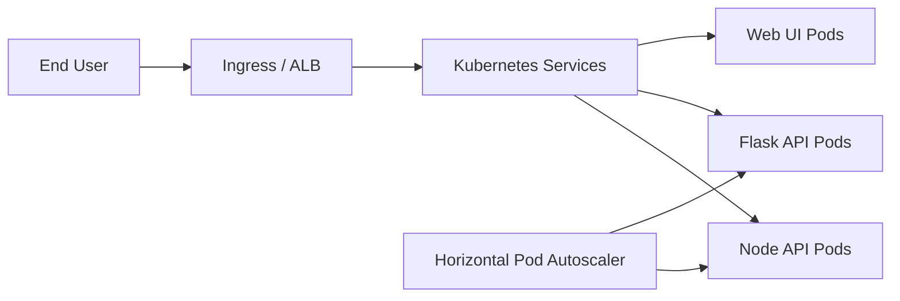

# Express Reliability Platform V5 — Kubernetes Self-Healing (EKS)

## 1) Version Purpose

Move from ECS-style orchestration to Kubernetes (EKS), then introduce self-healing and autoscaling concepts.

## 2) Chapters Covered

- Chapter 11: EKS Foundations (pods, deployments, services, ingress)
- Chapter 12: Self-Healing + Autoscaling (probes, HPA, node scaling concepts)

## 3) What You Will Build

- An EKS-based platform foundation managed with Terraform modules.
- A repeatable deployment path for workloads in `live` and `shared` environments.

## 4) Architecture Diagram (Mermaid)



## 5) Project Structure

```text
express-reliability-platform-v05/
├── environments/
│   └── live/
├── infrastructure/
│   └── bootstrap/
├── modules/
│   ├── alb/
│   ├── eks/
│   ├── iam/
│   └── vpc/
├── scripts/
│   └── terraform_init_apply.sh
└── README.md
```

## 6) Run Steps

1. Install prerequisites: AWS CLI, Terraform, kubectl, Helm.
2. Configure AWS credentials for your account.
3. Run infrastructure deployment helper:

   ```sh
   ./scripts/terraform_init_apply.sh
   ```

4. Validate Terraform outputs and configure kubectl for EKS.
5. Confirm cluster health:

   ```sh
   kubectl get nodes
   kubectl get pods -A
   ```

## 7) Validation Checklist

- [ ] Terraform init/plan/apply succeeds.
- [ ] EKS cluster is created and reachable via kubectl.
- [ ] Worker nodes are in `Ready` state.
- [ ] Baseline workload deployment can be scheduled.
- [ ] Autoscaling concepts (HPA/probes) are understood and documented for your workloads.

## 8) Troubleshooting

- AWS auth errors: re-run `aws configure` and confirm active account/region.
- Terraform backend/state issues: validate backend config in environment folders.
- kubectl access denied: refresh kubeconfig using `aws eks update-kubeconfig`.

## 9) Cleanup

- Destroy test resources after labs to avoid cost:

  ```sh
  terraform -chdir=environments/live destroy
  ```

## 10) Next Version Preview

In V6, you formalize infrastructure-as-code discipline with stronger Terraform structure, state strategy, and environment separation.


