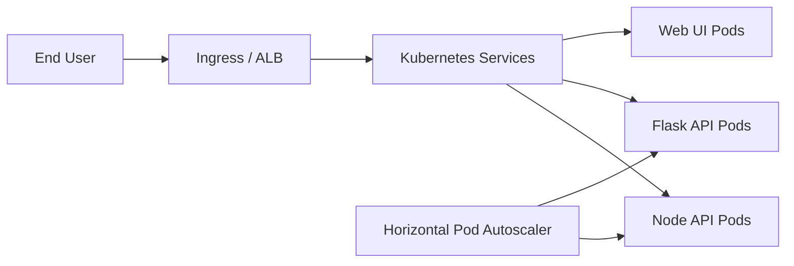

# Express Reliability Platform V5 — Kubernetes Self-Healing (EKS)

## Builds on V4

Before you start V5, copy your personal V4 repository to your local machine and rename it to V5:

```sh
git clone https://github.com/YOUR_USERNAME/express-reliability-platform-v04.git
mv express-reliability-platform-v04 express-reliability-platform-v05
cd express-reliability-platform-v05
```

Use the main class repository for scripts and canonical structure:

- https://github.com/Here2ServeU/express-reliability-platform-course

## 1) Version Purpose

Move from ECS-style orchestration to Kubernetes (EKS), then introduce self-healing and autoscaling concepts.

---

## Plain Language Context

**What is this version teaching you?**
You replace the container manager from V3 (ECS) with Kubernetes — a more powerful system that automatically restarts crashed services and scales up when traffic increases. Think of ECS as a person who watches one set of machines. Kubernetes is like an automated building manager who watches hundreds of machines, notices instantly when one fails, starts a replacement, and even calls for extra help when the building is unusually busy.

**How does a bank or hospital use this?**
Hospital patient portals face unpredictable traffic spikes — a public health announcement can send ten times the normal traffic in minutes. Kubernetes handles this automatically by starting more copies of the service when traffic rises and stopping them when it drops. Banks use it to maintain zero-downtime deployments — new code rolls out gradually while the old version keeps serving traffic.

**Key terms in plain language:**

| Term | What It Means |
|---|---|
| **Kubernetes** | A system that manages containers at scale — starts them, restarts them if they crash, and balances traffic across them |
| **EKS (Elastic Kubernetes Service)** | Amazon's managed Kubernetes service — Amazon handles the control plane so you only manage your workloads |
| **Pod** | The smallest deployable unit in Kubernetes — usually one running container |
| **Deployment** | A Kubernetes instruction that says "keep exactly N copies of this pod running at all times" |
| **Service (Kubernetes)** | A stable network address that routes traffic to the correct pods — even when pods restart and get new addresses |
| **Ingress / ALB** | The entry point for external traffic — routes incoming requests to the right Kubernetes service |
| **HPA (Horizontal Pod Autoscaler)** | Automatically adds more pods when load increases and removes them when load drops |
| **kubectl** | The command-line tool for controlling a Kubernetes cluster — like a remote control for your cluster |

**Expected result at the end of this version:**
- `kubectl get nodes` shows healthy nodes in the EKS cluster.
- `kubectl get pods -A` shows all services running without restarts.
- Killing a pod manually results in Kubernetes restarting it automatically.

---


## Training Workflow (Understand -> Build -> Test -> Break -> Fix -> Explain -> Automate -> Improve)

1. Understand: Review EKS architecture and autoscaling concepts.
2. Build: Deploy infrastructure and baseline workloads.
3. Test: Validate cluster health, scheduling, and service reachability.
4. Break: Trigger a controlled pod/service fault.
5. Fix: Use `kubectl`, logs, and metrics to restore health.
6. Explain: Document what failed, why it failed, and what fixed it.
7. Automate: Add runbooks/scripts for recovery and scale checks.
8. Improve: Tune probe, HPA, and capacity settings.

## 3) What You Will Build

- An EKS-based platform foundation managed with Terraform modules.
- A repeatable deployment path for workloads in the `live` environment, ready to promote with `dev -> staging -> prod` discipline.

## 4) Architecture Diagram (Mermaid)



## 5) Project Structure

```text
express-reliability-platform-v05/
├── environments/
│   └── live/
├── infrastructure/
│   └── bootstrap/
├── modules/
│   ├── alb/
│   ├── eks/
│   ├── iam/
│   └── vpc/
├── scripts/
│   └── terraform_init_apply.sh
└── README.md
```

## 6) Run Steps

1. Run the local Docker Compose gate first using your latest local stack (from V4):

   ```sh
   cd ../express-reliability-platform-v04
   docker compose up --build -d
   curl http://localhost:8080/api/health
   docker compose down
   cd ../express-reliability-platform-v05
   ```

2. Install prerequisites: AWS CLI, Terraform, kubectl, Helm.
3. Configure AWS credentials for your account.
4. Run infrastructure deployment helper:

   ```sh
   ./scripts/terraform_init_apply.sh
   ```

5. Validate Terraform outputs and configure kubectl for EKS.
6. Confirm cluster health:

   ```sh
   kubectl get nodes
   kubectl get pods -A
   ```

## 7) Validation Checklist

- [ ] Terraform init/plan/apply succeeds.
- [ ] EKS cluster is created and reachable via kubectl.
- [ ] Worker nodes are in `Ready` state.
- [ ] Baseline workload deployment can be scheduled.
- [ ] Autoscaling concepts (HPA/probes) are understood and documented for your workloads.

## 8) Troubleshooting

- AWS auth errors: re-run `aws configure` and confirm active account/region.
- Terraform backend/state issues: validate backend config in environment folders.
- kubectl access denied: refresh kubeconfig using `aws eks update-kubeconfig`.

## 9) Cleanup

- Destroy test resources after labs to avoid cost:

  ```sh
  terraform -chdir=environments/live destroy
  ```

## 10) Next Version Preview

In V6, you build on V5 and formalize stronger Terraform structure, state strategy, and environment separation.


