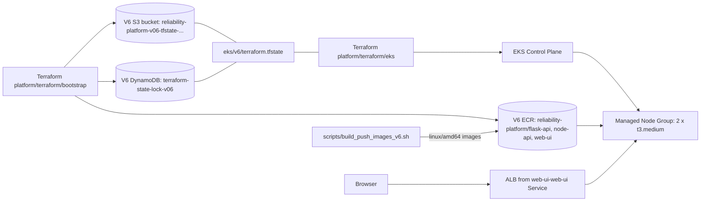

# Express Reliability Platform V6: Terraform Modules, Repeatable Infrastructure, Cost-Aware Environments

> **What you will build (in one paragraph).** The same EKS-on-AWS stack from V5, but rebuilt around the three production-grade infrastructure patterns: **reusable Terraform modules** with explicit input/output contracts, **per-environment tfvars** (`dev` and `prod` from the same code, sized differently), and **cost-aware tagging plus AWS Budgets alerts** so spend never sneaks up on you. By the end you will deploy the same root composition twice: once to a small `dev` cluster, once to a `prod`-sized cluster: with two different state files, two different budgets, and the same Helm charts on top. About 30 minutes per env on a fresh AWS account, ~$2.10/day for `dev`, ~$5.40/day for `prod` if you forget to clean up.

## Table of contents

- [Quick Start (the 4-command path)](#quick-start-the-4-command-path)
- [Why modules + per-env + cost-aware (the concept layer)](#why-modules--per-env--cost-aware-the-concept-layer)
- [Modules overview](#modules-overview)
- [Per-environment deploy](#per-environment-deploy)
- [Cost guardrails](#cost-guardrails)
- [Prerequisites](#prerequisites)
- [Deploy](#deploy)
  - [Path A: Scripted (recommended)](#path-a--scripted-recommended)
  - [Path B: Manual walkthrough](#path-b--manual-walkthrough)
- [Validate the platform](#validate-the-platform)
- [Operate (rolling updates, rollback, scaling)](#operate-rolling-updates-rollback-scaling)
- [Cleanup](#cleanup)
- [Reference](#reference)
  - [Project structure](#project-structure)
  - [Configuration reference](#configuration-reference)
    - [1. Helm chart values](#1-helm-chart-values)
    - [2. Terraform variables](#2-terraform-variables)
    - [3. Script environment variables](#3-script-environment-variables)
    - [4. Hardcoded values worth knowing about](#4-hardcoded-values-worth-knowing-about)
  - [Architecture diagrams](#architecture-diagrams)
  - [Web UI guide](#web-ui-guide)
  - [Troubleshooting](#troubleshooting)

---

## Quick Start (the 4-command path)

> Use this if you've already done V5 and just want a working V6 cluster. If anything goes wrong, jump to [Troubleshooting](#troubleshooting).

```sh
# 1. Clone the course repo (V5 sources live at ../express-reliability-platform-v05/)
cd express-reliability-platform-v06

# 2. One command provisions a sized environment. Default is dev.
ENV=dev  ./scripts/tf_deploy_v6.sh   # 1× t3.small,  $50/mo budget
# ENV=prod ./scripts/tf_deploy_v6.sh  # 3× t3.medium, $300/mo budget

# 3. Get the public URL (~25 minutes after step 2 starts; ALB takes 60-90s)
kubectl get svc web-ui-web-ui -n platform \
  -o jsonpath='{.status.loadBalancer.ingress[0].hostname}'

# 4. When done: destroy this env (the other env's state stays put)
ENV=dev ./scripts/cleanup_v6.sh
```

**You'll know it worked when** `curl -I http://<the-hostname>` returns `HTTP/1.1 200 OK` and `kubectl get pods -n platform` shows 6 pods all `Running 1/1`. To prove the FinOps story, also check the AWS Billing console → Budgets; you should see `reliability-platform-v06-<env>-monthly` with the `Environment=<env>` filter.

---

## Why modules + per-env + cost-aware (the concept layer)

V5 gave you a working EKS cluster, but the Terraform that built it was one ~180-line `main.tf` with hardcoded sizing, no environment separation, and the bare-minimum tags. That's fine for a single demo cluster. It's a disaster the moment you need a second one: for staging, for a customer demo, for a regulated tenant: because every change is copy-paste-edit, blast radius is unclear, and there's no signal when spend drifts.

V6 fixes all three at once.

**Reusable modules.** Every meaningful resource lives in a module under [platform/terraform/modules/](express-reliability-platform-v06/platform/terraform/modules/) with explicit `variables.tf` (inputs) and `outputs.tf` (outputs). The root [eks/main.tf](express-reliability-platform-v06/platform/terraform/eks/main.tf) is just composition: provider config plus four `module` calls. New env? New tfvars file. New region? Same modules, different root. Modules are the contract; the root is the only thing that changes.

**Repeatable infrastructure.** The same root applies cleanly to `dev` and `prod` from [environments/dev.tfvars](express-reliability-platform-v06/platform/terraform/eks/environments/dev.tfvars) and [environments/prod.tfvars](express-reliability-platform-v06/platform/terraform/eks/environments/prod.tfvars), with state stored in distinct keys (`eks/v6/dev/...` vs `eks/v6/prod/...`) so the two never share a lock or accidentally overwrite each other. Sizing, CIDR, and budget all flow from the tfvars file: code is identical, configuration is per-env.

**Cost-aware environments.** A provider-level `default_tags` block stamps `Environment`, `Owner`, `App`, `CostCenter`, `Project`, `Version`, `ManagedBy` onto every taggable AWS resource without the modules having to know those tags exist: the canonical FinOps pattern. An [aws_budgets_budget](express-reliability-platform-v06/platform/terraform/modules/budget/main.tf) resource per env emails you when spend crosses 80% and 100% of the env's monthly cap. Cost reports group cleanly by `Environment`/`App` so dev's noise doesn't drown out prod's signal.

### The three guarantees V6 adds on top of V5

| Guarantee | What it means | Where it lives |
|---|---|---|
| **One source of truth, many environments** | Same modules + same root + different tfvars = different env. Drift between envs becomes obvious in PRs. | [environments/](express-reliability-platform-v06/platform/terraform/eks/environments/) + [eks/main.tf](express-reliability-platform-v06/platform/terraform/eks/main.tf) |
| **Bounded blast radius** | Each module owns one concern (VPC, IAM, cluster, budget). A bug in IAM never compiles into a network change. | [modules/](express-reliability-platform-v06/platform/terraform/modules/) |
| **Spend you can see before the bill arrives** | Tags flow into Cost Explorer; budgets fire actual emails before the bill does. | [modules/budget/](express-reliability-platform-v06/platform/terraform/modules/budget/) + provider `default_tags` |

### Glossary (plain-language: V6 + carryover from V5)

| Term | What it means |
|---|---|
| **Module** | A folder under `modules/` that wraps a related set of resources behind explicit inputs (`variables.tf`) and outputs (`outputs.tf`). Callers depend on the contract, not the contents. |
| **Root module / composition** | The top-level `*.tf` that calls modules. Stays small on purpose: most of the logic lives inside the modules it composes. |
| **tfvars file** | A file of `name = value` pairs that fills in variables at apply time. We use one per env: `dev.tfvars`, `prod.tfvars`. |
| **Backend** | Where Terraform stores state. We use S3 for the state file, DynamoDB for locking, and a per-env state key so envs never collide. |
| **`default_tags`** | A provider-level block that automatically applies a tag map to every taggable resource the provider creates. The FinOps tagging pattern. |
| **Cost Allocation Tag** | A tag activated in the Billing console so it shows up in Cost Explorer reports and can filter Budgets. Activation is one-time, account-global, and takes ~24h to back-fill. |
| **AWS Budgets** | Spend alerts. Defined in Terraform; emails when actuals (or forecasts) cross thresholds. We use 80% and 100%. |
| **Kubernetes / EKS / Pod / Deployment / Service / Helm** | Same meanings as V5: V6 doesn't change the runtime, only the way the runtime is provisioned. |

---

## Modules overview

V6's Terraform lives in two places: small composition files at the root, and self-contained modules under [platform/terraform/modules/](express-reliability-platform-v06/platform/terraform/modules/). Each module exposes a narrow contract: only the inputs it actually needs, only the outputs other modules consume.

| Module | Purpose | Key inputs | Key outputs |
|---|---|---|---|
| [`modules/vpc`](express-reliability-platform-v06/platform/terraform/modules/vpc) | VPC, IGW, public subnets across N AZs, route table | `cidr_block`, `cluster_name`, `name_prefix` | `vpc_id`, `public_subnet_ids` |
| [`modules/eks-iam`](express-reliability-platform-v06/platform/terraform/modules/eks-iam) | Cluster + node IAM roles with the four AWS-managed policies attached | `name_prefix` | `cluster_role_arn`, `node_role_arn` |
| [`modules/eks-cluster`](express-reliability-platform-v06/platform/terraform/modules/eks-cluster) | EKS control plane + managed node group | `cluster_name`, `kubernetes_version`, `subnet_ids`, role ARNs, sizing | `cluster_name`, `cluster_endpoint` |
| [`modules/budget`](express-reliability-platform-v06/platform/terraform/modules/budget) | Per-env `aws_budgets_budget` with 80%/100% email alerts | `monthly_limit_usd`, `alert_email`, `cost_filter_tags` | `budget_name`, `budget_id` |

The root [eks/main.tf](express-reliability-platform-v06/platform/terraform/eks/main.tf) is just provider config plus four `module` calls: under 130 lines, mostly variables and outputs. To add a fifth concern (say, a managed Prometheus workspace later), you'd add `modules/prometheus/` with its own contract and a single `module "prometheus" {}` block in the root.

**Versioning interfaces.** Each module owns its `variables.tf` and `outputs.tf`. Adding an optional input with a `default` is non-breaking; renaming or removing one is. When you publish a module to multiple stacks, treat its `variables.tf` like a public API: semver it.

---

## Per-environment deploy

V6 ships two ready-to-apply environments: `dev` (cheap, single-node) and `prod` (sized for load + headroom). The same root `main.tf` applies cleanly to either; only the tfvars file changes.

| Setting | `dev.tfvars` | `prod.tfvars` |
|---|---|---|
| `vpc_cidr` | `10.43.0.0/16` | `10.44.0.0/16` (peerable with dev) |
| `node_instance_types` | `["t3.small"]` | `["t3.medium"]` |
| `node_desired_size` / `min` / `max` | `1` / `1` / `2` | `3` / `2` / `6` |
| `monthly_budget_usd` | `50` | `300` |
| State key | `eks/v6/dev/terraform.tfstate` | `eks/v6/prod/terraform.tfstate` |
| Cluster name | `reliability-platform-dev` | `reliability-platform-prod` |

```sh
# Apply dev (default)
ENV=dev ./scripts/tf_deploy_v6.sh

# Apply prod (same code, different tfvars + state key)
ENV=prod ./scripts/tf_deploy_v6.sh

# Tear down only dev; prod is untouched
ENV=dev ./scripts/cleanup_v6.sh
```

**State separation.** The deploy script passes `-backend-config="key=eks/v6/${ENV}/terraform.tfstate"` so each env gets its own state file in the shared bootstrap bucket. The DynamoDB lock table is shared but the lock key is the state key, so dev and prod never block each other.

**IAM is account-global.** EKS cluster + node IAM roles include the env in their names (`reliability-platform-v06-<env>-eks-cluster-role`) so dev and prod coexist on the same account. The `name_prefix` local in [eks/main.tf](express-reliability-platform-v06/platform/terraform/eks/main.tf) is what threads `<env>` through every module.

**Adding a `staging` env.** Copy `dev.tfvars` → `staging.tfvars`, change `environment = "staging"`, pick a non-overlapping CIDR (e.g. `10.45.0.0/16`), then `ENV=staging ./scripts/tf_deploy_v6.sh`. No code changes.

---

## Cost guardrails

Cost-aware infrastructure isn't just "smaller in dev"; it's a tagging discipline plus an alert mechanism.

**Tagging via `default_tags`.** [eks/main.tf](express-reliability-platform-v06/platform/terraform/eks/main.tf) declares a single `default_tags` block on the AWS provider. Every taggable resource Terraform creates inside any module gets:

| Tag | Source | Used by |
|---|---|---|
| `Project` | `var.project_name` | Cost Explorer grouping, ServiceCatalog discovery |
| `App` | `var.project_name` | Budget cost filter, app-level chargeback |
| `Environment` | `var.environment` | Budget cost filter, env-level chargeback |
| `Owner` | `var.owner` | FinOps escalation, "who owns this?" queries |
| `CostCenter` | `var.cost_center` | Showback / chargeback to the right team |
| `Version` | `var.version_suffix` | Course-version namespacing across V5/V6/V7+ |
| `ManagedBy` | `"terraform"` | Distinguishes from console-created resources |

The modules themselves don't reference these tags. They set per-resource tags like `Name`, and Terraform merges the provider defaults in. Add a new tag once at the provider, and every resource picks it up on the next apply.

**Activate the tags.** Tag-based cost reports and tag-filtered budgets only work after the tag is **activated** as a Cost Allocation Tag. One-time, per-account: AWS Billing console → Cost allocation tags → activate `Environment`, `App`, `Owner`, `CostCenter`, `Project`. Activation takes ~24h to back-fill historical spend; until then, tagged spend appears as "untagged" in reports and budgets.

**Per-env budgets.** [modules/budget](express-reliability-platform-v06/platform/terraform/modules/budget) creates one `aws_budgets_budget` per env, scoped by `Environment` and `App` tags so dev's spend doesn't trigger prod's alert. Two notification thresholds: 80% (warning) and 100% (alert). Both email `var.budget_alert_email` from the env's tfvars.

**Why the budget module gets a separate `aws.untagged` provider.** AWS Budgets has its own service-specific tagging permission (`budgets:TagResource`) that's not bundled into the typical IAM policies a course user gets. With the provider's `default_tags` in effect, `CreateBudget` calls `TagResource` and fails with:

```
AccessDeniedException: User ... is not authorized to perform: budgets:TagResource
```

[eks/main.tf](express-reliability-platform-v06/platform/terraform/eks/main.tf) declares a second `provider "aws"` block aliased as `untagged` (no `default_tags`), and the `module "budget"` call passes `providers = { aws = aws.untagged }`. The budget resource is created without tags, so no `TagResource` call is made. Every other resource still receives the full `default_tags` map.

The budget's cost-filter logic is unaffected: `cost_filter_tags = { Environment, App }` filters spend on tagged resources, which is independent of whether the budget itself is tagged.

If you'd rather grant the IAM permission and remove the alias (e.g. when the course user becomes an admin role), add this to the user's policy and delete the `aws.untagged` provider block:

```json
{
  "Effect": "Allow",
  "Action": [
    "budgets:TagResource",
    "budgets:UntagResource",
    "budgets:ListTagsForResource"
  ],
  "Resource": "arn:aws:budgets:<account-id>:budget/*"
}
```

**Daily run-rate.** Both envs are dominated by EKS control plane ($0.10/h flat) + EC2 nodes:

| Env | EKS control plane | Worker nodes | Approx daily |
|---|---|---|---|
| `dev` | $2.40/day | 1× t3.small | ~$2.10/day |
| `prod` | $2.40/day | 3× t3.medium | ~$5.40/day |

Forgetting to clean up `dev` for a month costs ~$63: under the $50 budget alert, you'd see the warning at ~24 days. Forgetting `prod` costs ~$162/month and trips the 80% warning at ~24 days as well. Both well below the cap, by design: the budget exists to catch surprise spikes (a runaway node group, a Spot replacement loop, an unintended LoadBalancer), not to track expected baseline.

---

## Prerequisites

Before running anything, confirm you have:

- [ ] **AWS CLI v2** configured (`aws configure`) with credentials that can create EKS, IAM, EC2, ECR, S3, and DynamoDB.
- [ ] **Docker with `buildx`** running locally: V6 builds and pushes its own images.
- [ ] **Terraform ≥ 1.5**.
- [ ] **kubectl ≥ 1.29 and helm ≥ 3.14**: install with:
  ```sh
  # macOS
  brew install kubectl helm

  # Linux
  curl -LO "https://dl.k8s.io/release/$(curl -Ls https://dl.k8s.io/release/stable.txt)/bin/linux/amd64/kubectl"
  chmod +x kubectl && sudo mv kubectl /usr/local/bin/
  curl https://raw.githubusercontent.com/helm/helm/main/scripts/get-helm-3 | bash

  # Verify
  kubectl version --client
  helm version
  ```
- [ ] **V5 application sources accessible.** V6 ships its own `web-ui/` (Dockerfile + V6 `index.html`); the build script reads Dockerfiles for `flask-api`/`node-api` from V5. The deploy script defaults to `../express-reliability-platform-v05/apps`. If your V5 sources live elsewhere, set `V5_APPS_SRC=<path>`.

> **Don't have V5?** Clone the course repo (`Here2ServeU/express-reliability-platform-course`) and you'll get both V5 and V6 as sibling directories. You don't need to deploy V5: V6 only needs the Dockerfiles, not a running V5 stack.

---

## Deploy

V6 owns its full stack: a state backend (S3 + DynamoDB), three ECR repos, an EKS cluster, and three Helm releases. V5 does not need to be deployed.

### Path A: Scripted (recommended)

```sh
ENV=dev  ./scripts/tf_deploy_v6.sh   # or ENV=prod
```

**What it runs, in order:**

| # | Step | Time |
|---|---|---|
| 1 | Bootstrap apply: state bucket + lock table + 3 ECR repos (shared across envs) | ~1 min |
| 2 | Build + push 3 `linux/amd64` images to ECR | ~3-5 min |
| 3 | EKS apply with `-var-file=environments/${ENV}.tfvars` and per-env state key | **10-15 min** |
| 4 | Configure kubectl and create the `platform` namespace | <1 min |
| 5 | Helm install all three charts | ~30s + pod startup |
| 6 | `kubectl rollout restart` so `:latest` images are picked up | ~5s |
| 7 | Wait for all rollouts to finish, print the public URL | ALB takes 60-90s |

The script is idempotent within an env: re-running with the same `ENV` rebuilds, repushes, and rolls forward. Switching `ENV` between runs is also safe: state keys are env-scoped, so `dev` and `prod` never share state.

**You'll know it worked when** the script prints a hostname under "Public URL", `curl -I http://<that-hostname>` returns `HTTP/1.1 200 OK`, and the AWS Billing console shows a budget named `reliability-platform-v06-${ENV}-monthly`.

### Path B: Manual walkthrough

Use this the first time so you see what each phase actually does.

#### Phase 1: Bootstrap (state backend + ECR repos) · ~1 min

```sh
terraform -chdir=platform/terraform/bootstrap init
terraform -chdir=platform/terraform/bootstrap apply -auto-approve
```

Outputs to note: `state_bucket`, `lock_table`, `account_id`, `ecr_base_uri`.

> If you previously ran V6 bootstrap, this is a no-op. If V5 already created ECR repos with the same names in the same account, terraform will fail to create V6's: change `project_name` in [bootstrap/variables.tf](express-reliability-platform-v06/platform/terraform/bootstrap/variables.tf), or destroy V5's repos first.

#### Phase 2: Build and push images · ~3-5 min

```sh
./scripts/build_push_images_v6.sh
```

Defaults: reads `web-ui/` from V6's own `apps/`, reads `flask-api/` and `node-api/` from `../express-reliability-platform-v05/apps`, builds `linux/amd64`, pushes `:latest` to V6's ECR. Override the V5 path with `V5_APPS_SRC=<path>`.

> **Why `linux/amd64`?** EKS nodes (and ECS Fargate) run amd64. On Apple Silicon, a plain `docker build` would produce arm64 images that the cluster cannot pull, leaving every pod in `ImagePullBackOff`.

#### Phase 3: Provision EKS · 10-15 min ☕

```sh
ENV=dev   # or prod
ACCOUNT_ID=$(terraform -chdir=platform/terraform/bootstrap output -raw account_id)
terraform -chdir=platform/terraform/eks init -reconfigure \
  -backend-config="bucket=reliability-platform-v06-tfstate-${ACCOUNT_ID}" \
  -backend-config="dynamodb_table=terraform-state-lock-v06" \
  -backend-config="key=eks/v6/${ENV}/terraform.tfstate"

terraform -chdir=platform/terraform/eks apply -auto-approve \
  -var-file="environments/${ENV}.tfvars"
```

Creates (per env): VPC + IGW + 2 public subnets (via `modules/vpc`), cluster + node IAM roles (via `modules/eks-iam`), the EKS cluster + managed node group sized per the tfvars file (via `modules/eks-cluster`), and a tag-filtered `aws_budgets_budget` (via `modules/budget`). The provider's `default_tags` block stamps `Environment`, `Owner`, `App`, `CostCenter`, `Project`, `Version`, `ManagedBy` onto every taggable resource.

#### Phase 4: Configure kubectl · <1 min

```sh
CLUSTER=$(terraform -chdir=platform/terraform/eks output -raw cluster_name)
aws eks --region us-east-1 update-kubeconfig --name "$CLUSTER"
kubectl get nodes
```

**You'll know it worked when** 2 nodes show `STATUS: Ready`. If they're `NotReady`, give it 2-3 more minutes for the CNI to come up.

#### Phase 5: Install the Helm charts · ~30s + pod startup

```sh
ECR_BASE=$(terraform -chdir=platform/terraform/bootstrap output -raw ecr_base_uri)

kubectl create namespace platform --dry-run=client -o yaml | kubectl apply -f -

for SVC in flask-api node-api web-ui; do
  helm upgrade --install "$SVC" "platform/helm/$SVC" \
    --namespace platform \
    --set image.repository="${ECR_BASE}/${SVC}"
done

kubectl get pods -n platform -w
```

`helm upgrade --install` is the idempotent deploy command: installs if missing, upgrades if present.

**You'll know it worked when** 6 pods show `STATUS: Running`, `READY: 1/1`. Press Ctrl-C to exit the watch.

#### Phase 6: Get the public URL · 60-90s for ALB

```sh
kubectl get svc web-ui-web-ui -n platform \
  -o jsonpath='{.status.loadBalancer.ingress[0].hostname}'
```

The Service is named `web-ui-web-ui` because Helm prefixes the service name with the release name (release `web-ui` + service `web-ui`). The first time, the hostname may be empty for 60-90 seconds while AWS provisions the Classic ELB.

---

## Validate the platform

Run these eight checks in order. All must pass before moving on to V7.

### 1. Cluster is up

```sh
ENV=dev   # or prod
aws eks describe-cluster --region us-east-1 --name "reliability-platform-${ENV}" \
  --query 'cluster.{name:name,status:status,version:version}' --output table
kubectl get nodes
```
Expect: cluster `status: ACTIVE`, nodes `Ready` (count per the env's tfvars: 1 for dev, 3 for prod).

### 2. All pods running

```sh
kubectl get pods -n platform -o wide
kubectl get deployments -n platform
kubectl get svc -n platform
```
Expect: 6 pods `Running 1/1`, 3 deployments `READY: 2/2`, `web-ui-web-ui` Service shows an external hostname.

### 3. Public URL returns 200

```sh
URL=$(kubectl get svc web-ui-web-ui -n platform \
  -o jsonpath='{.status.loadBalancer.ingress[0].hostname}')
curl -I "http://$URL"
```
Expect: `HTTP/1.1 200 OK`. Open the URL in a browser to see the V6 governance UI.

### 4. Health endpoint via port-forward

```sh
kubectl port-forward svc/node-api-node-api 3000:3000 -n platform &
curl http://localhost:3000/health
```
Expect: `{"status":"ok","service":"node-api","version":"v2"}`. Kill the port-forward when done with `kill %1`.

### 5. Self-healing: the most important test ⭐

```sh
POD=$(kubectl get pods -n platform -l app=node-api-node-api \
  -o jsonpath='{.items[0].metadata.name}')
kubectl delete pod "$POD" -n platform
kubectl get pods -n platform -w
```
Expect, in this exact sequence:
1. Deleted pod shows `Terminating`.
2. Within 5s a new pod appears with `Pending`.
3. Within 30s the new pod is `Running 1/1`.
4. The `Terminating` pod disappears.

If you see that sequence, **self-healing is confirmed.** This is the fundamental reliability guarantee Kubernetes adds on top of V5.

### 6. Liveness probe is configured

```sh
kubectl describe pod -n platform -l app=node-api-node-api | grep -A2 Liveness
```
Expect a line like `http-get http://:3000/health delay=30s period=10s #failure=3`.

### 7. Rolling update works

```sh
helm upgrade node-api platform/helm/node-api --namespace platform \
  --set image.repository="${ECR_BASE}/node-api" \
  --set image.tag=v3
kubectl rollout status deployment/node-api-node-api -n platform
```
Expect: `successfully rolled out`.

### 8. Rollback works

```sh
kubectl rollout undo deployment/node-api-node-api -n platform
kubectl rollout history deployment/node-api-node-api -n platform
```
Expect: pods return to `Running 1/1`, history shows the rollback as a new revision.

---

## Operate (rolling updates, rollback, scaling)

### Roll a new image without editing values.yaml

```sh
helm upgrade node-api platform/helm/node-api --namespace platform \
  --set image.repository="${ECR_BASE}/node-api" \
  --set image.tag=<sha-or-version>
kubectl rollout status deployment/node-api-node-api -n platform
```

### Roll back if a release misbehaves

```sh
kubectl rollout undo deployment/node-api-node-api -n platform
```

### Scale a deployment manually

```sh
kubectl scale deployment/node-api-node-api --replicas=4 -n platform
kubectl get pods -n platform -w
```

If new pods land `Pending` for resource reasons, bump `node_desired_size` in [eks/variables.tf](express-reliability-platform-v06/platform/terraform/eks/variables.tf) and re-apply.

---

## Cleanup

EKS is not free: control plane \$0.10/hr (~\$2.40/day) plus the worker nodes the env's tfvars sized. Always destroy after a session.

### Path A: Scripted (recommended)

```sh
ENV=dev  ./scripts/cleanup_v6.sh   # tear down dev only
ENV=prod ./scripts/cleanup_v6.sh   # tear down prod only
```

The script tears down only the `ENV` you specify. It uninstalls Helm releases, deletes the namespace, reaps orphan AWS load balancers (so subnet/IGW destroy doesn't `DependencyViolation`), destroys the env's EKS stack, and removes the kubectl context.

If **other envs still have state in the bootstrap bucket**, the script preserves the bucket / lock table / ECR repos so the other env keeps working. Once you've cleaned up every env, the final `cleanup_v6.sh` run also drains and destroys the bootstrap. V5's bootstrap and ECR (if present) are never touched.

### Path B: Manual

Run in reverse order of deploy. Substitute `dev` or `prod` for `${ENV}`.

```sh
ENV=dev

# 1) Helm + namespace
helm uninstall web-ui node-api flask-api -n platform || true
kubectl delete namespace platform --ignore-not-found

# 2) Reap orphan load balancers (otherwise subnet destroy will fail)
VPC=$(aws ec2 describe-vpcs --region us-east-1 \
  --filters "Name=tag:Name,Values=reliability-platform-v06-${ENV}-vpc" \
  --query 'Vpcs[0].VpcId' --output text)
for LB in $(aws elb describe-load-balancers --region us-east-1 \
      --query "LoadBalancerDescriptions[?VPCId=='$VPC'].LoadBalancerName" --output text); do
  aws elb delete-load-balancer --load-balancer-name "$LB" --region us-east-1
done
sleep 90

# 3) EKS for this env (10-15 min)
terraform -chdir=platform/terraform/eks destroy -auto-approve \
  -var-file="environments/${ENV}.tfvars"

# 4) Bootstrap: only when no other envs remain. Apply first to record
#    force_destroy in state, then destroy.
terraform -chdir=platform/terraform/bootstrap apply -auto-approve
terraform -chdir=platform/terraform/bootstrap destroy -auto-approve

# 5) kubectl context
kubectl config delete-context "$(kubectl config current-context)" 2>/dev/null || true
```

> **Why the LB-reap step matters.** A `Service type=LoadBalancer` provisions an AWS Classic ELB *outside* Terraform's view. If you skip the reap and run `terraform destroy`, AWS rejects subnet/IGW deletion with `DependencyViolation` because the LB still holds ENIs and EIPs. The cleanup script handles this in Step 2b automatically.

> **Why `apply` before `destroy` on bootstrap.** The state bucket is versioned, so a plain destroy fails with `BucketNotEmpty`. `force_destroy = true` on the bucket resource drains every version and delete-marker before issuing `DeleteBucket`: but only if it's recorded in state. The pre-destroy apply guarantees that.

---

## Reference

### Project structure

```text
express-reliability-platform-v06/
├── apps/
│   └── web-ui/                              ← V6 governance scorecard UI
│       ├── Dockerfile                       ← nginx:alpine + index.html
│       └── index.html
├── platform/
│   ├── helm/
│   │   ├── flask-api/                       ← Chart.yaml, values.yaml, templates/deployment.yaml
│   │   ├── node-api/
│   │   └── web-ui/                          ← service.type=LoadBalancer
│   └── terraform/
│       ├── bootstrap/                       ← state backend + ECR (shared across envs)
│       │   ├── main.tf                      ← S3 + DynamoDB
│       │   ├── ecr.tf                       ← 3 ECR repos + lifecycle policy
│       │   └── variables.tf
│       ├── modules/                         ← reusable, single-concern modules
│       │   ├── vpc/                         ← VPC + IGW + public subnets + RT
│       │   ├── eks-iam/                     ← cluster + node IAM roles
│       │   ├── eks-cluster/                 ← EKS control plane + node group
│       │   └── budget/                      ← aws_budgets_budget + tag filter
│       └── eks/                             ← thin root composition (uses modules/)
│           ├── main.tf                      ← provider default_tags + module calls
│           ├── variables.tf
│           └── environments/
│               ├── dev.tfvars               ← cheap, single-node
│               └── prod.tfvars              ← sized + larger budget
└── scripts/
    ├── tf_deploy_v6.sh                      ← ENV=dev|prod end-to-end deploy
    ├── build_push_images_v6.sh              ← image pipeline (V6 web-ui, V5 apis)
    └── cleanup_v6.sh                        ← ENV=dev|prod env-scoped teardown
```

### Configuration reference

Defaults are wired together: a fresh clone deploys without edits. This section is "what to change when defaults aren't right." Four config surfaces:

1. [Helm chart values](#1-helm-chart-values): per-service runtime config (image, probes, resources, scaling)
2. [Terraform variables](#2-terraform-variables): infrastructure shape (region, cluster size, K8s version)
3. [Script environment variables](#3-script-environment-variables): runtime overrides for the deploy/build/cleanup scripts
4. [Hardcoded values worth knowing about](#4-hardcoded-values-worth-knowing-about): things that aren't variables but you may need to edit

#### 1. Helm chart values

Each chart has a `values.yaml` with the same shape. Override per-install with `--set key=value`, or edit `values.yaml` for persistent changes.

**Files:**
- [platform/helm/flask-api/values.yaml](express-reliability-platform-v06/platform/helm/flask-api/values.yaml)
- [platform/helm/node-api/values.yaml](express-reliability-platform-v06/platform/helm/node-api/values.yaml)
- [platform/helm/web-ui/values.yaml](express-reliability-platform-v06/platform/helm/web-ui/values.yaml)

| Key | Default (flask-api) | Default (node-api) | Default (web-ui) | When to change |
|---|---|---|---|---|
| `replicaCount` | `2` | `2` | `2` | More replicas for higher request volume; minimum 2 to prove rolling updates work |
| `image.repository` | `YOUR_ACCOUNT_ID.dkr.ecr...flask-api` | `...node-api` | `...web-ui` | Always overridden by `--set image.repository=${ECR_BASE}/<svc>` from the deploy script. The placeholder is intentional: students forking the course shouldn't have a stale account ID in their `values.yaml`. If you want to invoke `helm install` directly without `--set`, replace the placeholder with your account ID first |
| `image.tag` | `latest` | `latest` | `latest` | Override per release with `--set image.tag=<sha>` for traceable deploys (`latest` is fine for the course but unsafe for prod) |
| `image.pullPolicy` | `Always` | `Always` | `Always` | Keep as `Always`: lets `kubectl rollout restart` pick up new `:latest` images without bumping the tag |
| `service.type` | `ClusterIP` | `ClusterIP` | **`LoadBalancer`** | Only `web-ui` is public. Don't change `flask-api` or `node-api` to `LoadBalancer`; they're internal-only by design |
| `service.port` | `5000` | `3000` | `80` | Match what the app listens on. Changing this also requires editing `containerPort` in the chart's [templates/deployment.yaml](express-reliability-platform-v06/platform/helm/flask-api/templates/deployment.yaml) |
| `resources.requests.cpu` | `100m` | `100m` | `50m` | Bump if the pod is throttled (check `kubectl top pod`); reduce if pods land `Pending` because the node is full |
| `resources.requests.memory` | `128Mi` | `128Mi` | `64Mi` | Bump if pods OOMKill; reduce if scheduling is tight |
| `resources.limits.cpu` | `500m` | `500m` | `250m` | Hard cap. Set generously: limits below requests cause CPU throttling under burst |
| `resources.limits.memory` | `256Mi` | `256Mi` | `128Mi` | Hard cap. Pods exceeding this are OOMKilled |
| `probes.liveness.path` | `/health` | `/health` | `/` | Change if your app doesn't expose `/health`. **Must return HTTP 200 within 1s, or the pod is killed.** |
| `probes.liveness.initialDelaySeconds` | `30` | `30` | `15` | Bump if the app needs longer to start (slow JVM warmup, big image load); reduce for fast-starting apps so failures are caught quicker |
| `probes.liveness.periodSeconds` | `10` | `10` | `10` | Lower = faster detection of stuck containers. 10s is a sane default |
| `probes.liveness.failureThreshold` | `3` | `3` | `3` | Consecutive failures before kubelet kills the pod. 3 × period = "30s of failures kills it" |
| `probes.readiness.path` | `/health` | `/health` | `/` | Same path as liveness is normal for simple apps. For heavy apps, expose a separate `/ready` that checks DB/cache reachability |
| `probes.readiness.initialDelaySeconds` | `10` | `10` | `5` | Time before the pod gets traffic. Too low = traffic hits a half-warm pod; too high = slow rollouts |
| `probes.readiness.periodSeconds` | `5` | `5` | `5` | Lower = faster traffic rerouting when a pod degrades |
| `probes.readiness.failureThreshold` | `3` | `3` | `3` | Consecutive readiness failures before the Service stops sending traffic to this pod |

**Override examples:**

```sh
# Bump replicas just for this release without editing values.yaml
helm upgrade --install node-api platform/helm/node-api -n platform \
  --set image.repository="${ECR_BASE}/node-api" \
  --set replicaCount=4

# Tag-pinned deploy for traceability
helm upgrade --install flask-api platform/helm/flask-api -n platform \
  --set image.repository="${ECR_BASE}/flask-api" \
  --set image.tag=$(git rev-parse --short HEAD)

# Change the readiness path for one chart
helm upgrade --install web-ui platform/helm/web-ui -n platform \
  --set image.repository="${ECR_BASE}/web-ui" \
  --set probes.readiness.path=/index.html
```

> **Things _not_ in `values.yaml`**: `containerPort`, namespace, labels, and selector are baked into [templates/deployment.yaml](express-reliability-platform-v06/platform/helm/flask-api/templates/deployment.yaml). Edit the template if you need to change them, then `helm upgrade` to apply.

#### 2. Terraform variables

The EKS stack reads variables from a per-env tfvars file ([environments/dev.tfvars](express-reliability-platform-v06/platform/terraform/eks/environments/dev.tfvars), [environments/prod.tfvars](express-reliability-platform-v06/platform/terraform/eks/environments/prod.tfvars)). Override per-apply with `-var key=value`. To add a new env, copy a tfvars file and change the values: no code change needed.

##### Bootstrap stack ([platform/terraform/bootstrap/variables.tf](express-reliability-platform-v06/platform/terraform/bootstrap/variables.tf))

| Variable | Default | When to change |
|---|---|---|
| `aws_region` | `us-east-1` | Deploying to another region. The EKS stack's `aws_region` **must match.** |
| `project_name` | `reliability-platform` | Forking the course under a different name. Drives both the state bucket prefix (`<project>-<suffix>-tfstate-<account>`) and the ECR repo prefix (`<project>/<service>`). |
| `version_suffix` | `v06` | Building V7+ on this template. **Must match** the EKS backend bucket name (see §4 below). |
| `services` | `["flask-api","node-api","web-ui"]` | Adding/removing services: one ECR repo is created per entry. |

##### EKS stack ([platform/terraform/eks/variables.tf](express-reliability-platform-v06/platform/terraform/eks/variables.tf))

Variables without a default **must** come from a tfvars file (or `-var`).

| Variable | Default | Source | When to change |
|---|---|---|---|
| `aws_region` | `us-east-1` | code | Different region. Must match bootstrap. |
| `project_name` | `reliability-platform` | code | Drives `App` tag and `name_prefix`. Forking the course under a different name. |
| `version_suffix` | `v06` | code | Must match the bootstrap stack's `version_suffix`. |
| `environment` | *(required)* | tfvars | One of `dev`/`staging`/`prod`. Drives sizing, CIDR, budget, and `Environment` tag. |
| `owner` | `platform-team` | tfvars | Goes into the `Owner` tag: FinOps and on-call escalation target. |
| `cost_center` | `platform-eng` | tfvars | Showback / chargeback label. Goes into the `CostCenter` tag. |
| `vpc_cidr` | *(required)* | tfvars | Pick non-overlapping CIDRs across envs. dev = `10.43.0.0/16`, prod = `10.44.0.0/16`. |
| `kubernetes_version` | `1.33` | code/tfvars | Bump when AWS retires the current default. EKS allows one minor version per upgrade. |
| `node_instance_types` | *(required)* | tfvars | dev: `["t3.small"]`, prod: `["t3.medium"]`. List form lets EKS fall back if the primary is out of capacity. |
| `node_desired_size` / `min` / `max` | *(required)* | tfvars | dev: 1/1/2. prod: 3/2/6. |
| `monthly_budget_usd` | *(required)* | tfvars | Per-env spend cap. Alerts at 80% and 100% of this number. |
| `budget_alert_email` | *(required)* | tfvars | Where the budget email goes. Must be deliverable. |

#### 3. Script environment variables

| Script | Variable | Default | Purpose |
|---|---|---|---|
| [build_push_images_v6.sh](express-reliability-platform-v06/scripts/build_push_images_v6.sh) | `REGION` | `us-east-1` | Target ECR region |
| | `PROJECT` | `reliability-platform` | ECR repo prefix: must match bootstrap's `project_name` |
| | `IMAGE_TAG` | `latest` | Tag the built images with `:<this>`. Set to a Git SHA for traceable deploys: `IMAGE_TAG=$(git rev-parse --short HEAD)` |
| | `V5_APPS_SRC` | `<v6-root>/../express-reliability-platform-v05/apps` | Where to read `flask-api` and `node-api` Dockerfiles from. `web-ui` always builds from V6's `apps/web-ui/`. |
| [tf_deploy_v6.sh](express-reliability-platform-v06/scripts/tf_deploy_v6.sh) | `ENV` | `dev` | Which env to deploy. Must match a file in [environments/](express-reliability-platform-v06/platform/terraform/eks/environments/). Picks the tfvars file and the per-env state key. |
| | `REGION` | `us-east-1` (hardcoded) | All AWS calls: keep consistent with the Terraform stacks |
| | `PROJECT` | `reliability-platform` (hardcoded) | ECR repo prefix |
| | `NAMESPACE` | `platform` (hardcoded) | Kubernetes namespace for Helm releases |
| | (passes through to `build_push_images_v6.sh`) | | All env vars above also apply when invoked through the orchestrator |
| [cleanup_v6.sh](express-reliability-platform-v06/scripts/cleanup_v6.sh) | `ENV` | `dev` | Which env to tear down. Other envs' state is preserved. |
| | `REGION` | `us-east-1` (hardcoded) | Where to look for AWS resources to destroy |
| | `NAMESPACE` | `platform` (hardcoded) | Helm/k8s namespace to drain |

**Override examples:**

```sh
# Build images tagged with the current git SHA, then deploy to dev
IMAGE_TAG=$(git rev-parse --short HEAD) ./scripts/build_push_images_v6.sh
ENV=dev ./scripts/tf_deploy_v6.sh

# Deploy to prod from a non-default V5 source location
V5_APPS_SRC=/path/to/v5/apps ENV=prod ./scripts/tf_deploy_v6.sh
```

#### 4. Hardcoded values worth knowing about

These aren't variables; they're literals in source files. Edit the file if you need to change them.

| File | Line(s) | Value | When to edit |
|---|---|---|---|
| [platform/terraform/eks/main.tf](express-reliability-platform-v06/platform/terraform/eks/main.tf) | `backend "s3"` block | (empty; every field is supplied via `-backend-config` at init time) | Terraform doesn't allow variables in `backend` blocks. The deploy script passes `bucket`/`dynamodb_table`/`region`/`key=eks/v6/${ENV}/terraform.tfstate` at `terraform init` time, so the same root applies to any env without editing this block. To run `terraform init` by hand, pass the same `-backend-config` flags. |
| [scripts/tf_deploy_v6.sh](express-reliability-platform-v06/scripts/tf_deploy_v6.sh) | top of file | `REGION`, `PROJECT`, `NAMESPACE`, `SERVICES=(...)` | Forking under a different project name or namespace |
| [scripts/cleanup_v6.sh](express-reliability-platform-v06/scripts/cleanup_v6.sh) | top of file | `REGION`, `NAMESPACE` | Same as above: keep in sync with deploy script |
| Each chart's [templates/deployment.yaml](express-reliability-platform-v06/platform/helm/flask-api/templates/deployment.yaml#L25) | `containerPort`, `targetPort` | `5000` (flask-api), `3000` (node-api), `80` (web-ui) | Changing the port the app listens on. Must match `service.port` in `values.yaml` |
| [platform/helm/flask-api/Chart.yaml](express-reliability-platform-v06/platform/helm/flask-api/Chart.yaml) | `appVersion` | `"v2"` | Cosmetic: shown in `helm list`. Bump for chart releases |

### Architecture diagrams

**What one `helm upgrade --install` lays down:**


**What Terraform provisions (and where images come from):**



### Web UI guide

The V6 `apps/web-ui/index.html` is the infrastructure-governance console: same V2-lineage scorecard you've seen in earlier versions, now scoring infrastructure governance instead of application reliability.

**It checks:**
- **Reliability** through repeatable infrastructure and stable environments.
- **Cost efficiency** through owner / application / environment tags.
- **Security and compliance** through reviewed Terraform plans and controlled changes.
- **Intelligence readiness** through structured infrastructure data that can later support policy and automation.

**Use it to teach:**
- Why Terraform modules matter for regulated environments.
- How FinOps tagging connects to real cloud cost accountability.
- How PR-reviewed plans become audit evidence.
- What V7's incident-operations work needs as a foundation.

**Reading the scorecard:**

| Field | Meaning |
|---|---|
| `version` | Confirms this is the V6 governance assessment. |
| `readiness_score` | Overall infrastructure readiness score. |
| `readiness_band` | Plain-language assessment of whether the platform is ready. |
| `domains.reliability` | Improves when infrastructure is modular and repeatable. |
| `domains.cost_efficiency` | Drops when cost allocation tags are missing. |
| `domains.security_compliance` | Drops when Terraform changes are not reviewed. |
| `domains.intelligence_aiops_mlops` | Improves when infrastructure data is structured and policy-ready. |

For regulated environments, weak tagging is a FinOps risk; weak change review is an audit risk.

### Optional: validate Helm charts locally before paying for EKS

If you want to lint and dry-render the charts on your laptop first:

```sh
helm lint   platform/helm/flask-api  platform/helm/node-api  platform/helm/web-ui
helm template node-api platform/helm/node-api | less   # see the actual K8s YAML Helm produces
```

For a real local Kubernetes (with kind or Docker Desktop's built-in cluster), see the [kind quick-start](https://kind.sigs.k8s.io/docs/user/quick-start/). Pods will land in `ImagePullBackOff` because the local cluster can't reach your private ECR; that's expected. The point is verifying chart shape, not pulling images.

### Troubleshooting

| Symptom | Cause | Fix |
|---|---|---|
| `kubectl` returns `connection refused` | `aws eks update-kubeconfig` not run, or cluster still provisioning | Re-run `aws eks --region us-east-1 update-kubeconfig --name reliability-platform-${ENV}` |
| Worker nodes stuck `NotReady` | CNI is still initializing | Wait 5 min; `kubectl describe node <name>` shows the actual state |
| Pod `ImagePullBackOff` | ECR repo doesn't exist, or no image was pushed | `aws ecr describe-repositories`: if missing, `terraform -chdir=platform/terraform/bootstrap apply`. If empty, `./scripts/build_push_images_v6.sh` (set `V5_APPS_SRC` if V5 Dockerfiles aren't at the default path) |
| Pod `CrashLoopBackOff` | App crashing on start, or probe path returns non-200 | `kubectl logs <pod> -n platform --previous` shows the crash; `kubectl describe pod <pod>` shows probe failure HTTP codes. **The most common case:** the probe path (`/health`) doesn't exist in the app: add the route or change `probes.liveness.path` in `values.yaml` |
| Pod `Pending` forever | Node has insufficient CPU/memory for `resources.requests` | Reduce requests in `values.yaml`, or bump `node_desired_size` / `node_instance_types` |
| `helm upgrade` hangs waiting for pods | Readiness probe failing | Check probe path / port / `initialDelaySeconds`. `kubectl describe pod` shows probe results |
| `web-ui-web-ui` `EXTERNAL-IP` stays `<pending>` | The default EKS install provisions a Classic ELB | Wait 60-90s. For an ALB instead of Classic ELB, install the AWS Load Balancer Controller; that's a V7 exercise |
| `CreateBudget … AccessDeniedException: budgets:TagResource` | The budget resource was about to receive `default_tags`; the IAM user lacks `budgets:TagResource` | Already handled by the `aws.untagged` provider alias in [eks/main.tf](express-reliability-platform-v06/platform/terraform/eks/main.tf): if you removed it, either restore it or grant `budgets:TagResource`/`UntagResource`/`ListTagsForResource` to the user (see [Cost guardrails](#cost-guardrails) for both options) |
| Terraform errors with `state lock` | Another apply in flight, or one was killed | `aws dynamodb scan --table-name terraform-state-lock-v06`. Force-unlock only as last resort: `terraform force-unlock <LOCK_ID>` |
| `Requested AMI for this version not supported` | EKS retires AMIs ~14 months after K8s release | List supported: `aws eks describe-cluster-versions --query 'clusterVersions[?clusterVersionStatus==\`standard\`].clusterVersion' --output text`. Bump `kubernetes_version` to one of those |
| `DependencyViolation` on subnet/IGW during destroy | A `LoadBalancer` Service left an orphan ELB holding ENIs/EIPs | Use `./scripts/cleanup_v6.sh` (it reaps the orphan in Step 2b). Or run the LB-reap snippet in [Cleanup → Path B](#path-b--manual) |
| `Unsupported Kubernetes minor version update from X.Y to X.Z` | EKS only allows one minor version per upgrade | If no live workloads: `terraform destroy && apply`. If production: bump `kubernetes_version` by one minor at a time, applying between each |
| `BucketNotEmpty 409` during bootstrap destroy | Versioned bucket; old versions/delete-markers blocking deletion | The cleanup script handles this. If running destroy by hand, do `bootstrap apply` first to record `force_destroy=true` in state, then destroy |

---

## What's next: V7

V7 builds on this Kubernetes foundation and operationalizes reliability: runbooks, on-call rotations, incident playbooks, disaster-recovery drills. The monitoring stack you wrote in V5 (Prometheus, Grafana, Alertmanager) moves into the cluster as `kube-prometheus-stack`, scraping pods directly via Kubernetes service discovery.
