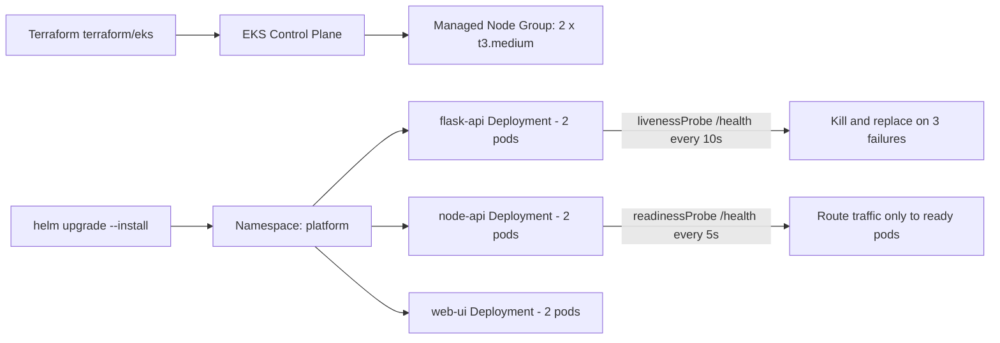

# Express Reliability Platform V6 — Kubernetes: The Self-Healing Platform

## Builds on V5

Before you start V6, copy your personal V5 repository to your local machine and rename it to V6:

```sh
git clone https://github.com/YOUR_USERNAME/express-reliability-platform-v05.git
mv express-reliability-platform-v05 express-reliability-platform-v06
cd express-reliability-platform-v06
```

Use the main class repository for scripts and canonical structure:

- https://github.com/Here2ServeU/express-reliability-platform-course

## 1) Version Purpose

ECS keeps your containers running. But its health check runs every 30 seconds. For 30 seconds, broken requests can still reach a crashed container. And a container that is running but internally stuck — an infinite loop, a deadlock — keeps receiving traffic even though it cannot process requests.

Kubernetes is fundamentally different. Its liveness probe runs every 10 seconds. Three consecutive failures and Kubernetes kills the container and starts a fresh one — automatically. Its readiness probe means traffic goes ONLY to containers that are currently healthy and ready. No broken container ever receives a user request.

**V6 Goal:** Create an EKS cluster with Terraform. Install `kubectl` and Helm. Deploy all three services as Helm charts with liveness and readiness probes. Run the self-healing test by deleting a pod and watching Kubernetes replace it. Validate completely. Clean up.

---

## Plain Language Context

**The flight operations center analogy.** A large airline has hundreds of aircraft, thousands of pilots, and millions of passengers. Managing all of that manually — assigning pilots to flights, replacing grounded aircraft, rerouting delayed flights — would be impossible. The airline uses a flight operations center with complete visibility into every aircraft, every route, every delay. When something goes wrong, the operations center responds immediately and automatically.

Kubernetes is the flight operations center for your containers. It has complete knowledge of every pod, every node, every deployment. When a pod crashes (an aircraft breaks down), Kubernetes immediately starts a replacement. When a node fails (an airport closes), Kubernetes reschedules all its pods to other nodes. It never sleeps.

**The three key guarantees Kubernetes makes:**

1. **Desired state reconciliation.** Kubernetes always tries to match actual state to desired state. You tell it: run 2 copies of `node-api`. If one crashes, Kubernetes starts another within seconds.
2. **Traffic only goes to healthy pods.** The readiness probe must pass before a pod receives any requests. The liveness probe must continue passing or Kubernetes kills and replaces the pod.
3. **Zero-downtime deployments.** When you update your code, Kubernetes does a rolling update: start one new pod, wait for it to be ready, then remove one old pod. Repeat until all pods are updated.

**Key terms in plain language:**

| Term | Plain Language Meaning |
|---|---|
| **Kubernetes** | Container orchestration. Manages running, healing, and scaling containers across many servers. |
| **EKS** | Amazon's managed Kubernetes. AWS operates the control plane. You manage your applications. |
| **Control plane** | The Kubernetes brain (API server, scheduler, controller manager). AWS runs this in EKS. |
| **Worker node** | An EC2 instance where pods actually run. You configure the node group size. |
| **kubectl** | Command-line tool for Kubernetes. Runs commands against the cluster. |
| **Pod** | Smallest Kubernetes unit. One or more containers sharing a network namespace. |
| **Deployment** | Declares desired pod count. Self-heals by replacing failed pods. |
| **ReplicaSet** | Created by Deployments. Maintains the exact pod count at all times. |
| **Service** | Stable DNS name and virtual IP for a group of pods. Routes traffic to healthy pods. |
| **Namespace** | Virtual partition separating resources. Your app uses `platform`. System uses `kube-system`. |
| **Liveness probe** | `httpGet /health` every 10s. Three failures = kill and replace. THIS IS SELF-HEALING. |
| **Readiness probe** | `httpGet /health` every 5s. Must pass before a pod receives any traffic. |
| **initialDelaySeconds** | Seconds after container start before the first probe. Gives the app time to initialize. |
| **failureThreshold** | Consecutive failures before action. Default `3`. |
| **Helm** | Package manager for Kubernetes. One command deploys all resources for a service. |
| **Chart** | Helm package containing templates and default values for one application. |
| **values.yaml** | Default configuration values for a chart. Override per environment. |
| **helm upgrade --install** | Update existing release or install fresh. Idempotent — safe to run repeatedly. |
| **ClusterIP** | Service only reachable inside the cluster. For internal services. |
| **LoadBalancer** | Service that creates an AWS ALB. For public-facing services. |
| **kubectl port-forward** | Tunnel a local port to a pod or service inside the cluster. For testing. |

**Expected result at the end of this version:**

- `kubectl get nodes` shows 2 worker nodes **Ready**.
- `kubectl get pods -n platform` shows 6 pods (2 per service) all `Running 1/1`.
- Deleting a pod causes Kubernetes to spin up a replacement within ~30 seconds — **self-healing confirmed**.
- `helm upgrade` performs a rolling update with zero downtime; `kubectl rollout undo` rolls back.

---

## 2) Chapters Covered

- Chapter 21: Kubernetes Concepts and EKS Setup
- Chapter 22: Helm Charts and Self-Healing
- Chapter 23: Probes, Rolling Updates, and Scaling
- Chapter 24: Validate and Clean Up

## Training Workflow (Understand -> Build -> Test -> Break -> Fix -> Explain -> Automate -> Improve)

1. **Understand:** Read the three guarantees Kubernetes makes and how probes drive self-healing.
2. **Build:** Apply `terraform/eks`, connect `kubectl`, deploy the three Helm charts into the `platform` namespace.
3. **Test:** `kubectl get pods`, port-forward to `/health`, confirm all pods are `Running 1/1`.
4. **Break:** `kubectl delete pod` on a running `node-api` pod.
5. **Fix:** Watch Kubernetes re-create the pod automatically — no human action required.
6. **Explain:** Note the sequence (`Terminating` → new `Pending` → `Running`) and the time it took.
7. **Automate:** Use `helm upgrade --install` for idempotent deploys; use `kubectl rollout` for safe updates and rollbacks.
8. **Improve:** Tune probe `initialDelaySeconds`, `periodSeconds`, and resource requests/limits.

## 3) What You Will Build

- An EKS cluster (control plane + 2 t3.medium worker nodes) provisioned by Terraform.
- Three Helm charts (`flask-api`, `node-api`, `web-ui`) with embedded liveness and readiness probes.
- A `platform` namespace running 6 pods with self-healing enabled.
- A cleanup script that uninstalls all releases and destroys EKS without touching the V5 bootstrap state.

## 4) Architecture Diagram (Mermaid)



## 5) Project Structure

```text
express-reliability-platform-v06/
├── terraform/
│   └── eks/
│       └── main.tf            ← EKS cluster, IAM roles, managed node group
├── helm/
│   ├── flask-api/
│   │   ├── Chart.yaml
│   │   ├── values.yaml
│   │   └── templates/deployment.yaml
│   ├── node-api/
│   │   ├── Chart.yaml
│   │   ├── values.yaml
│   │   └── templates/deployment.yaml
│   └── web-ui/
│       ├── Chart.yaml
│       ├── values.yaml
│       └── templates/deployment.yaml
├── scripts/
│   └── cleanup_v6.sh
└── README.md
```

## 6) Run Steps

### Install kubectl and Helm

```sh
# macOS
brew install kubectl helm

# Linux
curl -LO "https://dl.k8s.io/release/$(curl -Ls https://dl.k8s.io/release/stable.txt)/bin/linux/amd64/kubectl"
chmod +x kubectl && sudo mv kubectl /usr/local/bin/
curl https://raw.githubusercontent.com/helm/helm/main/scripts/get-helm-3 | bash

# Verify both
kubectl version --client
helm version
```

**Expected:** `kubectl Client Version: v1.29.x` or higher, and `version.BuildInfo{Version:"v3.14.x"}`.

### Create the EKS cluster with Terraform

```sh
terraform -chdir=terraform/eks init
terraform -chdir=terraform/eks apply -auto-approve
# Wait 10–15 minutes for EKS control plane provisioning.

CLUSTER=$(terraform -chdir=terraform/eks output -raw cluster_name)
aws eks --region us-east-1 update-kubeconfig --name "$CLUSTER"
kubectl get nodes
```

`aws eks update-kubeconfig` downloads the cluster endpoint, CA certificate, and auth token, then saves them to `~/.kube/config` so `kubectl` targets this EKS cluster.

**Expected:** 2 nodes listed with `STATUS: Ready`.

### Create the namespace and deploy all three services

```sh
kubectl create namespace platform --dry-run=client -o yaml | kubectl apply -f -

helm upgrade --install flask-api helm/flask-api --namespace platform
helm upgrade --install node-api  helm/node-api  --namespace platform
helm upgrade --install web-ui    helm/web-ui    --namespace platform

kubectl get pods -n platform -w
```

`helm upgrade --install` is the idempotent deploy command: if the release does not exist it installs, if it exists it upgrades. One command handles first deploy and every subsequent update.

**Expected:** 6 pods (2 per service) all `STATUS: Running`, `READY: 1/1`.

### The self-healing test (the most important test in V6)

```sh
POD=$(kubectl get pods -n platform -l app=node-api-node-api -o jsonpath='{.items[0].metadata.name}')
echo "About to delete: $POD"

kubectl delete pod "$POD" -n platform
kubectl get pods -n platform -w
```

**Expected sequence:**

1. Deleted pod shows `STATUS: Terminating`.
2. Within 5 seconds a NEW pod appears with `STATUS: Pending`.
3. Within 30 seconds the new pod shows `STATUS: Running`, `READY: 1/1`.
4. The `Terminating` pod disappears.

If you see that sequence: **self-healing is confirmed**. This is the fundamental reliability guarantee of Kubernetes.

### Rolling updates and rollback

```sh
# Change the image tag without editing values.yaml:
helm upgrade node-api helm/node-api --namespace platform --set image.tag=v3
kubectl rollout status deployment/node-api-node-api -n platform

# Roll back if the new version misbehaves:
kubectl rollout undo deployment/node-api-node-api -n platform
kubectl rollout history deployment/node-api-node-api -n platform
```

### Manual scaling

```sh
kubectl scale deployment/node-api-node-api --replicas=4 -n platform
kubectl get pods -n platform -w
kubectl scale deployment/node-api-node-api --replicas=2 -n platform
```

### Test the health endpoint through port-forward

```sh
kubectl port-forward service/node-api-node-api 3000:3000 -n platform &
sleep 2
curl http://localhost:3000/health
kill %1
```

**Expected:** `{"service":"node-api","status":"ok"}`.

## 7) Validation Checklist — Seven Checks

All seven checks must pass before moving on to V7.

- [ ] **Check 1 — Worker nodes Ready:** `kubectl get nodes` shows 2 nodes `Ready`.
- [ ] **Check 2 — All pods Running:** `kubectl get pods -n platform -o wide` shows 6 pods `Running 1/1`.
- [ ] **Check 3 — Health via port-forward:** `curl http://localhost:3000/health` returns `{"service":"node-api","status":"ok"}`.
- [ ] **Check 4 — Self-healing confirmed:** Deleted pod is replaced automatically within 30 seconds.
- [ ] **Check 5 — Liveness probe active:** `kubectl describe pod ... | grep -A6 Liveness` shows `http-get http://:3000/health delay=30s period=10s failure=3`.
- [ ] **Check 6 — Rolling update works:** `helm upgrade` + `kubectl rollout status` reports `successfully rolled out`.
- [ ] **Check 7 — Rollback works:** `kubectl rollout undo` completes and pods return to `Running 1/1`.

## 8) Troubleshooting

- **Nodes `NotReady`:** Wait 5 more minutes; inspect with `kubectl describe node NODE_NAME`.
- **`server: connection refused` on `kubectl`:** `aws eks update-kubeconfig` was not run, or the cluster is still provisioning.
- **Pod `ImagePullBackOff`:** The ECR image URL in `values.yaml` is wrong. Verify account ID and region.
- **Pod `CrashLoopBackOff`:** Container starts and crashes. Check `kubectl logs POD_NAME -n platform`.
- **Pod `Pending`:** Node has insufficient resources. `kubectl describe pod POD_NAME -n platform` shows the scheduling error.
- **`helm upgrade` hangs waiting for pods:** Readiness probe is failing — check probe path, port, and `initialDelaySeconds`.

## 9) Cleanup

EKS is not free. Two `t3.medium` nodes ≈ \$0.08/hour, control plane ≈ \$0.10/hour — about \$4.30/day. Always destroy after a practice session.

```sh
chmod +x scripts/cleanup_v6.sh
./scripts/cleanup_v6.sh
```

The script uninstalls all Helm releases, deletes the `platform` namespace, runs `terraform -chdir=terraform/eks destroy` (10–15 minutes), and removes the EKS context from `~/.kube/config`. It intentionally leaves the bootstrap S3 bucket + DynamoDB table in place so V7–V10 can reuse them.

## 10) Next Version Preview

In V7, you build on this Kubernetes foundation and operationalize reliability with runbooks, on-call rotations, and disaster-recovery drills — turning Kubernetes' automatic self-healing into a complete incident response workflow.
