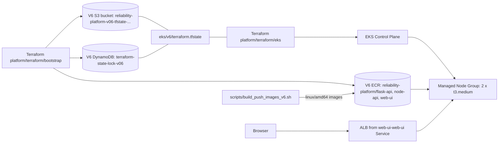

# Express Reliability Platform V6 — Kubernetes: The Self-Healing Platform

> **What you will build (in one paragraph).** A production-shaped Kubernetes deployment of three services on AWS EKS, each watched by liveness and readiness probes that automatically kill and replace any pod that falls over. By the end of this version you will delete a pod by hand, watch Kubernetes replace it within 30 seconds, and run a zero-downtime rolling update. About 30 minutes end-to-end on a fresh AWS account, ~$4.30/day if you forget to clean up.

## Table of contents

- [Quick Start (the 4-command path)](#quick-start-the-4-command-path)
- [Why Kubernetes (the concept layer)](#why-kubernetes-the-concept-layer)
- [Prerequisites](#prerequisites)
- [Deploy](#deploy)
  - [Path A — Scripted (recommended)](#path-a--scripted-recommended)
  - [Path B — Manual walkthrough](#path-b--manual-walkthrough)
- [Validate the platform](#validate-the-platform)
- [Operate (rolling updates, rollback, scaling)](#operate-rolling-updates-rollback-scaling)
- [Cleanup](#cleanup)
- [Reference](#reference)
  - [Project structure](#project-structure)
  - [Configuration reference](#configuration-reference)
    - [1. Helm chart values](#1-helm-chart-values)
    - [2. Terraform variables](#2-terraform-variables)
    - [3. Script environment variables](#3-script-environment-variables)
    - [4. Hardcoded values worth knowing about](#4-hardcoded-values-worth-knowing-about)
  - [Architecture diagrams](#architecture-diagrams)
  - [Web UI guide](#web-ui-guide)
  - [Troubleshooting](#troubleshooting)

---

## Quick Start (the 4-command path)

> Use this if you've already done V5 and just want a working V6 cluster. If anything goes wrong, jump to [Troubleshooting](#troubleshooting).

```sh
# 1. Clone the course repo (V5 sources live at ../express-reliability-platform-v05/)
cd express-reliability-platform-v06

# 2. One command provisions everything: state backend → ECR → images → EKS → Helm
./scripts/tf_deploy_v6.sh

# 3. Get the public URL (~25 minutes after step 2 starts; ALB takes 60-90s)
kubectl get svc web-ui-web-ui -n platform \
  -o jsonpath='{.status.loadBalancer.ingress[0].hostname}'

# 4. When done — destroy everything (avoid the EKS bill)
./scripts/cleanup_v6.sh
```

**You'll know it worked when** `curl -I http://<the-hostname>` returns `HTTP/1.1 200 OK` and `kubectl get pods -n platform` shows 6 pods all `Running 1/1`.

---

## Why Kubernetes (the concept layer)

V5 keeps containers running on ECS Fargate, but ECS health checks run every 30 seconds. For those 30 seconds, broken requests can still reach a crashed container. Worse, a container that's *running* but internally stuck (infinite loop, deadlock) keeps receiving traffic even though it can't actually serve it.

Kubernetes flips this. Liveness probes run every 10 seconds, readiness probes every 5. Three consecutive liveness failures → Kubernetes kills the container and starts a fresh one, automatically, no human involved. Readiness gating means traffic only goes to pods that are currently passing their health check.

**A real-world example.** At a bank, when a payment pod hits a memory leak at 3am, Kubernetes catches it on the next 10-second check, kills the pod, and spins up a replacement. Customer impact: a few seconds of reduced capacity instead of an outage. Hospitals run their patient-portal APIs the same way — readiness gating stops traffic to a pod whose database connection just dropped, instead of returning 500s to the EHR system.

### The three guarantees Kubernetes makes

| Guarantee | What it means |
|---|---|
| **Desired state reconciliation** | You declare "run 2 copies of `node-api`." If one crashes, Kubernetes starts another within seconds. Always. |
| **Traffic only goes to healthy pods** | Readiness probe must pass before a pod sees traffic. Liveness probe must keep passing or the pod is killed. |
| **Zero-downtime deployments** | Rolling updates: one new pod starts, becomes ready, then one old pod is removed. Repeat until done. |

### Glossary (plain-language)

| Term | What it means |
|---|---|
| **Kubernetes** | Container orchestrator that runs, heals, and scales containers across many servers. |
| **EKS** | AWS-managed Kubernetes — AWS runs the control plane, you manage workloads. |
| **Pod** | Smallest unit Kubernetes schedules. One or more containers sharing a network namespace. |
| **Deployment** | Declares "I want N pods like this." Self-heals by replacing failed pods. |
| **Service** | Stable virtual IP + DNS name for a set of pods. Routes traffic only to *ready* pods. |
| **Namespace** | Virtual partition for resources. Your apps live in `platform`; system pods live in `kube-system`. |
| **Liveness probe** | `httpGet /health` every 10s. Three failures → kill and replace. *This is self-healing.* |
| **Readiness probe** | `httpGet /health` every 5s. Must pass before a pod receives traffic. |
| **Helm** | Package manager for Kubernetes — one command installs all the resources for a service. |
| **Chart** | A Helm package: templates plus default values for one application. |
| **`helm upgrade --install`** | Install if missing, upgrade if present. Idempotent — safe to run repeatedly. |
| **LoadBalancer Service** | Service that creates a public AWS ALB/NLB so the cluster is reachable from the internet. |

---

## Prerequisites

Before running anything, confirm you have:

- [ ] **AWS CLI v2** configured (`aws configure`) with credentials that can create EKS, IAM, EC2, ECR, S3, and DynamoDB.
- [ ] **Docker with `buildx`** running locally — V6 builds and pushes its own images.
- [ ] **Terraform ≥ 1.5**.
- [ ] **kubectl ≥ 1.29 and helm ≥ 3.14** — install with:
  ```sh
  # macOS
  brew install kubectl helm

  # Linux
  curl -LO "https://dl.k8s.io/release/$(curl -Ls https://dl.k8s.io/release/stable.txt)/bin/linux/amd64/kubectl"
  chmod +x kubectl && sudo mv kubectl /usr/local/bin/
  curl https://raw.githubusercontent.com/helm/helm/main/scripts/get-helm-3 | bash

  # Verify
  kubectl version --client
  helm version
  ```
- [ ] **V5 application sources accessible.** V6 only ships `web-ui/index.html`; the build script reads Dockerfiles for `flask-api`/`node-api` from V5 by default. The deploy script defaults to `../express-reliability-platform-v05/apps`. If your sources live elsewhere, set `APPS_SRC=<path>`.

> **Don't have V5?** Clone the course repo (`Here2ServeU/express-reliability-platform-course`) and you'll get both V5 and V6 as sibling directories. You don't need to deploy V5 — V6 only needs the Dockerfiles, not a running V5 stack.

---

## Deploy

V6 owns its full stack: a state backend (S3 + DynamoDB), three ECR repos, an EKS cluster, and three Helm releases. V5 does not need to be deployed.

### Path A — Scripted (recommended)

```sh
./scripts/tf_deploy_v6.sh
```

**What it runs, in order:**

| # | Step | Time |
|---|---|---|
| 1 | Bootstrap apply: state bucket + lock table + 3 ECR repos | ~1 min |
| 2 | Build + push 3 `linux/amd64` images to ECR | ~3-5 min |
| 3 | EKS apply: control plane + IAM + VPC + 2 × `t3.medium` node group | **10-15 min** |
| 4 | Configure kubectl and create the `platform` namespace | <1 min |
| 5 | Helm install all three charts | ~30s + pod startup |
| 6 | Wait for all rollouts to finish, print the public URL | ALB takes 60-90s |

The script is idempotent — run it again after a code change and it rebuilds, repushes, and rolls forward.

**You'll know it worked when** the script prints a hostname under "Public URL" and `curl -I http://<that-hostname>` returns `HTTP/1.1 200 OK`.

### Path B — Manual walkthrough

Use this the first time so you see what each phase actually does.

#### Phase 1 — Bootstrap (state backend + ECR repos) · ~1 min

```sh
terraform -chdir=platform/terraform/bootstrap init
terraform -chdir=platform/terraform/bootstrap apply -auto-approve
```

Outputs to note: `state_bucket`, `lock_table`, `account_id`, `ecr_base_uri`.

> If you previously ran V6 bootstrap, this is a no-op. If V5 already created ECR repos with the same names in the same account, terraform will fail to create V6's — change `project_name` in [bootstrap/variables.tf](express-reliability-platform-v06/platform/terraform/bootstrap/variables.tf), or destroy V5's repos first.

#### Phase 2 — Build and push images · ~3-5 min

```sh
./scripts/build_push_images_v6.sh
```

Defaults: reads Dockerfiles from `../express-reliability-platform-v05/apps`, builds `linux/amd64`, pushes `:latest` to V6's ECR. Override the source path with `APPS_SRC=<path>`.

> **Why `linux/amd64`?** EKS nodes (and ECS Fargate) run amd64. On Apple Silicon, a plain `docker build` would produce arm64 images that the cluster cannot pull, leaving every pod in `ImagePullBackOff`.

#### Phase 3 — Provision EKS · 10-15 min ☕

```sh
ACCOUNT_ID=$(terraform -chdir=platform/terraform/bootstrap output -raw account_id)
terraform -chdir=platform/terraform/eks init -reconfigure \
  -backend-config="bucket=reliability-platform-v06-tfstate-${ACCOUNT_ID}" \
  -backend-config="dynamodb_table=terraform-state-lock-v06" \
  -backend-config="key=eks/v6/terraform.tfstate"

terraform -chdir=platform/terraform/eks apply -auto-approve
```

Creates: cluster IAM role, node IAM role + 3 policy attachments (worker / ECR read / CNI), the EKS cluster, and a managed node group of 2 × `t3.medium`.

#### Phase 4 — Configure kubectl · <1 min

```sh
CLUSTER=$(terraform -chdir=platform/terraform/eks output -raw cluster_name)
aws eks --region us-east-1 update-kubeconfig --name "$CLUSTER"
kubectl get nodes
```

**You'll know it worked when** 2 nodes show `STATUS: Ready`. If they're `NotReady`, give it 2-3 more minutes for the CNI to come up.

#### Phase 5 — Install the Helm charts · ~30s + pod startup

```sh
ECR_BASE=$(terraform -chdir=platform/terraform/bootstrap output -raw ecr_base_uri)

kubectl create namespace platform --dry-run=client -o yaml | kubectl apply -f -

for SVC in flask-api node-api web-ui; do
  helm upgrade --install "$SVC" "platform/helm/$SVC" \
    --namespace platform \
    --set image.repository="${ECR_BASE}/${SVC}"
done

kubectl get pods -n platform -w
```

`helm upgrade --install` is the idempotent deploy command — installs if missing, upgrades if present.

**You'll know it worked when** 6 pods show `STATUS: Running`, `READY: 1/1`. Press Ctrl-C to exit the watch.

#### Phase 6 — Get the public URL · 60-90s for ALB

```sh
kubectl get svc web-ui-web-ui -n platform \
  -o jsonpath='{.status.loadBalancer.ingress[0].hostname}'
```

The Service is named `web-ui-web-ui` because Helm prefixes the service name with the release name (release `web-ui` + service `web-ui`). The first time, the hostname may be empty for 60-90 seconds while AWS provisions the Classic ELB.

---

## Validate the platform

Run these eight checks in order. All must pass before moving on to V7.

### 1. Cluster is up

```sh
aws eks describe-cluster --region us-east-1 --name reliability-platform-cluster \
  --query 'cluster.{name:name,status:status,version:version}' --output table
kubectl get nodes
```
Expect: cluster `status: ACTIVE`, 2 nodes `Ready`.

### 2. All pods running

```sh
kubectl get pods -n platform -o wide
kubectl get deployments -n platform
kubectl get svc -n platform
```
Expect: 6 pods `Running 1/1`, 3 deployments `READY: 2/2`, `web-ui-web-ui` Service shows an external hostname.

### 3. Public URL returns 200

```sh
URL=$(kubectl get svc web-ui-web-ui -n platform \
  -o jsonpath='{.status.loadBalancer.ingress[0].hostname}')
curl -I "http://$URL"
```
Expect: `HTTP/1.1 200 OK`. Open the URL in a browser to see the V6 governance UI.

### 4. Health endpoint via port-forward

```sh
kubectl port-forward svc/node-api-node-api 3000:3000 -n platform &
curl http://localhost:3000/health
```
Expect: `{"status":"ok","service":"node-api","version":"v2"}`. Kill the port-forward when done with `kill %1`.

### 5. Self-healing — the most important test ⭐

```sh
POD=$(kubectl get pods -n platform -l app=node-api-node-api \
  -o jsonpath='{.items[0].metadata.name}')
kubectl delete pod "$POD" -n platform
kubectl get pods -n platform -w
```
Expect, in this exact sequence:
1. Deleted pod shows `Terminating`.
2. Within 5s a new pod appears with `Pending`.
3. Within 30s the new pod is `Running 1/1`.
4. The `Terminating` pod disappears.

If you see that sequence, **self-healing is confirmed.** This is the fundamental reliability guarantee Kubernetes adds on top of V5.

### 6. Liveness probe is configured

```sh
kubectl describe pod -n platform -l app=node-api-node-api | grep -A2 Liveness
```
Expect a line like `http-get http://:3000/health delay=30s period=10s #failure=3`.

### 7. Rolling update works

```sh
helm upgrade node-api platform/helm/node-api --namespace platform \
  --set image.repository="${ECR_BASE}/node-api" \
  --set image.tag=v3
kubectl rollout status deployment/node-api-node-api -n platform
```
Expect: `successfully rolled out`.

### 8. Rollback works

```sh
kubectl rollout undo deployment/node-api-node-api -n platform
kubectl rollout history deployment/node-api-node-api -n platform
```
Expect: pods return to `Running 1/1`, history shows the rollback as a new revision.

---

## Operate (rolling updates, rollback, scaling)

### Roll a new image without editing values.yaml

```sh
helm upgrade node-api platform/helm/node-api --namespace platform \
  --set image.repository="${ECR_BASE}/node-api" \
  --set image.tag=<sha-or-version>
kubectl rollout status deployment/node-api-node-api -n platform
```

### Roll back if a release misbehaves

```sh
kubectl rollout undo deployment/node-api-node-api -n platform
```

### Scale a deployment manually

```sh
kubectl scale deployment/node-api-node-api --replicas=4 -n platform
kubectl get pods -n platform -w
```

If new pods land `Pending` for resource reasons, bump `node_desired_size` in [eks/variables.tf](express-reliability-platform-v06/platform/terraform/eks/variables.tf) and re-apply.

---

## Cleanup

EKS is not free: 2 × `t3.medium` ≈ \$0.08/hr + control plane \$0.10/hr ≈ **\$4.30/day**. Always destroy after a session.

### Path A — Scripted (recommended)

```sh
./scripts/cleanup_v6.sh
```

Uninstalls Helm releases, deletes the namespace, reaps orphan AWS load balancers (so subnet/IGW destroy doesn't `DependencyViolation`), destroys EKS, drains the V6 state bucket, destroys the V6 bootstrap (including the ECR repos and pushed images — `force_delete = true` handles non-empty drains), and removes the kubectl context.

V5's bootstrap and ECR (if present) are untouched.

### Path B — Manual

Run in reverse order of deploy:

```sh
# 1) Helm + namespace
helm uninstall web-ui node-api flask-api -n platform || true
kubectl delete namespace platform --ignore-not-found

# 2) Reap orphan load balancers (otherwise subnet destroy will fail)
VPC=$(aws ec2 describe-vpcs --region us-east-1 \
  --filters "Name=tag:Name,Values=reliability-platform-v06-vpc" \
  --query 'Vpcs[0].VpcId' --output text)
for LB in $(aws elb describe-load-balancers --region us-east-1 \
      --query "LoadBalancerDescriptions[?VPCId=='$VPC'].LoadBalancerName" --output text); do
  aws elb delete-load-balancer --load-balancer-name "$LB" --region us-east-1
done
sleep 90

# 3) EKS (10-15 min)
terraform -chdir=platform/terraform/eks destroy -auto-approve

# 4) Bootstrap — apply first to record force_destroy in state, then destroy
terraform -chdir=platform/terraform/bootstrap apply -auto-approve
terraform -chdir=platform/terraform/bootstrap destroy -auto-approve

# 5) kubectl context
kubectl config delete-context "$(kubectl config current-context)" 2>/dev/null || true
```

> **Why the LB-reap step matters.** A `Service type=LoadBalancer` provisions an AWS Classic ELB *outside* Terraform's view. If you skip the reap and run `terraform destroy`, AWS rejects subnet/IGW deletion with `DependencyViolation` because the LB still holds ENIs and EIPs. The cleanup script handles this in Step 2b automatically.

> **Why `apply` before `destroy` on bootstrap.** The state bucket is versioned, so a plain destroy fails with `BucketNotEmpty`. `force_destroy = true` on the bucket resource drains every version and delete-marker before issuing `DeleteBucket` — but only if it's recorded in state. The pre-destroy apply guarantees that.

---

## Reference

### Project structure

```text
express-reliability-platform-v06/
├── apps/
│   └── web-ui/index.html                    ← V6 governance scorecard UI
├── platform/
│   ├── helm/
│   │   ├── flask-api/                       ← Chart.yaml, values.yaml, templates/deployment.yaml
│   │   ├── node-api/
│   │   └── web-ui/                          ← service.type=LoadBalancer
│   └── terraform/
│       ├── bootstrap/                       ← state backend + ECR
│       │   ├── main.tf                      ← S3 + DynamoDB
│       │   ├── ecr.tf                       ← 3 ECR repos + lifecycle policy
│       │   └── variables.tf
│       └── eks/                             ← cluster + IAM + VPC + node group
│           ├── main.tf
│           └── variables.tf
└── scripts/
    ├── tf_deploy_v6.sh                      ← end-to-end deploy
    ├── build_push_images_v6.sh              ← standalone image pipeline (APPS_SRC overrides)
    └── cleanup_v6.sh                        ← uninstall, destroy, drain, deregister
```

### Configuration reference

Defaults are wired together — a fresh clone deploys without edits. This section is "what to change when defaults aren't right." Four config surfaces:

1. [Helm chart values](#1-helm-chart-values) — per-service runtime config (image, probes, resources, scaling)
2. [Terraform variables](#2-terraform-variables) — infrastructure shape (region, cluster size, K8s version)
3. [Script environment variables](#3-script-environment-variables) — runtime overrides for the deploy/build/cleanup scripts
4. [Hardcoded values worth knowing about](#4-hardcoded-values-worth-knowing-about) — things that aren't variables but you may need to edit

#### 1. Helm chart values

Each chart has a `values.yaml` with the same shape. Override per-install with `--set key=value`, or edit `values.yaml` for persistent changes.

**Files:**
- [platform/helm/flask-api/values.yaml](express-reliability-platform-v06/platform/helm/flask-api/values.yaml)
- [platform/helm/node-api/values.yaml](express-reliability-platform-v06/platform/helm/node-api/values.yaml)
- [platform/helm/web-ui/values.yaml](express-reliability-platform-v06/platform/helm/web-ui/values.yaml)

| Key | Default (flask-api) | Default (node-api) | Default (web-ui) | When to change |
|---|---|---|---|---|
| `replicaCount` | `2` | `2` | `2` | More replicas for higher request volume; minimum 2 to prove rolling updates work |
| `image.repository` | `YOUR_ACCOUNT_ID.dkr.ecr...flask-api` | `...node-api` | `...web-ui` | Always overridden by `--set image.repository=${ECR_BASE}/<svc>` from the deploy script. The placeholder is intentional — students forking the course shouldn't have a stale account ID in their `values.yaml`. If you want to invoke `helm install` directly without `--set`, replace the placeholder with your account ID first |
| `image.tag` | `latest` | `latest` | `latest` | Override per release with `--set image.tag=<sha>` for traceable deploys (`latest` is fine for the course but unsafe for prod) |
| `image.pullPolicy` | `Always` | `Always` | `Always` | Keep as `Always` — lets `kubectl rollout restart` pick up new `:latest` images without bumping the tag |
| `service.type` | `ClusterIP` | `ClusterIP` | **`LoadBalancer`** | Only `web-ui` is public. Don't change `flask-api` or `node-api` to `LoadBalancer` — they're internal-only by design |
| `service.port` | `5000` | `3000` | `80` | Match what the app listens on. Changing this also requires editing `containerPort` in the chart's [templates/deployment.yaml](express-reliability-platform-v06/platform/helm/flask-api/templates/deployment.yaml) |
| `resources.requests.cpu` | `100m` | `100m` | `50m` | Bump if the pod is throttled (check `kubectl top pod`); reduce if pods land `Pending` because the node is full |
| `resources.requests.memory` | `128Mi` | `128Mi` | `64Mi` | Bump if pods OOMKill; reduce if scheduling is tight |
| `resources.limits.cpu` | `500m` | `500m` | `250m` | Hard cap. Set generously — limits below requests cause CPU throttling under burst |
| `resources.limits.memory` | `256Mi` | `256Mi` | `128Mi` | Hard cap. Pods exceeding this are OOMKilled |
| `probes.liveness.path` | `/health` | `/health` | `/` | Change if your app doesn't expose `/health`. **Must return HTTP 200 within 1s, or the pod is killed.** |
| `probes.liveness.initialDelaySeconds` | `30` | `30` | `15` | Bump if the app needs longer to start (slow JVM warmup, big image load); reduce for fast-starting apps so failures are caught quicker |
| `probes.liveness.periodSeconds` | `10` | `10` | `10` | Lower = faster detection of stuck containers. 10s is a sane default |
| `probes.liveness.failureThreshold` | `3` | `3` | `3` | Consecutive failures before kubelet kills the pod. 3 × period = "30s of failures kills it" |
| `probes.readiness.path` | `/health` | `/health` | `/` | Same path as liveness is normal for simple apps. For heavy apps, expose a separate `/ready` that checks DB/cache reachability |
| `probes.readiness.initialDelaySeconds` | `10` | `10` | `5` | Time before the pod gets traffic. Too low = traffic hits a half-warm pod; too high = slow rollouts |
| `probes.readiness.periodSeconds` | `5` | `5` | `5` | Lower = faster traffic rerouting when a pod degrades |
| `probes.readiness.failureThreshold` | `3` | `3` | `3` | Consecutive readiness failures before the Service stops sending traffic to this pod |

**Override examples:**

```sh
# Bump replicas just for this release without editing values.yaml
helm upgrade --install node-api platform/helm/node-api -n platform \
  --set image.repository="${ECR_BASE}/node-api" \
  --set replicaCount=4

# Tag-pinned deploy for traceability
helm upgrade --install flask-api platform/helm/flask-api -n platform \
  --set image.repository="${ECR_BASE}/flask-api" \
  --set image.tag=$(git rev-parse --short HEAD)

# Change the readiness path for one chart
helm upgrade --install web-ui platform/helm/web-ui -n platform \
  --set image.repository="${ECR_BASE}/web-ui" \
  --set probes.readiness.path=/index.html
```

> **Things _not_ in `values.yaml`** — `containerPort`, namespace, labels, and selector are baked into [templates/deployment.yaml](express-reliability-platform-v06/platform/helm/flask-api/templates/deployment.yaml). Edit the template if you need to change them, then `helm upgrade` to apply.

#### 2. Terraform variables

Override on the command line with `-var key=value`, or commit a `terraform.tfvars` next to `variables.tf` for persistent overrides:

```hcl
# platform/terraform/eks/terraform.tfvars
node_instance_types = ["t3.large"]
node_desired_size   = 3
kubernetes_version  = "1.32"
```

##### Bootstrap stack ([platform/terraform/bootstrap/variables.tf](express-reliability-platform-v06/platform/terraform/bootstrap/variables.tf))

| Variable | Default | When to change |
|---|---|---|
| `aws_region` | `us-east-1` | Deploying to another region. The EKS stack's `aws_region` **must match.** |
| `project_name` | `reliability-platform` | Forking the course under a different name. Drives both the state bucket prefix (`<project>-<suffix>-tfstate-<account>`) and the ECR repo prefix (`<project>/<service>`). |
| `version_suffix` | `v06` | Building V7+ on this template. **Must match** the EKS backend bucket name (see §4 below). |
| `services` | `["flask-api","node-api","web-ui"]` | Adding/removing services — one ECR repo is created per entry. |

##### EKS stack ([platform/terraform/eks/variables.tf](express-reliability-platform-v06/platform/terraform/eks/variables.tf))

| Variable | Default | When to change |
|---|---|---|
| `aws_region` | `us-east-1` | Different region. **Must match** the bootstrap region. |
| `project_name` | `reliability-platform-v06` | Tags VPC, IGW, subnets, route table. Cosmetic — used in resource `Name` tags. |
| `cluster_name` | `reliability-platform-cluster` | Renaming the EKS cluster. **Set once before the first apply** — changing later rebuilds the cluster from scratch (it's the EKS resource's primary identifier). |
| `kubernetes_version` | `1.33` | AWS retires EKS versions ~14 months after K8s release. List supported versions: `aws eks describe-cluster-versions --query 'clusterVersions[?clusterVersionStatus==\`standard\`].clusterVersion' --output text`. EKS only allows **one minor version per upgrade** (1.30 → 1.31, then 1.31 → 1.32). |
| `vpc_cidr` | `10.43.0.0/16` | Avoiding overlap with a peered VPC. V5 uses `10.42.0.0/16` so the two can be peered. |
| `node_instance_types` | `["t3.medium"]` | Bigger pods or workloads — try `["t3.large"]` or `["m5.xlarge"]`. List of types lets EKS fall back if the primary is out of capacity. |
| `node_desired_size` | `2` | More workers if pods land `Pending` for resource reasons. |
| `node_min_size` | `1` | Floor for manual scaling. |
| `node_max_size` | `4` | Ceiling for manual scaling. **Bump this if you scale a Deployment past `node_max_size × pods-per-node`.** |

#### 3. Script environment variables

| Script | Variable | Default | Purpose |
|---|---|---|---|
| [build_push_images_v6.sh](express-reliability-platform-v06/scripts/build_push_images_v6.sh) | `REGION` | `us-east-1` | Target ECR region |
| | `PROJECT` | `reliability-platform` | ECR repo prefix — must match bootstrap's `project_name` |
| | `IMAGE_TAG` | `latest` | Tag the built images with `:<this>`. Set to a Git SHA for traceable deploys: `IMAGE_TAG=$(git rev-parse --short HEAD)` |
| | `APPS_SRC` | `<v6-root>/../express-reliability-platform-v05/apps` | Where to read Dockerfiles from. Set to `apps` if your V6 directory contains the Dockerfiles directly |
| [tf_deploy_v6.sh](express-reliability-platform-v06/scripts/tf_deploy_v6.sh) | `REGION` | `us-east-1` (hardcoded) | All AWS calls — keep consistent with the Terraform stacks |
| | `PROJECT` | `reliability-platform` (hardcoded) | ECR repo prefix |
| | `NAMESPACE` | `platform` (hardcoded) | Kubernetes namespace for Helm releases |
| | (passes through to `build_push_images_v6.sh`) | | All env vars above also apply when invoked through the orchestrator |
| [cleanup_v6.sh](express-reliability-platform-v06/scripts/cleanup_v6.sh) | `REGION` | `us-east-1` (hardcoded) | Where to look for AWS resources to destroy |
| | `NAMESPACE` | `platform` (hardcoded) | Helm/k8s namespace to drain |

**Override example:**

```sh
# Build images tagged with the current git SHA, then deploy
IMAGE_TAG=$(git rev-parse --short HEAD) ./scripts/build_push_images_v6.sh
./scripts/tf_deploy_v6.sh   # picks up :latest by default; override per-install if needed
```

#### 4. Hardcoded values worth knowing about

These aren't variables — they're literals in source files. Edit the file if you need to change them.

| File | Line(s) | Value | When to edit |
|---|---|---|---|
| [platform/terraform/eks/main.tf](express-reliability-platform-v06/platform/terraform/eks/main.tf#L2-L11) | `backend "s3"` block | `bucket = "reliability-platform-v06-tfstate-YOUR_ACCOUNT_ID"`, `dynamodb_table = "terraform-state-lock-v06"` | Terraform doesn't allow variables in `backend` blocks. **Either replace `YOUR_ACCOUNT_ID` with your actual account ID, or pass `-backend-config="bucket=..."` at `terraform init` time** (which is what `tf_deploy_v6.sh` does — that's why the script works without editing this block). Also update both fields if you change `project_name` or `version_suffix` in bootstrap. |
| [scripts/tf_deploy_v6.sh](express-reliability-platform-v06/scripts/tf_deploy_v6.sh) | top of file | `REGION`, `PROJECT`, `NAMESPACE`, `SERVICES=(...)` | Forking under a different project name or namespace |
| [scripts/cleanup_v6.sh](express-reliability-platform-v06/scripts/cleanup_v6.sh) | top of file | `REGION`, `NAMESPACE` | Same as above — keep in sync with deploy script |
| Each chart's [templates/deployment.yaml](express-reliability-platform-v06/platform/helm/flask-api/templates/deployment.yaml#L25) | `containerPort`, `targetPort` | `5000` (flask-api), `3000` (node-api), `80` (web-ui) | Changing the port the app listens on. Must match `service.port` in `values.yaml` |
| [platform/helm/flask-api/Chart.yaml](express-reliability-platform-v06/platform/helm/flask-api/Chart.yaml) | `appVersion` | `"v2"` | Cosmetic — shown in `helm list`. Bump for chart releases |

### Architecture diagrams

**What one `helm upgrade --install` lays down:**


**What Terraform provisions (and where images come from):**



### Web UI guide

The V6 `apps/web-ui/index.html` is the infrastructure-governance console — same V2-lineage scorecard you've seen in earlier versions, now scoring infrastructure governance instead of application reliability.

**It checks:**
- **Reliability** through repeatable infrastructure and stable environments.
- **Cost efficiency** through owner / application / environment tags.
- **Security and compliance** through reviewed Terraform plans and controlled changes.
- **Intelligence readiness** through structured infrastructure data that can later support policy and automation.

**Use it to teach:**
- Why Terraform modules matter for regulated environments.
- How FinOps tagging connects to real cloud cost accountability.
- How PR-reviewed plans become audit evidence.
- What V7's incident-operations work needs as a foundation.

**Reading the scorecard:**

| Field | Meaning |
|---|---|
| `version` | Confirms this is the V6 governance assessment. |
| `readiness_score` | Overall infrastructure readiness score. |
| `readiness_band` | Plain-language assessment of whether the platform is ready. |
| `domains.reliability` | Improves when infrastructure is modular and repeatable. |
| `domains.cost_efficiency` | Drops when cost allocation tags are missing. |
| `domains.security_compliance` | Drops when Terraform changes are not reviewed. |
| `domains.intelligence_aiops_mlops` | Improves when infrastructure data is structured and policy-ready. |

For regulated environments, weak tagging is a FinOps risk; weak change review is an audit risk.

### Optional: validate Helm charts locally before paying for EKS

If you want to lint and dry-render the charts on your laptop first:

```sh
helm lint   platform/helm/flask-api  platform/helm/node-api  platform/helm/web-ui
helm template node-api platform/helm/node-api | less   # see the actual K8s YAML Helm produces
```

For a real local Kubernetes (with kind or Docker Desktop's built-in cluster), see the [kind quick-start](https://kind.sigs.k8s.io/docs/user/quick-start/). Pods will land in `ImagePullBackOff` because the local cluster can't reach your private ECR — that's expected. The point is verifying chart shape, not pulling images.

### Troubleshooting

| Symptom | Cause | Fix |
|---|---|---|
| `kubectl` returns `connection refused` | `aws eks update-kubeconfig` not run, or cluster still provisioning | Re-run `aws eks --region us-east-1 update-kubeconfig --name reliability-platform-cluster` |
| Worker nodes stuck `NotReady` | CNI is still initializing | Wait 5 min; `kubectl describe node <name>` shows the actual state |
| Pod `ImagePullBackOff` | ECR repo doesn't exist, or no image was pushed | `aws ecr describe-repositories` — if missing, `terraform -chdir=platform/terraform/bootstrap apply`. If empty, `./scripts/build_push_images_v6.sh` (set `APPS_SRC` if Dockerfiles aren't at the default path) |
| Pod `CrashLoopBackOff` | App crashing on start, or probe path returns non-200 | `kubectl logs <pod> -n platform --previous` shows the crash; `kubectl describe pod <pod>` shows probe failure HTTP codes. **The most common case:** the probe path (`/health`) doesn't exist in the app — add the route or change `probes.liveness.path` in `values.yaml` |
| Pod `Pending` forever | Node has insufficient CPU/memory for `resources.requests` | Reduce requests in `values.yaml`, or bump `node_desired_size` / `node_instance_types` |
| `helm upgrade` hangs waiting for pods | Readiness probe failing | Check probe path / port / `initialDelaySeconds`. `kubectl describe pod` shows probe results |
| `web-ui-web-ui` `EXTERNAL-IP` stays `<pending>` | The default EKS install provisions a Classic ELB | Wait 60-90s. For an ALB instead of Classic ELB, install the AWS Load Balancer Controller — that's a V7 exercise |
| Terraform errors with `state lock` | Another apply in flight, or one was killed | `aws dynamodb scan --table-name terraform-state-lock-v06`. Force-unlock only as last resort: `terraform force-unlock <LOCK_ID>` |
| `Requested AMI for this version not supported` | EKS retires AMIs ~14 months after K8s release | List supported: `aws eks describe-cluster-versions --query 'clusterVersions[?clusterVersionStatus==\`standard\`].clusterVersion' --output text`. Bump `kubernetes_version` to one of those |
| `DependencyViolation` on subnet/IGW during destroy | A `LoadBalancer` Service left an orphan ELB holding ENIs/EIPs | Use `./scripts/cleanup_v6.sh` (it reaps the orphan in Step 2b). Or run the LB-reap snippet in [Cleanup → Path B](#path-b--manual) |
| `Unsupported Kubernetes minor version update from X.Y to X.Z` | EKS only allows one minor version per upgrade | If no live workloads: `terraform destroy && apply`. If production: bump `kubernetes_version` by one minor at a time, applying between each |
| `BucketNotEmpty 409` during bootstrap destroy | Versioned bucket; old versions/delete-markers blocking deletion | The cleanup script handles this. If running destroy by hand, do `bootstrap apply` first to record `force_destroy=true` in state, then destroy |

---

## What's next: V7

V7 builds on this Kubernetes foundation and operationalizes reliability — runbooks, on-call rotations, incident playbooks, disaster-recovery drills. The monitoring stack you wrote in V5 (Prometheus, Grafana, Alertmanager) moves into the cluster as `kube-prometheus-stack`, scraping pods directly via Kubernetes service discovery.
