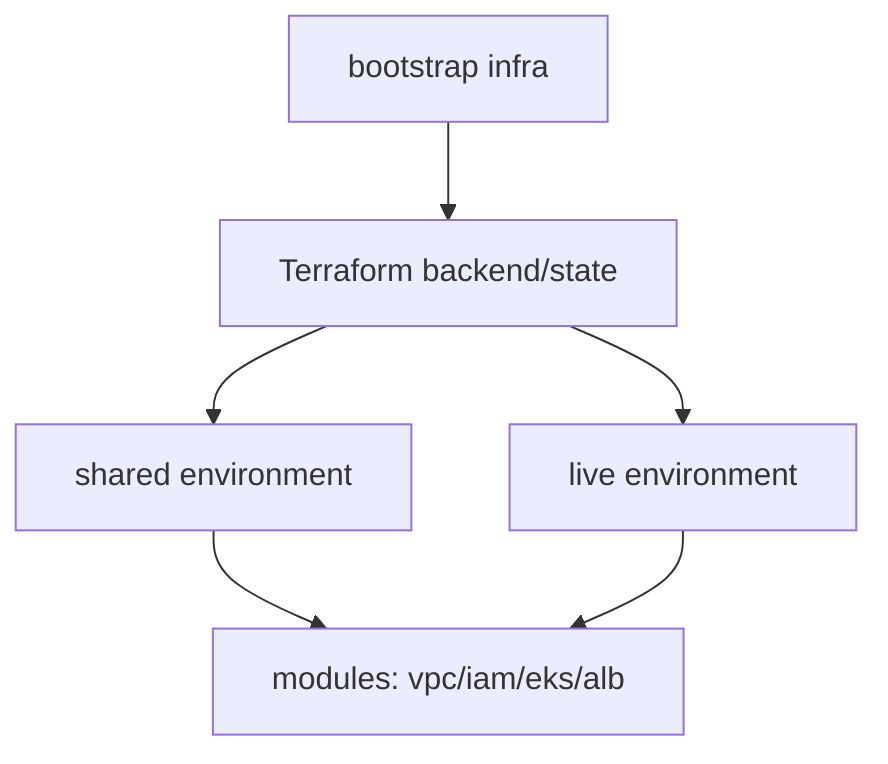

# Express Reliability Platform V6 — Infrastructure as Code Discipline

## Builds on V5

Before you start V6, copy your personal V5 repository to your local machine and rename it to V6:

```sh
git clone https://github.com/YOUR_USERNAME/express-reliability-platform-v05.git
mv express-reliability-platform-v05 express-reliability-platform-v06
cd express-reliability-platform-v06
```

Use the main class repository for scripts and canonical structure:

- https://github.com/Here2ServeU/express-reliability-platform-course

## 1) Version Purpose

Standardize Terraform usage across environments with clear state, module, and bootstrap patterns.

## 2) Chapters Covered

- Chapter 13: Terraform Foundations (state, backend, modules, environments)

## 3) What You Will Build

- A disciplined IaC workflow for `live` and `shared` environments.
- A reusable module-driven infrastructure layout.

## 4) Architecture Diagram (Mermaid)



## 5) Project Structure

```text
express-reliability-platform-v06/
├── environments/
│   ├── live/
│   └── shared/
├── infrastructure/
│   └── bootstrap/
├── modules/
│   ├── alb/
│   ├── eks/
│   ├── iam/
│   └── vpc/
├── scripts/
│   └── terraform_init_apply.sh
└── README.md
```

## 6) Run Steps

1. Run the local Docker Compose gate first using your latest local stack (from V4):

    ```sh
    cd ../express-reliability-platform-v04
    docker compose up --build -d
    curl http://localhost:8080/api/health
    docker compose down
    cd ../express-reliability-platform-v06
    ```

2. Configure AWS credentials and region.
3. Bootstrap remote state resources (if required by your backend setup).
4. Apply shared environment first.
5. Apply live environment next.
6. Promote infrastructure updates through `dev -> staging -> prod` using separate state keys/workspaces.
7. Use helper script:

   ```sh
   ./scripts/terraform_init_apply.sh
   ```

## 7) Validation Checklist

- [ ] Remote state backend is reachable and locked correctly.
- [ ] `terraform validate` and `terraform plan` run cleanly.
- [ ] Module outputs are wired correctly between environments.
- [ ] Re-running apply is idempotent (no unexpected drift).

## 8) Troubleshooting

- State lock stuck: release lock only after confirming no active Terraform run.
- Backend init errors: verify bucket/table/permissions in bootstrap resources.
- Module mismatch: verify variable names and output references.

## 9) Cleanup

- Destroy lab resources in reverse dependency order (`live` before `shared`).

## 10) Next Version Preview

In V7, you build on V6 and operationalize reliability with runbooks, incident response workflows, and disaster recovery habits.


