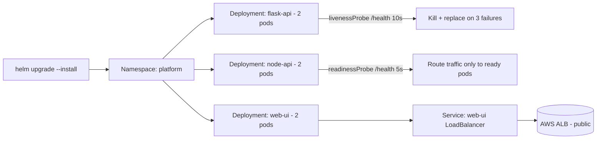
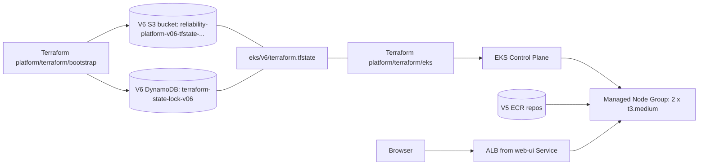

# Express Reliability Platform V6 — Kubernetes: The Self-Healing Platform

## 1) Builds on V5

Before you start V6, copy your personal V5 repository to your local machine and rename it to V6:

```sh
git clone https://github.com/YOUR_USERNAME/express-reliability-platform-v05.git
mv express-reliability-platform-v05 express-reliability-platform-v06
cd express-reliability-platform-v06
```

Use the main class repository for scripts and canonical structure:

- https://github.com/Here2ServeU/express-reliability-platform-course

> **V5's ECR repos must still exist.** V6 has its own bootstrap stack — own S3 bucket (`reliability-platform-v06-tfstate-<account>`) and own DynamoDB lock table (`terraform-state-lock-v06`) — so it does not depend on V5's state backend. But V6 *does* reuse V5's ECR repositories and the `linux/amd64` images V5 pushed to `reliability-platform/{flask-api,node-api,web-ui}`. If you've already run `./scripts/cleanup_v5.sh`, those images are gone — re-run `./scripts/tf_deploy.sh` in your V5 directory before continuing. The deploy script in §11 includes a preflight that fails fast with this message if the repos are missing.

## 2) Version Purpose

V5 keeps your containers running on ECS Fargate, but ECS health checks run every 30 seconds — for those 30 seconds, broken requests can still reach a crashed container. And a container that is *running* but internally stuck (infinite loop, deadlock) keeps receiving traffic even though it cannot process requests.

Kubernetes is fundamentally different. Liveness probes run every 10 seconds, readiness probes every 5. Three consecutive liveness failures and Kubernetes kills the container and starts a fresh one — automatically, no human in the loop. Readiness gating means traffic only goes to containers that are currently healthy.

Provision an EKS cluster with Terraform. Install `kubectl` and Helm. Deploy all three V5 services as Helm charts with liveness and readiness probes. Run the self-healing test by deleting a pod and watching Kubernetes replace it. Then validate the rolling-update and rollback flow.

---

## 3) Plain Language Context

**What is this version teaching you?**
Self-healing infrastructure. In V5 you had to watch dashboards and alerts to know if a container was sick. In V6 the platform watches itself — every pod is probed continuously, and any pod that fails is killed and replaced without you doing anything. The same Helm charts that deploy the application also encode the rules that keep it healthy.

**How does a bank or hospital use this?**
At a bank, when a payment-processing pod hits a memory leak at 3am, Kubernetes' liveness probe catches it on the next 10-second check, kills the pod, and spins up a fresh one. Total customer-visible impact: a few seconds of degraded capacity instead of an outage. Hospitals run their patient-portal APIs the same way — readiness gating ensures a pod that just lost its database connection stops receiving traffic until the connection comes back, instead of returning errors to the EHR system.

**The three guarantees Kubernetes makes:**

| Guarantee | What It Means |
|---|---|
| **Desired state reconciliation** | You declare "run 2 copies of `node-api`." If one crashes, Kubernetes starts another within seconds. Always. |
| **Traffic only goes to healthy pods** | Readiness probe must pass before a pod sees traffic. Liveness probe must keep passing or the pod is killed. |
| **Zero-downtime deployments** | Rolling updates: one new pod starts, becomes ready, then one old pod is removed. Repeat until done. |

**Key terms in plain language:**

| Term | What It Means |
|---|---|
| **Kubernetes** | Container orchestrator. Runs, heals, and scales containers across many servers. |
| **EKS** | AWS-managed Kubernetes. AWS runs the control plane; you manage workloads. |
| **Control plane** | The Kubernetes brain — API server, scheduler, controller manager. AWS runs this in EKS. |
| **Worker node** | An EC2 instance where pods actually run. You configure the node group size. |
| **kubectl** | CLI for talking to a Kubernetes cluster. |
| **Pod** | Smallest scheduling unit. One or more containers sharing a network namespace. |
| **Deployment** | Declares desired pod count. Self-heals by replacing failed pods. |
| **ReplicaSet** | Created by a Deployment. Keeps the exact pod count at all times. |
| **Service** | Stable virtual IP + DNS name for a set of pods. Routes traffic only to ready pods. |
| **Namespace** | Virtual partition for resources. Your apps live in `platform`; system pods live in `kube-system`. |
| **Liveness probe** | `httpGet /health` every 10s. Three failures → kill and replace. **This is self-healing.** |
| **Readiness probe** | `httpGet /health` every 5s. Must pass before a pod receives any traffic. |
| **`initialDelaySeconds`** | Seconds after container start before the first probe runs. Gives the app time to initialize. |
| **`failureThreshold`** | Consecutive failures before action is taken. Default `3`. |
| **Helm** | Package manager for Kubernetes. One command deploys all the resources for a service. |
| **Chart** | Helm package — templates plus default values for one application. |
| **`values.yaml`** | Default configuration for a chart. Overridden per environment with `--set` or `-f`. |
| **`helm upgrade --install`** | Install if missing, upgrade if present. Idempotent — safe to run repeatedly. |
| **ClusterIP** | Service only reachable inside the cluster. Used for internal services. |
| **LoadBalancer** | Service that creates a public AWS ALB/NLB. Used for public-facing services. |
| **`kubectl port-forward`** | Tunnel a local port to a pod or service inside the cluster. Used for testing. |

**Expected result at the end of this version:**

- `kubectl get nodes` shows 2 worker nodes **Ready**.
- `kubectl get pods -n platform` shows 6 pods (2 per service) all `Running 1/1`.
- Deleting a pod (`kubectl delete pod ...`) causes Kubernetes to spin up a replacement within ~30 seconds — **self-healing confirmed**.
- `helm upgrade ... --set image.tag=...` performs a rolling update with zero downtime; `kubectl rollout undo` rolls back.
- The `web-ui` LoadBalancer service exposes a public ALB URL that returns the V6 governance UI.

---

## 4) Training Workflow (Understand -> Build -> Test -> Break -> Fix -> Explain -> Automate -> Improve)

1. **Understand:** Read the three Kubernetes guarantees and how probes drive self-healing.
2. **Build:** Apply `platform/terraform/eks`, connect `kubectl`, deploy the three Helm charts into the `platform` namespace.
3. **Test:** `kubectl get pods`, port-forward to `/health`, confirm all pods are `Running 1/1`.
4. **Break:** `kubectl delete pod` on a running `node-api` pod.
5. **Fix:** Watch Kubernetes re-create the pod automatically — no human action required.
6. **Explain:** Note the sequence (`Terminating` → new `Pending` → `Running`) and the time it took.
7. **Automate:** Use `helm upgrade --install` for idempotent deploys; use `kubectl rollout` for safe updates and rollbacks.
8. **Improve:** Tune probe `initialDelaySeconds`, `periodSeconds`, and resource requests/limits.

## 5) What You Will Build

- A V6-specific bootstrap stack — own S3 state bucket (`reliability-platform-v06-tfstate-<account>`) and DynamoDB lock table (`terraform-state-lock-v06`) — so V6 stands alone instead of reusing V5's state backend.
- An EKS cluster (control plane + 2 × t3.medium worker nodes) provisioned by Terraform, with state stored in the V6 bootstrap bucket at the key `eks/v6/terraform.tfstate`.
- Three Helm charts (`flask-api`, `node-api`, `web-ui`) that wrap the V5 service images with liveness and readiness probes.
- A `platform` namespace running 6 pods with self-healing enabled and a public `web-ui` LoadBalancer that returns the V6 governance UI.
- A cleanup script that uninstalls all releases, destroys EKS, drains the V6 state bucket, and destroys the V6 bootstrap — without touching V5's bootstrap or ECR. V7–V10 can still reuse V5's ECR images.

> **Scope note:** V6 deploys the application tier on Kubernetes. The monitoring stack (Prometheus, Grafana, Alertmanager) is intentionally not part of V6 — the next version (V7) installs `kube-prometheus-stack` so the same dashboards and alerts you wrote in V5 run inside the cluster, scraping pods directly via Kubernetes service discovery.

## 6) Architecture Diagrams

**Helm-side (what one `helm upgrade --install` lays down):**



**AWS-side (what Terraform provisions):**



## 7) Project Structure

```text
express-reliability-platform-v06/
├── apps/
│   └── web-ui/
│       └── index.html                       ← V6 governance scorecard UI
├── platform/
│   ├── helm/
│   │   ├── flask-api/
│   │   │   ├── Chart.yaml
│   │   │   ├── values.yaml                  ← image repo, probes, resources
│   │   │   └── templates/deployment.yaml
│   │   ├── node-api/
│   │   │   ├── Chart.yaml
│   │   │   ├── values.yaml
│   │   │   └── templates/deployment.yaml
│   │   └── web-ui/
│   │       ├── Chart.yaml
│   │       ├── values.yaml                  ← service.type=LoadBalancer
│   │       └── templates/deployment.yaml
│   └── terraform/
│       ├── bootstrap/                       ← V6 S3 state bucket + DynamoDB lock table
│       │   ├── main.tf
│       │   └── variables.tf                 ← aws_region, project_name, version_suffix
│       └── eks/                             ← EKS cluster, IAM, dedicated VPC, node group
│           ├── main.tf
│           └── variables.tf                 ← cluster_name, vpc_cidr, node sizing, k8s version
├── scripts/
│   ├── tf_deploy_v6.sh                      ← end-to-end deploy: bootstrap → eks → kubectl → helm
│   └── cleanup_v6.sh                        ← uninstall releases, destroy EKS, drain V6 bucket, destroy bootstrap
└── README.md
```

---

# Part A — Validate the Helm Charts Locally (Optional)

You can lint and dry-render the charts before you spend EKS dollars. This is the V6 analog of V5's local Docker Compose validation — same idea (catch problems before paying the cloud), different toolchain.

## 8) Local Helm Validation

1. Lint each chart for syntax errors and best-practice warnings:

   ```sh
   helm lint platform/helm/flask-api
   helm lint platform/helm/node-api
   helm lint platform/helm/web-ui
   ```

   Expect `1 chart(s) linted, 0 chart(s) failed` for each.

2. Render each chart to plain Kubernetes YAML and inspect it. This is what `helm install` would actually apply to the cluster:

   ```sh
   helm template flask-api platform/helm/flask-api | less
   helm template node-api  platform/helm/node-api  | less
   helm template web-ui    platform/helm/web-ui    | less
   ```

   Look for: `livenessProbe` and `readinessProbe` blocks present, image repository pointing at the right ECR URI, `resources.requests` and `resources.limits` populated. If any of those are missing or malformed, fix `values.yaml` before deploying.

3. (Optional) Run a real Kubernetes locally and validate the charts there before EKS. Pick **one** of the two options below — both produce a single-node cluster `kubectl` can talk to.

   **Option A — `kind` (Kubernetes IN Docker).** Lightweight, scriptable, works on macOS / Linux / Windows. Needs Docker running. Install:

   ```sh
   # macOS
   brew install kind

   # Linux
   curl -Lo ./kind https://kind.sigs.k8s.io/dl/v0.23.0/kind-linux-amd64
   chmod +x ./kind && sudo mv ./kind /usr/local/bin/kind

   # Windows (PowerShell — pick whichever package manager you already use)
   choco install kind                       # Chocolatey
   winget install Kubernetes.kind           # winget
   scoop install kind                       # Scoop

   # Verify (any OS)
   kind version
   docker info >/dev/null && echo "Docker is running"
   ```

   Then create the cluster and dry-run the chart:

   ```sh
   kind create cluster --name v6-local
   kubectl create namespace platform
   helm install flask-api platform/helm/flask-api --namespace platform \
     --set image.pullPolicy=IfNotPresent
   kubectl get pods -n platform -w   # pods will ImagePullBackOff (ECR not reachable from kind)
   kind delete cluster --name v6-local
   ```

   **Option B — Docker Desktop's built-in Kubernetes.** No extra CLI to install — Docker Desktop ships with a single-node Kubernetes cluster you can flip on. Best on Windows or macOS if you'd rather avoid another package install.

   1. Open Docker Desktop → **Settings** → **Kubernetes** → tick **Enable Kubernetes** → **Apply & Restart**. Wait ~2 minutes for the cluster to come up (the green dot at the bottom-left turns from yellow to green).
   2. Switch your `kubectl` context to it:

      ```sh
      kubectl config use-context docker-desktop
      kubectl get nodes   # should list one node named docker-desktop, STATUS Ready
      ```

   3. Run the same `helm install` / `kubectl get pods` flow shown in Option A. To tear it down, untick **Enable Kubernetes** in Docker Desktop and apply.

   Either way, you will see `ImagePullBackOff` because the local cluster can't pull from your private ECR — that's expected and fine. The point of this step is to verify the *shape* of the resources Helm creates: deployments, services, replica counts, probe configuration. For real image pulls, use EKS (Part B).

---

# Part B — Deploy and Validate on AWS (EKS via Terraform + Helm)

## 9) AWS Prerequisites and Stack Overview

**Prerequisites:**
- AWS CLI v2 configured (`aws configure`) with credentials that can create EKS, IAM, EC2 (worker nodes), and access the V5 state bucket.
- Terraform ≥ 1.5.
- `kubectl` ≥ 1.29 and `helm` ≥ 3.14. Install with:

  ```sh
  # macOS
  brew install kubectl helm

  # Linux
  curl -LO "https://dl.k8s.io/release/$(curl -Ls https://dl.k8s.io/release/stable.txt)/bin/linux/amd64/kubectl"
  chmod +x kubectl && sudo mv kubectl /usr/local/bin/
  curl https://raw.githubusercontent.com/helm/helm/main/scripts/get-helm-3 | bash

  # Verify
  kubectl version --client
  helm version
  ```

**The platform stacks at this point:**

| Stack | Folder | What it creates | Run frequency | Owned by |
|---|---|---|---|---|
| **V5 Bootstrap** | (V5) `terraform/bootstrap/` | `reliability-platform-tfstate-<account>` bucket, `terraform-state-lock` table | Once per AWS account | V5 |
| **V5 Platform** | (V5) `terraform/platform/` | VPC, ECR, ECS, ALB, IAM | Every V5 deploy | V5 |
| **V6 Bootstrap** | (V6) `platform/terraform/bootstrap/` | `reliability-platform-v06-tfstate-<account>` bucket, `terraform-state-lock-v06` table | Once per AWS account | V6 |
| **V6 EKS** | (V6) `platform/terraform/eks/` | EKS cluster, IAM, dedicated VPC, managed node group | Every V6 deploy | V6 |

V6 has its own bootstrap with V6-specific resource names so it can coexist with V5 on the same AWS account — no shared bucket, no shared lock table, no shared blast radius. The only thing V6 still borrows from V5 is the **ECR repositories**: V6's Helm charts reference `<account>.dkr.ecr.<region>.amazonaws.com/reliability-platform/<svc>` via `--set image.repository`, which is V5's `aws_ecr_repository.services` resource. If V5 was cleaned up, those repos and images are gone.

### 9.1) Reconfigure variables (skip if defaults are fine)

Both Terraform stacks expose their inputs in dedicated [variables.tf](express-reliability-platform-v06/platform/terraform/eks/variables.tf) files. The defaults are wired together so a fresh clone deploys without edits — but you'll want to change them if you fork the course, deploy to a different region, or want a beefier node group.

| File | Variable | Default | When to change |
|---|---|---|---|
| `platform/terraform/bootstrap/variables.tf` | `aws_region` | `us-east-1` | Deploying to another region. The EKS stack's `aws_region` must match. |
| | `project_name` | `reliability-platform` | Forking the course under a different project name. |
| | `version_suffix` | `v06` | Building V7+ on this template. Must match the EKS stack's backend bucket name (see below). |
| `platform/terraform/eks/variables.tf` | `aws_region` | `us-east-1` | Same as bootstrap — must match. |
| | `project_name` | `reliability-platform-v06` | Tags the VPC, IGW, subnets, route table. Cosmetic. |
| | `cluster_name` | `reliability-platform-cluster` | Renaming the EKS cluster. The subnet `kubernetes.io/cluster/<this>` tag follows automatically. |
| | `kubernetes_version` | `1.33` | AWS retires EKS versions about 14 months after K8s release — list currently-supported versions with `aws eks describe-cluster-versions` and bump this when the default's AMI gets retired. |
| | `vpc_cidr` | `10.43.0.0/16` | Avoiding overlap with another VPC you peer with. |
| | `node_instance_types` | `["t3.medium"]` | Larger pods or more workload — try `["t3.large"]` or `["m5.xlarge"]`. |
| | `node_desired_size` | `2` | More workers if pods land `Pending` for resource reasons. |
| | `node_min_size` / `node_max_size` | `1` / `4` | Bounds for manual scaling; bump `node_max_size` if you scale a Deployment past 4 replicas. |

Override on the command line with `-var`:

```sh
terraform -chdir=platform/terraform/eks apply -auto-approve \
  -var node_instance_types='["t3.large"]' \
  -var node_desired_size=3 \
  -var kubernetes_version=1.30
```

Or commit a `terraform.tfvars` next to `variables.tf` for persistent overrides:

```hcl
# platform/terraform/eks/terraform.tfvars
node_instance_types = ["t3.large"]
node_desired_size   = 3
kubernetes_version  = "1.30"
```

> **Two gotchas to know:**
> 1. **Backend bucket names are not variable-aware.** `platform/terraform/eks/main.tf` has its `bucket = "reliability-platform-v06-tfstate-<account>"` hard-coded in the `backend "s3"` block — Terraform doesn't allow variables there. If you change `version_suffix` or `project_name` in the bootstrap, you must edit the backend block to match (or pass `-backend-config="bucket=..."` like `tf_deploy_v6.sh` does).
> 2. **Changing `cluster_name` after a deploy** rebuilds the cluster from scratch (it's the EKS resource's primary identifier). Set it once before the first apply and leave it alone.

Two ways to deploy V6:

- **Path A — Manual:** run each phase by hand the first time, so you see what each step does.
- **Path B — Scripted:** one command end to end. Use this on subsequent deploys.

## 10) Path A — Manual Deployment

### 10.1) Phase 1 — Bootstrap (V6 state backend)

Creates the V6-specific S3 bucket and DynamoDB lock table that the EKS stack will use for state.

```sh
terraform -chdir=platform/terraform/bootstrap init
terraform -chdir=platform/terraform/bootstrap apply -auto-approve
```

Note the three outputs: `state_bucket` (e.g. `reliability-platform-v06-tfstate-123456789012`), `lock_table` (`terraform-state-lock-v06`), and `account_id`.

> **If you previously ran V6 bootstrap in this account:** the bucket and DynamoDB table already exist. Terraform sees no changes and the apply is a no-op. **If you're sharing the account with a V5 deployment:** no conflict — the resource names are V6-specific.

### 10.2) Phase 2 — Wire the EKS stack to the V6 backend

Edit [terraform/eks/main.tf](express-reliability-platform-v06/platform/terraform/eks/main.tf) and replace `YOUR_ACCOUNT_ID` in the backend config with the `account_id` from Phase 1:

```hcl
backend "s3" {
  bucket         = "reliability-platform-v06-tfstate-123456789012"
  key            = "eks/v6/terraform.tfstate"
  region         = "us-east-1"
  dynamodb_table = "terraform-state-lock-v06"
}
```

Then initialize:

```sh
terraform -chdir=platform/terraform/eks init
```

> **Tip:** if you'd rather not edit the file, pass the bucket and table via `-backend-config` flags (this is what the scripted path does):
>
> ```sh
> ACCOUNT_ID=$(terraform -chdir=platform/terraform/bootstrap output -raw account_id)
> terraform -chdir=platform/terraform/eks init -reconfigure \
>   -backend-config="bucket=reliability-platform-v06-tfstate-${ACCOUNT_ID}" \
>   -backend-config="dynamodb_table=terraform-state-lock-v06"
> ```

### 10.3) Phase 3 — Provision EKS

```sh
terraform -chdir=platform/terraform/eks apply -auto-approve
```

Expect 10–15 minutes for the EKS control plane to come up. The apply creates: cluster IAM role, node IAM role + 3 policy attachments (worker, ECR read, CNI), the EKS cluster itself, and a managed node group with 2 × `t3.medium` instances.

```sh
CLUSTER=$(terraform -chdir=platform/terraform/eks output -raw cluster_name)
echo "$CLUSTER"
```

### 10.4) Phase 4 — Configure kubectl

`aws eks update-kubeconfig` downloads the cluster's API endpoint, CA certificate, and an authentication token, then writes them to `~/.kube/config` so that `kubectl` targets this EKS cluster:

```sh
aws eks --region us-east-1 update-kubeconfig --name "$CLUSTER"
kubectl get nodes
```

Expect 2 nodes listed with `STATUS: Ready`. If they're `NotReady`, give it 2–3 more minutes for kubelet to register and the CNI to come up.

### 10.5) Phase 5 — Override the image repository in the Helm values

Each chart's [values.yaml](express-reliability-platform-v06/platform/helm/flask-api/values.yaml) hard-codes a `YOUR_ACCOUNT_ID` placeholder in `image.repository`. You can either edit the files in-place or override per-install with `--set`:

```sh
ACCOUNT_ID=$(aws sts get-caller-identity --query Account --output text)
ECR_BASE="${ACCOUNT_ID}.dkr.ecr.us-east-1.amazonaws.com/reliability-platform"
```

### 10.6) Phase 6 — Install the Helm charts

```sh
kubectl create namespace platform --dry-run=client -o yaml | kubectl apply -f -

helm upgrade --install flask-api platform/helm/flask-api --namespace platform \
  --set image.repository="${ECR_BASE}/flask-api"
helm upgrade --install node-api  platform/helm/node-api  --namespace platform \
  --set image.repository="${ECR_BASE}/node-api"
helm upgrade --install web-ui    platform/helm/web-ui    --namespace platform \
  --set image.repository="${ECR_BASE}/web-ui"

kubectl get pods -n platform -w
```

`helm upgrade --install` is the idempotent deploy command: if the release does not exist it installs, if it exists it upgrades. One command handles first deploy and every subsequent update.

Expect 6 pods (2 per service) all `STATUS: Running`, `READY: 1/1`. If pods are stuck `ImagePullBackOff`, the ECR repos from V5 have been deleted — see Section 13 (Troubleshooting).

Get the public URL for the V6 UI:

```sh
kubectl get svc web-ui -n platform -o jsonpath='{.status.loadBalancer.ingress[0].hostname}'
```

The first time, that may be empty for 60–90 seconds while AWS provisions the ALB.

## 11) Path B — Scripted Deployment

```sh
./scripts/tf_deploy_v6.sh
```

The script runs all phases back to back: it applies V6's bootstrap, reads its outputs, wires `platform/terraform/eks` to that bucket and lock table via `-backend-config`, applies the EKS stack, configures kubectl, creates the namespace, and runs `helm upgrade --install` against all three charts with the correct ECR base URI substituted. The script is idempotent — re-running it after a chart change rolls the deployment forward, and Terraform reconciles whatever drifted.

### 11.1) What the script runs (full source)

The script lives at [scripts/tf_deploy_v6.sh](express-reliability-platform-v06/scripts/tf_deploy_v6.sh):

```sh
#!/bin/bash
set -euo pipefail

REGION="us-east-1"
PROJECT="reliability-platform"
NAMESPACE="platform"
SERVICES=(flask-api node-api web-ui)

echo '=== Step 1: Apply V6 bootstrap (S3 state bucket + DynamoDB lock table) ==='
terraform -chdir=platform/terraform/bootstrap init -input=false
terraform -chdir=platform/terraform/bootstrap apply -auto-approve

echo '=== Step 2: Read bootstrap outputs and ECR base URI ==='
STATE_BUCKET=$(terraform -chdir=platform/terraform/bootstrap output -raw state_bucket)
LOCK_TABLE=$(terraform -chdir=platform/terraform/bootstrap output -raw lock_table)
ACCOUNT_ID=$(terraform -chdir=platform/terraform/bootstrap output -raw account_id)
ECR_BASE="${ACCOUNT_ID}.dkr.ecr.${REGION}.amazonaws.com/${PROJECT}"

# (Preflight skipped here — see scripts/tf_deploy_v6.sh for the full version,
# which also fails fast if V5's ECR repos are missing.)

echo '=== Step 3: Initialize EKS stack against V6 bootstrap backend ==='
terraform -chdir=platform/terraform/eks init \
  -reconfigure -input=false \
  -backend-config="bucket=${STATE_BUCKET}" \
  -backend-config="region=${REGION}" \
  -backend-config="dynamodb_table=${LOCK_TABLE}" \
  -backend-config="key=eks/v6/terraform.tfstate"

echo '=== Step 4: Apply EKS Terraform (10-15 minutes) ==='
terraform -chdir=platform/terraform/eks apply -auto-approve

echo '=== Step 5: Configure kubectl for the new cluster ==='
CLUSTER=$(terraform -chdir=platform/terraform/eks output -raw cluster_name)
aws eks --region "${REGION}" update-kubeconfig --name "${CLUSTER}"
kubectl get nodes

echo '=== Step 6: Create platform namespace (idempotent) ==='
kubectl create namespace "${NAMESPACE}" --dry-run=client -o yaml | kubectl apply -f -

echo '=== Step 7: Install/upgrade Helm charts with V5 ECR images ==='
for SVC in "${SERVICES[@]}"; do
  helm upgrade --install "${SVC}" "helm/${SVC}" \
    --namespace "${NAMESPACE}" \
    --set image.repository="${ECR_BASE}/${SVC}"
done

echo '=== Step 8: Wait for all pods Ready ==='
kubectl rollout status deployment/flask-api-flask-api -n "${NAMESPACE}"
kubectl rollout status deployment/node-api-node-api  -n "${NAMESPACE}"
kubectl rollout status deployment/web-ui-web-ui      -n "${NAMESPACE}"

echo '=== Step 9: Public URL ==='
kubectl get svc web-ui -n "${NAMESPACE}" \
  -o jsonpath='{.status.loadBalancer.ingress[0].hostname}{"\n"}'
echo 'If empty, the ALB is still provisioning — wait 60-90s and re-check.'
```

### 11.2) Helm install — what each piece does

| Action | Command (from Step 6) | What it does |
|---|---|---|
| **Install or upgrade** | `helm upgrade --install <release> <chart>` | If the release doesn't exist, install it; if it does, upgrade it. Idempotent — safe to re-run on every code change. |
| **Namespace** | `--namespace platform` | Targets the `platform` namespace. Created by Step 5 with a dry-run-then-apply pattern so it's idempotent too. |
| **Image override** | `--set image.repository=<ecr-uri>` | Overrides the `YOUR_ACCOUNT_ID` placeholder in the chart's `values.yaml` with your real ECR base URI. Avoids editing the chart files in-place. |
| **Tag (default)** | (no override — uses `tag: latest` from values.yaml) | Pulls the `:latest` tag V5 pushed. Override per-install with `--set image.tag=<sha>` for traceable deploys. |

The loop runs this for each service in `SERVICES=(flask-api node-api web-ui)`, so one invocation deploys (or upgrades) all three.

## 12) Validate the Platform on AWS

This mirrors V5 Section 15: confirm the cluster is up, confirm the workloads are running, hit the public endpoint, and prove self-healing works.

### 12.1) Confirm the cluster

```sh
# EKS cluster status
aws eks describe-cluster --region us-east-1 --name reliability-platform-cluster \
  --query 'cluster.{name:name,status:status,version:version}' --output table

# Worker nodes
kubectl get nodes
```

Expect cluster `status: ACTIVE` and 2 nodes `STATUS: Ready`.

### 12.2) Confirm pods running

```sh
kubectl get pods -n platform -o wide
kubectl get deployments -n platform
kubectl get svc -n platform
```

Expect 6 pods `Running 1/1`, 3 deployments with `READY: 2/2`, and `web-ui` Service showing an external hostname under `EXTERNAL-IP`.

### 12.3) Open the public URL

```sh
URL=$(kubectl get svc web-ui -n platform \
  -o jsonpath='{.status.loadBalancer.ingress[0].hostname}')
echo "$URL"
curl -I "http://$URL"
```

You should get `HTTP/1.1 200 OK`. Open the URL in a browser to see the V6 UI — same V2-lineage console you've seen in earlier versions, now scoring infrastructure governance.

### 12.4) Self-healing test (the most important test in V6)

```sh
POD=$(kubectl get pods -n platform -l app=node-api-node-api \
  -o jsonpath='{.items[0].metadata.name}')
echo "About to delete: $POD"

kubectl delete pod "$POD" -n platform
kubectl get pods -n platform -w
```

Expected sequence:

1. Deleted pod shows `STATUS: Terminating`.
2. Within 5 seconds a new pod appears with `STATUS: Pending`.
3. Within 30 seconds the new pod shows `STATUS: Running`, `READY: 1/1`.
4. The `Terminating` pod disappears.

If you see that sequence, **self-healing is confirmed**. This is the fundamental reliability guarantee Kubernetes adds on top of V5's ECS deployment.

### 12.5) Rolling updates and rollback

Change the image tag without editing `values.yaml`:

```sh
helm upgrade node-api platform/helm/node-api --namespace platform \
  --set image.repository="${ECR_BASE}/node-api" \
  --set image.tag=v3
kubectl rollout status deployment/node-api-node-api -n platform
```

Roll back if the new version misbehaves:

```sh
kubectl rollout undo deployment/node-api-node-api -n platform
kubectl rollout history deployment/node-api-node-api -n platform
```

### 12.6) Manual scaling

```sh
kubectl scale deployment/node-api-node-api --replicas=4 -n platform
kubectl get pods -n platform -w
kubectl scale deployment/node-api-node-api --replicas=2 -n platform
```

### 12.7) Validation Checklist

All eight checks must pass before moving on to V7.

- [ ] **Check 1 — Worker nodes Ready:** `kubectl get nodes` shows 2 nodes `Ready`.
- [ ] **Check 2 — All pods Running:** `kubectl get pods -n platform` shows 6 pods `Running 1/1`.
- [ ] **Check 3 — `web-ui` ALB returns 200:** `curl -I http://<lb-hostname>` returns `HTTP/1.1 200 OK`.
- [ ] **Check 4 — Health via port-forward:** `kubectl port-forward svc/node-api-node-api 3000:3000 -n platform &` then `curl http://localhost:3000/health` returns `{"service":"node-api","status":"ok"}`.
- [ ] **Check 5 — Self-healing confirmed:** Deleted pod is replaced automatically within 30 seconds.
- [ ] **Check 6 — Liveness probe active:** `kubectl describe pod ... | grep -A6 Liveness` shows `http-get http://:3000/health delay=30s period=10s failure=3`.
- [ ] **Check 7 — Rolling update works:** `helm upgrade ... --set image.tag=...` + `kubectl rollout status` reports `successfully rolled out`.
- [ ] **Check 8 — Rollback works:** `kubectl rollout undo` completes and pods return to `Running 1/1`.

## 13) Troubleshooting

- **`server: connection refused` on `kubectl`:** `aws eks update-kubeconfig` was not run, or the cluster is still provisioning. Re-run `aws eks --region us-east-1 update-kubeconfig --name reliability-platform-cluster`.
- **Worker nodes stuck `NotReady`:** Wait 5 more minutes; inspect with `kubectl describe node <node-name>` — usually CNI is still initializing.
- **Pod `ImagePullBackOff`:** The ECR image URL in your `--set image.repository=...` is wrong, OR V5 was cleaned up and the ECR repos no longer exist. Check `aws ecr describe-repositories --query 'repositories[].repositoryName'` — if `reliability-platform/<svc>` is missing, redeploy V5 first.
- **Pod `CrashLoopBackOff`:** Container starts and crashes. Check `kubectl logs <pod-name> -n platform --previous` to see the crash output.
- **Pod `Pending` forever:** Node has insufficient resources for the requested CPU/memory. `kubectl describe pod <name> -n platform` shows the scheduling error. Either reduce `resources.requests` in `values.yaml` or bump `node_desired_size` / `node_instance_types` in `platform/terraform/eks/variables.tf` and re-apply.
- **`helm upgrade` hangs waiting for pods:** Readiness probe is failing — check probe path, port, and `initialDelaySeconds`. View probe results with `kubectl describe pod <name> -n platform`.
- **`web-ui` `EXTERNAL-IP` stays `<pending>`:** The AWS Load Balancer Controller isn't installed on the cluster. By default EKS provisions a *Classic* ELB for `Service type=LoadBalancer`, which works but is deprecated. For an Application Load Balancer instead, install the AWS Load Balancer Controller — this is one of V7's exercises.
- **Terraform apply errors with `state lock`:** Another apply is in flight, or one was killed. Check `aws dynamodb scan --table-name terraform-state-lock-v06`. Force-unlock only as a last resort: `terraform -chdir=platform/terraform/eks force-unlock <LOCK_ID>`.
- **`Requested AMI for this version <X.Y> is not supported`:** AWS retires EKS-optimized AMIs ~14 months after the Kubernetes minor release. Run `aws eks describe-cluster-versions --query 'clusterVersions[?clusterVersionStatus==`standard`].clusterVersion' --output text` to list versions still in standard support, then bump `kubernetes_version` in [platform/terraform/eks/variables.tf](express-reliability-platform-v06/platform/terraform/eks/variables.tf) to one of those.
- **`DependencyViolation` on subnet/IGW during `terraform destroy`:** A `Service type=LoadBalancer` (the `web-ui` Service) provisioned an AWS Classic ELB *inside* the VPC, but Kubernetes — not Terraform — owns it. If you `terraform destroy` without first deleting the Service, the ELB's ENIs hold the subnets and its EIPs hold the IGW, and you'll see:
  ```
  DependencyViolation: subnet ... has dependencies and cannot be deleted
  DependencyViolation: Network ... has some mapped public address(es)
  ```
  Recovery: delete the orphan LB(s), wait for ENIs to release, then re-run destroy:
  ```sh
  VPC=$(aws ec2 describe-vpcs --region us-east-1 \
    --filters "Name=tag:Name,Values=reliability-platform-v06-vpc" \
    --query 'Vpcs[0].VpcId' --output text)
  for LB in $(aws elb describe-load-balancers --region us-east-1 \
        --query "LoadBalancerDescriptions[?VPCId=='$VPC'].LoadBalancerName" --output text); do
    aws elb delete-load-balancer --load-balancer-name "$LB" --region us-east-1
  done
  sleep 90
  terraform -chdir=platform/terraform/eks destroy -auto-approve
  ```
  `scripts/cleanup_v6.sh` Step 2b does this automatically — use the script instead of bare `terraform destroy` to avoid the trap.
- **`Unsupported Kubernetes minor version update from X.Y to X.Z`:** EKS only allows **one minor version per upgrade** (1.29 → 1.30, then 1.30 → 1.31, etc.). A multi-version jump like 1.29 → 1.33 is rejected. If the cluster has no workloads yet — e.g. you hit this on the very first apply because the AMI for the original `kubernetes_version` was already retired — destroy and recreate is faster than 4 sequential upgrades:
  ```sh
  terraform -chdir=platform/terraform/eks destroy -auto-approve
  terraform -chdir=platform/terraform/eks apply -auto-approve
  ```
  If the cluster is in production with live workloads, do the incremental path: bump `kubernetes_version` by one minor, `apply`, wait for both control plane and node group to roll, repeat.

## 14) Full Cleanup

EKS is not free. 2 × `t3.medium` ≈ \$0.08/hr + control plane \$0.10/hr ≈ **\$4.30/day**. Always destroy after a practice session.

You have two teardown paths, mirroring V5:

| Path | Command | When to use |
|---|---|---|
| **Path A — Scripted** | `./scripts/cleanup_v6.sh` | Default. Uninstalls Helm releases, deletes namespace, destroys EKS, drains the V6 state bucket, destroys the V6 bootstrap, removes the kubectl context. Leaves V5's bootstrap and ECR alone. |
| **Path B — Manual** | `helm uninstall ...`, then `terraform -chdir=platform/terraform/eks destroy`, then `terraform -chdir=platform/terraform/bootstrap destroy` | First time you tear down, so you see what each step does. |

> **Important:** V6 cleanup destroys **only V6 resources** — its own bootstrap, its own EKS cluster. V5's bootstrap and ECR repos are intentionally left in place so V7–V10 can still reuse V5's images. If you want a full nuke (V5 + V6 + everything), run V6's `cleanup_v6.sh` first, then V5's `cleanup_v5.sh`.

> **If `terraform destroy` failed with `DependencyViolation` errors, run `./scripts/cleanup_v6.sh`.** Bare `terraform destroy` only sees what Terraform created — it doesn't know about the AWS Classic ELB that the `web-ui` Service provisioned, the ENIs that ELB holds in your subnets, or the EIP it has on your IGW. So when Terraform tries to delete the subnets and IGW, AWS rejects with messages like "subnet has dependencies and cannot be deleted" and "Network has some mapped public address(es)". The cleanup script handles this in Step 2b: it finds and deletes the orphan LBs, waits for AWS to release the ENIs, then runs `terraform destroy` against a clean VPC. **Don't keep retrying bare `terraform destroy` — the dependencies persist until something deletes the LB.** Either run the full cleanup script (which is idempotent and safe to run on a partial-destroy state), or manually reap the LB using the snippet in §14.2 Path B before retrying the Terraform destroy.

### 14.1) Path A — Scripted teardown

```sh
chmod +x scripts/cleanup_v6.sh
./scripts/cleanup_v6.sh
```

The script:

1. **Helm uninstall** — `helm uninstall web-ui node-api flask-api -n platform`. Idempotent: missing releases are warnings, not errors.
2. **Namespace delete** — `kubectl delete namespace platform` removes any leftover resources (PVCs, ConfigMaps, etc.).
2b. **Reap orphan AWS load balancers** — `Service type=LoadBalancer` provisions an AWS Classic ELB outside Terraform's view. The script looks up the cluster VPC by tag, deletes any Classic ELBs and v2 NLB/ALBs in it, then polls `describe-network-interfaces` for up to 3 minutes until no ENIs are `in-use`. Without this step, the next `terraform destroy` would `DependencyViolation` on the subnets and IGW because the LB still holds ENIs and EIPs.
3. **Re-init EKS stack** — passes V6 bucket + lock table via `-backend-config` so the destroy works even if `.terraform/` was wiped or `main.tf` still has the placeholder.
4. **EKS destroy** — `terraform -chdir=platform/terraform/eks destroy` (10–15 min). Removes the cluster, node group, dedicated VPC, and IAM roles. The `eks/v6/terraform.tfstate` key stays in the V6 bucket until step 6.
5. **Drain the V6 state bucket** — loops `aws s3api list-object-versions` + `delete-objects` in batches of 1000 until both `Versions[]` and `DeleteMarkers[]` are empty. Required because the bucket is versioned, and `aws s3 rm --recursive` doesn't touch non-current versions or delete markers.
6. **Bootstrap destroy** — `terraform -chdir=platform/terraform/bootstrap apply` first (records `force_destroy = true` in state if it wasn't already), then `terraform destroy`. Removes the V6 S3 bucket and DynamoDB lock table.
7. **kubectl context cleanup** — removes the EKS context from `~/.kube/config` so future `kubectl` commands don't try to talk to a dead cluster.
8. **Verify** — lists EKS clusters, checks the V6 bucket and lock table are gone.
9. **Local Terraform artifacts cleanup** — wipes `.terraform/`, `.terraform.lock.hcl`, `terraform.tfstate*`, and `tfplan` from both `platform/terraform/bootstrap/` and `platform/terraform/eks/`.

### 14.2) Path B — Manual teardown

Run in the reverse order of deploy (workloads → EKS → bootstrap):

```sh
# 1) Uninstall the Helm releases (idempotent — `|| true` swallows missing-release warnings)
helm uninstall web-ui node-api flask-api -n platform || true

# 2) Delete the namespace (also catches anything Helm didn't, like orphaned PVCs)
kubectl delete namespace platform --ignore-not-found

# 2b) Reap orphan AWS load balancers — `Service type=LoadBalancer` provisions
#     an AWS Classic ELB outside Terraform's view. If you skip this and go
#     straight to step 3, `terraform destroy` will DependencyViolation on the
#     subnets and IGW because the LB still holds ENIs and EIPs.
VPC=$(aws ec2 describe-vpcs --region us-east-1 \
  --filters "Name=tag:Name,Values=reliability-platform-v06-vpc" \
  --query 'Vpcs[0].VpcId' --output text)
for LB in $(aws elb describe-load-balancers --region us-east-1 \
      --query "LoadBalancerDescriptions[?VPCId=='$VPC'].LoadBalancerName" --output text); do
  aws elb delete-load-balancer --load-balancer-name "$LB" --region us-east-1
done
sleep 90   # let AWS release the LB's ENIs before Terraform tries to delete the subnets

# 3) Destroy EKS (10-15 minutes)
terraform -chdir=platform/terraform/eks destroy -auto-approve

# 4) Apply bootstrap so force_destroy=true is recorded in state, then destroy
terraform -chdir=platform/terraform/bootstrap apply -auto-approve
terraform -chdir=platform/terraform/bootstrap destroy -auto-approve

# 5) Remove the kubectl context
kubectl config delete-context "$(kubectl config current-context)" 2>/dev/null || true
```

#### 14.3) The versioned-bucket pitfall (`BucketNotEmpty` 409)

The V6 state bucket has versioning enabled, so every `terraform apply` writes a new version of `terraform.tfstate` and every `terraform destroy` creates *delete markers*. A plain `aws s3 rm --recursive` only removes the *current* version of each object — it leaves all old versions and delete markers in place. So `terraform -chdir=platform/terraform/bootstrap destroy` then fails with:

```
Error: deleting S3 Bucket (reliability-platform-v06-tfstate-NNN): operation error S3:
DeleteBucket, ... api error BucketNotEmpty: The bucket you tried to delete is not
empty. You must delete all versions in the bucket.
```

[terraform/bootstrap/main.tf](express-reliability-platform-v06/platform/terraform/bootstrap/main.tf#L34) already has `force_destroy = true` on `aws_s3_bucket.tf_state` to prevent this — it tells the AWS provider to drain every version + delete-marker before issuing `DeleteBucket`. **But it only kicks in if it's recorded in Terraform state.** If you skipped step 4 of Path B (the `apply` before the `destroy`), state still has the old default and the drain doesn't run. The cleanup script in Path A always does the apply-then-destroy dance, so it doesn't hit this.

If you do hit `BucketNotEmpty`, the recovery is the same shape as V5's:

```sh
BUCKET=$(terraform -chdir=platform/terraform/bootstrap output -raw state_bucket)
REGION=us-east-1

while : ; do
  CHUNK=$(aws s3api list-object-versions --bucket "$BUCKET" --region "$REGION" \
    --no-paginate --max-keys 1000 \
    --query '{Objects: [Versions, DeleteMarkers][].{Key:Key,VersionId:VersionId}}' \
    --output json)
  echo "$CHUNK" | grep -q '"Objects": null' && break
  COUNT=$(echo "$CHUNK" | grep -c '"Key":' || true)
  [ "$COUNT" -eq 0 ] && break
  aws s3api delete-objects --bucket "$BUCKET" --region "$REGION" --delete "$CHUNK" >/dev/null
  echo "drained $COUNT"
done

# Verify (must print 0)
aws s3api list-object-versions --bucket "$BUCKET" --region "$REGION" \
  --query 'length(Versions || `[]`) + length(DeleteMarkers || `[]`)' --output text

# Now destroy
terraform -chdir=platform/terraform/bootstrap destroy -auto-approve
```

## 15) Next Version Preview

In V7, you build on this Kubernetes foundation and operationalize reliability with runbooks, on-call rotations, incident playbooks, and disaster-recovery drills — turning Kubernetes' automatic self-healing into a complete incident-response workflow. The monitoring stack (Prometheus, Grafana, Alertmanager) you wrote in V5 also moves into the cluster as `kube-prometheus-stack`, scraping pods directly via Kubernetes service discovery.

---

## 16) Web UI Guide — `apps/web-ui/index.html`

### Platform Continuity

The V6 UI keeps the same V2 regulated-readiness console and evolves it with Terraform, FinOps, and infrastructure-governance checks. Students should experience this as the same platform growing, not as a separate app.

### What the V6 UI Does

The V6 `index.html` is the infrastructure-governance console. It explains how Terraform, reusable modules, environment separation, tagging, and change review make the platform repeatable and auditable.

The page checks:

- Reliability through repeatable infrastructure and stable environments.
- Cost efficiency through owner, application, and environment tags.
- Security and compliance through reviewed Terraform plans and controlled changes.
- Intelligence readiness through structured infrastructure data that can later support policy and automation.

### What It Is Used For

Use the V6 UI to teach students that regulated infrastructure must be reproducible. A bank or hospital should not rely on manually created cloud resources that no one can explain later.

This UI is useful for:

- Explaining why Terraform modules matter.
- Connecting FinOps tagging to real cloud cost accountability.
- Showing how PR-reviewed plans become audit evidence.
- Preparing students for V7 incident operations.

### How to Read the Results

The UI generates an infrastructure-governance scorecard.

| Field | Meaning |
|---|---|
| `version` | Confirms this is the V6 governance assessment. |
| `platform` | The infrastructure foundation being evaluated. |
| `readiness_score` | Overall infrastructure readiness score. |
| `readiness_band` | Plain-language assessment of whether the platform is ready. |
| `domains.reliability` | Improves when infrastructure is modular and repeatable. |
| `domains.cost_efficiency` | Drops when cost allocation tags are missing. |
| `domains.security_compliance` | Drops when Terraform changes are not reviewed. |
| `domains.intelligence_aiops_mlops` | Improves when infrastructure data is structured and policy-ready. |

For regulated environments, weak tagging is a FinOps risk, and weak change review is an audit risk.
