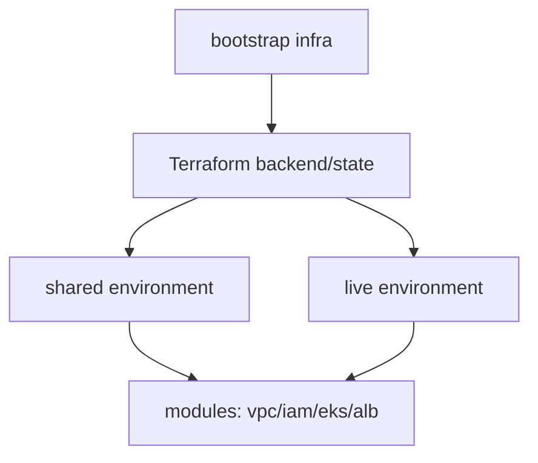

# Express Reliability Platform V6 — Infrastructure as Code Discipline

## Builds on V5

Before you start V6, copy your personal V5 repository to your local machine and rename it to V6:

```sh
git clone https://github.com/YOUR_USERNAME/express-reliability-platform-v05.git
mv express-reliability-platform-v05 express-reliability-platform-v06
cd express-reliability-platform-v06
```

Use the main class repository for scripts and canonical structure:

- https://github.com/Here2ServeU/express-reliability-platform-course

## 1) Version Purpose

Standardize Terraform usage across environments with clear state, module, and bootstrap patterns.

## 2) Chapters Covered

- Chapter 13: Terraform Foundations (state, backend, modules, environments)

## Training Workflow (Understand -> Build -> Test -> Break -> Fix -> Explain -> Automate -> Improve)

1. Understand: Review backend/state strategy and module boundaries.
2. Build: Apply infrastructure in shared then live order.
3. Test: Validate plans, state lock behavior, and idempotency.
4. Break: Trigger a controlled infra/config fault in a non-prod environment.
5. Fix: Use Terraform plan/output and cloud logs to recover.
6. Explain: Document what failed, why it failed, and what fixed it.
7. Automate: Add scripts/checks for plan validation and safe apply.
8. Improve: Tighten state isolation, policy checks, and promotion controls.

## 3) What You Will Build

- A disciplined IaC workflow for `live` and `shared` environments.
- A reusable module-driven infrastructure layout.

## 4) Architecture Diagram (Mermaid)



## 5) Project Structure

## 1) Version Purpose

Standardize Terraform usage across environments with clear state, module, and bootstrap patterns.

---

## Plain Language Context

**What is this version teaching you?**
You will organize your cloud setup code so that any engineer on your team can read it, reproduce it, and safely make changes — without breaking anything. This is like building a professional filing system where every document has a standard location, every change is tracked, and anyone with the right access can recreate the entire setup from scratch.

**How does a bank or hospital use this?**
In regulated industries, auditors can walk in at any time and ask: "Show us exactly how this environment was set up." Infrastructure as Code gives them a complete, versioned answer. It also means a new engineer on the team can be productive on day one instead of spending weeks learning an ad-hoc setup by trial and error.

**Key terms in plain language:**

| Term | What It Means |
|---|---|
| **Terraform state** | A file Terraform keeps to track what it has already built — so it knows what to add, change, or remove |
| **Remote backend** | Storing the state file in S3 (not on your laptop) so every team member shares the same truth |
| **Modules** | Reusable building blocks in Terraform — like a template. Define a VPC module once, use it in every environment |
| **Bootstrap** | The first infrastructure you create (S3 bucket + DynamoDB table) so Terraform has a place to store its state |
| **Environment promotion** | Moving infrastructure changes through `dev → staging → prod` in sequence, testing at each step |
| **Idempotency** | Running the same Terraform command twice gives the same result — nothing breaks if you apply twice |
| **tfvars** | A file containing values that change between environments (region, instance size, etc.) — keeps code DRY |

**Expected result at the end of this version:**
- `terraform plan` shows zero unexpected changes after you apply.
- State is stored remotely in S3 with DynamoDB locking.
- Modules are reused across `live` and `shared` environments.
- A second engineer can clone your repo and apply without asking you any questions.

---

## 2) Chapters Covered
├── infrastructure/
│   └── bootstrap/
├── modules/
│   ├── alb/
│   ├── eks/
│   ├── iam/
│   └── vpc/
├── scripts/
│   └── terraform_init_apply.sh
└── README.md
```

## 6) Run Steps

1. Run the local Docker Compose gate first using your latest local stack (from V4):

    ```sh
    cd ../express-reliability-platform-v04
    docker compose up --build -d
    curl http://localhost:8080/api/health
    docker compose down
    cd ../express-reliability-platform-v06
    ```

2. Configure AWS credentials and region.
3. Bootstrap remote state resources (if required by your backend setup).
4. Apply shared environment first.
5. Apply live environment next.
6. Promote infrastructure updates through `dev -> staging -> prod` using separate state keys/workspaces.
7. Use helper script:

   ```sh
   ./scripts/terraform_init_apply.sh
   ```

## 7) Validation Checklist

- [ ] Remote state backend is reachable and locked correctly.
- [ ] `terraform validate` and `terraform plan` run cleanly.
- [ ] Module outputs are wired correctly between environments.
- [ ] Re-running apply is idempotent (no unexpected drift).

## 8) Troubleshooting

- State lock stuck: release lock only after confirming no active Terraform run.
- Backend init errors: verify bucket/table/permissions in bootstrap resources.
- Module mismatch: verify variable names and output references.

## 9) Cleanup

- Destroy lab resources in reverse dependency order (`live` before `shared`).

## 10) Next Version Preview

In V7, you build on V6 and operationalize reliability with runbooks, incident response workflows, and disaster recovery habits.


