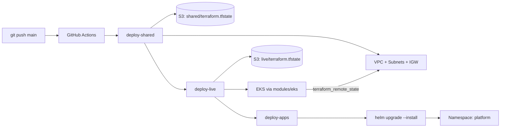

# Express Reliability Platform V7 — Organized Infrastructure and CI/CD

## 1) Builds on V6

Before you start V7, copy your personal V6 repository to your local machine and rename it to V7:

```sh
git clone https://github.com/YOUR_USERNAME/express-reliability-platform-v06.git
mv express-reliability-platform-v06 express-reliability-platform-v07
cd express-reliability-platform-v07
```

Use the main class repository for scripts and canonical structure:

- https://github.com/Here2ServeU/express-reliability-platform-course

## 2) Version Purpose

In Version 6, all your Terraform lives in one folder. That works when you are the only engineer. In a real company with ten engineers, one person changing the EKS node size can accidentally destroy the VPC networking. Or two people run `terraform apply` simultaneously and corrupt the state.

Version 7 separates infrastructure into independent **layers** — network in one folder, compute in another. Each layer has its own state file. A problem in one layer cannot affect another. Version 7 also adds **GitHub Actions** so every `git push` automatically deploys your platform without any manual commands.

**V7 Goal:** Separate Terraform into `shared` (VPC, network) and `live` (EKS, apps) layers. Connect them with remote state data sources. Automate the complete deployment with a three-job GitHub Actions pipeline.

---

## 3) Plain Language Context

**The skyscraper construction analogy.** Building a skyscraper takes years. First the foundation — concrete piles driven deep into bedrock. Then the structural steel frame. Then floors. Then interior finishings. Each phase builds on the previous one, and each floor is independent: you can renovate the 30th floor without touching the 15th floor or the foundation.

Cloud infrastructure should work the same way. The VPC (your network foundation) is built once and changed rarely. The EKS cluster (a floor) is rebuilt more frequently as you iterate. The application layer (tenant improvements) changes every deployment. Each layer is independent, with clear interfaces between them. Problems in one layer cannot cascade to others.

**Key terms in plain language:**

| Term | Plain Language Meaning |
|---|---|
| **Layer separation** | Each Terraform folder manages one layer. Each has its own state file. Changes to one cannot corrupt another. |
| **Shared layer** | The network foundation: VPC, subnets, internet gateway. Built once. Referenced by everything else. |
| **Live layer** | The compute layer: EKS cluster, ALB, node groups. Rebuilt frequently as you iterate. |
| **Remote state** | A Terraform data source that reads outputs from another layer's S3 state file. |
| **State isolation** | Each layer's state lives at a different S3 key. Destroying `live` state does not affect `shared` state. |
| **Promotion order** | Always deploy bottom-up: `shared` first, then `live`. Always destroy top-down: `live` first, then `shared`. |
| **GitHub Actions** | GitHub's built-in CI/CD. Runs YAML-defined workflows triggered by `git push`. |
| **Workflow** | A `.github/workflows/FILENAME.yml` file defining jobs and their steps. |
| **Job** | One unit of work in a workflow. Runs on a fresh Ubuntu VM. Can depend on other jobs. |
| **Step** | One action within a job. Either a shell command (`run:`) or a reusable action (`uses:`). |
| **needs: deploy-shared** | This job waits for `deploy-shared` to succeed before starting. Enforces correct order. |
| **OIDC authentication** | Passwordless AWS auth. GitHub gets a token AWS trusts. No keys stored in GitHub. |
| **id-token: write** | Permission required for OIDC. Allows the job to request a GitHub identity token. |
| **secrets.AWS_ROLE_ARN** | A GitHub Secret holding the IAM role ARN. Set in Repository → Settings → Secrets. |

**Expected result at the end of this version:**

- S3 holds two independent state files: `shared/terraform.tfstate` and `live/terraform.tfstate`.
- `terraform -chdir=terraform/shared output` returns `vpc_id` and subnet IDs.
- `terraform -chdir=terraform/live output` returns `cluster_name` and `cluster_endpoint` sourced from `shared` via remote state.
- A `git push` to `main` runs three GitHub Actions jobs in sequence: `deploy-shared → deploy-live → deploy-apps`.
- `terraform -chdir=terraform/shared destroy` **fails** while `live` is still alive — proving state isolation is enforced.

---

## 4) Training Workflow (Understand -> Build -> Test -> Break -> Fix -> Explain -> Automate -> Improve)

1. **Understand:** Read layer separation, remote state, and destroy-order rules.
2. **Build:** `terraform apply` on `shared`, then on `live`; deploy Helm charts into the `platform` namespace.
3. **Test:** Verify two distinct state files in S3, outputs wire through remote state, and the pipeline runs green.
4. **Break:** Attempt `terraform destroy` on `shared` while `live` depends on it — confirm Terraform refuses.
5. **Fix:** Destroy in the correct order (Helm → live → shared).
6. **Explain:** Capture why layer isolation matters and what remote state actually does at the file-system level.
7. **Automate:** Let the three-job GitHub Actions pipeline own the deploy path. No local `terraform apply` on `main`.
8. **Improve:** Tighten IAM role trust policy, add plan-only PR workflows, split envs further (`dev`, `staging`, `prod`).

## 5) What You Will Build

- `terraform/shared/` — a VPC with 2 public and 2 private subnets across 2 AZs, IGW, and public route table. Exports `vpc_id` and subnet IDs.
- `terraform/live/` — an EKS cluster launched inside `shared`'s VPC using a `terraform_remote_state` data source.
- `terraform/modules/eks/` — a reusable EKS module consumed by `live` (inputs: `cluster_name`, `vpc_id`, `subnet_ids`, `node_count`, `instance_type`).
- `.github/workflows/deploy.yml` — a three-job pipeline (`deploy-shared → deploy-live → deploy-apps`) authenticating to AWS via OIDC.
- `scripts/cleanup_v7.sh` — a teardown script that enforces the mandatory reverse order.

## 6) Architecture Diagram (Mermaid)



## 7) Project Structure

```text
express-reliability-platform-v07/
├── terraform/
│   ├── shared/
│   │   └── main.tf            ← VPC, subnets, IGW, route table + outputs
│   ├── live/
│   │   └── main.tf            ← reads shared via remote state; uses modules/eks
│   └── modules/
│       └── eks/
│           ├── main.tf        ← cluster, IAM roles, managed node group
│           ├── variables.tf
│           └── outputs.tf
├── helm/
│   ├── flask-api/
│   ├── node-api/
│   └── web-ui/
├── .github/
│   └── workflows/
│       └── deploy.yml         ← three-job pipeline with OIDC
├── scripts/
│   └── cleanup_v7.sh
└── README.md
```

## 8) Run Steps

### Local apply (first time or when iterating)

```sh
# Bottom-up build order — shared MUST be applied before live.
terraform -chdir=terraform/shared init
terraform -chdir=terraform/shared apply -auto-approve

terraform -chdir=terraform/live init
terraform -chdir=terraform/live apply -auto-approve

CLUSTER=$(terraform -chdir=terraform/live output -raw cluster_name)
aws eks --region us-east-1 update-kubeconfig --name "$CLUSTER"

helm upgrade --install flask-api helm/flask-api --namespace platform --create-namespace
helm upgrade --install node-api  helm/node-api  --namespace platform --create-namespace
helm upgrade --install web-ui    helm/web-ui    --namespace platform --create-namespace

kubectl get pods -n platform
```

### Automated apply (every `git push` to `main`)

Set one GitHub Secret before the first push:

- `Repository → Settings → Secrets and variables → Actions → New repository secret`
- Name: `AWS_ROLE_ARN`
- Value: ARN of an IAM role with a trust policy allowing your GitHub repo to assume it via OIDC.

Then:

```sh
git add .
git commit -m "V7 - organized layers with CI/CD"
git push origin main
```

Watch the run at `Repository → Actions`. You should see three green jobs in order: `deploy-shared → deploy-live → deploy-apps`.

## 9) Validation Checklist — Six Checks

All six checks must pass before moving on to V8.

- [ ] **Check 1 — Separate state files in S3:** `aws s3 ls s3://reliability-platform-tfstate-$ACCOUNT/ --recursive | grep tfstate` lists both `shared/terraform.tfstate` and `live/terraform.tfstate`.
- [ ] **Check 2 — Shared outputs available:** `terraform -chdir=terraform/shared output` shows `vpc_id`, `public_subnet_ids`, `private_subnet_ids`.
- [ ] **Check 3 — Live used shared's VPC:** `terraform -chdir=terraform/live output` shows `cluster_name` and `cluster_endpoint`.
- [ ] **Check 4 — GitHub Actions pipeline ran:** Three jobs (`deploy-shared → deploy-live → deploy-apps`) show green checkmarks on the `main` branch.
- [ ] **Check 5 — State isolation proof:** `terraform -chdir=terraform/shared destroy -auto-approve` **fails** with an error showing `live` resources still reference `shared`'s VPC.
- [ ] **Check 6 — Module works:** `terraform -chdir=terraform/live state list | grep module` lists `module.eks.*` resources.

## 10) Troubleshooting

- **`Error acquiring the state lock`:** Another apply is in flight. Wait, or release with `terraform force-unlock <LOCK_ID>` only after confirming no active run.
- **`data.terraform_remote_state.shared.outputs.vpc_id is null`:** `shared` has not been applied yet, or the `key`/`bucket` in the remote state block does not match the `shared` backend.
- **GitHub Actions job: `Error: Could not assume role`:** The `AWS_ROLE_ARN` secret is missing, or the role's trust policy does not allow your repo + branch via GitHub OIDC.
- **`deploy-apps` job: `kubectl` cannot connect:** The `aws eks update-kubeconfig` step failed — check the cluster name matches the `live` output.
- **`terraform destroy` on `shared` fails with VPC dependency errors:** Correct. Destroy `live` first. This is the state isolation guarantee working as designed.

## 11) Cleanup — Mandatory Reverse Order

**Destroy order is mandatory: Helm → live → shared.**
Never destroy `shared` before `live`. `live` reads `shared`'s remote state during its own destroy; destroying `shared` first causes `live`'s destroy to fail with confusing errors.

```sh
chmod +x scripts/cleanup_v7.sh
./scripts/cleanup_v7.sh
```

The script uninstalls Helm releases, deletes the `platform` namespace, destroys `live`, destroys `shared`, and cleans up the kubectl context. The bootstrap S3 bucket and DynamoDB table are intentionally preserved for V8–V10.

## 12) Next Version Preview

In V8, you layer AIOps patterns on top of this CI/CD foundation — risk scoring on deploys, pattern detection across incidents, and auto-generated incident summaries pulled from logs and metrics.

---

## 13) Web UI Guide — `apps/web-ui/index.html`

### Platform Continuity

The V7 UI keeps the same V2 regulated readiness console and evolves it with incident operations, SLOs, runbooks, and recovery evidence checks. Students should experience this as the same platform growing, not as a separate app.

### What the V7 UI Does

The V7 `index.html` is the operational excellence console. It shows whether the platform team can detect, explain, escalate, fix, and prove recovery during an incident.

The page checks:

- Reliability through SLOs, SLIs, and tested runbooks.
- Cost efficiency through incident cost visibility and reduced operational waste.
- Security and compliance through auditable response evidence.
- Intelligence readiness through structured incident data that can feed AIOps in V8.

### What It Is Used For

Use the V7 UI when students begin talking like platform operators, not only builders. A regulated organization needs a repeatable operating model: who responds, what runbook is followed, what evidence is captured, and how recovery is validated.

This UI is useful for:

- Practicing incident-readiness walkthroughs.
- Explaining SLO and SLI ownership.
- Connecting runbooks to audit evidence.
- Preparing students for automated AIOps triage in V8.

### How to Read the Results

The UI generates an incident operations scorecard.

| Field | Meaning |
|---|---|
| `scenario` | The incident scenario being evaluated. |
| `readiness_score` | Overall operational readiness score. |
| `readiness_band` | Plain-language result of the assessment. |
| `domains.reliability` | Drops when runbooks or SLOs are missing. |
| `domains.cost_efficiency` | Reflects how well incidents are controlled and documented. |
| `domains.security_compliance` | Drops when evidence is missing or incomplete. |
| `domains.intelligence_aiops_mlops` | Improves when incident data is structured and ready for automation. |

For regulated environments, a strong V7 result should show tested runbooks, defined SLOs, and complete recovery evidence.
