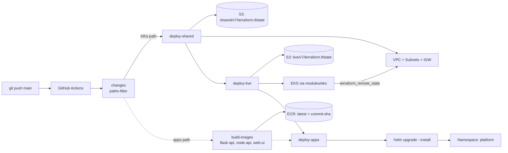
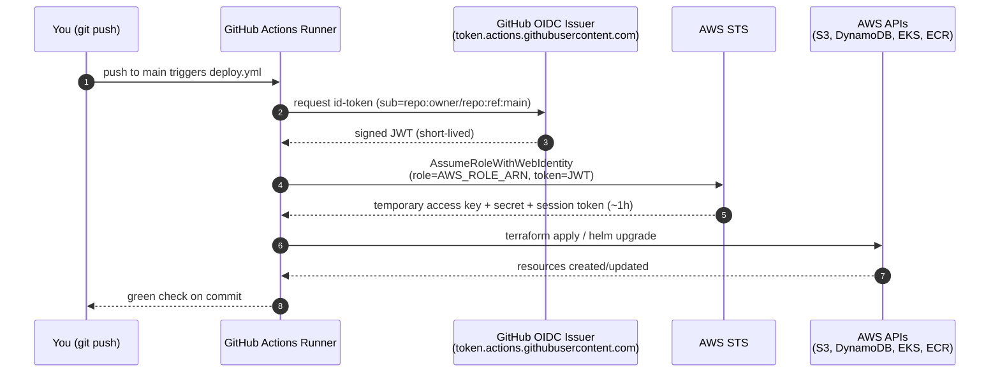

# Express Reliability Platform V7 — Organized Infrastructure and CI/CD

## 1) Builds on V6

Before you start V7, copy your personal V6 repository to your local machine and rename it to V7:

```sh
git clone https://github.com/YOUR_USERNAME/express-reliability-platform-v06.git
mv express-reliability-platform-v06 express-reliability-platform-v07
cd express-reliability-platform-v07
```

Use the main class repository for scripts and canonical structure:

- https://github.com/Here2ServeU/express-reliability-platform-course

## 2) Version Purpose

In Version 6, all your Terraform lives in one folder. That works when you are the only engineer. In a real company with ten engineers, one person changing the EKS node size can accidentally destroy the VPC networking. Or two people run `terraform apply` simultaneously and corrupt the state.

Version 7 separates infrastructure into independent **layers** — network in one folder, compute in another. Each layer has its own state file. A problem in one layer cannot affect another. Version 7 also adds **GitHub Actions** so every `git push` automatically deploys your platform without any manual commands.

**V7 Goal:** Separate Terraform into `shared` (VPC, network) and `live` (EKS, apps) layers. Connect them with remote state data sources. Automate the complete deployment with a three-job GitHub Actions pipeline.

---

## 3) Plain Language Context

**The skyscraper construction analogy.** Building a skyscraper takes years. First the foundation — concrete piles driven deep into bedrock. Then the structural steel frame. Then floors. Then interior finishings. Each phase builds on the previous one, and each floor is independent: you can renovate the 30th floor without touching the 15th floor or the foundation.

Cloud infrastructure should work the same way. The VPC (your network foundation) is built once and changed rarely. The EKS cluster (a floor) is rebuilt more frequently as you iterate. The application layer (tenant improvements) changes every deployment. Each layer is independent, with clear interfaces between them. Problems in one layer cannot cascade to others.

**Key terms in plain language:**

| Term | Plain Language Meaning |
|---|---|
| **Layer separation** | Each Terraform folder manages one layer. Each has its own state file. Changes to one cannot corrupt another. |
| **Bootstrap layer** | The state backend itself: S3 bucket, DynamoDB lock table, and ECR repos. Built once before any other layer. |
| **Shared layer** | The network foundation: VPC, subnets, internet gateway. Built once. Referenced by everything else. |
| **Live layer** | The compute layer: EKS cluster, ALB, node groups. Rebuilt frequently as you iterate. |
| **Remote state** | A Terraform data source that reads outputs from another layer's S3 state file. |
| **State isolation** | Each layer's state lives at a different S3 key. Destroying `live` state does not affect `shared` state. |
| **Promotion order** | Always deploy bottom-up: `bootstrap` → `shared` → `live`. Always destroy top-down: `live` → `shared` → `bootstrap`. |
| **GitHub Actions** | GitHub's built-in CI/CD. Runs YAML-defined workflows triggered by `git push`. |
| **Workflow** | A `.github/workflows/FILENAME.yml` file defining jobs and their steps. |
| **Job** | One unit of work in a workflow. Runs on a fresh Ubuntu VM. Can depend on other jobs. |
| **Step** | One action within a job. Either a shell command (`run:`) or a reusable action (`uses:`). |
| **needs: deploy-shared** | This job waits for `deploy-shared` to succeed before starting. Enforces correct order. |
| **OIDC authentication** | Passwordless AWS auth. GitHub gets a token AWS trusts. No keys stored in GitHub. |
| **id-token: write** | Permission required for OIDC. Allows the job to request a GitHub identity token. |
| **secrets.AWS_ROLE_ARN** | A GitHub Secret holding the IAM role ARN. Set in Repository → Settings → Secrets. |

**Expected result at the end of this version:**

- S3 holds two independent state files: `shared/v7/terraform.tfstate` and `live/v7/terraform.tfstate`.
- `terraform -chdir=terraform/shared output` returns `vpc_id` and subnet IDs.
- `terraform -chdir=terraform/live output` returns `cluster_name` and `cluster_endpoint` sourced from `shared` via remote state.
- A `git push` to `main` runs three GitHub Actions jobs in sequence: `deploy-shared → deploy-live → deploy-apps`.
- `terraform -chdir=terraform/shared destroy` **fails** while `live` is still alive — proving state isolation is enforced.

---

## 4) Training Workflow (Understand → Build → Test → Break → Fix → Explain → Automate → Improve)

1. **Understand:** Read layer separation, remote state, and destroy-order rules.
2. **Build:** `terraform apply` on `bootstrap`, `shared`, then `live`; deploy Helm charts into the `platform` namespace.
3. **Test:** Verify two distinct state files in S3, outputs wire through remote state, and the pipeline runs green.
4. **Break:** Attempt `terraform destroy` on `shared` while `live` depends on it — confirm Terraform refuses.
5. **Fix:** Destroy in the correct order (Helm → live → shared → bootstrap).
6. **Explain:** Capture why layer isolation matters and what remote state actually does at the file-system level.
7. **Automate:** Let the three-job GitHub Actions pipeline own the deploy path. No local `terraform apply` on `main`.
8. **Improve:** Tighten IAM role trust policy, add plan-only PR workflows, split envs further (`dev`, `staging`, `prod`).

## 5) What You Will Build

- `terraform/bootstrap/` — V7's state bucket, DynamoDB lock table, and three ECR repos. Owns `version_suffix = "v07"` so it coexists with V5/V6 bootstraps on the same AWS account.
- `terraform/shared/` — a VPC with 2 public and 2 private subnets across 2 AZs, IGW, and public route table. Exports `vpc_id` and subnet IDs.
- `terraform/live/` — an EKS cluster launched inside `shared`'s VPC using a `terraform_remote_state` data source.
- `terraform/modules/eks/` — a reusable EKS module consumed by `live` (inputs: `cluster_name`, `kubernetes_version`, `vpc_id`, `subnet_ids`, `node_count`, `instance_type`).
- `.github/workflows/deploy.yml` — a three-job pipeline (`deploy-shared → deploy-live → deploy-apps`) authenticating to AWS via OIDC.
- `scripts/tf_deploy_v7.sh` — local end-to-end deploy: bootstrap → push images → shared → live → Helm.
- `scripts/build_push_images_v7.sh` — standalone image pipeline (overridable `APPS_SRC`).
- `scripts/cleanup_v7.sh` — teardown that enforces the mandatory reverse order and drains the V7 state bucket.

## 6) Architecture Diagram (Mermaid)



## 7) Project Structure

```text
express-reliability-platform-v07/
├── terraform/
│   ├── bootstrap/
│   │   ├── main.tf            ← S3 state bucket + DynamoDB lock table
│   │   ├── ecr.tf             ← 3 ECR repos + lifecycle policy
│   │   └── variables.tf
│   ├── shared/
│   │   ├── main.tf            ← VPC, subnets, IGW, route table + outputs
│   │   └── variables.tf
│   ├── live/
│   │   ├── main.tf            ← reads shared via remote state; uses modules/eks
│   │   └── variables.tf
│   └── modules/
│       └── eks/
│           ├── main.tf        ← cluster, IAM roles, managed node group
│           ├── variables.tf
│           └── outputs.tf
├── helm/
│   ├── flask-api/             ← Chart.yaml, values.yaml, templates/deployment.yaml
│   ├── node-api/
│   └── web-ui/                ← service.type=LoadBalancer
├── apps/
│   ├── flask-api/             ← Python service (Dockerfile + app.py + requirements.txt)
│   ├── node-api/              ← Node service (Dockerfile + index.js + package.json)
│   └── web-ui/index.html      ← V7 incident-operations console
├── .github/
│   └── workflows/
│       └── deploy.yml         ← four-job pipeline (changes → build-images, deploy-shared, deploy-live → deploy-apps) with OIDC
├── scripts/
│   ├── tf_deploy_v7.sh        ← local end-to-end deploy
│   ├── build_push_images_v7.sh
│   └── cleanup_v7.sh
└── README.md
```

## 8) Run Steps

### Local apply (first time or when iterating)

```sh
# One command provisions everything:
# bootstrap → image build/push → shared → live → Helm
./scripts/tf_deploy_v7.sh
```

The script is idempotent — re-run it after a code change and it rebuilds, repushes, and rolls forward.

#### Manual walkthrough (the same steps the script does)

```sh
# 1. Bootstrap — state bucket, lock table, ECR repos
terraform -chdir=terraform/bootstrap init
terraform -chdir=terraform/bootstrap apply -auto-approve

STATE_BUCKET=$(terraform -chdir=terraform/bootstrap output -raw state_bucket)
LOCK_TABLE=$(terraform -chdir=terraform/bootstrap output -raw lock_table)
ECR_BASE=$(terraform -chdir=terraform/bootstrap output -raw ecr_base_uri)

# 2. Build and push images (sources live in this repo's apps/)
./scripts/build_push_images_v7.sh

# 3. Shared layer — VPC + subnets + IGW
terraform -chdir=terraform/shared init -reconfigure \
  -backend-config="bucket=${STATE_BUCKET}" \
  -backend-config="dynamodb_table=${LOCK_TABLE}" \
  -backend-config="key=shared/v7/terraform.tfstate"
terraform -chdir=terraform/shared apply -auto-approve

# 4. Live layer — EKS via the module + remote state
terraform -chdir=terraform/live init -reconfigure \
  -backend-config="bucket=${STATE_BUCKET}" \
  -backend-config="dynamodb_table=${LOCK_TABLE}" \
  -backend-config="key=live/v7/terraform.tfstate"
terraform -chdir=terraform/live apply -auto-approve \
  -var "state_bucket=${STATE_BUCKET}"

# 5. Wire kubectl + install Helm charts
CLUSTER=$(terraform -chdir=terraform/live output -raw cluster_name)
aws eks --region us-east-1 update-kubeconfig --name "$CLUSTER"

for SVC in flask-api node-api web-ui; do
  helm upgrade --install "$SVC" "helm/$SVC" \
    --namespace platform --create-namespace \
    --set image.repository="${ECR_BASE}/${SVC}"
done

kubectl get pods -n platform
```

### Automated apply (every `git push` to `main`)

The bootstrap (state bucket + ECR) is run once locally — the per-push pipeline only manages `shared`, `live`, and `apps`.

#### Why GitHub Actions needs OIDC (and what CI/CD even means here)

CI/CD = **Continuous Integration / Continuous Delivery**. In plain language: every time you `git push`, a robot (GitHub Actions) checks out your code and runs `terraform apply` and `helm upgrade` for you, on a clean Ubuntu VM, with no human typing AWS credentials.

That robot lives on GitHub's servers. It has no AWS access by default. Two ways to give it access:

1. **The bad way — long-lived AWS access keys.** Paste an `AKIA...` access key + secret into a GitHub Secret. It works, but those keys never expire. If anyone leaks the repo settings, gets a malicious PR merged that prints `env`, or compromises a GitHub Actions runner, your AWS account is wide open until you manually rotate the key. This is how most production breaches start.
2. **The good way — OIDC (OpenID Connect).** GitHub gives every workflow run a short-lived signed token (a JWT) that says "this run is from `repo:owner/name`, branch `main`, commit `abc123`." AWS already trusts GitHub as an identity provider. Your IAM role's trust policy says "if a token from GitHub for *my repo* shows up, let it assume me — for one hour." No keys are stored anywhere. Tokens expire. Trust is scoped to one specific repo.

That is what `permissions: id-token: write` and `aws-actions/configure-aws-credentials` are doing in [.github/workflows/deploy.yml](.github/workflows/deploy.yml) — they request the GitHub-issued token and exchange it for temporary AWS credentials.

> **Where this was first set up:** The IAM role and its OIDC trust policy were created back in **V3** (see V3's IAM/OIDC section). V7 *reuses* that same role — `arn:aws:iam::730335276920:role/t2s-gha-eks-deploy-prod`. You should not need to recreate it; you only need to tell *this* repo about it via a GitHub Secret.

#### CI/CD + OIDC visual



No password, no long-lived key, no human in the loop after `git push`.

#### One-time setup: tell this repo about the V3 role

You need exactly one GitHub Secret on this repo: `AWS_ROLE_ARN`, set to the V3 role's ARN.

**Step 1 — get the role ARN.** Use whichever you prefer:

*Option A — AWS Console:*
1. Sign in to the AWS Console for account `730335276920`.
2. Go to **IAM → Roles**.
3. In the search box, type `t2s-gha-eks-deploy-prod`.
4. Click the role. The **ARN** field at the top of the summary is what you want — it should read `arn:aws:iam::730335276920:role/t2s-gha-eks-deploy-prod`.
5. While you are there, click the **Trust relationships** tab and confirm the principal is `token.actions.githubusercontent.com` and the `sub` condition matches your GitHub repo (`repo:<owner>/<repo>:*`). If it does not list your repo, that is why GitHub Actions cannot assume the role — update the condition to include this repo.

*Option B — AWS CLI:*

```sh
# Get the ARN
aws iam get-role \
  --role-name t2s-gha-eks-deploy-prod \
  --query 'Role.Arn' --output text

# Inspect the trust policy (confirm your repo is allowed)
aws iam get-role \
  --role-name t2s-gha-eks-deploy-prod \
  --query 'Role.AssumeRolePolicyDocument' --output json
```

The expected ARN: `arn:aws:iam::730335276920:role/t2s-gha-eks-deploy-prod`.

**Step 2 — set the secret on this repo.**

*Option A — GitHub web UI:*
1. Go to your repo on github.com.
2. **Settings → Secrets and variables → Actions → New repository secret**.
3. **Name:** `AWS_ROLE_ARN` (exact spelling, case-sensitive).
4. **Secret:** `arn:aws:iam::730335276920:role/t2s-gha-eks-deploy-prod`
5. Click **Add secret**.

*Option B — `gh` CLI (faster):*

If you do not already have the GitHub CLI installed, install it for your OS:

- **macOS** (Homebrew):
  ```sh
  brew install gh
  ```
- **Linux** (Debian/Ubuntu):
  ```sh
  sudo apt update && sudo apt install gh -y
  ```
  Fedora/RHEL: `sudo dnf install gh`. Arch: `sudo pacman -S github-cli`. For other distros see https://github.com/cli/cli/blob/trunk/docs/install_linux.md.
- **Windows** (winget, recommended on Windows 11/10):
  ```powershell
  winget install --id GitHub.cli
  ```
  Or with Chocolatey: `choco install gh`. Or with Scoop: `scoop install gh`.

After installing, authenticate once (opens a browser):

```sh
gh auth login
gh --version   # confirm install
```

Then set the secret on this repo (run from inside the cloned repo directory):

```sh
gh secret set AWS_ROLE_ARN \
  --body "arn:aws:iam::730335276920:role/t2s-gha-eks-deploy-prod"

# Verify
gh secret list
```

You should see `AWS_ROLE_ARN` in the listing.

#### Push and watch

```sh
git add .
git commit -m "V7 - organized layers with CI/CD"
git push origin main
```

Watch the run at `Repository → Actions`. You should see three green jobs in order: `deploy-shared → deploy-live → deploy-apps`.

If `deploy-shared` fails immediately with `Could not load credentials from any providers`, the OIDC handshake failed — re-check Step 1 (role ARN spelled correctly, trust policy lists this repo) and Step 2 (secret name is exactly `AWS_ROLE_ARN`).

## 9) Validation Checklist — Six Checks

All six checks must pass before moving on to V8.

- [ ] **Check 1 — Separate state files in S3:** `aws s3 ls s3://reliability-platform-v07-tfstate-$ACCOUNT/ --recursive | grep tfstate` lists both `shared/v7/terraform.tfstate` and `live/v7/terraform.tfstate`.
- [ ] **Check 2 — Shared outputs available:** `terraform -chdir=terraform/shared output` shows `vpc_id`, `public_subnet_ids`, `private_subnet_ids`.
- [ ] **Check 3 — Live used shared's VPC:** `terraform -chdir=terraform/live output` shows `cluster_name` and `cluster_endpoint`.
- [ ] **Check 4 — GitHub Actions pipeline ran:** Three jobs (`deploy-shared → deploy-live → deploy-apps`) show green checkmarks on the `main` branch.
- [ ] **Check 5 — State isolation proof:** `terraform -chdir=terraform/shared destroy -auto-approve` **fails** with an error showing `live` resources still reference `shared`'s VPC.
- [ ] **Check 6 — Module works:** `terraform -chdir=terraform/live state list | grep module` lists `module.eks.*` resources.

## 10) Troubleshooting

- **`Error acquiring the state lock`:** Another apply is in flight. Wait, or release with `terraform force-unlock <LOCK_ID>` only after confirming no active run.
- **`data.terraform_remote_state.shared.outputs.vpc_id is null`:** `shared` has not been applied yet, or the `key`/`bucket` in the remote state block does not match the `shared` backend. Pass `-var state_bucket=<bucket>` to live, or replace `YOUR_ACCOUNT_ID` in the literal default.
- **GitHub Actions job: `Error: Could not assume role`:** The `AWS_ROLE_ARN` secret is missing, or the role's trust policy does not allow your repo + branch via GitHub OIDC.
- **`deploy-apps` job: `kubectl` cannot connect:** The `aws eks update-kubeconfig` step failed — check the cluster name matches the `live` output.
- **`deploy-apps` pods stuck in `ImagePullBackOff`:** ECR is empty for at least one of the three services. The pipeline's `build-images` job pushes images on any push that touches `apps/` or the workflow file. If the failing run was Terraform-only, the build step was skipped on purpose — push an empty commit to `apps/` (or run `./scripts/build_push_images_v7.sh` locally) to populate ECR. The `Diagnose failed rollout` step in the CI log will print the exact missing image reference.
- **`terraform destroy` on `shared` fails with VPC dependency errors:** Correct. Destroy `live` first. This is the state isolation guarantee working as designed.

## 11) Cleanup — Mandatory Reverse Order

**Destroy order is mandatory: Helm → live → shared → bootstrap.**
Never destroy `shared` before `live`. `live` reads `shared`'s remote state during its own destroy; destroying `shared` first causes `live`'s destroy to fail with confusing errors.

```sh
chmod +x scripts/cleanup_v7.sh
./scripts/cleanup_v7.sh
```

The script uninstalls Helm releases, deletes the `platform` namespace, reaps any orphan AWS load balancers, destroys `live`, destroys `shared`, drains the V7 state bucket, destroys `bootstrap` (including ECR repos and pushed images), and cleans up the kubectl context.

V5 and V6 bootstraps (if present) are left untouched.

## 12) Next Version Preview

In V8, you layer AIOps patterns on top of this CI/CD foundation — risk scoring on deploys, pattern detection across incidents, and auto-generated incident summaries pulled from logs and metrics.

---

## 13) Web UI Guide — `apps/web-ui/index.html`

### Platform Continuity

The V7 UI keeps the same V2 regulated readiness console and evolves it with incident operations, SLOs, runbooks, and recovery evidence checks. Students should experience this as the same platform growing, not as a separate app.

### What the V7 UI Does

The V7 `index.html` is the operational excellence console. It shows whether the platform team can detect, explain, escalate, fix, and prove recovery during an incident.

The page checks:

- Reliability through SLOs, SLIs, and tested runbooks.
- Cost efficiency through incident cost visibility and reduced operational waste.
- Security and compliance through auditable response evidence.
- Intelligence readiness through structured incident data that can feed AIOps in V8.

### What It Is Used For

Use the V7 UI when students begin talking like platform operators, not only builders. A regulated organization needs a repeatable operating model: who responds, what runbook is followed, what evidence is captured, and how recovery is validated.

This UI is useful for:

- Practicing incident-readiness walkthroughs.
- Explaining SLO and SLI ownership.
- Connecting runbooks to audit evidence.
- Preparing students for automated AIOps triage in V8.

### How to Read the Results

The UI generates an incident operations scorecard.

| Field | Meaning |
|---|---|
| `scenario` | The incident scenario being evaluated. |
| `readiness_score` | Overall operational readiness score. |
| `readiness_band` | Plain-language result of the assessment. |
| `domains.reliability` | Drops when runbooks or SLOs are missing. |
| `domains.cost_efficiency` | Reflects how well incidents are controlled and documented. |
| `domains.security_compliance` | Drops when evidence is missing or incomplete. |
| `domains.intelligence_aiops_mlops` | Improves when incident data is structured and ready for automation. |

For regulated environments, a strong V7 result should show tested runbooks, defined SLOs, and complete recovery evidence.
