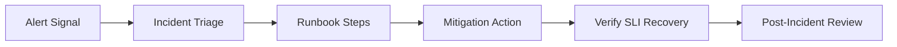

# Express Reliability Platform V7 — Enterprise Reliability Operations

## 1) Version Purpose

Translate infrastructure maturity into operational maturity: runbooks, incident response, SLO/SLI thinking, and disaster recovery basics.

## 2) Chapters Covered

- Chapter 14: Runbooks + Incident Response (SLOs/SLIs, on-call mindset, DR basics)

## 3) What You Will Build

- A practical incident response workflow tied to your platform environments.
- Operational checklists that guide detection, triage, mitigation, and recovery.

## 4) Architecture Diagram (Mermaid)



## 5) Project Structure

```text
express-reliability-platform-v07/
├── environments/
│   ├── live/
│   └── shared/
├── infrastructure/
│   └── bootstrap/
├── modules/
│   ├── alb/
│   ├── eks/
│   ├── iam/
│   └── vpc/
├── scripts/
│   └── terraform_init_apply.sh
└── README.md
```

## 6) Run Steps

1. Deploy platform baseline with Terraform helper script.
2. Define SLI targets (latency, error rate, availability).
3. Create incident severity levels and escalation path.
4. Practice one incident drill end-to-end:
   - detect
   - classify
   - mitigate
   - recover
   - document

## 7) Validation Checklist

- [ ] SLO/SLI targets are documented and measurable.
- [ ] At least one runbook exists for a high-impact incident.
- [ ] Drill execution time and communication timeline are captured.
- [ ] Recovery is validated against objective metrics.

## 8) Troubleshooting

- Alert fatigue: tighten thresholds and prioritize critical alerts first.
- Slow incident response: simplify runbook steps and assign clear ownership.
- Noisy metrics: standardize labels and time windows for SLI measurement.

## 9) Cleanup

- Remove temporary test resources and close all drill tickets/issues.

## 10) Next Version Preview

In V8, you introduce AIOps patterns for risk scoring, pattern detection, and faster incident summaries.


