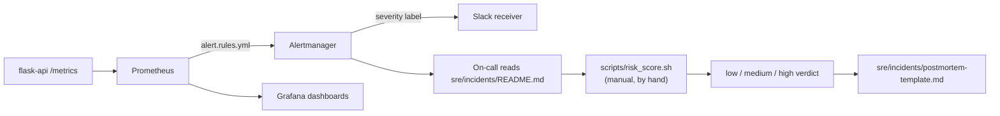
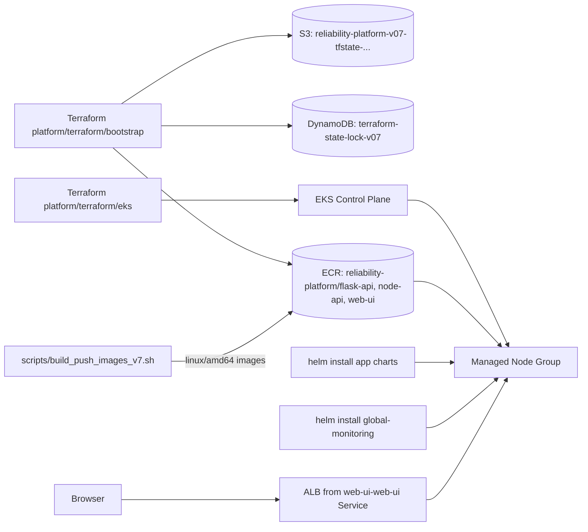

# Express Reliability Platform V7: Monitoring, Incident Response, and an AIOps Introduction

> **What you will build (in one paragraph).** The exact same EKS-on-AWS stack V6 builds — reusable Terraform modules, per-environment tfvars, cost-aware tagging and budgets, three Helm-deployed services — deployed the exact same way, with `scripts/tf_deploy_v7.sh`. On top of that unchanged foundation, V7 adds three new layers: a **monitoring stack** (Prometheus, Grafana, Alertmanager) you can run locally in Docker or install into the cluster with Helm; a short **SRE incident-response introduction** (severity levels, roles, a postmortem template); and a **one-script introduction to AIOps-style risk scoring** that turns four incident signals into a 0–100 score. Nothing about V6's deploy path changed — only what sits on top of it. About 30 minutes per env on a fresh AWS account, same run-rate as V6 (~$2.10/day `dev`, ~$5.40/day `prod`) plus a few cents/day if you also run the cloud monitoring stack.

## Table of contents

- [Quick Start (the 4-command path)](#quick-start-the-4-command-path)
- [What's new in V7 (and what stayed exactly the same)](#whats-new-in-v7-and-what-stayed-exactly-the-same)
- [Modules overview](#modules-overview)
- [Per-environment deploy](#per-environment-deploy)
- [Cost guardrails](#cost-guardrails)
- [Prerequisites](#prerequisites)
- [Deploy](#deploy)
  - [Path A: Scripted (recommended)](#path-a-scripted-recommended)
  - [Path B: Manual walkthrough](#path-b-manual-walkthrough)
- [Local monitoring stack](#local-monitoring-stack)
- [Validate the platform](#validate-the-platform)
- [Incident-response practice](#incident-response-practice)
- [Operate (rolling updates, rollback, scaling)](#operate-rolling-updates-rollback-scaling)
- [Cleanup](#cleanup)
- [Reference](#reference)
  - [Project structure](#project-structure)
  - [Configuration reference](#configuration-reference)
  - [Architecture diagrams](#architecture-diagrams)
  - [Web UI guide](#web-ui-guide)
  - [Troubleshooting](#troubleshooting)
- [What's next: V8](#whats-next-v8)

---

## Quick Start (the 4-command path)

> Use this if you've already done V6 and just want a working V7 cluster plus monitoring. If anything goes wrong, jump to [Troubleshooting](#troubleshooting).

```sh
cd express-reliability-platform-v07

# 1. One command provisions a sized environment + the app + monitoring. Default is dev.
ENV=dev  ./scripts/tf_deploy_v7.sh   # 1× t3.medium, $50/mo budget
# ENV=prod ./scripts/tf_deploy_v7.sh  # 3× t3.medium, $300/mo budget

# 2. Get the public URL (~25 minutes after step 1 starts; ALB takes 60-90s)
kubectl get svc web-ui-web-ui -n platform \
  -o jsonpath='{.status.loadBalancer.ingress[0].hostname}'

# When you get the public URL, ensure to add http://Public_URL

# 3. Try the risk-scoring intro against a simulated bad incident
./scripts/risk_score.sh 650 1.8 1 2

# 4. When done: destroy this env (the other env's state stays put)
ENV=dev ./scripts/cleanup_v7.sh
```

Prefer to stay local? Skip straight to the [local monitoring stack](#local-monitoring-stack) — `docker compose up --build -d` brings up `flask-api`, `web-ui`, `prometheus`, `grafana`, and `alertmanager` with no AWS account required.

**You'll know it worked when** `curl -I http://<the-hostname>` returns `HTTP/1.1 200 OK`, `kubectl get pods -n platform` shows 6 pods all `Running 1/1`, and `kubectl get pods -n monitoring` shows the Prometheus/Grafana/Alertmanager pods `Running`.

---

## What's new in V7 (and what stayed exactly the same)

V6 gave you modular, repeatable, cost-aware infrastructure — but standing up a cluster is only half the reliability story. Once it's running, someone has to *notice* when it's unhealthy, *decide* how bad that is, and *know what to do next*. V7 is the first version to close that loop, deliberately kept small: this is an introduction, not the full incident-management system later versions build.

**Unchanged from V6, byte-for-byte in structure:** `platform/terraform/{bootstrap,eks,modules/{vpc,eks-iam,eks-cluster,budget}}`, `platform/helm/{flask-api,node-api,web-ui}`, and the `tf_deploy_v7.sh` / `build_push_images_v7.sh` / `cleanup_v7.sh` script trio. If you've deployed V6, you already know how to deploy V7 — only the version suffix (`v07`) and a couple of CIDR blocks differ. See [Modules overview](#modules-overview) and [Per-environment deploy](#per-environment-deploy) below; they're V6's sections with the numbers updated.

**New layers added on top:**

| Layer | What it is | Where it lives |
|---|---|---|
| **Monitoring** | Prometheus (metrics + alert rules), Grafana (two dashboards), Alertmanager (routing). Runs locally via Docker Compose or in-cluster via the `kube-prometheus-stack` Helm chart, with dashboards loaded from the `grafana-dashboards` chart. | [`monitoring/`](monitoring/), [`docker-compose.yml`](docker-compose.yml), [`platform/helm/global-monitoring/`](platform/helm/global-monitoring/), [`platform/helm/grafana-dashboards/`](platform/helm/grafana-dashboards/) |
| **SRE incident response (intro)** | Severity levels, on-call roles, the detect→triage→mitigate→resolve→postmortem loop, and a blameless postmortem template. | [`sre/incidents/`](sre/incidents/) |
| **AIOps risk scoring (intro)** | One script, four `if` blocks, no JSON evidence file, no Slack integration, no rules file to keep in sync — just enough to introduce the concept of turning signals into a score. | [`scripts/risk_score.sh`](scripts/risk_score.sh) |

**Why introductions, not full systems.** A full AIOps pipeline (JSON evidence per incident, automatic Slack paging, `dev → staging → prod` promotion guardrails) and a full incident-management system (ticket creation, chaos drills, ITSM integration) are real, valuable things — later versions of this course build them. Bolting all of that onto V7 before you've even watched a dashboard fire an alert would be building automation for a process you haven't practiced by hand yet. V7's job is to get metrics flowing and put the *concepts* in front of you: severity, triage, a risk score you can compute by hand. V8+ automates what you now understand.

### Glossary (V7 additions only — see V6's README for the module/tfvars/tagging vocabulary, unchanged here)

| Term | Plain-language meaning |
|---|---|
| **Golden signals** | The four things that describe whether a service is healthy: latency, traffic, errors, saturation. `monitoring/grafana-dashboard-golden-signals.json` has one panel per signal. |
| **Alert rule** | A Prometheus expression that, when true for a sustained period (`for:`), fires an alert. `monitoring/alert.rules.yml` has three: `ServiceDown`, `HighErrorRate`, `HighLatency`. |
| **Alertmanager** | The Prometheus component that receives firing alerts and routes them somewhere (Slack, email, a webhook) based on labels like `severity`. |
| **Risk score** | A 0–100 number built from four transparent thresholds (latency, error rate, restarts, blast radius). `scripts/risk_score.sh` computes it from arguments you pass in by hand. |
| **Severity band** | `low` (0–39), `medium` (40–69), `high` (70–100) — the same bands `risk_score.sh` prints and `sre/incidents/README.md` explains how to act on. |
| **Postmortem** | A written, blameless account of an incident: what happened, the timeline, the root cause, what fixed it, and follow-up actions. Template: [`sre/incidents/postmortem-template.md`](sre/incidents/postmortem-template.md). |

---

## Modules overview

Identical to V6 — same four modules, same contracts, just deployed under V7's own bootstrap/state.

| Module | Purpose | Key inputs | Key outputs |
|---|---|---|---|
| [`modules/vpc`](platform/terraform/modules/vpc) | VPC, IGW, public subnets across N AZs, route table | `cidr_block`, `cluster_name`, `name_prefix` | `vpc_id`, `public_subnet_ids` |
| [`modules/eks-iam`](platform/terraform/modules/eks-iam) | Cluster + node IAM roles with the four AWS-managed policies attached | `name_prefix` | `cluster_role_arn`, `node_role_arn` |
| [`modules/eks-cluster`](platform/terraform/modules/eks-cluster) | EKS control plane + managed node group | `cluster_name`, `kubernetes_version`, `subnet_ids`, role ARNs, sizing | `cluster_name`, `cluster_endpoint` |
| [`modules/budget`](platform/terraform/modules/budget) | Per-env `aws_budgets_budget` with 80%/100% email alerts | `monthly_limit_usd`, `alert_email`, `cost_filter_tags` | `budget_name`, `budget_id` |

The root [`eks/main.tf`](platform/terraform/eks/main.tf) is the same thin composition as V6: provider `default_tags`, an untagged provider alias for the budget module (see V6's README for why), and four `module` calls. Nothing here changed except `version_suffix` flowing through to `v07`.

---

## Per-environment deploy

Same two ready-to-apply environments as V6 — `dev` and `prod` — with V7's own CIDR blocks so it can coexist with a still-running V6 stack on the same account.

| Setting | `dev.tfvars` | `prod.tfvars` |
|---|---|---|
| `vpc_cidr` | `10.45.0.0/16` | `10.46.0.0/16` (peerable with dev) |
| `node_instance_types` | `["t3.medium"]` | `["t3.medium"]` |
| `node_desired_size` / `min` / `max` | `1` / `1` / `2` | `3` / `2` / `6` |
| `monthly_budget_usd` | `50` | `300` |
| State key | `eks/v7/dev/terraform.tfstate` | `eks/v7/prod/terraform.tfstate` |
| Cluster name | `reliability-platform-dev` | `reliability-platform-prod` |

```sh
ENV=dev  ./scripts/tf_deploy_v7.sh
ENV=prod ./scripts/tf_deploy_v7.sh
ENV=dev  ./scripts/cleanup_v7.sh   # tears down only dev; prod is untouched
```

**State separation, IAM naming, adding a `staging` env** — identical mechanics to V6: `-backend-config="key=eks/v7/${ENV}/terraform.tfstate"`, IAM roles named `reliability-platform-v07-<env>-eks-*-role`, and a new env is just a new tfvars file plus a non-overlapping CIDR. See V6's README section of the same name if you want the full explanation; nothing about the mechanism changed.

---

## Cost guardrails

Unchanged from V6: the same `default_tags` provider block (`Project`, `App`, `Environment`, `Owner`, `CostCenter`, `Version`, `ManagedBy`), the same `aws.untagged` provider alias so the budget module doesn't need `budgets:TagResource`, and the same 80%/100% email-alert budget per environment. V7's `Version` tag reads `v07` instead of `v06`; everything else — including the Cost Allocation Tag activation step and the daily run-rate math — is identical. See V6's README "Cost guardrails" section for the full walkthrough.

New in V7: if you deploy the in-cluster monitoring stack (`platform/helm/global-monitoring`), Prometheus/Grafana/Alertmanager add a small amount of compute to the node group — budget an extra node or bump `node_instance_types` if pods land `Pending` after installing it.

---

## Prerequisites

- [ ] **AWS CLI v2** configured (`aws configure`) with credentials that can create EKS, IAM, EC2, ECR, S3, and DynamoDB.
- [ ] **Docker with `buildx`** running locally — verify with `docker ps`. V7 builds and pushes its own images, and the local monitoring stack runs in Docker Compose.
- [ ] **Terraform ≥ 1.5**.
- [ ] **kubectl ≥ 1.29 and helm ≥ 3.14**:
  ```sh
  # macOS
  brew install kubectl helm

  # Linux
  curl -LO "https://dl.k8s.io/release/$(curl -Ls https://dl.k8s.io/release/stable.txt)/bin/linux/amd64/kubectl"
  chmod +x kubectl && sudo mv kubectl /usr/local/bin/
  curl https://raw.githubusercontent.com/helm/helm/main/scripts/get-helm-3 | bash
  ```
- [ ] **No V6 sources needed.** Unlike V6 (which reads `flask-api`/`node-api` Dockerfiles from V5), V7 ships all three services in its own `apps/` — `build_push_images_v7.sh` builds entirely from this repo.
- [ ] **Make the helper scripts executable** (one time):
  ```sh
  chmod +x scripts/*.sh
  ```

---

## Deploy

V7 owns its full stack: a state backend (S3 + DynamoDB), three ECR repos, an EKS cluster, three Helm app releases, and (new) the monitoring Helm release. V6 does not need to be deployed or even present.

### Path A: Scripted (recommended)

```sh
ENV=dev  ./scripts/tf_deploy_v7.sh   # or ENV=prod
```

**What it runs, in order:**

| # | Step | Time |
|---|---|---|
| 1 | Bootstrap apply: state bucket + lock table + 3 ECR repos (shared across envs) | ~1 min |
| 2 | Build + push 3 `linux/amd64` images to ECR | ~3-5 min |
| 3 | EKS apply with `-var-file=environments/${ENV}.tfvars` and per-env state key | **10-15 min** |
| 4 | Configure kubectl and create the `platform` namespace | <1 min |
| 5 | Helm install all three app charts | ~30s + pod startup |
| 6 | `kubectl rollout restart` so `:latest` images are picked up | ~5s |
| 7 | Wait for all app rollouts to finish | pod startup |
| 8 | **New:** install `grafana-dashboards` (dashboard ConfigMap), then monitoring (`kube-prometheus-stack`) into the `monitoring` namespace | ~1-2 min |
| 9 | Print the public URL | ALB takes 60-90s |

The script is idempotent within an env, and safe to switch `ENV` between runs — same as V6. Set `SKIP_MONITORING=true` to skip step 8 on a re-run where you only want to redeploy the apps.

**You'll know it worked when** the script prints a hostname under "Public URL", `curl -I http://<that-hostname>` returns `HTTP/1.1 200 OK`, and `kubectl get pods -n monitoring` shows Prometheus/Grafana/Alertmanager pods `Running`.

### Path B: Manual walkthrough

Phases 1–6 are identical to V6's manual walkthrough (bootstrap, build/push, EKS apply, kubectl config, Helm install, public URL) — see V6's README for the full phase-by-phase breakdown with expected output at each step. The one addition:

#### New Phase 7: Install monitoring · ~1-2 min

```sh
kubectl create namespace monitoring --dry-run=client -o yaml | kubectl apply -f -

# grafana-dashboards must be installed before kube-prometheus-stack: the
# Grafana pod's dashboardsConfigMaps.default value (in global-monitoring's
# values.yaml) points at this ConfigMap, and its volume mount hangs in
# ContainerCreating if the ConfigMap doesn't exist yet.
helm upgrade --install grafana-dashboards platform/helm/grafana-dashboards \
  --namespace monitoring

helm repo add prometheus-community https://prometheus-community.github.io/helm-charts
helm repo update prometheus-community
helm upgrade --install global-monitoring prometheus-community/kube-prometheus-stack \
  --namespace monitoring --create-namespace \
  -f platform/helm/global-monitoring/values.yaml
```

This installs Prometheus (scraping `flask-api`/`node-api` pods in the `platform` namespace), Grafana, and Alertmanager, using the same alert rules and routing as the local Docker Compose stack — just cluster-wide instead of per-container. `platform/helm/global-monitoring/values.yaml` is values for the community chart, not a standalone chart of its own. `platform/helm/grafana-dashboards/` *is* a real (tiny) chart — it just wraps the two dashboard JSON files in `monitoring/` into a labeled ConfigMap the community chart's sidecar auto-loads.

```sh
kubectl get pods -n monitoring
kubectl port-forward -n monitoring svc/global-monitoring-grafana 3000:80
open http://localhost:3000   # admin / admin
kubectl port-forward -n monitoring svc/global-monitoring-prometheus 9090:9090
open http://localhost:9090/targets   # expect flask-api & node-api UP
```

---

## Local monitoring stack

No AWS account needed — this is entirely Docker Compose, and it's the fastest way to see the golden signals and alert rules in action before paying for EKS.

```sh
docker compose up --build -d
docker compose ps
```

| Service | Image / build | Host port | Purpose |
|---|---|---|---|
| `flask-api` | `apps/flask-api` | `5050` → 5000 | App under test; serves `/`, `/metrics`, `/api/health`, `/health`, `/score`. |
| `web-ui` | `apps/web-ui` | `8080` → 80 | The console; nginx proxies `/api/` → `flask-api` locally (it proxies to `node-api` when deployed via Helm — see [Configuration reference](#configuration-reference)). |
| `prometheus` | `prom/prometheus` | `9090` | Scrapes `monitoring/prometheus.yml` targets; loads `monitoring/alert.rules.yml`; forwards firing alerts to `alertmanager`. |
| `grafana` | `grafana/grafana` | `3001` → 3000 | Login `admin`/`admin`. Add the Prometheus datasource (`http://prometheus:9090`), then import `monitoring/grafana-dashboard.json` and `monitoring/grafana-dashboard-golden-signals.json`. |
| `alertmanager` | `prom/alertmanager` | `9093` | Receives firing alerts, routes per `monitoring/alertmanager/alertmanager.yml`. |

```sh
curl http://localhost:8080/api/health   # {"service":"flask-api","status":"ok","version":"v7"}
curl http://localhost:5050/api/health   # same, hitting flask-api directly
open http://localhost:8080              # the console
open http://localhost:9090/targets      # flask-api should be UP (node-api will be down — no node-api container in this local stack, which is expected)
open http://localhost:9093              # Alertmanager
open http://localhost:3001              # Grafana
```

**Try the risk-scoring intro against the running stack:**

```sh
./scripts/risk_score.sh              # healthy baseline → 0 / low
./scripts/risk_score.sh 650 1.8 1 2  # simulated bad incident → 100 / high
```

Shut it down with `docker compose down` (add `-v` to also drop the Grafana data volume).

---

## Validate the platform

Checks 1–8 are identical to V6's — cluster up, pods running, public URL, health endpoint, self-healing, liveness probe, rolling update, rollback. See V6's README "Validate the platform" section for the full walkthrough with expected output. Two new checks:

### 9. Monitoring is scraping the platform

```sh
kubectl port-forward -n monitoring svc/global-monitoring-prometheus 9090:9090 &
open http://localhost:9090/targets
```
Expect: `flask-api` and `node-api` targets `UP`.

### 10. Risk scoring intro runs

```sh
./scripts/risk_score.sh 650 1.8 1 2
```
Expect: `TOTAL RISK SCORE: 100 / 100` and `VERDICT: HIGH`.

---

## Incident-response practice

This is the "break it on purpose" drill V7 introduces — read [`sre/incidents/README.md`](sre/incidents/README.md) first for the roles/severity vocabulary, then run this against the **local** Docker Compose stack:

```sh
# 1. Break it
docker compose stop flask-api
curl -i http://localhost:8080/api/health     # 502 from nginx — flask-api is gone
open http://localhost:9090/targets            # flask-api now DOWN — ServiceDown alert arms
open http://localhost:9090/alerts             # ServiceDown moves Pending -> Firing after 30s
open http://localhost:9093                     # the firing alert lands in Alertmanager

# 2. Triage: what would risk_score.sh say about this?
./scripts/risk_score.sh 9999 100 1 1   # unreachable service ≈ maximal latency + error rate

# 3. Fix it
docker compose start flask-api
curl http://localhost:8080/api/health         # back to {"status":"ok",...}

# 4. Write it up
cp sre/incidents/postmortem-template.md /tmp/flask-api-outage.md
# fill in: what happened, timeline, root cause, what fixed it, follow-ups
```

This is deliberately manual — no evidence file gets written automatically, no Slack alert fires. The point of V7 is to practice the loop by hand before V8+ automates any of it.

**No Docker Compose? Run the same drill against the deployed EKS cluster instead.** Everything here is `kubectl`, and every view opens in your browser — no local containers involved. Requires the cluster from the [Quick Start](#quick-start-the-4-command-path) to already be up.

```sh
# 0. Grab the public URL once (web-ui is a real LoadBalancer in-cluster, no port-forward needed)
WEB_UI=$(kubectl get svc web-ui-web-ui -n platform \
  -o jsonpath='{.status.loadBalancer.ingress[0].hostname}')

# Prometheus and Alertmanager aren't public — forward them locally
kubectl port-forward -n monitoring svc/global-monitoring-prometheus 9090:9090 &
kubectl port-forward -n monitoring svc/global-monitoring-alertmanager 9093:9093 &

# 1. Break it — scale flask-api to zero (reversible; Helm/replicaCount stays at 2)
kubectl scale deployment/flask-api-flask-api -n platform --replicas=0
curl -i "http://${WEB_UI}/api/health"          # 502/504 — flask-api is gone
open http://localhost:9090/targets              # flask-api pods now DOWN — ServiceDown alert arms
open http://localhost:9090/alerts               # ServiceDown moves Pending -> Firing after 30s
open http://localhost:9093                      # the firing alert lands in Alertmanager

# 2. Triage: what would risk_score.sh say about this?
./scripts/risk_score.sh 9999 100 1 1   # unreachable service ≈ maximal latency + error rate

# 3. Fix it — restore the Helm-defined replica count
kubectl scale deployment/flask-api-flask-api -n platform --replicas=2
kubectl rollout status deployment/flask-api-flask-api -n platform
curl "http://${WEB_UI}/api/health"             # back to {"status":"ok",...}

# 4. Write it up
cp sre/incidents/postmortem-template.md /tmp/flask-api-outage.md
# fill in: what happened, timeline, root cause, what fixed it, follow-ups

# 5. Stop the port-forwards when done
kill %1 %2
```

Same drill, same alert rules, cluster-wide instead of per-container — `kubectl scale --replicas=0` is the EKS equivalent of `docker compose stop`.

---

## Operate (rolling updates, rollback, scaling)

Identical to V6 — same `helm upgrade --set image.tag=...`, same `helm rollback` (never `kubectl rollout undo` on a Helm-managed deployment), same `kubectl scale`. See V6's README "Operate" section; nothing here changed for V7.

---

## Cleanup

### Path A: Scripted (recommended)

```sh
ENV=dev  ./scripts/cleanup_v7.sh   # tear down dev only
ENV=prod ./scripts/cleanup_v7.sh   # tear down prod only
```

Same mechanics as V6's cleanup script (Helm uninstall, namespace delete, orphan-ELB reaping, env-scoped EKS destroy, bootstrap destroy only when no other env's state remains) — plus one addition: it also uninstalls the `global-monitoring` and `grafana-dashboards` Helm releases and deletes the `monitoring` namespace before touching Terraform state. V6's bootstrap and ECR repos are never touched.

Local Docker Compose stack:

```sh
docker compose down      # stop flask-api, web-ui, prometheus, grafana, alertmanager
docker compose down -v   # also drop the grafana-data volume
```

### Path B: Manual

Same as V6's manual cleanup path (Helm/namespace → LB reap → EKS destroy → bootstrap destroy → kubectl context), with `helm uninstall global-monitoring grafana-dashboards -n monitoring` and `kubectl delete namespace monitoring` added before step 1. See V6's README for the full script and the "why" behind the LB-reap and pre-destroy-apply steps — unchanged in V7.

---

## Reference

### Project structure

```text
express-reliability-platform-v07/
├── docker-compose.yml                        ← local stack: flask-api, web-ui, prometheus, grafana, alertmanager
├── apps/
│   ├── flask-api/                            ← Flask service: /, /health, /api/health, /metrics, /score
│   ├── node-api/                             ← Express service: /, /health, /api/status, /score
│   └── web-ui/
│       ├── index.html                        ← V2-lineage readiness console (all versions, version picker)
│       ├── nginx.conf.template                ← envsubst template; API_UPSTREAM picks flask-api (local) or node-api (k8s)
│       └── Dockerfile
├── monitoring/
│   ├── prometheus.yml                        ← scrape config; routes alerts to alertmanager:9093
│   ├── alert.rules.yml                       ← ServiceDown / HighErrorRate / HighLatency
│   ├── alertmanager/
│   │   └── alertmanager.yml                  ← alert routing + Slack receiver
│   ├── grafana-dashboard.json                ← platform overview dashboard
│   └── grafana-dashboard-golden-signals.json ← latency / traffic / errors / saturation
├── sre/
│   └── incidents/
│       ├── README.md                         ← severity levels, roles, the detect→...→postmortem loop
│       └── postmortem-template.md
├── platform/
│   ├── helm/
│   │   ├── flask-api/                        ← Chart.yaml, values.yaml, templates/deployment.yaml
│   │   ├── node-api/
│   │   ├── web-ui/                           ← service.type=LoadBalancer
│   │   ├── global-monitoring/                ← values.yaml for the community kube-prometheus-stack chart
│   │   └── grafana-dashboards/                ← real chart: ConfigMap wrapping monitoring/*.json for Grafana's sidecar
│   └── terraform/
│       ├── bootstrap/                        ← state backend + ECR (shared across envs)
│       │   ├── main.tf  ecr.tf  variables.tf
│       ├── modules/                          ← reusable, single-concern modules (identical to V6)
│       │   ├── vpc/  eks-iam/  eks-cluster/  budget/
│       └── eks/                              ← thin root composition (uses modules/)
│           ├── main.tf  variables.tf
│           └── environments/
│               ├── dev.tfvars
│               └── prod.tfvars
├── scripts/
│   ├── tf_deploy_v7.sh                       ← ENV=dev|staging|prod end-to-end deploy + monitoring
│   ├── build_push_images_v7.sh               ← image pipeline (all three services from this repo's apps/)
│   ├── cleanup_v7.sh                         ← ENV=dev|staging|prod env-scoped teardown
│   └── risk_score.sh                         ← AIOps risk-scoring introduction
├── .github/
│   └── workflows/
│       └── provision.yml                     ← bootstrap / terraform-eks / helm-deploy / notify
├── .gitignore
└── README.md
```

### Configuration reference

#### 1. Helm chart values

Same shape as V6, and (for `flask-api`/`node-api`/`web-ui`) identical values — this didn't change in V7.

| Key | `flask-api` | `node-api` | `web-ui` |
|---|---|---|---|
| `replicaCount` | `2` | `2` | `2` |
| `service.type` | `ClusterIP` | `ClusterIP` | `LoadBalancer` |
| `service.port` | `5000` | `3000` | `80` |
| `resources.requests` | `100m` / `128Mi` | `100m` / `128Mi` | `50m` / `64Mi` |
| `resources.limits` | `500m` / `256Mi` | `500m` / `256Mi` | `250m` / `128Mi` |
| `probes.liveness.path` | `/health` | `/health` | `/` |
| `probes.liveness.initialDelaySeconds` | `30` | `30` | `15` |
| `probes.readiness.path` | `/health` | `/health` | `/` |
| `probes.readiness.initialDelaySeconds` | `10` | `10` | `5` |

`image.repository` is always overridden by `--set image.repository=${ECR_BASE}/<svc>` from the deploy script — see V6's README "Helm chart values" section for the full table (probe periods/thresholds, override examples) and why the placeholder account ID in `values.yaml` is intentional.

**`platform/helm/global-monitoring/values.yaml`** is new in V7: it's values for the community `prometheus-community/kube-prometheus-stack` chart, not a chart of its own. Edit it to change scrape targets, alert routing, or the Grafana admin password before deploying to a real environment (the default `admin`/`admin` is fine for this course, not for anything else).

**`platform/helm/grafana-dashboards/`** is new in V7 too, and unlike `global-monitoring/` it *is* a real chart (`Chart.yaml` + one templated ConfigMap). It packages `monitoring/grafana-dashboard.json` and `monitoring/grafana-dashboard-golden-signals.json` (copied into the chart's own `dashboards/` folder — Helm's `.Files.Get` can't read outside the chart directory) as a `grafana_dashboard: "1"`-labeled ConfigMap that the community chart's sidecar auto-discovers. It must be installed before `global-monitoring`, or the Grafana pod hangs in `ContainerCreating` waiting for a ConfigMap that doesn't exist yet. If you edit a dashboard JSON, copy the updated file into `platform/helm/grafana-dashboards/dashboards/` too and re-run `helm upgrade --install grafana-dashboards platform/helm/grafana-dashboards -n monitoring`.

#### 2. Terraform variables

Identical variable set to V6 — `aws_region`, `project_name`, `version_suffix` (now `v07`), `environment`, `owner`, `cost_center`, `vpc_cidr`, `kubernetes_version`, `node_instance_types`, `node_desired_size`/`min`/`max`, `monthly_budget_usd`, `budget_alert_email`. See V6's README "Terraform variables" section for the full table with defaults and when-to-change guidance — nothing here changed except the values in `dev.tfvars`/`prod.tfvars` (see [Per-environment deploy](#per-environment-deploy)).

#### 3. Script environment variables

| Script | Variable | Default | Purpose |
|---|---|---|---|
| [`build_push_images_v7.sh`](scripts/build_push_images_v7.sh) | (none — reads everything from `platform/terraform/bootstrap` output and `apps/`) | | No `V6_APPS_SRC`-style override needed: all three Dockerfiles live in this repo. |
| [`tf_deploy_v7.sh`](scripts/tf_deploy_v7.sh) | `ENV` | `dev` | Which env to deploy. Picks the tfvars file and the per-env state key. |
| | `SKIP_MONITORING` | `false` | Set `true` to skip installing/upgrading the monitoring Helm release. |
| [`cleanup_v7.sh`](scripts/cleanup_v7.sh) | `ENV` | `dev` | Which env to tear down. Other envs' state is preserved. |
| [`risk_score.sh`](scripts/risk_score.sh) | positional args | `120 0.2 0 0` | `latency_ms error_rate_pct restart_count multi_service_failures`, in that order — all optional, defaulting to a healthy baseline. |

#### 4. Hardcoded values worth knowing about

Same category as V6's table (backend block populated via `-backend-config`, `REGION`/`PROJECT`/`NAMESPACE` at the top of each script, `containerPort` in each chart's `templates/deployment.yaml`) — see V6's README for the full table. One V7-specific addition:

| File | Value | When to edit |
|---|---|---|
| [`apps/web-ui/Dockerfile`](apps/web-ui/Dockerfile) | `ENV API_UPSTREAM=node-api-node-api:3000` | This is nginx's default proxy target for `/api/` — correct for the Helm/k8s deployment (where `node-api-node-api` is the in-cluster service name). `docker-compose.yml` overrides it to `flask-api:5000` for the local stack, which has no `node-api` container. Change the Dockerfile default only if you rename the Helm release. |

### Architecture diagrams

**What's new in V7, on top of V6's cluster:**


```mermaid
flowchart LR
    Metrics[flask-api /metrics] --> Prom[Prometheus]
    Prom -->|alert.rules.yml| AM[Alertmanager]
    AM -->|severity label| Slack[Slack receiver]
    Prom --> Grafana[Grafana dashboards]
    AM --> Human[On-call reads sre/incidents/README.md]
    Human --> Score["scripts/risk_score.sh<br/>(manual, by hand)"]
    Score --> Action[low / medium / high verdict]
    Action --> Postmortem[sre/incidents/postmortem-template.md]
```

**Deploy path — identical shape to V6, `v07` instead of `v06`, plus the monitoring install:**


```mermaid
flowchart LR
    Boot[Terraform platform/terraform/bootstrap] --> S3[(S3: reliability-platform-v07-tfstate-...)]
    Boot --> DDB[(DynamoDB: terraform-state-lock-v07)]
    Boot --> ECR[(ECR: reliability-platform/flask-api, node-api, web-ui)]
    Push[scripts/build_push_images_v7.sh] -->|linux/amd64 images| ECR
    TF[Terraform platform/terraform/eks] --> EKS[EKS Control Plane]
    EKS --> NG[Managed Node Group]
    ECR --> NG
    Helm1[helm install app charts] --> NG
    Helm2[helm install global-monitoring] --> NG
    User[Browser] --> ALB[ALB from web-ui-web-ui Service]
    ALB --> NG
```

### Web UI guide

`apps/web-ui/index.html` is the same client-side, self-contained readiness console every version of this course shares — a version picker (V1 through Capstone) that recomputes a simulated readiness score from three dropdowns (evidence, automation, governance quality) with no backend calls. It is **not** wired to `flask-api`/`node-api` or to real incident signals; the "AIOps" and "incident response" language in its V7 tile is narrative framing for the version-picker story, not a live integration with `monitoring/` or `scripts/risk_score.sh`.

Selecting V7 in the picker shows:

| Field (in the JSON output) | Meaning |
|---|---|
| `readiness_score` | 0–100 average of the four domain scores below. |
| `readiness_grade` | `production ready` / `controlled pilot` / `needs targeted improvement` / `high risk`. |
| `domains.reliability`, `.cost_efficiency`, `.security_compliance`, `.intelligence_aiops_mlops` | Per-domain scores, adjusted by the evidence/automation/governance dropdowns. |
| `version_adds`, `next` | Narrative text describing what this version adds and what comes next. |

Use it to explain the course's overall arc to a student, not as a live dashboard for this specific V7 deployment — for that, use Grafana (`monitoring/grafana-dashboard*.json`) and Prometheus, which are reading real metrics from real containers.

### Troubleshooting

Identical failure modes to V6 apply unchanged (see V6's README table): `connection refused` from kubectl, nodes stuck `NotReady`, `ImagePullBackOff`, `CrashLoopBackOff`, pods `Pending`, `helm upgrade` hangs, `EXTERNAL-IP` stays `<pending>`, `budgets:TagResource` denial, state lock errors, AMI retirement, `DependencyViolation` on destroy, `BucketNotEmpty` on bootstrap destroy. V7-specific additions:

| Symptom | Cause | Fix |
|---|---|---|
| Health endpoint fails locally | Local stack isn't up | `docker compose up --build -d`, then `docker compose ps`. `http://localhost:8080/api/health` is served by `web-ui` (nginx) and proxied to `flask-api`; a `502` means `flask-api` is down — `docker compose up -d flask-api` or check `docker compose logs flask-api`. |
| Port already in use | `8080`/`5050`/`9090`/`3001`/`9093` taken by something else | Stop the other process or edit the port mappings in `docker-compose.yml`. |
| Grafana shows no data / no dashboard | Not auto-provisioned | Log in `admin`/`admin`, add a Prometheus datasource (`http://prometheus:9090`), import both `monitoring/grafana-dashboard*.json` files via **Dashboards → New → Import**. |
| `node-api` target `DOWN` in local Prometheus | Expected — the local Docker Compose stack has no `node-api` container | Ignore it, or delete the `node-api` job from `monitoring/prometheus.yml`. It's `UP` when scraped in-cluster via `global-monitoring`. |
| `web-ui` proxies `/api/` to the wrong place | `API_UPSTREAM` mismatch | Local (Compose) should be `flask-api:5000` (set in `docker-compose.yml`); in-cluster (Helm) should be `node-api-node-api:3000` (the Dockerfile default). Don't edit one to match the other. |
| `risk_score.sh` always prints `LOW` | Arguments in the wrong order, or none passed | Order is `latency_ms error_rate_pct restart_count multi_service_failures`. Run with no args to confirm the healthy baseline, then pass real numbers. |
| `helm upgrade --install global-monitoring` fails with "chart not found" | Repo not added/updated | `helm repo add prometheus-community https://prometheus-community.github.io/helm-charts && helm repo update prometheus-community`. |

---

## What's next: V8

V8 builds on V7 and adds the GitOps governance layer: Trivy image scanning, OPA Gatekeeper admission policies, Checkov infrastructure scanning, and risk scoring wired directly into the deployment workflow, so unsafe changes are blocked before they ever reach the cluster. The full incident pipeline this version only introduced by hand — evidence files, Slack paging, ServiceNow/Jira tickets, chaos drills — is built out in V9.
