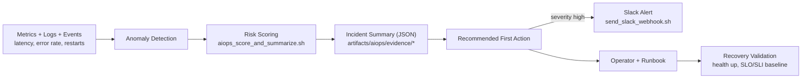

# Express Reliability Platform V8 — AIOps Incident Management

## 1) Builds on V7

Before you start V8, copy your personal V7 repository to your local machine and rename it to V8:

```sh
git clone https://github.com/YOUR_USERNAME/express-reliability-platform-v07.git
mv express-reliability-platform-v07 express-reliability-platform-v08
cd express-reliability-platform-v08
```

Use the main class repository for scripts and canonical structure:

- https://github.com/Here2ServeU/express-reliability-platform-course

## 2) Version Purpose

In Version 7 you organized infrastructure into independent layers and let GitHub Actions deploy them on every `git push`. The platform is now structured and automated — but when something breaks at 2 a.m., a human still has to read every alert and decide what matters.

Version 8 adds **AIOps incident management**: you take your platform's health signals (latency, error rate, restarts, blast radius), turn them into a **risk score from 0 to 100**, classify the **severity**, write a **machine-readable incident summary**, and — when the score is high enough — fire a **Slack alert automatically**. You practice this loop locally first, then promote it through `dev → staging → prod` with guardrails.

**V8 Goal:** Convert raw signals into a scored, summarized, and routed incident — with a JSON evidence file written for every run and Slack notification wired into the scoring script.

---

## 3) Plain Language Context

**The emergency-room triage analogy.** A triage nurse takes every patient's vital signs, assigns a priority number (1 = immediate, 5 = can wait), and hands the doctor a card: *"Priority 2. Elevated heart rate and blood pressure. Recommend ECG."* The doctor doesn't re-check every patient — they trust the triage.

V8 builds the same thing for your platform. Instead of patients you have services. Instead of vital signs you have latency, error rate, restart count, and how many services failed together. The scoring script is the nurse: it reads the numbers, produces a priority (`low` / `medium` / `high`), and hands you a card (`recommended_action`) — and pages the on-call via Slack when the priority is high.

**Why a bank or hospital needs this.** Large regulated organizations receive thousands of monitoring alerts per day. No human team can review each one. AIOps tooling scores every alert, writes evidence for auditors, and surfaces only the ones that need a person — so engineers spend their time fixing real problems instead of reading noise.

**Key terms in plain language:**

| Term | Plain Language Meaning |
|---|---|
| **AIOps** | Using automation and simple decision logic to help operations teams detect, prioritize, and fix incidents faster. |
| **Incident signal** | A measurable sign that something is wrong — high latency, high error rate, pod restarts, multiple services failing. |
| **SLI** | The measured value (for example, p95 latency in milliseconds). |
| **SLO** | The target you promise for an SLI (for example, p95 latency under 500 ms). |
| **Risk score** | A number (0–100 here) estimating how serious an incident is. Built from transparent rules, not guesswork. |
| **Severity band** | `low` (0–39), `medium` (40–69), `high` (70–100) — defined in `artifacts/aiops/risk-rules.yaml`. |
| **Incident summary** | A short, machine-readable report: impacted service, severity, risk score, recommended first action, owner, timestamp. |
| **Evidence file** | The JSON written for every scoring run — your audit trail and your portfolio proof. |
| **Blast radius** | How much of the system a fault affects. Two or more services failing together expands it. |
| **Guardrail** | A safety rule that limits risk during tests — e.g. `prod` tests require `APPROVED_PROD_TEST=true`. |
| **Recovery validation** | Proving the service returned to a healthy state (health endpoint up, SLO/SLI trends back to baseline) after mitigation. |

**Expected result at the end of this version:**

- `./scripts/aiops_score_and_summarize.sh <incident_id> <service> <latency_ms> <error_rate_pct> <restart_count> <multi_service_failures> <owner> <output_file>` writes a JSON evidence file and prints `risk_score=… severity=…`.
- `./scripts/aiops_local_incident_test.sh` checks the local stack's health endpoint, scores an incident, and writes evidence to `artifacts/aiops/evidence/local/*.json`.
- `./scripts/aiops_cloud_incident_test.sh dev …` does the same for a cloud environment and writes to `artifacts/aiops/evidence/cloud/*.json`.
- When `SLACK_WEBHOOK_URL` is exported, every scoring run sends a Slack alert; when it is not, the script prints a dry-run preview instead.
- The cloud test refuses to run against `prod` unless `APPROVED_PROD_TEST=true`.

---

## 4) Training Workflow (Understand → Build → Test → Break → Fix → Explain → Automate → Improve)

1. **Understand:** Read `artifacts/aiops/risk-rules.yaml`, `artifacts/aiops/aiops-incident-management.md`, and the high-demand AIOps engineer blueprint.
2. **Build:** Bring up the local stack (`docker compose up` — flask-api, web-ui, prometheus, grafana, alertmanager) and make the V8 scripts executable.
3. **Test:** Run the local AIOps incident test; confirm a JSON evidence file is written and the score/severity print.
4. **Break:** Stop a service in the local stack on purpose; watch the health endpoint fail.
5. **Fix:** Restart the service, re-run the test, confirm recovery criteria.
6. **Explain:** Write the three answers — what failed, why, what fixed it — for every drill.
7. **Automate:** Let `aiops_score_and_summarize.sh` own scoring + Slack; let GitHub Actions (`.github/workflows/provision.yml`) own the cloud deploy.
8. **Improve:** Tune thresholds in `risk-rules.yaml`, improve summary quality, and drive down mean time to detect / recover.

## 5) Skills That Match High AIOps Engineer Demand

Practiced directly in this version (see `artifacts/aiops/high-demand-aiops-engineer-blueprint.md`):

1. **Observable systems** — collect metrics, logs, events, and health signals.
2. **Fast triage** — move from signal to incident summary in one command.
3. **Risk scoring** — prioritize by impact using transparent rules, not gut feel.
4. **Automation** — generate repeatable, machine-readable incident evidence.
5. **Safe promotion** — validate in `dev`, then `staging`, then `prod` behind guardrails.
6. **Evidence culture** — keep JSON outputs for post-incident review, audit, and portfolio.

## 6) What You Will Build

- A local testing stack — `docker-compose.yml` runs **flask-api**, **web-ui**, **prometheus**, **grafana**, and **alertmanager** so the AIOps scripts have a real platform to poll, score, and break.
- A documented AIOps incident-management approach (`artifacts/aiops/aiops-incident-management.md`).
- A risk-rule set with severity bands (`artifacts/aiops/risk-rules.yaml`).
- A scoring + summary engine that also routes to Slack (`scripts/aiops_score_and_summarize.sh`).
- A local incident-test workflow with health check and evidence output (`scripts/aiops_local_incident_test.sh`).
- A cloud incident-test workflow with environment guardrails (`scripts/aiops_cloud_incident_test.sh`).
- A standalone Slack webhook sender that can format messages from an evidence file (`slack/send_slack_webhook.sh`).
- The carried-forward Terraform layers (`environments/shared`, `environments/live`, `modules/*`, `infrastructure/bootstrap`) and Helm charts (`environments/live/helm/*`), deployable by hand or by the `provision.yml` pipeline.
- The continued V2-lineage web console, now showing AIOps risk scoring (`apps/web-ui/index.html`).

## 7) Architecture Diagram (Mermaid)



## 8) Project Structure

```text
express-reliability-platform-v08/
├── docker-compose.yml                        ← local testing stack: flask-api, web-ui, prometheus, grafana, alertmanager
├── apps/
│   ├── flask-api/                            ← Flask service: /, /metrics, /api/health
│   │   ├── app.py  requirements.txt  Dockerfile
│   └── web-ui/
│       ├── index.html                        ← V8 AIOps incident-intelligence console (V2 lineage)
│       ├── nginx.conf                        ← serves index.html, proxies /api/ -> flask-api
│       └── Dockerfile
├── monitoring/                               ← carried forward from V5
│   ├── prometheus.yml                        ← scrape config; routes alerts to alertmanager:9093
│   ├── alert.rules.yml                       ← ServiceDown / HighErrorRate / HighLatency alerts
│   ├── alertmanager/
│   │   └── alertmanager.yml                  ← alert routing + webhook receiver
│   ├── grafana-dashboard.json                ← platform overview dashboard (import into Grafana)
│   └── grafana-dashboard-golden-signals.json ← golden-signals dashboard (latency / traffic / errors / saturation)
├── artifacts/
│   └── aiops/
│       ├── aiops-incident-management.md      ← the AIOps loop, signals, summary template
│       ├── high-demand-aiops-engineer-blueprint.md
│       ├── risk-rules.yaml                   ← scoring rules + severity bands
│       └── evidence/                         ← generated at runtime
│           ├── local/*.json
│           └── cloud/*.json
├── environments/
│   ├── shared/                               ← shared S3 bucket layer (carried forward)
│   │   ├── main.tf  outputs.tf  variables.tf  shared.tfvars
│   └── live/                                 ← EKS + ALB layer
│       ├── main.tf  outputs.tf  variables.tf  live.tfvars
│       └── helm/
│           ├── fintech-chart/                ← Chart.yaml + values.yaml
│           ├── hospital-chart/
│           ├── ui-chart/
│           ├── ui-portal/
│           └── global-monitoring/            ← Prometheus + Grafana values
├── infrastructure/
│   └── bootstrap/                            ← remote-state bucket + DynamoDB lock + IAM role
│       ├── main.tf  outputs.tf  variables.tf  README.md
├── modules/
│   ├── alb/                                  ← main.tf + variables.tf
│   ├── eks/
│   ├── iam/
│   └── vpc/
├── scripts/
│   ├── aiops_score_and_summarize.sh          ← scores risk, writes JSON, sends Slack if SLACK_WEBHOOK_URL set
│   ├── aiops_local_incident_test.sh          ← health check → score → evidence (local)
│   ├── aiops_cloud_incident_test.sh          ← guardrailed score → evidence (dev/staging/prod)
│   └── terraform_init_apply.sh               ← init + apply a given Terraform dir
├── slack/
│   └── send_slack_webhook.sh                 ← standalone Slack sender; can build a message from an evidence file
├── .github/
│   └── workflows/
│       └── provision.yml                     ← terraform-shared / terraform-live / helm-deploy / notify
├── .gitignore
└── README.md
```

## 9) Scoring Logic (What the Numbers Mean)

`scripts/aiops_score_and_summarize.sh` mirrors `artifacts/aiops/risk-rules.yaml`:

| Condition | Points added |
|---|---|
| `error_rate_pct > 1.0` | +30 |
| `latency_ms > 500` | +30 |
| `restart_count > 0` | +20 |
| `multi_service_failures > 1` | +20 |

Severity bands and the recommended first action:

| Risk score | Severity | Recommended first action |
|---|---|---|
| 0–39 | `low` | Investigate dashboards and watch trends for ~10 minutes. |
| 40–69 | `medium` | Open an incident ticket, assign an owner, apply the first runbook mitigation step. |
| 70–100 | `high` | Declare an incident, start mitigation immediately, trigger on-call escalation (Slack alert fires automatically). |

Each run writes a JSON object with `incident_id`, `service`, the raw signal values, `risk_score`, `severity`, `recommended_action`, `owner`, and `generated_at_utc`.

## 10) Step-by-Step Guide (Local and Cloud)

### Step A — Understand

```sh
cat artifacts/aiops/risk-rules.yaml
cat artifacts/aiops/aiops-incident-management.md
cat artifacts/aiops/high-demand-aiops-engineer-blueprint.md
```

Before building, be able to answer:

1. Which signals indicate an incident, and what point value each carries.
2. How a risk score maps to a severity band.
3. What first action is expected for each severity.

### Step B — Build (Local Setup)

**B1: Prerequisites** — install and verify Docker + Docker Compose, Terraform, AWS CLI, kubectl, Helm, `curl`, and `python3` (used by the Slack sender to parse evidence files).

**B2: Bring up the local testing stack** — `docker-compose.yml` in this repo runs five services:

| Service | Image / build | Host port | Purpose |
|---|---|---|---|
| `flask-api` | `apps/flask-api` | `5050` → 5000 | App under test; serves `/`, `/metrics`, `/api/health`. |
| `web-ui` | `apps/web-ui` | `8080` → 80 | V8 AIOps console; nginx also proxies `/api/` → `flask-api`, so `http://localhost:8080/api/health` works. |
| `prometheus` | `prom/prometheus` | `9090` | Scrapes the app targets in `monitoring/prometheus.yml`; loads `monitoring/alert.rules.yml`; sends firing alerts to `alertmanager`. |
| `grafana` | `grafana/grafana` | `3001` → 3000 | Login `admin` / `admin`. Add the Prometheus datasource (`http://prometheus:9090`), then import `monitoring/grafana-dashboard.json` and `monitoring/grafana-dashboard-golden-signals.json`. |
| `alertmanager` | `prom/alertmanager` | `9093` | Receives firing alerts from Prometheus and routes them per `monitoring/alertmanager/alertmanager.yml`. |

> Note: `monitoring/prometheus.yml` is carried forward from V5 and also lists a `node-api` scrape target. V8 has no `node-api` service, so that target shows as **down** in Prometheus — that is expected. Remove the job from `monitoring/prometheus.yml` if you want a clean targets page.

```sh
docker compose up --build -d
docker compose ps

curl http://localhost:8080/api/health          # {"service":"flask-api","status":"ok","version":"v8"}
curl http://localhost:5050/api/health          # same, hitting flask-api directly
open http://localhost:8080                      # the V8 AIOps console
open http://localhost:9090/targets              # flask-api should be UP (node-api will be down — see note above)
open http://localhost:9093                      # Alertmanager
open http://localhost:3001                      # Grafana (admin / admin) — add the datasource, import the dashboards
```

**B3: Make the V8 scripts executable:**

```sh
chmod +x scripts/aiops_score_and_summarize.sh \
         scripts/aiops_local_incident_test.sh \
         scripts/aiops_cloud_incident_test.sh \
         slack/send_slack_webhook.sh
```

### Step C — Test (Local AIOps)

```sh
./scripts/aiops_local_incident_test.sh http://localhost:8080/api/health flask-api 650 1.8 1 1 local-oncall
```

Argument order: `<api_url> <service> <latency_ms> <error_rate_pct> <restart_count> <multi_service_failures> <owner>`. Every argument is optional and falls back to a default (the default URL is `http://localhost:8080/api/health` and the default service is `flask-api`) — `./scripts/aiops_local_incident_test.sh` alone works too.

What it does:

1. Verifies the health endpoint is reachable (`curl -fsS`).
2. Echoes the incident signal values it will score.
3. Calls `aiops_score_and_summarize.sh` with an auto-generated `incident_id` (`local-<UTC timestamp>`).
4. Writes the evidence file to `artifacts/aiops/evidence/local/<incident_id>.json`.
5. Prints recovery criteria to confirm (health endpoint up, SLO/SLI back to baseline).

Score one incident directly (note the trailing **output file** argument):

```sh
./scripts/aiops_score_and_summarize.sh INC-001 flask-api 650 1.8 1 1 local-oncall artifacts/aiops/evidence/local/INC-001.json
```

#### Slack notifications — complete beginner walkthrough

**What is this?** A Slack *Incoming Webhook* is a private URL. Anything you `POST` to that URL shows up as a message in one Slack channel. That's the whole trick — no bot, no login from the script, just a URL. The V8 scripts use it to page the on-call when an incident scores `high`.

##### Why you might see "nothing in Slack"

There are **two different no-send situations**, and both are normal:

1. **You used `--dry-run`.** The `--dry-run` flag *never* posts to Slack — on purpose. It just prints the message in your terminal so you can check the wording. Example: `./slack/send_slack_webhook.sh --dry-run --message "..."` will *always* be silent in Slack. That is correct behavior.
2. **`SLACK_WEBHOOK_URL` is not set.** If that environment variable is empty, the scripts fall back to dry-run mode automatically and just print the preview. You haven't done anything wrong — you just haven't given it a webhook URL yet.

So before a real message can appear, two things must be true: **you are not passing `--dry-run`**, and **a real webhook URL is available** (via `SLACK_WEBHOOK_URL` or `--url`).

##### Step 1 — Create a Slack Incoming Webhook (one time, ~2 minutes)

1. Open <https://api.slack.com/apps> in a browser (sign in to your Slack workspace if asked).
2. Click **Create New App** → **From scratch**.
3. Give it a name like `erp-aiops-alerts`, pick the workspace you want alerts in, click **Create App**.
4. In the left sidebar click **Incoming Webhooks**, then flip the toggle at the top to **On**.
5. Scroll down, click **Add New Webhook to Workspace**.
6. Pick the channel the alerts should land in (e.g. `#incidents` or just message yourself), click **Allow**.
7. You're back on the Incoming Webhooks page. Under **Webhook URL** click **Copy**. It looks like:
   `https://hooks.slack.com/services/YOUR/WEBHOOK/URL`

> Keep that URL private — anyone who has it can post to your channel. Don't paste it into a public repo or a screenshot.

##### Step 2 — Tell the scripts about your webhook URL

Open a terminal **in this project folder** and run (paste your real URL):

```sh
export SLACK_WEBHOOK_URL='https://hooks.slack.com/services/YOUR/WEBHOOK/URL'
```

Check it actually took:

```sh
echo "$SLACK_WEBHOOK_URL"          # should print your URL, not a blank line
```

> This `export` only lasts for the current terminal window. Open a new tab and you'd have to do it again.

**Make it permanent (recommended):** add the same line to your shell startup file so every new terminal has it.

```sh
echo 'export SLACK_WEBHOOK_URL="https://hooks.slack.com/services/YOUR/WEBHOOK/URL"' >> ~/.zshrc
source ~/.zshrc                    # apply it to the current terminal too
echo "$SLACK_WEBHOOK_URL"          # confirm again
```

(If you use bash instead of zsh, use `~/.bashrc` in place of `~/.zshrc`.)

##### Step 3 — Send a real message

```sh
# 1) Preview only — never touches Slack (safe to run anytime):
./slack/send_slack_webhook.sh --dry-run --message "AIOps test from V8"

# 2) Send for real — needs SLACK_WEBHOOK_URL set (Step 2):
./slack/send_slack_webhook.sh --message "AIOps test from V8"

# 3) Send without exporting anything — pass the URL right on the command line:
./slack/send_slack_webhook.sh --url 'https://hooks.slack.com/services/YOUR/WEBHOOK/URL' --message "AIOps test from V8"

# 4) Build the alert from a real incident evidence file (generate one first so the file exists):
./scripts/aiops_score_and_summarize.sh INC-001 flask-api 650 1.8 1 1 local-oncall artifacts/aiops/evidence/local/INC-001.json
./slack/send_slack_webhook.sh --evidence-file artifacts/aiops/evidence/local/INC-001.json
```

**What success looks like:** the script prints `Slack alert sent.` and the message appears in your chosen channel within a second or two.

**What failure looks like:** it prints `Slack did not accept the message. Response: ...` (or `invalid_token` / `no_service`) and exits with a non-zero status. That almost always means the URL is wrong, was revoked, or has a typo — go back to Step 1 and copy it again. The script is deliberately loud here so a bad URL never *looks* like it worked.

##### Step 4 — Wire it into the incident scoring (automatic alerts)

Once `SLACK_WEBHOOK_URL` is exported (Step 2), the scoring script sends a Slack alert on **every** run — and the wording reflects the severity (`:rotating_light:` for `high`, `:warning:` for `medium`, `:white_check_mark:` for `low`):

```sh
./scripts/aiops_local_incident_test.sh http://localhost:8080/api/health flask-api 650 1.8 1 1 local-oncall
```

If `SLACK_WEBHOOK_URL` is *not* set, that same command instead prints:

```text
[Slack] SLACK_WEBHOOK_URL not set — skipping notification.
        Message that would be sent: <severity> alert for <service> (risk_score=<n>)
```

— which is your cue to go do Step 2.

##### Quick checklist if Slack still shows nothing

- Did you leave off `--dry-run`? (`--dry-run` is *always* silent in Slack — that's its job.)
- Does `echo "$SLACK_WEBHOOK_URL"` print your real `https://hooks.slack.com/services/...` URL in *this* terminal? If it's blank, re-run the `export` (Step 2) or `source ~/.zshrc`.
- Did the script print `Slack alert sent.`? If it printed an error instead, the webhook URL is the problem — recreate/recopy it (Step 1).
- Are you looking in the channel you picked in Step 1.6? The webhook only ever posts to that one channel.
- Is `python3` installed? (`python3 --version`) The sender uses it to build the JSON payload and to parse `--evidence-file`.

### Step D — Break the System (Local Failure Drill)

```sh
docker compose stop flask-api
curl -i http://localhost:8080/api/health     # 502 from nginx — flask-api is gone
open http://localhost:9090/targets            # flask-api now DOWN; the ServiceDown alert arms
open http://localhost:9090/alerts             # ServiceDown moves Pending -> Firing after 30s
open http://localhost:9093                     # the firing alert lands in Alertmanager
```

This is what an incident actually looks like in operations — a dependency goes away and the health check starts failing. Note how `./scripts/aiops_local_incident_test.sh` now fails fast at the `curl -fsS` health check, exactly as it should.

### Step E — Fix the System

```sh
docker compose start flask-api
curl http://localhost:8080/api/health         # back to {"status":"ok",...}
./scripts/aiops_local_incident_test.sh
```

### Step F — Explain What Happened

Document these three answers after every drill:

1. What failed?
2. Why did it fail?
3. What fixed it?

### Step G — Automate

The automation is already in place — your job is to use and extend it:

- `scripts/aiops_score_and_summarize.sh` — scoring + JSON evidence + Slack in one place.
- `scripts/aiops_local_incident_test.sh` / `scripts/aiops_cloud_incident_test.sh` — repeatable test harnesses.
- `.github/workflows/provision.yml` — on every push to `main`, runs `terraform-shared`, `terraform-live`, then `helm-deploy` (fintech, hospital, ui charts), then `notify`. Requires the repo secret `AWS_ROLE_TO_ASSUME` (an IAM role ARN with a GitHub OIDC trust policy — reuse the one from earlier versions).

### Step H — Improve

After each drill:

1. Adjust thresholds and point values in `artifacts/aiops/risk-rules.yaml` (and keep `aiops_score_and_summarize.sh` in sync).
2. Improve the quality of `recommended_action` text for each severity.
3. Track and reduce mean time to detect and mean time to recover across drills.

### Step I — Cloud Deployment and AIOps Testing

**I1: Configure AWS access**

```sh
aws configure
aws sts get-caller-identity
```

**I2: (Optional) Bootstrap remote state** — only if you do not already have a state backend from a prior version:

```sh
terraform -chdir=infrastructure/bootstrap init
terraform -chdir=infrastructure/bootstrap apply -auto-approve
```

**I3: Deploy the shared layer**

```sh
terraform -chdir=environments/shared init
terraform -chdir=environments/shared validate
terraform -chdir=environments/shared plan  -var-file=shared.tfvars
terraform -chdir=environments/shared apply -var-file=shared.tfvars
```

**I4: Fill in live network values** — edit `environments/live/live.tfvars` and replace the placeholders `vpc_id = "vpc-xxxxxxxx"` and the two `subnet-…` entries with real IDs.

**I5: Deploy the live layer (EKS + ALB)**

```sh
terraform -chdir=environments/live init
terraform -chdir=environments/live validate
terraform -chdir=environments/live plan  -var-file=live.tfvars
terraform -chdir=environments/live apply -var-file=live.tfvars
```

**I6: Install Helm charts** (the `provision.yml` pipeline also does this on push):

```sh
aws eks --region us-east-1 update-kubeconfig --name express-reliability-platform-eks-live
helm upgrade --install fintech  ./environments/live/helm/fintech-chart  --namespace fintech  --create-namespace
helm upgrade --install hospital ./environments/live/helm/hospital-chart --namespace hospital --create-namespace
helm upgrade --install ui       ./environments/live/helm/ui-chart       --namespace ui       --create-namespace
```

**I7: Test cloud AIOps in `dev`**

```sh
./scripts/aiops_cloud_incident_test.sh dev node-api 700 2.2 1 2 cloud-oncall
```

Argument order: `<environment> <service> <latency_ms> <error_rate_pct> <restart_count> <multi_service_failures> <owner>`. Valid environments are `dev`, `staging`, `prod` only.

**I8: Promote to `staging`** after a stable recovery in `dev`:

```sh
./scripts/aiops_cloud_incident_test.sh staging node-api 650 1.5 1 1 cloud-oncall
```

**I9: Run a `prod` test only with approval** — the guardrail blocks it otherwise:

```sh
APPROVED_PROD_TEST=true ./scripts/aiops_cloud_incident_test.sh prod node-api 600 1.2 1 1 cloud-oncall
```

Cloud evidence lands in `artifacts/aiops/evidence/cloud/<env>-<timestamp>.json`.

### Step J — Cleanup (Local)

```sh
docker compose down            # stop flask-api, web-ui, prometheus, grafana, alertmanager
docker compose down -v         # also drop the grafana-data volume, if you want a clean slate
```

## 11) Validation Checklist

- [ ] AIOps incident-management notes and risk rules are reviewed (`artifacts/aiops/`).
- [ ] `docker compose up --build -d` brought up `flask-api`, `web-ui`, `prometheus`, `grafana`, and `alertmanager`; `http://localhost:8080/api/health` returns `status: ok` and Prometheus shows `flask-api` UP.
- [ ] `risk-rules.yaml` thresholds and severity bands match `aiops_score_and_summarize.sh`.
- [ ] Local AIOps test ran the health check and wrote a JSON evidence file to `artifacts/aiops/evidence/local/`.
- [ ] Slack dry-run output is visible with no `SLACK_WEBHOOK_URL` set.
- [ ] A real Slack alert fires when `SLACK_WEBHOOK_URL` is exported.
- [ ] `send_slack_webhook.sh --evidence-file …` formats a readable message from a JSON file.
- [ ] Cloud AIOps test wrote `dev` evidence to `artifacts/aiops/evidence/cloud/`.
- [ ] Promotion to `staging` happened only after a stable `dev` recovery.
- [ ] A `prod` test ran only with `APPROVED_PROD_TEST=true`.
- [ ] Every incident summary includes severity, risk score, and a recommended first action.
- [ ] Recovery is tied to SLO/SLI targets (health endpoint up, trends back to baseline).

## 12) Troubleshooting

- **Health endpoint fails locally** — make sure the local stack is up (`docker compose up --build -d` in this repo, then `docker compose ps`). `http://localhost:8080/api/health` is served by `web-ui` (nginx) and proxied to `flask-api`; if it returns `502`, `flask-api` is down — `docker compose up -d flask-api` or check `docker compose logs flask-api`.
- **Port already in use** — `8080`, `5050`, `9090`, `3001`, or `9093` is taken by something else. Stop the other process or edit the port mappings in `docker-compose.yml`.
- **Grafana shows no data / no dashboard** — Grafana is not auto-provisioned in V8. Log in (`admin` / `admin`), add a Prometheus datasource pointing at `http://prometheus:9090`, then import `monitoring/grafana-dashboard.json` and `monitoring/grafana-dashboard-golden-signals.json` via **Dashboards → New → Import**.
- **`node-api` target down in Prometheus** — expected: `monitoring/prometheus.yml` is carried over from V5 and lists a `node-api` job, but V8 ships no `node-api` service. Ignore it or delete that job from `monitoring/prometheus.yml`.
- **No evidence file created** — confirm the scripts are executable (`chmod +x scripts/*.sh slack/*.sh`) and that `aiops_score_and_summarize.sh` received all 8 arguments (the last one is the output file path).
- **Too many high-risk incidents** — tune thresholds / point values in `artifacts/aiops/risk-rules.yaml` and `aiops_score_and_summarize.sh`.
- **Slack message not sending** — verify `SLACK_WEBHOOK_URL` is exported in the current shell; run `slack/send_slack_webhook.sh --dry-run` first to confirm message format; ensure `python3` is installed (the sender uses it to parse evidence and build the JSON payload).
- **`Invalid environment` from the cloud test** — the first argument must be exactly `dev`, `staging`, or `prod`.
- **`Prod tests require APPROVED_PROD_TEST=true`** — set that variable only after a formal approval.
- **Terraform `live` plan/apply fails** — confirm real `vpc_id` and `subnet_ids` are set in `environments/live/live.tfvars` (the defaults are placeholders).
- **GitHub Actions can't reach AWS** — the `AWS_ROLE_TO_ASSUME` repo secret is missing or its IAM role's OIDC trust policy doesn't allow this repo/branch.

## 13) Cloud Cleanup

```sh
terraform -chdir=environments/live   destroy -var-file=live.tfvars
terraform -chdir=environments/shared destroy -var-file=shared.tfvars
```

- Archive everything under `artifacts/aiops/evidence/` (local and cloud) as portfolio proof.
- Record lessons learned and follow-up action items with owners.
- Leave `infrastructure/bootstrap` in place if other versions share that state backend.

## 14) Next Version Preview

In V9 you build on V8 and connect the incident pipeline to real workflow tools — Slack, ServiceNow, Jira — and into chaos-engineering and auto-response loops, so a scored incident doesn't just get a message, it gets a ticket, an owner, and an automated first response.

---

## 15) Web UI Guide — `apps/web-ui/index.html`

### Platform Continuity

The V8 UI keeps the same V2 regulated-readiness console and evolves it with AIOps risk scoring and incident-triage checks. Students should experience this as the same platform growing, not a separate app.

### What the V8 UI Does

The V8 `index.html` is the AIOps incident-intelligence console. It turns incident signals into a risk score, a severity label, and a recommended first action.

The page checks:

- Reliability impact from latency, error rate, and blast radius.
- Cost-efficiency impact from alert noise and operational toil.
- Security and compliance through incident evidence.
- Intelligence maturity through AIOps scoring and summary generation.

### What It Is Used For

Use the V8 UI to explain AIOps in plain language — how an operations team moves from raw signals to prioritized action instead of guessing which alert matters most. Useful for:

- Demonstrating risk scoring from multiple incident inputs.
- Practicing severity classification.
- Explaining how AIOps reduces alert fatigue.
- Preparing for V9's Slack / ServiceNow / Jira / chaos-workflow integration.

### How to Read the Results

The UI generates an AIOps incident scorecard.

| Field | Meaning |
|---|---|
| `service` | The service being evaluated. |
| `incident_risk_score` | Incident risk from 1 to 10. Higher is more urgent. |
| `severity` | Severity label: `low`, `medium`, `high`, or `critical`. |
| `readiness_score` | Overall platform readiness after considering incident risk. |
| `recommended_first_action` | What the operator should do first. |
| `next` | Points students toward V9 workflow automation. |

Suggested risk interpretation (UI 1–10 scale):

- `1–3` — Low: monitor and document.
- `4–6` — Medium: investigate and attach evidence.
- `7–8` — High: open an incident and notify the team.
- `9–10` — Critical: escalate immediately and follow the runbook.

> Note: the UI uses a 1–10 readability scale; the `aiops_score_and_summarize.sh` script uses a 0–100 scale with bands `low` 0–39 / `medium` 40–69 / `high` 70–100. Same idea, different resolution.
