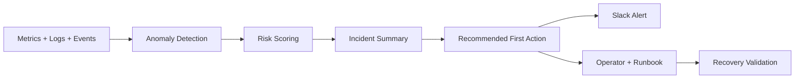

# Express Reliability Platform V8 - AIOps Incident Management

## Builds on V7

Before you start V8, copy your personal V7 repository to your local machine and rename it to V8:

```sh
git clone https://github.com/YOUR_USERNAME/express-reliability-platform-v07.git
mv express-reliability-platform-v07 express-reliability-platform-v08
cd express-reliability-platform-v08
```

Use the main class repository for scripts and canonical structure:

- https://github.com/Here2ServeU/express-reliability-platform-course

## 1) Version Purpose

Version 8 trains you to run AIOps incident management in a real engineering workflow.
You will detect incidents, score risk, summarize impact, and validate recovery.

## 2) Chapter Covered

- Chapter 16: AIOps for Incident Management

## Training Workflow (Understand -> Build -> Test -> Break -> Fix -> Explain -> Automate -> Improve)

This version follows the same engineering loop used across the full program:

`Understand -> Build -> Test -> Break -> Fix -> Explain -> Automate -> Improve`

## 4) Skills That Match High AIOps Engineer Demand

These are the skills hiring teams look for, and they are practiced in this version:

1. Observable systems: collect metrics, logs, events, and health signals.
2. Fast triage: move from signal to incident summary quickly.
3. Risk scoring: prioritize by impact, not guesswork.
4. Automation: generate repeatable incident evidence files.
5. Safe promotion: test in `dev`, then `staging`, then `prod` with guardrails.
6. Evidence culture: keep machine-readable outputs for review and portfolio proof.

## 5) Concepts Explained (Simple Language)

- AIOps: using automation and AI-style logic to help operations teams detect and fix incidents faster.
- Incident signal: a measurable sign that something is wrong, like high latency or high error rate.
- SLI: the measured value (for example, p95 latency).
- SLO: the target you promise for an SLI (for example, p95 latency under 500 ms).
- Risk score: a number that estimates how serious an incident is.
- Incident summary: a short report with impact, likely cause, and first action.
- Runbook: step-by-step actions engineers follow during incidents.
- Blast radius: how much of the system is affected by a fault.
- Guardrail: a safety rule that limits risk during tests.
- Recovery validation: proving the service returned to healthy state after mitigation.

## 6) What You Will Build

- A complete AIOps incident-management guide.
- Local AIOps testing workflow with evidence output.
- Cloud AIOps testing workflow with promotion safety checks.
- Risk rules and severity bands for consistent triage.
- Slack alerting that fires automatically after every risk-score run.

## 7) Architecture Diagram (Mermaid)



## 8) Project Structure

```text
## 1) Version Purpose

Version 8 trains you to run AIOps incident management in a real engineering workflow.
You will detect incidents, score risk, summarize impact, and validate recovery.

---

## Plain Language Context

**What is this version teaching you?**
You will build an automated triage system — one that reads your platform's health signals, assigns a risk score from 1 to 10, and produces a written summary with a recommended action. Think of it like a triage nurse in an emergency room who takes every patient's vital signs, assigns a priority number (1 = immediate, 5 = can wait), and hands the doctor a card that says: "Priority 2. Elevated heart rate and blood pressure. Recommend ECG."

**How does a bank or hospital use this?**
Large financial institutions receive thousands of monitoring alerts per day. No human team can manually review each one. AIOps tools read every alert, score it, and surface only the ones that need human attention — so engineers spend their time fixing real problems instead of reading through noise.

**Key terms in plain language:**

| Term | What It Means |
|---|---|
| **AIOps** | Automation that reads signals from your system, scores their severity, and suggests what to do — faster than any human alone |
| **Risk score** | A number (1–10) that represents how serious an incident is, calculated from multiple signals at once |
| **Anomaly detection** | Noticing when a number goes outside the normal range — like seeing your heart rate jump from 70 to 140 |
| **Evidence file (JSON)** | A machine-readable file that records what signals were seen, when, and what the risk score was — like a medical chart |
| **Incident summary** | A short plain-language description of what is wrong, how serious it is, and what to do first |
| **Severity band** | A label that groups risk scores — Low (1–3), Medium (4–6), High (7–8), Critical (9–10) |
| **SLI** | Service Level Indicator — the actual measured number, like "p95 latency = 620ms" |
| **SLO** | Service Level Objective — the target, like "p95 latency must stay under 500ms" |

**Expected result at the end of this version:**
- Running `./scripts/aiops_score_and_summarize.sh` produces a risk score and text summary.
- A JSON evidence file is written to disk for every scoring run.
- An incident with a risk score ≥ 7 triggers a Slack notification automatically.

---

## 2) Chapter Covered
│   ├── live/
│   │   ├── live.tfvars
│   │   ├── main.tf
│   │   ├── outputs.tf
│   │   └── variables.tf
│   └── shared/
│       ├── shared.tfvars
│       ├── main.tf
│       ├── outputs.tf
│       └── variables.tf
├── infrastructure/
│   └── bootstrap/
├── modules/
│   ├── alb/
│   ├── eks/
│   ├── iam/
│   └── vpc/
├── scripts/
│   ├── aiops_cloud_incident_test.sh
│   ├── aiops_local_incident_test.sh
│   ├── aiops_score_and_summarize.sh  <- scores risk AND sends Slack
│   └── terraform_init_apply.sh
├── slack/
│   └── send_slack_webhook.sh  <- standalone Slack webhook sender
└── README.md
```

## 9) Step-by-Step Guide (Local and Cloud)

### Step A - Understand

Read these files first:

```sh
cat artifacts/aiops/risk-rules.yaml
cat artifacts/aiops/high-demand-aiops-engineer-blueprint.md
```

What you should understand before building:

1. What signals indicate an incident.
2. How risk score maps to severity.
3. What first action is expected for each severity.

### Step B - Build (Local Setup)

#### B1: Prerequisites

Install and verify:

- Docker + Docker Compose
- Terraform
- AWS CLI
- kubectl
- curl

#### B2: Run local platform gate

Use the latest local stack from V4:

```sh
cd ../express-reliability-platform-v04
docker compose up --build -d
curl http://localhost:8080/api/health
cd ../express-reliability-platform-v08
```

### Step C - Test (Local AIOps)

```sh
chmod +x scripts/aiops_score_and_summarize.sh scripts/aiops_local_incident_test.sh slack/send_slack_webhook.sh
./scripts/aiops_local_incident_test.sh http://localhost:8080/api/health node-api 650 1.8 1 1 local-oncall
```

What this does:

1. Verifies health endpoint availability.
2. Uses incident inputs (latency, error rate, restarts, blast radius).
3. Computes risk score and severity.
4. Writes a machine-readable incident summary file.
5. Sends a Slack alert if `SLACK_WEBHOOK_URL` is set — otherwise prints a dry-run message.

To enable Slack:

```sh
export SLACK_WEBHOOK_URL=https://hooks.slack.com/services/YOUR/WEBHOOK/URL
./scripts/aiops_local_incident_test.sh http://localhost:8080/api/health node-api 650 1.8 1 1 local-oncall
```

To send a standalone Slack message:

```sh
./slack/send_slack_webhook.sh --message "AIOps: SEV1 on node-api"
./slack/send_slack_webhook.sh --evidence-file artifacts/aiops/evidence/local/INC-001.json
./slack/send_slack_webhook.sh --dry-run --evidence-file artifacts/aiops/evidence/local/INC-001.json
```

Expected evidence location:

- `artifacts/aiops/evidence/local/*.json`

### Step D - Break the System (Local Failure Drill)

Trigger an intentional failure in the local stack:

```sh
cd ../express-reliability-platform-v04
docker compose stop flask-api
curl -i http://localhost:8080/api/health
cd ../express-reliability-platform-v08
```

This teaches you how incidents appear in real operations.

### Step E - Fix the System

Restore service and re-test:

```sh
cd ../express-reliability-platform-v04
docker compose start flask-api
curl http://localhost:8080/api/health
cd ../express-reliability-platform-v08
./scripts/aiops_local_incident_test.sh
```

### Step F - Explain What Happened

Document these 3 answers after every drill:

1. What failed?
2. Why did it fail?
3. What fixed it?

### Step G - Automate

Use automation scripts already included:

- `scripts/aiops_score_and_summarize.sh`
- `scripts/aiops_local_incident_test.sh`
- `scripts/aiops_cloud_incident_test.sh`

Extend them as needed for your environment.

### Step H - Improve

After each drill:

1. Adjust `risk-rules.yaml` thresholds.
2. Improve incident summary quality.
3. Reduce mean time to detect and recover.

### Step I - Cloud Deployment and AIOps Testing

#### I1: Configure AWS account access

```sh
aws configure
aws sts get-caller-identity
```

#### I2: Deploy shared environment

```sh
terraform -chdir=environments/shared init
terraform -chdir=environments/shared validate
terraform -chdir=environments/shared plan -var-file=shared.tfvars
terraform -chdir=environments/shared apply -var-file=shared.tfvars
```

#### I3: Prepare live environment values

Update `environments/live/live.tfvars` with real network values (`vpc_id` and `subnet_ids`).

#### I4: Deploy live environment

```sh
terraform -chdir=environments/live init
terraform -chdir=environments/live validate
terraform -chdir=environments/live plan -var-file=live.tfvars
terraform -chdir=environments/live apply -var-file=live.tfvars
```

#### I5: Test cloud AIOps in `dev`

```sh
chmod +x scripts/aiops_cloud_incident_test.sh
./scripts/aiops_cloud_incident_test.sh dev node-api 700 2.2 1 2 cloud-oncall
```

#### I6: Promote to `staging` after stable recovery

```sh
./scripts/aiops_cloud_incident_test.sh staging node-api 650 1.5 1 1 cloud-oncall
```

#### I7: Run `prod` test only with approval

```sh
APPROVED_PROD_TEST=true ./scripts/aiops_cloud_incident_test.sh prod node-api 600 1.2 1 1 cloud-oncall
```

Expected cloud evidence location:

- `artifacts/aiops/evidence/cloud/*.json`

### Step J - Cleanup

```sh
cd ../express-reliability-platform-v04
docker compose down
cd ../express-reliability-platform-v08
```

## 10) Validation Checklist

- [ ] AIOps incident-management guide is reviewed.
- [ ] Risk rules are documented in `risk-rules.yaml`.
- [ ] Local AIOps test generated a JSON incident summary.
- [ ] Slack dry-run output is visible (no `SLACK_WEBHOOK_URL` needed).
- [ ] Slack real alert fires when `SLACK_WEBHOOK_URL` is set.
- [ ] Cloud AIOps test generated `dev` evidence.
- [ ] Promotion to `staging` happened only after stable recovery.
- [ ] `prod` test required explicit approval flag.
- [ ] Every incident summary includes impact, likely cause, and first action.
- [ ] Recovery metrics are tied to SLO/SLI targets.

## 11) Troubleshooting

- Health endpoint fails locally: verify V4 stack is running and `http://localhost:8080/api/health` is reachable.
- No evidence file created: confirm script execute permissions and input parameters.
- Too many high-risk incidents: tune thresholds in `risk-rules.yaml`.
- Terraform plan fails in live: confirm `vpc_id` and `subnet_ids` are set in `live.tfvars`.
- Prod test blocked: set `APPROVED_PROD_TEST=true` only after formal approval.
- Slack message not sending: verify `SLACK_WEBHOOK_URL` is exported. Run `send_slack_webhook.sh --dry-run` first to confirm message format.

## 12) Cloud Cleanup

```sh
terraform -chdir=environments/live destroy -var-file=live.tfvars
terraform -chdir=environments/shared destroy -var-file=shared.tfvars
```

- Archive all evidence files from `artifacts/aiops/evidence/`.
- Record lessons learned and follow-up actions.

## 13) Next Version Preview

In V9, you build on V8 and apply reliability practices to cyber-physical workflows, including telemetry simulation and auto-response loops.
