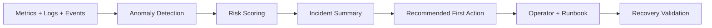

# Express Reliability Platform V8 - AIOps Incident Management

## Builds on V7

Before you start V8, copy your personal V7 repository to your local machine and rename it to V8:

```sh
git clone https://github.com/YOUR_USERNAME/express-reliability-platform-v07.git
mv express-reliability-platform-v07 express-reliability-platform-v08
cd express-reliability-platform-v08
```

Use the main class repository for scripts and canonical structure:

- https://github.com/Here2ServeU/express-reliability-platform-course

## 1) Version Purpose

Version 8 turns your platform into an AIOps incident-management system.
You will detect incidents, score risk, generate incident summaries, and validate recovery.

## 2) Chapter Covered

- Chapter 16: AIOps for Incident Management

## 3) Recommendations to Meet High AIOps Engineer Demand

These are the skills hiring teams look for, and they are implemented in this version:

1. Observable systems: collect metrics, logs, events, and health signals.
2. Fast triage: move from signal to incident summary quickly.
3. Risk scoring: prioritize by impact, not guesswork.
4. Automation: generate repeatable incident evidence files.
5. Safe promotion: test in `dev`, then `staging`, then `prod` with guardrails.
6. Evidence culture: keep machine-readable outputs for review and portfolio proof.

## 4) Concepts Explained (Simple Language)

- AIOps: using automation and AI-style logic to help operations teams detect and fix incidents faster.
- Incident signal: a measurable sign that something is wrong, like high latency or high error rate.
- SLI: the measured value (for example, p95 latency).
- SLO: the target you promise for an SLI (for example, p95 latency under 500 ms).
- Risk score: a number that estimates how serious an incident is.
- Incident summary: a short report with impact, likely cause, and first action.
- Runbook: step-by-step actions engineers follow during incidents.
- Blast radius: how much of the system is affected by a fault.
- Guardrail: a safety rule that limits risk during tests.
- Recovery validation: proving the service returned to healthy state after mitigation.

## 5) What You Will Build

- A complete AIOps incident-management guide.
- Local AIOps testing workflow with evidence output.
- Cloud AIOps testing workflow with promotion safety checks.
- Risk rules and severity bands for consistent triage.

## 6) Architecture Diagram (Mermaid)



## 7) Project Structure

```text
express-reliability-platform-v08/
├── artifacts/
│   └── aiops/
│       ├── high-demand-aiops-engineer-blueprint.md
│       └── risk-rules.yaml
├── environments/
│   ├── live/
│   │   ├── live.tfvars
│   │   ├── main.tf
│   │   ├── outputs.tf
│   │   └── variables.tf
│   └── shared/
│       ├── shared.tfvars
│       ├── main.tf
│       ├── outputs.tf
│       └── variables.tf
├── infrastructure/
│   └── bootstrap/
├── modules/
│   ├── alb/
│   ├── eks/
│   ├── iam/
│   └── vpc/
├── scripts/
│   ├── aiops_cloud_incident_test.sh
│   ├── aiops_local_incident_test.sh
│   ├── aiops_score_and_summarize.sh
│   └── terraform_init_apply.sh
└── README.md
```

## 8) Step-by-Step Local Deployment and AIOps Test

### Step 1: Prerequisites

Install and verify:

- Docker + Docker Compose
- Terraform
- AWS CLI
- kubectl
- curl

### Step 2: Run local platform gate

Use the latest local stack from V4:

```sh
cd ../express-reliability-platform-v04
docker compose up --build -d
curl http://localhost:8080/api/health
cd ../express-reliability-platform-v08
```

### Step 3: Read the AIOps guide and rules

```sh
cat artifacts/aiops/risk-rules.yaml
cat artifacts/aiops/high-demand-aiops-engineer-blueprint.md
```

### Step 4: Run local AIOps incident test

```sh
chmod +x scripts/aiops_score_and_summarize.sh scripts/aiops_local_incident_test.sh
./scripts/aiops_local_incident_test.sh http://localhost:8080/api/health node-api 650 1.8 1 1 local-oncall
```

What this does:

1. Verifies health endpoint availability.
2. Uses incident inputs (latency, error rate, restarts, blast radius).
3. Computes risk score and severity.
4. Writes a machine-readable incident summary file.

Expected evidence location:

- `artifacts/aiops/evidence/local/*.json`

### Step 5: Stop local stack when done

```sh
cd ../express-reliability-platform-v04
docker compose down
cd ../express-reliability-platform-v08
```

## 9) Step-by-Step Cloud Deployment and AIOps Test

### Step 1: Configure AWS account access

```sh
aws configure
aws sts get-caller-identity
```

### Step 2: Deploy shared environment

```sh
terraform -chdir=environments/shared init
terraform -chdir=environments/shared validate
terraform -chdir=environments/shared plan -var-file=shared.tfvars
terraform -chdir=environments/shared apply -var-file=shared.tfvars
```

### Step 3: Prepare live environment values

Update `environments/live/live.tfvars` with required network inputs (for example, `vpc_id` and `subnet_ids`) before deploy.

### Step 4: Deploy live environment

```sh
terraform -chdir=environments/live init
terraform -chdir=environments/live validate
terraform -chdir=environments/live plan -var-file=live.tfvars
terraform -chdir=environments/live apply -var-file=live.tfvars
```

### Step 5: Run cloud AIOps test in dev first

```sh
chmod +x scripts/aiops_cloud_incident_test.sh
./scripts/aiops_cloud_incident_test.sh dev node-api 700 2.2 1 2 cloud-oncall
```

### Step 6: Promote to staging after stable recovery

```sh
./scripts/aiops_cloud_incident_test.sh staging node-api 650 1.5 1 1 cloud-oncall
```

### Step 7: Run prod test only with approval

```sh
APPROVED_PROD_TEST=true ./scripts/aiops_cloud_incident_test.sh prod node-api 600 1.2 1 1 cloud-oncall
```

Expected evidence location:

- `artifacts/aiops/evidence/cloud/*.json`

## 10) Validation Checklist

- [ ] AIOps incident-management guide is reviewed.
- [ ] Risk rules are documented in `risk-rules.yaml`.
- [ ] Local AIOps test generated a JSON incident summary.
- [ ] Cloud AIOps test generated `dev` evidence.
- [ ] Promotion to `staging` happened only after stable recovery.
- [ ] `prod` test required explicit approval flag.
- [ ] Every incident summary includes impact, likely cause, and first action.
- [ ] Recovery metrics are tied to SLO/SLI targets.

## 11) Troubleshooting

- Health endpoint fails locally: verify V4 stack is running and `http://localhost:8080/api/health` is reachable.
- No evidence file created: confirm script execute permissions and input parameters.
- Too many high-risk incidents: tune thresholds in `risk-rules.yaml`.
- Terraform plan fails in live: confirm `vpc_id` and `subnet_ids` are set in `live.tfvars`.
- Prod test blocked: set `APPROVED_PROD_TEST=true` only after formal approval.

## 12) Cleanup

```sh
terraform -chdir=environments/live destroy -var-file=live.tfvars
terraform -chdir=environments/shared destroy -var-file=shared.tfvars
```

- Archive all evidence files from `artifacts/aiops/evidence/`.
- Record lessons learned and follow-up actions.

## 13) Next Version Preview

In V9, you build on V8 and apply reliability practices to cyber-physical workflows, including telemetry simulation and auto-response loops.
