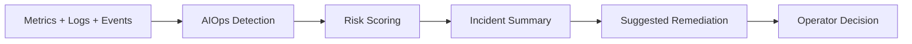

# Express Reliability Platform V8 — AIOps

## 1) Version Purpose

Introduce intelligent infrastructure operations with risk scoring, incident summarization, and pattern-based response guidance.

## 2) Chapters Covered

- Chapter 15: Intelligent Infrastructure (risk scoring, incident summary, pattern detection)

## 3) What You Will Build

- An AIOps workflow that improves mean time to detection and response quality.
- Repeatable detection patterns that can be applied across environments.

## 4) Architecture Diagram (Mermaid)



## 5) Project Structure

```text
express-reliability-platform-v08/
├── environments/
│   ├── live/
│   └── shared/
├── infrastructure/
│   └── bootstrap/
├── modules/
│   ├── alb/
│   ├── eks/
│   ├── iam/
│   └── vpc/
├── scripts/
│   └── terraform_init_apply.sh
└── README.md
```

## 6) Run Steps

1. Provision baseline platform with Terraform script.
2. Define your first three risk rules (latency spike, error-rate spike, service outage).
3. Produce incident summaries for each simulated event.
4. Record operator action and expected recovery signal.

## 7) Validation Checklist

- [ ] At least 3 event patterns are documented.
- [ ] Every pattern has a risk score rule.
- [ ] Summaries include service impact, likely cause, and first action.
- [ ] Recovery confirmation criteria are defined.

## 8) Troubleshooting

- Too many false positives: increase confidence threshold or widen baseline window.
- Weak summaries: enforce required fields (impact, cause, action, owner).
- No action follow-through: map each recommendation to a runbook step.

## 9) Cleanup

- Archive test incidents and reset temporary alert rules.

## 10) Next Version Preview

In V9, you apply reliability practices to cyber-physical workflows, including telemetry simulation and auto-response loops.


