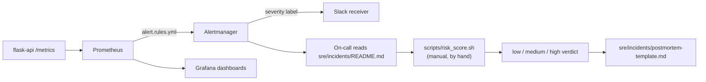
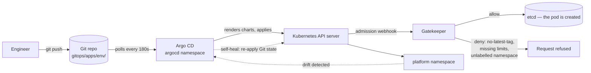
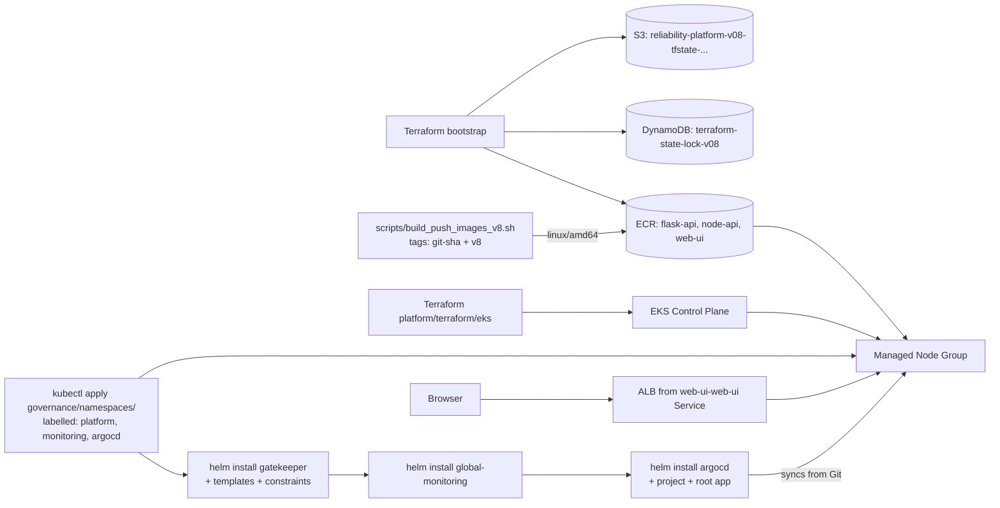

# Express Reliability Platform V8: GitOps, Governance, and Incident Response

> **What you will build (in one paragraph).** Everything V7 builds — the same EKS-on-AWS stack, reusable Terraform modules, per-environment tfvars, cost-aware tagging and budgets, three services, Prometheus/Grafana/Alertmanager monitoring, and SRE risk scoring — plus GitOps, governance, and the complete incident-response pipeline. **GitOps**: Argo CD makes the cluster match the desired state in `gitops/apps/<env>/`. **Governance**: OPA Gatekeeper, Trivy, and Checkov block unsafe changes. **Incident response**: Alertmanager can page Slack, helper scripts create ServiceNow and Jira records, four chaos drills produce evidence, and an automated postmortem captures the outcome. Nothing V7 does was removed or rewritten; these layers build on it.

## Table of contents

- [Quick Start (the 5-command path)](#quick-start-the-5-command-path)
- [What's new in V8 (and what stayed exactly the same)](#whats-new-in-v8-and-what-stayed-exactly-the-same)
- [Modules overview](#modules-overview)
- [Per-environment deploy](#per-environment-deploy)
- [Cost guardrails](#cost-guardrails)
- [Prerequisites](#prerequisites)
- [Deploy](#deploy)
  - [Path A: Scripted (recommended)](#path-a-scripted-recommended)
  - [Path B: Manual walkthrough](#path-b-manual-walkthrough)
- [GitOps with Argo CD](#gitops-with-argo-cd)
  - [Wiring the manifests to your repo](#wiring-the-manifests-to-your-repo)
  - [Deploying a new version](#deploying-a-new-version)
  - [The drift drill](#the-drift-drill)
  - [Rollback is `git revert`](#rollback-is-git-revert)
- [Governance](#governance)
  - [The three admission policies](#the-three-admission-policies)
  - [Proving they work](#proving-they-work)
  - [CI-side gates: Trivy and Checkov](#ci-side-gates-trivy-and-checkov)
  - [Introducing policies to a live cluster](#introducing-policies-to-a-live-cluster)
- [Local monitoring stack](#local-monitoring-stack)
- [Validate the platform](#validate-the-platform)
- [Incident-response practice](#incident-response-practice)
- [Operate (rolling updates, rollback, scaling)](#operate-rolling-updates-rollback-scaling)
- [Cleanup](#cleanup)
- [Reference](#reference)
  - [Project structure](#project-structure)
  - [Configuration reference](#configuration-reference)
  - [Architecture diagrams](#architecture-diagrams)
  - [Web UI guide](#web-ui-guide)
  - [Troubleshooting](#troubleshooting)

---

## Quick Start (the 5-command path)

> Use this if you've already done V7 and just want a working V8 cluster. If anything goes wrong, jump to [Troubleshooting](#troubleshooting).

**One new step before the deploy, and it is not optional.** Argo CD pulls your charts from a Git repo over the network. It cannot read your laptop. So the manifests in `gitops/` have to name a repo you can push to, and that has to be committed and pushed *before* the cluster comes up.

```sh
cd express-reliability-platform-v08

# 0. NEW IN V8: point the GitOps manifests at your fork and your ECR, then push.
#    Argo CD syncs your pushed commit — not your working copy.
./scripts/gitops_set_repo_v8.sh          # auto-detects origin + AWS account
git add gitops/ && git commit -m 'gitops: point at my repo' && git push

# 1. One command provisions the environment, governance, monitoring, and Argo CD.
ENV=dev  ./scripts/tf_deploy_v8.sh   # 1× t3.medium, $50/mo budget
# ENV=prod ./scripts/tf_deploy_v8.sh  # 3× t3.medium, $300/mo budget

# 2. Get the public URL (~30 minutes after step 1 starts; ALB takes 60-90s)
kubectl get svc web-ui-web-ui -n platform \
  -o jsonpath='{.status.loadBalancer.ingress[0].hostname}'

# When you get the public URL, ensure to add http://Public_URL

# 3. Watch GitOps do its job, and try to break the rules
kubectl get applications -n argocd          # Synced / Healthy
kubectl run bad --image=nginx:latest -n platform   # denied by Gatekeeper

# 4. When done: destroy this env (the other env's state stays put)
ENV=dev ./scripts/cleanup_v8.sh
```

Prefer to stay local? Skip straight to the [local monitoring stack](#local-monitoring-stack) — `docker compose up --build -d` brings up `flask-api`, `web-ui`, `prometheus`, `grafana`, and `alertmanager` with no AWS account required. The GitOps and governance layers are cluster-side and are not part of the Compose stack.

**You'll know it worked when** `curl -I http://<the-hostname>` returns `HTTP/1.1 200 OK`, `kubectl get pods -n platform` shows 6 pods all `Running 1/1`, `kubectl get applications -n argocd` shows four Applications `Synced`/`Healthy`, and `kubectl run bad --image=nginx:latest -n platform` is **refused** by the admission webhook.

---

## What's new in V8 (and what stayed exactly the same)

V7 could tell you when the platform was unhealthy. What it could not tell you was **what is supposed to be running** — the cluster's contents were whatever the last person to run `tf_deploy_v7.sh` happened to have on their laptop, deployed from a `:latest` tag that could point anywhere. And it could not stop anyone from deploying something reckless; nothing in V7 would refuse a container with no memory limit, or a namespace nobody owns.

V8 answers both. GitOps makes the desired state an artifact — a file, in Git, with an author and a diff and a history. Governance makes the rules an artifact too, and enforces them at the moment of admission rather than in a wiki nobody reads.

**Unchanged from V7:** `platform/terraform/**` (same four modules, same bootstrap, same tfvars shape), `platform/helm/{flask-api,node-api,web-ui}` charts, `platform/helm/{global-monitoring,grafana-dashboards}`, `monitoring/**`, `docker-compose.yml`, `sre/incidents/**`, and `scripts/risk_score.sh` — all carried over as-is. The version suffix (`v08`), the CIDR blocks, and the Grafana dashboard title are the only cosmetic edits. If you deployed V7, the infrastructure half of V8 will look identical.

**New layers added on top:**

| Layer | What it is | Where it lives |
|---|---|---|
| **GitOps (Argo CD)** | Argo CD watches `gitops/apps/<env>/` in your repo and reconciles the cluster to match — continuously, not just when someone runs a script. An `AppProject` fences what it is allowed to deploy and where. | [`gitops/`](gitops/), [`scripts/gitops_bootstrap_v8.sh`](scripts/gitops_bootstrap_v8.sh), [`scripts/gitops_set_repo_v8.sh`](scripts/gitops_set_repo_v8.sh), [`scripts/promote_image_v8.sh`](scripts/promote_image_v8.sh) |
| **Governance (admission)** | OPA Gatekeeper plus three policies, enforcing at the API server: no `:latest` tags, resource limits required, namespaces must declare an owner. | [`governance/`](governance/), [`scripts/governance_install_v8.sh`](scripts/governance_install_v8.sh) |
| **Governance (CI)** | Trivy scans every image for HIGH/CRITICAL CVEs and Checkov scans the Terraform, both before anything is pushed or applied. | [`.github/workflows/provision.yml`](.github/workflows/provision.yml) |

**The one thing V8 *changes* rather than adds: image tags.** V7 deployed `:latest` and then ran `kubectl rollout restart` to force a re-pull, because a Deployment spec that never changes gives Helm nothing to roll. V8 cannot do that — its own `no-latest-tag` policy denies it at admission — and GitOps would not work if it did, because a tag that never changes produces no Git diff and therefore no deploy. So V8 pushes each image under an immutable commit-SHA tag (plus a mutable `v8` tag for the non-GitOps escape hatch), and `rollout restart` is gone. This is the single most instructive consequence in the whole version: a governance rule you wrote forced a change in how you ship software, and that change is what made GitOps possible.

### Glossary (V8 additions only — V7's monitoring/incident vocabulary is unchanged and still applies)

| Term | Plain-language meaning |
|---|---|
| **GitOps** | The desired state of the cluster lives in Git; an agent in the cluster continuously makes reality match it. You do not run deploy commands — you commit, and the agent deploys. |
| **Argo CD `Application`** | One custom resource saying "this chart, from this repo, at this revision, into this namespace". Replaces one `helm upgrade --install` line. |
| **App of apps** | A root `Application` whose "chart" is a directory full of other `Application` files. Adding a service becomes adding a file. |
| **`AppProject`** | Argo CD's guardrail object: which repos may be sources, which namespaces may be destinations, which resource kinds are allowed. An `Application` that violates it is refused. |
| **Sync / drift / self-heal** | *Sync* is making the cluster match Git. *Drift* is the cluster no longer matching Git (someone ran `kubectl edit`). *Self-heal* is Argo CD undoing that drift automatically. |
| **Prune** | Deleting cluster resources that were removed from Git. Off by default in most tools because it is the setting that can delete production. |
| **Admission controller** | Code the API server calls before writing an object to etcd. It can accept, mutate, or reject. Gatekeeper is a *validating* one: accept or reject, no mutation. |
| **`ConstraintTemplate` / `Constraint`** | The template is the reusable rule written in Rego (*"containers must have limits"*). The constraint is one application of it (*"…for Pods in the `platform` namespace, and deny violations"*). |
| **`enforcementAction`** | `deny` blocks the request. `dryrun` records the violation and lets it through — how you introduce a policy to a cluster that already has workloads. |
| **Immutable tag** | An image tag that always refers to the same bytes, like a commit SHA. The opposite of `:latest`, and the prerequisite for both GitOps and honest rollbacks. |
| **Shift left** | Catching a problem in CI (Trivy, Checkov) rather than at admission or in production. Cheaper, but bypassable — which is why V8 does both. |

---

## Modules overview

Identical to V7 — same four modules, same contracts, just deployed under V8's own bootstrap/state.

| Module | Purpose | Key inputs | Key outputs |
|---|---|---|---|
| [`modules/vpc`](platform/terraform/modules/vpc) | VPC, IGW, public subnets across N AZs, route table | `cidr_block`, `cluster_name`, `name_prefix` | `vpc_id`, `public_subnet_ids` |
| [`modules/eks-iam`](platform/terraform/modules/eks-iam) | Cluster + node IAM roles with the four AWS-managed policies attached | `name_prefix` | `cluster_role_arn`, `node_role_arn` |
| [`modules/eks-cluster`](platform/terraform/modules/eks-cluster) | EKS control plane + managed node group | `cluster_name`, `kubernetes_version`, `subnet_ids`, role ARNs, sizing | `cluster_name`, `cluster_endpoint` |
| [`modules/budget`](platform/terraform/modules/budget) | Per-env `aws_budgets_budget` with 80%/100% email alerts | `monthly_limit_usd`, `alert_email`, `cost_filter_tags` | `budget_name`, `budget_id` |

The root [`eks/main.tf`](platform/terraform/eks/main.tf) is the same thin composition as V7: provider `default_tags`, an untagged provider alias for the budget module (see V6's README for why), and four `module` calls. Nothing here changed except `version_suffix` flowing through to `v08`. **Argo CD and Gatekeeper are deliberately not Terraform-managed** — they are cluster add-ons installed by Helm after the cluster exists, the same way the monitoring stack is.

---

## Per-environment deploy

Same two ready-to-apply environments as V7 — `dev` and `prod` — with V8's own CIDR blocks so it can coexist with a still-running V7 stack on the same account. V8 adds a third per-environment artifact: a directory of Argo CD `Application` manifests.

| Setting | `dev.tfvars` | `prod.tfvars` |
|---|---|---|
| `vpc_cidr` | `10.47.0.0/16` | `10.48.0.0/16` (peerable with dev) |
| `node_instance_types` | `["t3.medium"]` | `["t3.medium"]` |
| `node_desired_size` / `min` / `max` | `1` / `1` / `2` | `3` / `2` / `6` |
| `monthly_budget_usd` | `50` | `300` |
| State key | `eks/v8/dev/terraform.tfstate` | `eks/v8/prod/terraform.tfstate` |
| Cluster name | `reliability-platform-dev` | `reliability-platform-prod` |
| GitOps manifests | `gitops/apps/dev/` (2 replicas) | `gitops/apps/prod/` (3 replicas) |
| GitOps root app | `gitops/argocd/root-app-dev.yaml` | `gitops/argocd/root-app-prod.yaml` |

```sh
ENV=dev  ./scripts/tf_deploy_v8.sh
ENV=prod ./scripts/tf_deploy_v8.sh
ENV=dev  ./scripts/cleanup_v8.sh   # tears down only dev; prod is untouched
```

**State separation, IAM naming** — identical mechanics to V7: `-backend-config="key=eks/v8/${ENV}/terraform.tfstate"`, IAM roles named `reliability-platform-v08-<env>-eks-*-role`. See V6's README section of the same name for the full explanation; nothing about the mechanism changed.

**Adding a `staging` env** now takes one more step than it did in V7. As well as a new tfvars file with a non-overlapping CIDR, copy `gitops/apps/dev/` to `gitops/apps/staging/` and `gitops/argocd/root-app-dev.yaml` to `root-app-staging.yaml` (changing the `path:` and the `name:`). `gitops_bootstrap_v8.sh` fails with a clear message if you forget — it would otherwise silently sync the wrong environment's manifests, which is worse.

What lives where is worth being precise about: **Terraform owns the infrastructure, Git owns the applications.** Changing the node count is a tfvars edit and a `tf_deploy_v8.sh` run. Changing which image version is deployed is a `gitops/apps/<env>/` edit and a `git push`. These are two different change-control paths on purpose, because they have different blast radii and different review requirements.

---

## Cost guardrails

Unchanged from V7: the same `default_tags` provider block (`Project`, `App`, `Environment`, `Owner`, `CostCenter`, `Version`, `ManagedBy`), the same `aws.untagged` provider alias so the budget module doesn't need `budgets:TagResource`, and the same 80%/100% email-alert budget per environment. V8's `Version` tag reads `v08`; everything else — including the Cost Allocation Tag activation step and the daily run-rate math — is identical. See V6's README "Cost guardrails" section for the full walkthrough.

**Pod-count pressure is the real V8 cost story.** V7 already warned that the monitoring stack adds compute. V8 adds two more control-plane-ish workloads on top:

| Add-on | Pods | Notes |
|---|---|---|
| Monitoring (V7) | ~6 | Prometheus, Grafana, Alertmanager, operator, kube-state-metrics, node-exporter |
| Argo CD (V8) | 6 | Single-replica everything, set in `gitops/argocd/values.yaml` |
| Gatekeeper (V8) | 2 | controller + audit; `--set replicas=1` in `governance_install_v8.sh` |

Counting only pods that consume an ENI address (`aws-node` and `kube-proxy` are host-network and free), a full V8 `dev` cluster needs **21**: 2 coredns + 6 application + 5 monitoring + 6 Argo CD + 2 Gatekeeper. One `t3.medium` caps at **17**. So `dev.tfvars` now sets `node_desired_size = 2` — this is the one sizing change V8 makes, and it roughly doubles dev's run rate to **~$4.20/day**. To stay on one node, deploy with `SKIP_MONITORING=true` and use the local Docker Compose stack for dashboards instead. Symptom if you get this wrong: pods stuck `Pending` with `Too many pods` in `kubectl describe pod`.

---

## Prerequisites

- [ ] **AWS CLI v2** configured (`aws configure`) with credentials that can create EKS, IAM, EC2, ECR, S3, and DynamoDB.
- [ ] **Docker with `buildx`** running locally — verify with `docker ps`. V8 builds and pushes its own images, and the local monitoring stack runs in Docker Compose.
- [ ] **Terraform ≥ 1.5**.
- [ ] **kubectl ≥ 1.29 and helm ≥ 3.14**:
  ```sh
  # macOS
  brew install kubectl helm

  # Linux
  curl -LO "https://dl.k8s.io/release/$(curl -Ls https://dl.k8s.io/release/stable.txt)/bin/linux/amd64/kubectl"
  chmod +x kubectl && sudo mv kubectl /usr/local/bin/
  curl https://raw.githubusercontent.com/helm/helm/main/scripts/get-helm-3 | bash
  ```
- [ ] **No V7 sources needed.** V8 ships all three services in its own `apps/` — `build_push_images_v8.sh` builds entirely from this repo.
- [ ] **NEW: a Git repo you can push to, that Argo CD can read.** This is the one prerequisite V8 adds and the one most likely to trip you up. Argo CD runs *in the cluster* and clones over the network — it cannot see your working copy, and it cannot authenticate to a private repo without extra setup this course does not cover. So you need a **fork you own**, **public**, pushed. Verify:
  ```sh
  git remote -v                 # you should have push access to this
  git status                    # gitops/ changes must be committed AND pushed
  ```
  If your fork must be private, you will additionally need to register repo credentials with Argo CD (`argocd repo add --username ... --password <PAT>`), which is outside this version's scope.
- [ ] **Make the helper scripts executable** (one time):
  ```sh
  chmod +x scripts/*.sh
  ```

---

## Deploy

V8 owns its full stack: a state backend (S3 + DynamoDB), three ECR repos, an EKS cluster, the monitoring Helm release, and (new) Gatekeeper plus Argo CD. V7 does not need to be deployed or even present.

**Do step 0 first.** The deploy script refuses to install Argo CD against unedited manifests, because Argo CD would accept them and then sit in `Unknown` forever with a repo-not-found error buried three screens into the UI:

```sh
./scripts/gitops_set_repo_v8.sh
git add gitops/ && git commit -m 'gitops: point at my repo and ECR' && git push
```

### Path A: Scripted (recommended)

```sh
ENV=dev  ./scripts/tf_deploy_v8.sh   # or ENV=prod
```

**What it runs, in order:**

| # | Step | Time | vs V7 |
|---|---|---|---|
| 1 | Bootstrap apply: state bucket + lock table + 3 ECR repos | ~1 min | same |
| 2 | Build + push 3 `linux/amd64` images, tagged `<git-sha>` **and** `v8` | ~3-5 min | **`:latest` is gone** |
| 3 | EKS apply with `-var-file=environments/${ENV}.tfvars` and per-env state key | **10-15 min** | same |
| 4 | Configure kubectl | <1 min | same |
| 5 | Apply `governance/namespaces/` — `platform`, `monitoring`, `argocd`, all labelled, then re-labelled to `${ENV}` | <1 min | **new** — V7 created these implicitly and unlabelled |
| 6 | Install Gatekeeper, apply ConstraintTemplates, wait for the generated CRDs, apply Constraints | ~2 min | **new** |
| 7 | Install `grafana-dashboards`, then `kube-prometheus-stack` into `monitoring` | ~1-2 min | same (namespace pre-created) |
| 8 | Install Argo CD, apply the `platform` AppProject, apply the `${ENV}` root Application | ~2-3 min | **new** — replaces V7's Helm-install-the-apps step |
| 9 | Wait for Argo CD to sync the three apps and their rollouts to finish | ~1-2 min | **new** — V7 waited on its own `helm upgrade` |
| 10 | Print the public URL | ALB takes 60-90s | same |

**What is no longer in this script:** the `helm upgrade --install` loop over the three app charts, and the `kubectl rollout restart` that followed it. Argo CD does the first; the second existed only to work around mutable `:latest` tags and is unnecessary now.

The script is idempotent within an env and safe to switch `ENV` between runs. Escape hatches:

| Variable | Effect |
|---|---|
| `SKIP_MONITORING=true` | Skip step 7. Useful on `dev` if you want to stay on one node. |
| `SKIP_GOVERNANCE=true` | Skip step 6. The cluster comes up with no admission policies. |
| `SKIP_GITOPS=true` | Skip steps 8-9 and print the V7-style `helm upgrade` commands instead. Use this if you have not pushed your `gitops/` changes yet. |
| `ENFORCEMENT=dryrun` | Install the policies in audit-only mode (see [Introducing policies to a live cluster](#introducing-policies-to-a-live-cluster)). |

**You'll know it worked when** the script prints a hostname under "Public URL", `curl -I http://<that-hostname>` returns `HTTP/1.1 200 OK`, `kubectl get pods -n monitoring` shows Prometheus/Grafana/Alertmanager `Running`, and:

```sh
kubectl get applications -n argocd
# NAME        SYNC STATUS   HEALTH STATUS
# root-dev    Synced        Healthy
# flask-api   Synced        Healthy
# node-api    Synced        Healthy
# web-ui      Synced        Healthy

kubectl get constraints
# ... three constraints, ENFORCEMENT-ACTION: deny
```

### Path B: Manual walkthrough

Phases 1–4 are identical to V7's manual walkthrough (bootstrap, build/push, EKS apply, kubectl config) — see V7's README for the phase-by-phase breakdown with expected output. V8 replaces V7's Helm-install phase with three new ones, and **the order is not negotiable**:

#### New Phase 5: Declare the namespaces · <1 min

```sh
kubectl apply -f governance/namespaces/
for NS in platform monitoring argocd; do
  kubectl label namespace "$NS" environment=dev --overwrite
done
```

This has to happen **before** Phase 6. The `require-ns-labels` constraint denies any namespace without `owner` and `environment`, and that includes namespaces created implicitly by `helm --create-namespace`. Create them first, labelled, and the policy never has to reject anything.

#### New Phase 6: Install governance · ~2 min

```sh
./scripts/governance_install_v8.sh
```

Doing it by hand is four steps, and the third is the one everybody skips:

```sh
helm repo add gatekeeper https://open-policy-agent.github.io/gatekeeper/charts
helm upgrade --install gatekeeper gatekeeper/gatekeeper \
  --namespace gatekeeper-system --create-namespace \
  --version 3.23.0 --set replicas=1 --wait

kubectl apply -f governance/gatekeeper/templates/

# THIS ONE. A ConstraintTemplate makes Gatekeeper register a brand-new CRD
# with the API server, and `kubectl apply` returns before that finishes.
# Skip this wait and the next command fails with
#   error: no matches for kind "NoLatestTag" in version "constraints.gatekeeper.sh/v1beta1"
# which reads like a typo and is actually just impatience.
for CRD in nolatesttag requireresourcelimits requirenslabels; do
  kubectl wait --for=condition=Established --timeout=120s \
    "crd/${CRD}.constraints.gatekeeper.sh"
done

kubectl apply -f governance/gatekeeper/constraints/
```

Note that `gatekeeper-system` *is* created with `--create-namespace` here, unlabelled — and that is fine, because the constraints are not enforcing yet. It is the last namespace that gets to do that.

#### Phase 7: Install monitoring · ~1-2 min

Unchanged from V7 except that the namespace already exists from Phase 5, so `--create-namespace` is dropped:

```sh
# grafana-dashboards must be installed before kube-prometheus-stack: the
# Grafana pod's dashboardsConfigMaps.default value (in global-monitoring's
# values.yaml) points at this ConfigMap, and its volume mount hangs in
# ContainerCreating if the ConfigMap doesn't exist yet.
helm upgrade --install grafana-dashboards platform/helm/grafana-dashboards \
  --namespace monitoring

helm repo add prometheus-community https://prometheus-community.github.io/helm-charts
helm repo update prometheus-community
helm upgrade --install global-monitoring prometheus-community/kube-prometheus-stack \
  --namespace monitoring \
  -f platform/helm/global-monitoring/values.yaml
```

This installs Prometheus (scraping `flask-api`/`node-api` pods in the `platform` namespace), Grafana, and Alertmanager, using the same alert rules and routing as the local Docker Compose stack — just cluster-wide instead of per-container. `platform/helm/global-monitoring/values.yaml` is values for the community chart, not a standalone chart of its own. `platform/helm/grafana-dashboards/` *is* a real (tiny) chart — it just wraps the two dashboard JSON files in `monitoring/` into a labeled ConfigMap the community chart's sidecar auto-loads.

**Grafana arrives fully wired — there is nothing to click.** Its sidecar provisions two datasources from `global-monitoring/values.yaml`, and the `grafana-dashboards` ConfigMap supplies both dashboards:

| What | Name in Grafana | uid | Points at |
|---|---|---|---|
| Data source | **Prometheus** (default) | `prometheus` | `global-monitoring-kube-pro-prometheus:9090` |
| Data source | **Alertmanager** | `alertmanager` | `global-monitoring-kube-pro-alertmanager:9093` |
| Dashboard | **Express Reliability Platform V8** | `erp-v8-overview` | uses the `prometheus` datasource |
| Dashboard | **Reliability Platform — Golden Signals** | `rp-golden-signals` | uses the default datasource |

The uids are load-bearing: every panel in `monitoring/grafana-dashboard.json` pins datasource uid `prometheus`, so if you rename it in the values file the panels go blank.

```sh
kubectl get pods -n monitoring
kubectl port-forward -n monitoring svc/global-monitoring-grafana 3000:80
open http://localhost:3000   # admin / admin — Dashboards → Express Reliability Platform V8
kubectl port-forward -n monitoring svc/global-monitoring-kube-pro-prometheus 9090:9090
open http://localhost:9090/targets   # expect flask-api & node-api UP
```

> **Service names:** the chart truncates its release prefix, so Prometheus and Alertmanager are `global-monitoring-kube-pro-prometheus` / `global-monitoring-kube-pro-alertmanager` (Grafana is plain `global-monitoring-grafana`). If a port-forward errors with `services "..." not found`, run `kubectl get svc -n monitoring` and use the name you see.

#### New Phase 8: Hand the apps to Argo CD · ~2-3 min

```sh
./scripts/gitops_bootstrap_v8.sh          # ENV=dev by default
```

By hand:

```sh
helm repo add argo https://argoproj.github.io/argo-helm
helm upgrade --install argocd argo/argo-cd \
  --namespace argocd \
  -f gitops/argocd/values.yaml --wait

# Same class of race as the Gatekeeper CRDs above.
kubectl wait --for=condition=Established --timeout=120s \
  crd/applications.argoproj.io crd/appprojects.argoproj.io

kubectl apply -f gitops/argocd/project.yaml       # the guardrails
kubectl apply -f gitops/argocd/root-app-dev.yaml  # the app-of-apps
```

There is no `helm install flask-api` phase in V8. That is the whole point — from here the three services are deployed by Argo CD from your Git repo, and the way to change what is running is to commit.

```sh
kubectl get applications -n argocd -w

kubectl port-forward -n argocd svc/argocd-server 8081:80
open http://localhost:8081     # admin / (see below)
kubectl -n argocd get secret argocd-initial-admin-secret \
  -o jsonpath='{.data.password}' | base64 -d
```

---

## GitOps with Argo CD

V7's deploy story had a gap you may not have noticed until now: **nothing recorded what was supposed to be running.** `tf_deploy_v7.sh` pushed `:latest` and ran `helm upgrade`. If you wanted to know which build was live, you read a pod spec. If two people deployed from different branches an hour apart, the cluster reflected whoever went last, and nothing anywhere said so.

GitOps closes that gap by inverting the direction of the deploy. Nothing pushes to the cluster. An agent inside the cluster pulls from Git and continuously reconciles:

| | V7 (push) | V8 (pull) |
|---|---|---|
| Who deploys | a person running a script | Argo CD, continuously |
| Source of truth | whatever ran last | `gitops/apps/<env>/` in Git |
| "What is in prod?" | read the cluster | read the repo |
| Deploy history | shell history, if you are lucky | `git log` |
| Rollback | `helm rollback`, if the release is intact | `git revert` |
| Someone hand-edits the cluster | it stays edited | reverted within 3 minutes |
| CI needs | cluster credentials | commit access to a repo |

That last row is the security argument, and it is the one people underrate. In V7, the CI runner held credentials that could do anything to the cluster. In V8 it holds a Git token. A compromised runner can *propose* a bad image; it cannot reach past Argo CD's `AppProject` to put that image in `kube-system`.

### What is in `gitops/`

```text
gitops/
├── argocd/
│   ├── values.yaml           ← how Argo CD itself is installed
│   ├── project.yaml          ← AppProject: the guardrails
│   ├── root-app-dev.yaml     ← app-of-apps → watches gitops/apps/dev/
│   └── root-app-prod.yaml    ← app-of-apps → watches gitops/apps/prod/
└── apps/
    ├── dev/                  ← one Application per service (2 replicas)
    │   ├── flask-api.yaml
    │   ├── node-api.yaml
    │   └── web-ui.yaml
    └── prod/                 ← same three, 3 replicas
```

**The root Application is the only thing applied by hand.** It watches a directory and creates one `Application` per file it finds. Adding a fourth service to the platform is committing a fourth file — no kubectl, no helm, no script.

**The `AppProject` is the governance half.** Without it, any `Application` in the `argocd` namespace can deploy any chart from any repo into any namespace, `kube-system` included. `gitops/argocd/project.yaml` restricts sources to your repo, destinations to the `platform` namespace, allowed kinds to `Deployment` and `Service`, and forbids cluster-scoped resources entirely. An `Application` that violates it does not partially deploy — Argo CD refuses it:

```text
application destination server 'https://kubernetes.default.svc' and namespace
'kube-system' do not match any of the allowed destinations in project 'platform'
```

### Wiring the manifests to your repo

The committed manifests contain placeholders — `YOUR_GITHUB_USERNAME` and `YOUR_ACCOUNT_ID` — because there is no repo URL that is correct for every reader. `gitops_set_repo_v8.sh` fills them in:

```sh
./scripts/gitops_set_repo_v8.sh                       # auto-detect everything
./scripts/gitops_set_repo_v8.sh https://github.com/me/my-fork.git
ACCOUNT_ID=123456789012 ./scripts/gitops_set_repo_v8.sh
```

It rewrites four things across every file in `gitops/`:

| Field | From | Detected via |
|---|---|---|
| `repoURL` | the placeholder GitHub URL | `git remote get-url origin`, SSH normalized to HTTPS |
| `sourceRepos` (AppProject) | same | same — **this one matters**: if the project still allows only the placeholder, Argo CD refuses every Application with *"is not permitted in project"* |
| `path` | `express-reliability-platform-v08/...` | `git rev-parse --show-prefix`, so it works whether you cloned the whole course or split V8 into its own repo |
| `image.repository` | `YOUR_ACCOUNT_ID.dkr.ecr...` | `aws sts get-caller-identity` |

It is re-runnable — run it again after moving the repo and it rewrites whatever is currently there.

**It edits files. It does not commit them.** That is deliberate: with GitOps the commit *is* the deploy, so it should be something you do on purpose.

```sh
git diff gitops/
git add gitops/ && git commit -m 'gitops: point at my repo and ECR' && git push
```

> **The mistake everyone makes once.** Editing `gitops/` and not pushing, then wondering why the cluster has not changed. Argo CD clones your remote; it has never heard of your working copy. If a change is not pushed, it does not exist.

### Deploying a new version

This is the loop V8 replaces `helm upgrade` with:

```sh
# 1. Build. Images get an immutable git-sha tag (and a mutable v8 tag).
./scripts/build_push_images_v8.sh
#    ...
#    flask-api : <account>.dkr.ecr.us-east-1.amazonaws.com/reliability-platform/flask-api:4a91c2e

# 2. Point Git at the new tag. Checks the images exist in ECR first.
./scripts/promote_image_v8.sh 4a91c2e dev

# 3. Deploy — which is to say, commit.
git add gitops/apps/dev
git commit -m 'deploy(dev): promote to 4a91c2e'
git push

# 4. Watch Argo CD notice, within its 180s reconciliation window.
kubectl get applications -n argocd -w
```

Impatient? Force a sync instead of waiting:

```sh
kubectl -n argocd patch app flask-api --type merge \
  -p '{"operation":{"sync":{"revision":"main"}}}'
```

**Why the SHA tag and not `v8`.** Try it: push a new image to `:v8`, and nothing happens. Argo CD compares Git to the cluster, and Git still says `image.tag: v8` — no diff, no sync, no rollout. Mutable tags and GitOps are fundamentally incompatible, and the failure is silent, which makes it worse than an error. The `v8` tag exists only so the very first deploy has something to pull and so `SKIP_GITOPS=true` works; every real deploy uses the SHA.

This is also where V7's `no-latest-tag` policy and V8's GitOps model turn out to be the same lesson arriving from two directions. The policy says `:latest` is unsafe because you cannot tell what it points at. GitOps says a mutable tag is useless because it produces no diff. Both are the same underlying fact: **a version you cannot name is a version you cannot manage.**

### The drift drill

Run this one. It is thirty seconds and it makes the difference between "GitOps is a deployment tool" and "GitOps is a control system" concrete.

```sh
# 1. Change the cluster by hand, the way a 2am incident would.
kubectl set image deployment/flask-api-flask-api \
  flask-api=nginx:1.27 -n platform

kubectl get deploy flask-api-flask-api -n platform \
  -o jsonpath='{.spec.template.spec.containers[0].image}'
# nginx:1.27  — the cluster now disagrees with Git

# 2. Wait, or look at Argo CD: the app goes OutOfSync, then heals.
kubectl get applications -n argocd -w

# 3. Check again.
kubectl get deploy flask-api-flask-api -n platform \
  -o jsonpath='{.spec.template.spec.containers[0].image}'
# back to the ECR image from Git
```

`selfHeal: true` in each Application is what does this. It is off by default in Argo CD, and reasonably so: it means the cluster will actively undo a human. The trade-off is real, and worth being explicit about — **self-heal ends emergency `kubectl edit` as a mitigation strategy.** If the fix is not in Git, the fix does not survive. That is a discipline, not a limitation, but it will bite the first person who tries to patch prod by hand during an incident.

One deliberate exception is carved out in each Application:

```yaml
ignoreDifferences:
  - group: apps
    kind: Deployment
    jsonPointers:
      - /spec/replicas
```

Replica count is not Git-owned, so that V7's incident drill (`kubectl scale --replicas=0`) still works. Without it, Argo CD scales the service straight back up and the `ServiceDown` alert never fires. Delete that block when you want replica count strictly owned by Git — and be aware it disables horizontal autoscaling too, if you add an HPA later.

### Rollback is `git revert`

```sh
git log --oneline gitops/apps/prod
# 9f2c1a4 deploy(prod): promote to 4a91c2e   ← the bad one
# 3e81b02 deploy(prod): promote to 7d0e5f1   ← the good one

git revert 9f2c1a4
git push
```

Argo CD syncs the reverted state within its reconciliation window. Two things worth noticing:

- **The rollback is itself a commit.** `git log` now records both the bad deploy and the decision to undo it, with authors and timestamps. Compare with `helm rollback`, which quietly rewinds a release and leaves the repo claiming the bad version is still live.
- **It works even if the cluster is a mess.** `helm rollback` needs an intact release history in the cluster. `git revert` needs Git.

For a faster manual rollback that skips the commit, use the Argo CD UI's History and Rollback — but note that the cluster then disagrees with Git, so the app shows `OutOfSync` and self-heal will drag it forward again. The UI rollback is a stopgap; the commit is the fix.

---

## Governance

Governance is two layers doing the same job at different distances from production.

| | CI gate | Admission control |
|---|---|---|
| Tools | Trivy, Checkov | OPA Gatekeeper |
| Runs | on every push, in GitHub Actions | on every API write, in the cluster |
| Catches | CVEs, Terraform misconfiguration | non-compliant workloads |
| Cost of a violation | a red build | a rejected `kubectl` command |
| Can be bypassed by | anyone with `kubectl` | nobody |
| Can tell you about a CVE | yes | no |

Neither is sufficient. CI is cheaper, faster, and gives better error messages — but it only governs the path *through* CI, and there is always another path. Admission control governs every path, and cannot be argued with, but it has no idea what a CVE is. V8 runs both.

### The three admission policies

Each is a `ConstraintTemplate` (the reusable Rego rule) plus a `Constraint` (one application of it, with a scope and an enforcement action).

| Policy | Rejects | Scope | Why it exists |
|---|---|---|---|
| [`no-latest-tag`](governance/gatekeeper/templates/no-latest-tag.yaml) | `image: foo:latest`, or an image with no tag at all | Pods in `platform` | You cannot roll back to a version you cannot name. Two people deploying `:latest` an hour apart get different code with identical manifests. |
| [`require-resource-limits`](governance/gatekeeper/templates/require-resource-limits.yaml) | containers with no `resources.limits.cpu` or `.memory` | Pods in `platform` | One unbounded container evicts its neighbours. Limits are how a node stays a shared resource instead of a race. |
| [`require-ns-labels`](governance/gatekeeper/templates/require-ns-labels.yaml) | Namespaces without `owner` and `environment` | **every** Namespace | An unowned namespace is a cost centre nobody pays and an incident nobody is paged for. |

Two things about the third one that are easy to miss:

1. **It is cluster-wide**, not scoped to `platform`. Every namespace you create from now on needs those labels — including ones created implicitly by `helm --create-namespace`. This is why `tf_deploy_v8.sh` declares `platform`, `monitoring`, and `argocd` up front from `governance/namespaces/`.
2. **Existing namespaces are unaffected.** Admission control runs on writes, not on what is already stored. `kube-system` is not retroactively illegal. Use Gatekeeper's audit results to find pre-existing violations: `kubectl get constraints -o yaml` lists them under `status.violations`.

### Proving they work

Do not take the policies on trust — a policy you have not seen reject something is a policy you do not know is loaded:

```sh
# 1. A :latest image
kubectl run bad-tag --image=nginx:latest -n platform
# Error from server (Forbidden): admission webhook "validation.gatekeeper.sh"
# denied the request: [no-latest-tag] Container 'bad-tag' uses image tag
# :latest. Use a specific version tag.

# 2. No resource limits (note: this one trips TWO policies at once)
kubectl run bad-limits --image=nginx:1.27 -n platform
# ... [require-resource-limits] Container 'bad-limits' is missing cpu limit.
# ... [require-resource-limits] Container 'bad-limits' is missing memory limit.

# 3. An unowned namespace
kubectl create namespace rogue
# ... [require-ns-labels] Namespace is missing required label: environment
# ... [require-ns-labels] Namespace is missing required label: owner
```

And confirm the platform's own charts pass — governance that blocks your own deploys is just an outage with paperwork:

```sh
kubectl get pods -n platform     # 6 pods Running: the charts comply
```

They comply because each chart's `values.yaml` sets both limits, and because V8 tags images with a git SHA. **This is the ordering that makes the version work:** if you install these policies on a V7 cluster without changing the image tags first, every deploy is rejected at admission with `no-latest-tag`, and the deployment sits at `0/2` with the real error buried in `kubectl describe replicaset`.

### CI-side gates: Trivy and Checkov

Both live in [`.github/workflows/provision.yml`](.github/workflows/provision.yml) and run before anything is pushed or applied.

**Trivy** builds each image and scans it, failing the job on HIGH/CRITICAL:

```yaml
--exit-code 1 --severity HIGH,CRITICAL --ignore-unfixed
```

`--ignore-unfixed` is the interesting flag. It skips CVEs with no available patch. Without it, a single unfixable CVE in a base image blocks every deploy indefinitely — and the reliable outcome of a gate that cannot be satisfied is that someone deletes the gate. A policy people route around is worse than no policy, because it also costs you the belief that the policy is working.

**Checkov** scans the Terraform, currently with `soft_fail: true` — findings are printed, nothing is blocked. This course's Terraform trips several legitimate Checkov rules on purpose (public subnets, no VPC flow logs, a permissive node role) because tightening them is a later version's job. Flip it to `false` once you have worked through the findings; leaving it soft forever is how a scanner becomes decoration.

### Introducing policies to a live cluster

Everything above assumes a fresh cluster where the policies are enforcing before the first workload. Adding `enforcementAction: deny` to a cluster that already has running workloads is a different exercise, and doing it directly is how you cause the outage you were trying to prevent — the constraint takes effect on the *next* write, so nothing breaks until something restarts, at 3am, in a way nobody connects to the policy change from last Tuesday.

Do it in `dryrun` first:

```sh
ENFORCEMENT=dryrun ./scripts/governance_install_v8.sh

# Nothing is blocked; violations are recorded. Read them:
kubectl get constraints
kubectl get requireresourcelimits require-resource-limits \
  -o jsonpath='{.status.violations}' | python3 -m json.tool
```

Fix what it finds, confirm the violation count is zero, then re-run without `ENFORCEMENT` to switch to `deny`. The audit cycle runs every 60 seconds (`--set auditInterval=60`).

---

## Local monitoring stack

No AWS account needed — this is entirely Docker Compose, and it's the fastest way to see the golden signals and alert rules in action before paying for EKS.

```sh
docker compose up --build -d
docker compose ps
```

| Service | Image / build | Host port | Purpose |
|---|---|---|---|
| `flask-api` | `apps/flask-api` | `5050` → 5000 | App under test; serves `/`, `/metrics`, `/api/health`, `/health`, `/score`. |
| `web-ui` | `apps/web-ui` | `8080` → 80 | The console; nginx proxies `/api/` → `flask-api` locally (it proxies to `node-api` when deployed via Helm — see [Configuration reference](#configuration-reference)). |
| `prometheus` | `prom/prometheus` | `9090` | Scrapes `monitoring/prometheus.yml` targets; loads `monitoring/alert.rules.yml`; forwards firing alerts to `alertmanager`. |
| `grafana` | `grafana/grafana` | `3001` → 3000 | Login `admin`/`admin`. Add the Prometheus datasource (`http://prometheus:9090`), then import `monitoring/grafana-dashboard.json` and `monitoring/grafana-dashboard-golden-signals.json`. |
| `alertmanager` | `prom/alertmanager` | `9093` | Receives firing alerts, routes per `monitoring/alertmanager/alertmanager.yml`. |

```sh
curl http://localhost:8080/api/health   # {"service":"flask-api","status":"ok","version":"v8"}
curl http://localhost:5050/api/health   # same, hitting flask-api directly
open http://localhost:8080              # the console
open http://localhost:9090/targets      # flask-api should be UP (node-api will be down — no node-api container in this local stack, which is expected)
open http://localhost:9093              # Alertmanager
open http://localhost:3001              # Grafana
```

**Try the risk-scoring intro against the running stack:**

```sh
./scripts/risk_score.sh              # healthy baseline → 0 / low
./scripts/risk_score.sh 650 1.8 1 2  # simulated bad incident → 100 / high
```

Shut it down with `docker compose down` (add `-v` to also drop the Grafana data volume).

---

## Validate the platform

Checks 1–8 are identical to V6's — cluster up, pods running, public URL, health endpoint, self-healing, liveness probe, rolling update, rollback. See V6's README "Validate the platform" section for the full walkthrough with expected output. V7 added checks 9–10; V8 adds four more.

### 9. Monitoring is scraping the platform

```sh
kubectl port-forward -n monitoring svc/global-monitoring-kube-pro-prometheus 9090:9090 &
open http://localhost:9090/targets
```
Expect: `flask-api` and `node-api` targets `UP`.

### 10. Risk scoring intro runs

```sh
./scripts/risk_score.sh 650 1.8 1 2
```
Expect: `TOTAL RISK SCORE: 100 / 100` and `VERDICT: HIGH`.

### 11. Argo CD is syncing from Git

```sh
kubectl get applications -n argocd
```
Expect four Applications — `root-dev` (or `root-prod`) plus `flask-api`, `node-api`, `web-ui` — all `Synced` / `Healthy`.

If they show `Unknown`, read the message; it is almost always one of two things:

```sh
kubectl describe application flask-api -n argocd | tail -30
```

| Message contains | Meaning |
|---|---|
| `authentication required` / `repository not found` | `repoURL` points at a repo Argo CD cannot read. Public fork? Pushed? |
| `is not permitted in project` | The `AppProject`'s `sourceRepos` still lists the placeholder — re-run `gitops_set_repo_v8.sh` and push |

### 12. Governance is enforcing

```sh
kubectl get constraints
```
Expect three constraints with `ENFORCEMENT-ACTION: deny`. Then confirm one actually rejects something:

```sh
kubectl run bad --image=nginx:latest -n platform
```
Expect `Error from server (Forbidden)` naming `no-latest-tag`. A constraint that exists but does not reject is worse than none — you will trust it.

### 13. The deployed images are immutable

```sh
kubectl get pods -n platform \
  -o jsonpath='{range .items[*]}{.spec.containers[0].image}{"\n"}{end}' | sort -u
```
Expect tags that are commit SHAs or `v8` — and **no** `:latest`. If you see `:latest`, admission would have rejected it, so what you are actually looking at is a pod that predates the policy install.

### 14. Drift gets healed

The full walkthrough is in [The drift drill](#the-drift-drill). The one-line version:

```sh
kubectl set image deployment/flask-api-flask-api flask-api=nginx:1.27 -n platform
sleep 200
kubectl get deploy flask-api-flask-api -n platform \
  -o jsonpath='{.spec.template.spec.containers[0].image}'
```
Expect the ECR image from Git, not `nginx:1.27`.

---

## Incident-response practice

Carried over from V7 unchanged — read [`sre/incidents/README.md`](sre/incidents/README.md) first for the roles/severity vocabulary, then run this against the **local** Docker Compose stack:

```sh
# 1. Break it
docker compose stop flask-api
curl -i http://localhost:8080/api/health     # 502 from nginx — flask-api is gone
open http://localhost:9090/targets            # flask-api now DOWN — ServiceDown alert arms
open http://localhost:9090/alerts             # ServiceDown moves Pending -> Firing after 30s
open http://localhost:9093                     # the firing alert lands in Alertmanager

# 2. Triage: what would risk_score.sh say about this?
./scripts/risk_score.sh 9999 100 1 1   # unreachable service ≈ maximal latency + error rate

# 3. Fix it
docker compose start flask-api
curl http://localhost:8080/api/health         # back to {"status":"ok",...}

# 4. Write it up
cp sre/incidents/postmortem-template.md /tmp/flask-api-outage.md
# fill in: what happened, timeline, root cause, what fixed it, follow-ups
```

This is deliberately manual — no evidence file gets written automatically, no Slack alert fires. The point is to practice the loop by hand before a later version automates it.

**No Docker Compose? Run the same drill against the deployed EKS cluster instead.** Everything here is `kubectl`, and every view opens in your browser — no local containers involved. Requires the cluster from the [Quick Start](#quick-start-the-5-command-path) to already be up.

> **V8 note — why this drill still works.** `kubectl scale --replicas=0` is exactly the kind of hand-edit Argo CD's `selfHeal` exists to undo, and on a strict GitOps setup the service would be back before the `ServiceDown` alert finished arming. That is why every Application in `gitops/apps/` carries:
>
> ```yaml
> ignoreDifferences:
>   - group: apps
>     kind: Deployment
>     jsonPointers: [/spec/replicas]
> ```
>
> Replica count is deliberately not Git-owned, so V7's drill survives into V8. Delete that block and the drill stops working — which is itself a useful thing to observe once, because it is exactly what would happen to a real 2am mitigation that was not committed.
>
> Breaking it a *different* way — `kubectl set image ... nginx:1.27` — **is** self-healed, and takes about three minutes. See [The drift drill](#the-drift-drill).

```sh
# 0. Grab the public URL once (web-ui is a real LoadBalancer in-cluster, no port-forward needed)
WEB_UI=$(kubectl get svc web-ui-web-ui -n platform \
  -o jsonpath='{.status.loadBalancer.ingress[0].hostname}')

# Start Grafana — datasources and dashboards are already provisioned,
# open "Express Reliability Platform V8" and watch it during the drill
kubectl port-forward -n monitoring svc/global-monitoring-grafana 3000:80 &
open http://localhost:3000   # admin / admin

# Prometheus and Alertmanager aren't public — forward them locally
kubectl port-forward -n monitoring svc/global-monitoring-kube-pro-prometheus 9090:9090 &
kubectl port-forward -n monitoring svc/global-monitoring-kube-pro-alertmanager 9093:9093 &

# 1. Break it — scale flask-api to zero (reversible; Git's replicaCount stays at 2,
#    and /spec/replicas is in ignoreDifferences so Argo CD won't undo this)
kubectl scale deployment/flask-api-flask-api -n platform --replicas=0
curl -i "http://${WEB_UI}/api/health"          # 502/504 — flask-api is gone
open http://localhost:9090/targets              # flask-api pods now DOWN — ServiceDown alert arms
open http://localhost:9090/alerts               # ServiceDown moves Pending -> Firing after 30s
open http://localhost:9093                      # the firing alert lands in Alertmanager

# 2. Triage: what would risk_score.sh say about this?
./scripts/risk_score.sh 9999 100 1 1   # unreachable service ≈ maximal latency + error rate

# 3. Fix it — restore the Git-defined replica count
kubectl scale deployment/flask-api-flask-api -n platform --replicas=2
kubectl rollout status deployment/flask-api-flask-api -n platform
curl "http://${WEB_UI}/api/health"             # back to {"status":"ok",...}

# 4. Write it up
cp sre/incidents/postmortem-template.md /tmp/flask-api-outage.md
# fill in: what happened, timeline, root cause, what fixed it, follow-ups

# 5. Stop the port-forwards when done
kill %1 %2 %3
```

Same drill, same alert rules, cluster-wide instead of per-container — `kubectl scale --replicas=0` is the EKS equivalent of `docker compose stop`.

**The V8 postmortem gets one new question:** *was the mitigation committed?* If the fix was a `kubectl` command, it is not in Git, self-heal will eventually undo it, and the next deploy silently reintroduces the outage. "Commit the mitigation" belongs in the follow-ups section of every postmortem you write from here on.

---

## Operate (rolling updates, rollback, scaling)

**This is the section V8 changes most.** V6 and V7 operated the platform with `helm upgrade`, `helm rollback`, and `kubectl scale`. Two of those three are now the wrong tool.

| Task | V7 | V8 |
|---|---|---|
| Deploy a new version | `helm upgrade --set image.tag=...` | `promote_image_v8.sh <sha> <env>` → commit → push |
| Roll back | `helm rollback flask-api` | `git revert <deploy-commit>` → push |
| Scale replicas | `kubectl scale` | `kubectl scale` still works — `/spec/replicas` is in `ignoreDifferences`. To make it permanent, edit `replicaCount` in `gitops/apps/<env>/` and commit |
| Change a probe, a limit, a port | `helm upgrade` | edit the chart in `platform/helm/<svc>/`, commit, push — Argo CD re-renders |
| Emergency hand-patch | `kubectl edit`, and it sticks | `kubectl edit` is reverted within ~3 minutes by self-heal |

**Do not run `helm upgrade` against the three app charts on a V8 cluster.** It will appear to work, and then Argo CD will notice the cluster no longer matches Git and undo it. Worse, there is no Helm release for Argo CD-managed apps in the first place — Argo CD renders the chart and applies the manifests directly, so `helm list -n platform` comes back empty and `helm rollback` has nothing to roll back to.

The infrastructure half is unchanged: node sizing, CIDRs, budgets, and Kubernetes version are still Terraform, still `tf_deploy_v8.sh`, still `helm upgrade` for the monitoring stack. Argo CD only owns the three application charts.

---

## Cleanup

### Path A: Scripted (recommended)

```sh
ENV=dev  ./scripts/cleanup_v8.sh   # tear down dev only
ENV=prod ./scripts/cleanup_v8.sh   # tear down prod only
```

Same mechanics as V7's cleanup script (Helm uninstall, namespace delete, orphan-ELB reaping, env-scoped EKS destroy, bootstrap destroy only when no other env's state remains), with two new steps that run **first**, and the order is not cosmetic:

**Step 0a — stop Argo CD before removing anything it manages.** Argo CD has `selfHeal` and `prune` on. Delete a Deployment it owns while it is still running and it puts the Deployment straight back; you end up in a loop where the teardown and the reconciler take turns. The script deletes the `Application` objects first — their `resources-finalizer.argocd.argoproj.io` finalizer makes Argo CD tear down the workloads on the way out — then uninstalls Argo CD. It also force-strips finalizers if one wedges, which happens if Argo CD was already gone when you deleted the Application (nothing left to run the finalizer, so the object hangs in `Terminating` forever and takes the namespace with it).

**Step 0b — remove Gatekeeper's constraints before its controller.** Delete the controller first and the webhook registration outlives it, so every later API call in the teardown pays a timeout against a service with no pods behind it.

V7's bootstrap and ECR repos are never touched.

Local Docker Compose stack:

```sh
docker compose down      # stop flask-api, web-ui, prometheus, grafana, alertmanager
docker compose down -v   # also drop the grafana-data volume
```

### Path B: Manual

Same as V7's manual cleanup path (Helm/namespace → LB reap → EKS destroy → bootstrap destroy → kubectl context), with these before step 1:

```sh
# Argo CD first — it will fight you otherwise
kubectl delete applications --all -n argocd --timeout=180s
kubectl delete appprojects --all -n argocd
helm uninstall argocd -n argocd

# Then Gatekeeper: constraints, templates, controller
kubectl delete -f governance/gatekeeper/constraints/
kubectl delete -f governance/gatekeeper/templates/
helm uninstall gatekeeper -n gatekeeper-system

# Then V7's monitoring teardown, unchanged
helm uninstall global-monitoring grafana-dashboards -n monitoring
kubectl delete namespace monitoring argocd gatekeeper-system
```

See V6's README for the full script and the "why" behind the LB-reap and pre-destroy-apply steps — unchanged in V8.

> **If a namespace hangs in `Terminating`,** it is almost always an Argo CD `Application` whose finalizer cannot complete because the controller is already gone:
> ```sh
> kubectl patch app <name> -n argocd --type merge -p '{"metadata":{"finalizers":null}}'
> ```

---

## Reference

### Project structure

```text
express-reliability-platform-v08/
├── docker-compose.yml                        ← local stack: flask-api, web-ui, prometheus, grafana, alertmanager
├── apps/
│   ├── flask-api/                            ← Flask service: /, /health, /api/health, /metrics, /score
│   ├── node-api/                             ← Express service: /, /health, /api/status, /score
│   └── web-ui/
│       ├── index.html                        ← V2-lineage readiness console (all versions, version picker)
│       ├── nginx.conf.template                ← envsubst template; API_UPSTREAM picks flask-api (local) or node-api (k8s)
│       └── Dockerfile
├── monitoring/
│   ├── prometheus.yml                        ← scrape config; routes alerts to alertmanager:9093
│   ├── alert.rules.yml                       ← ServiceDown / HighErrorRate / HighLatency
│   ├── alertmanager/
│   │   └── alertmanager.yml                  ← alert routing + Slack receiver
│   ├── grafana-dashboard.json                ← platform overview dashboard ("Express Reliability Platform V8")
│   └── grafana-dashboard-golden-signals.json ← latency / traffic / errors / saturation
├── sre/
│   └── incidents/
│       ├── README.md                         ← severity levels, roles, the detect→...→postmortem loop
│       └── postmortem-template.md
├── gitops/                                   ← NEW IN V8: the desired state Argo CD reconciles to
│   ├── argocd/
│   │   ├── values.yaml                       ← how Argo CD itself is installed (argo-cd Helm chart)
│   │   ├── project.yaml                      ← AppProject: allowed repos / namespaces / kinds
│   │   ├── root-app-dev.yaml                 ← app-of-apps → watches gitops/apps/dev/
│   │   └── root-app-prod.yaml                ← app-of-apps → watches gitops/apps/prod/
│   └── apps/
│       ├── dev/                              ← one Application per service, 2 replicas
│       │   ├── flask-api.yaml  node-api.yaml  web-ui.yaml
│       └── prod/                             ← same three, 3 replicas
│           ├── flask-api.yaml  node-api.yaml  web-ui.yaml
├── governance/                               ← NEW IN V8: the rules the cluster enforces
│   ├── gatekeeper/
│   │   ├── templates/                        ← ConstraintTemplates (the Rego rules)
│   │   │   ├── no-latest-tag.yaml  require-resource-limits.yaml  require-ns-labels.yaml
│   │   └── constraints/                      ← Constraints (scope + enforcementAction)
│   │       ├── no-latest-tag.yaml  require-resource-limits.yaml  require-ns-labels.yaml
│   └── namespaces/                           ← labelled namespaces, so they survive their own policy
│       ├── platform-ns.yaml  monitoring-ns.yaml  argocd-ns.yaml
├── platform/
│   ├── helm/
│   │   ├── flask-api/                        ← Chart.yaml, values.yaml, templates/deployment.yaml
│   │   ├── node-api/
│   │   ├── web-ui/                           ← service.type=LoadBalancer
│   │   ├── global-monitoring/                ← values.yaml for the community kube-prometheus-stack chart
│   │   └── grafana-dashboards/                ← real chart: ConfigMap wrapping monitoring/*.json for Grafana's sidecar
│   └── terraform/
│       ├── bootstrap/                        ← state backend + ECR (shared across envs)
│       │   ├── main.tf  ecr.tf  variables.tf
│       ├── modules/                          ← reusable, single-concern modules (identical to V6/V7)
│       │   ├── vpc/  eks-iam/  eks-cluster/  budget/
│       └── eks/                              ← thin root composition (uses modules/)
│           ├── main.tf  variables.tf
│           └── environments/
│               ├── dev.tfvars
│               └── prod.tfvars
├── scripts/
│   ├── tf_deploy_v8.sh                       ← ENV=dev|staging|prod deploy: infra + governance + monitoring + GitOps
│   ├── build_push_images_v8.sh               ← image pipeline; tags <git-sha> AND v8 (never :latest)
│   ├── cleanup_v8.sh                         ← ENV-scoped teardown; Argo CD and Gatekeeper come off first
│   ├── governance_install_v8.sh              ← NEW: Gatekeeper + the three policies, with the CRD waits
│   ├── gitops_set_repo_v8.sh                 ← NEW: rewrite gitops/ to point at your repo + ECR
│   ├── gitops_bootstrap_v8.sh                ← NEW: install Argo CD, apply the project and root app
│   ├── promote_image_v8.sh                   ← NEW: change image.tag in Git — this is how you deploy
│   └── risk_score.sh                         ← AIOps risk-scoring introduction (unchanged from V7)
├── .github/
│   └── workflows/
│       └── provision.yml                     ← trivy → checkov → bootstrap → eks → governance
│                                               → build/push → monitoring → promote-to-git
├── .gitignore
└── README.md
```

### Configuration reference

#### 1. Helm chart values

Same shape as V7, and (for `flask-api`/`node-api`/`web-ui`) identical values — with one exception, called out below the table.

| Key | `flask-api` | `node-api` | `web-ui` |
|---|---|---|---|
| `replicaCount` | `2` | `2` | `2` |
| `service.type` | `ClusterIP` | `ClusterIP` | `LoadBalancer` |
| `service.port` | `5000` | `3000` | `80` |
| `resources.requests` | `100m` / `128Mi` | `100m` / `128Mi` | `50m` / `64Mi` |
| `resources.limits` | `500m` / `256Mi` | `500m` / `256Mi` | `250m` / `128Mi` |
| `probes.liveness.path` | `/health` | `/health` | `/` |
| `probes.liveness.initialDelaySeconds` | `30` | `30` | `15` |
| `probes.readiness.path` | `/health` | `/health` | `/` |
| `probes.readiness.initialDelaySeconds` | `10` | `10` | `5` |

**Changed in V8: `image.tag` defaults to `v8`, not `latest`.** A chart shipping `tag: latest` would be denied by its own cluster's `no-latest-tag` policy the moment anyone installed it without an override — a booby trap. `v8` is a mutable convenience tag for the non-GitOps path; the real deploys use a commit SHA supplied by the Argo CD Application.

`image.repository` and `image.tag` are both overridden per-environment now, but by a different mechanism than V7 used:

| | V7 | V8 |
|---|---|---|
| Where the override lives | `--set` on the deploy script's command line | `spec.source.helm.parameters` in `gitops/apps/<env>/<svc>.yaml` |
| Who can see what was deployed | whoever ran the script | anyone with `git log` |

See V6's README "Helm chart values" section for the full table (probe periods/thresholds, override examples) and why the placeholder account ID in `values.yaml` is intentional.

**`platform/helm/global-monitoring/values.yaml`** (carried over from V7): it's values for the community `prometheus-community/kube-prometheus-stack` chart, not a chart of its own. Edit it to change scrape targets, alert routing, or the Grafana admin password before deploying to a real environment (the default `admin`/`admin` is fine for this course, not for anything else).

**`platform/helm/grafana-dashboards/`** (also from V7) — unlike `global-monitoring/` it *is* a real chart (`Chart.yaml` + one templated ConfigMap). It packages `monitoring/grafana-dashboard.json` and `monitoring/grafana-dashboard-golden-signals.json` (copied into the chart's own `dashboards/` folder — Helm's `.Files.Get` can't read outside the chart directory) as a `grafana_dashboard: "1"`-labeled ConfigMap that the community chart's sidecar auto-discovers. It must be installed before `global-monitoring`, or the Grafana pod hangs in `ContainerCreating` waiting for a ConfigMap that doesn't exist yet. If you edit a dashboard JSON, copy the updated file into `platform/helm/grafana-dashboards/dashboards/` too and re-run `helm upgrade --install grafana-dashboards platform/helm/grafana-dashboards -n monitoring`.

#### 2. Terraform variables

Identical variable set to V7 — `aws_region`, `project_name`, `version_suffix` (now `v08`), `environment`, `owner`, `cost_center`, `vpc_cidr`, `kubernetes_version`, `node_instance_types`, `node_desired_size`/`min`/`max`, `monthly_budget_usd`, `budget_alert_email`. See V6's README "Terraform variables" section for the full table with defaults and when-to-change guidance. The only value changes are in `dev.tfvars`/`prod.tfvars`: new CIDRs, and `dev`'s `node_desired_size` raised from 1 to 2 to fit the Argo CD and Gatekeeper pods (see [Cost guardrails](#cost-guardrails)).

**Argo CD and Gatekeeper are not Terraform-managed.** They are Helm-installed cluster add-ons, configured in `gitops/argocd/values.yaml` and via flags in `governance_install_v8.sh` — the same treatment the monitoring stack gets. Terraform owns the cluster; Helm owns what runs on it; Git owns the applications.

#### 3. Script environment variables

| Script | Variable | Default | Purpose |
|---|---|---|---|
| [`build_push_images_v8.sh`](scripts/build_push_images_v8.sh) | (none — reads everything from `platform/terraform/bootstrap` output and `apps/`) | | No `V6_APPS_SRC`-style override needed: all three Dockerfiles live in this repo. |
| [`tf_deploy_v8.sh`](scripts/tf_deploy_v8.sh) | `ENV` | `dev` | Which env to deploy. Picks the tfvars file and the per-env state key. |
| | `SKIP_MONITORING` | `false` | Set `true` to skip installing/upgrading the monitoring Helm release. |
| | `SKIP_GOVERNANCE` | `false` | Set `true` to skip Gatekeeper and the policies. |
| | `SKIP_GITOPS` | `false` | Set `true` to skip Argo CD; prints V7-style `helm upgrade` commands instead. |
| | `ENFORCEMENT` | `deny` | Passed through to `governance_install_v8.sh`. |
| [`governance_install_v8.sh`](scripts/governance_install_v8.sh) | `GATEKEEPER_VERSION` | `3.23.0` | Gatekeeper Helm chart version. |
| | `ENFORCEMENT` | `deny` | `dryrun` installs the constraints in audit-only mode without editing the committed manifests. |
| [`gitops_set_repo_v8.sh`](scripts/gitops_set_repo_v8.sh) | `$1` | `git remote get-url origin` | Repo URL to write into every `repoURL` and into the AppProject's `sourceRepos`. |
| | `ACCOUNT_ID` | `aws sts get-caller-identity` | ECR account to write into every `image.repository`. |
| | `AWS_REGION` | `us-east-1` | ECR region. |
| [`gitops_bootstrap_v8.sh`](scripts/gitops_bootstrap_v8.sh) | `ENV` | `dev` | Which `root-app-<env>.yaml` to apply. Fails loudly if that file doesn't exist. |
| [`promote_image_v8.sh`](scripts/promote_image_v8.sh) | `$1` | `git rev-parse --short HEAD` | Image tag to promote. Refuses `latest`. Verifies the tag exists in ECR first. |
| | `$2` | `dev` | Environment directory under `gitops/apps/` to rewrite. |
| | `$3` | — | `--commit` to commit the change (the commit *is* the deploy). |
| [`cleanup_v8.sh`](scripts/cleanup_v8.sh) | `ENV` | `dev` | Which env to tear down. Other envs' state is preserved. |
| [`risk_score.sh`](scripts/risk_score.sh) | positional args | `120 0.2 0 0` | `latency_ms error_rate_pct restart_count multi_service_failures`, in that order — all optional, defaulting to a healthy baseline. |

#### 4. Hardcoded values worth knowing about

Same category as V6's table (backend block populated via `-backend-config`, `REGION`/`PROJECT`/`NAMESPACE` at the top of each script, `containerPort` in each chart's `templates/deployment.yaml`) — see V6's README for the full table. Carried over from V7, plus three V8 additions:

| File | Value | When to edit |
|---|---|---|
| [`apps/web-ui/Dockerfile`](apps/web-ui/Dockerfile) | `ENV API_UPSTREAM=node-api-node-api:3000` | This is nginx's default proxy target for `/api/` — correct for the Helm/k8s deployment (where `node-api-node-api` is the in-cluster service name). `docker-compose.yml` overrides it to `flask-api:5000` for the local stack, which has no `node-api` container. Change the Dockerfile default only if you rename the Helm release. |
| [`gitops/argocd/values.yaml`](gitops/argocd/values.yaml) | `configs.params."server.insecure": true` | Argo CD serves plain HTTP because the course reaches it via `kubectl port-forward`, which is already an encrypted tunnel. **Remove this** the moment you expose the UI through an Ingress. |
| [`gitops/argocd/values.yaml`](gitops/argocd/values.yaml) | `configs.cm."timeout.reconciliation": 180s` | How long drift can persist before Argo CD notices. Lower it and you hammer your Git provider's API; raise it and the drift drill takes longer. |
| [`governance/gatekeeper/constraints/*.yaml`](governance/gatekeeper/constraints/) | `enforcementAction: deny` | Change to `dryrun` to audit without blocking — or leave the files alone and use `ENFORCEMENT=dryrun` on the install script, which patches the value on the way in. |

### Architecture diagrams

**Carried over from V7 — the monitoring and incident loop, unchanged:**


```mermaid
flowchart LR
    Metrics[flask-api /metrics] --> Prom[Prometheus]
    Prom -->|alert.rules.yml| AM[Alertmanager]
    AM -->|severity label| Slack[Slack receiver]
    Prom --> Grafana[Grafana dashboards]
    AM --> Human[On-call reads sre/incidents/README.md]
    Human --> Score["scripts/risk_score.sh<br/>(manual, by hand)"]
    Score --> Action[low / medium / high verdict]
    Action --> Postmortem[sre/incidents/postmortem-template.md]
```

**New in V8 — the two control loops.** Note that neither one is triggered by a person running a command:


```mermaid
flowchart LR
    Dev[Engineer] -->|git push| Repo[(Git repo<br/>gitops/apps/env/)]
    Repo -->|polls every 180s| Argo[Argo CD<br/>argocd namespace]
    Argo -->|renders charts, applies| API[Kubernetes API server]
    API -->|admission webhook| GK[Gatekeeper]
    GK -->|allow| ETCD[(etcd — the pod is created)]
    GK -->|deny: no-latest-tag,<br/>missing limits,<br/>unlabelled namespace| Reject[Request refused]
    API --> Cluster[platform namespace]
    Cluster -.->|drift detected| Argo
    Argo -.->|self-heal: re-apply Git state| API
```

Read the dotted lines: that is the loop that makes GitOps a control system rather than a deploy button. Anything that changes the cluster without changing Git gets noticed and undone.

**Deploy path — V7's shape, with governance inserted before workloads and GitOps replacing the app install:**


```mermaid
flowchart LR
    Boot[Terraform bootstrap] --> S3[(S3: reliability-platform-v08-tfstate-...)]
    Boot --> DDB[(DynamoDB: terraform-state-lock-v08)]
    Boot --> ECR[(ECR: flask-api, node-api, web-ui)]
    Push["scripts/build_push_images_v8.sh<br/>tags: git-sha + v8"] -->|linux/amd64| ECR
    TF[Terraform platform/terraform/eks] --> EKS[EKS Control Plane]
    EKS --> NG[Managed Node Group]
    NS["kubectl apply governance/namespaces/<br/>labelled: platform, monitoring, argocd"] --> NG
    NS --> GK[helm install gatekeeper<br/>+ templates + constraints]
    GK --> Mon[helm install global-monitoring]
    Mon --> Argo[helm install argocd<br/>+ project + root app]
    Argo -->|syncs from Git| NG
    ECR --> NG
    User[Browser] --> ALB[ALB from web-ui-web-ui Service]
    ALB --> NG
```

The ordering in that chain is load-bearing, and it is the thing most worth remembering from V8: **labelled namespaces → governance → workloads.** Reverse any two and the deploy fails at admission.

### Web UI guide

`apps/web-ui/index.html` is the same client-side, self-contained readiness console every version of this course shares — a version picker (V1 through Capstone) that recomputes a simulated readiness score from three dropdowns (evidence, automation, governance quality) with no backend calls. It is **not** wired to `flask-api`/`node-api` or to real incident signals; the "governance" language in its V8 tile is narrative framing for the version-picker story, not a live integration with `governance/` or `gitops/`. In particular, the console's "governance quality" dropdown is a simulation input — it has no connection to whether Gatekeeper is actually enforcing.

Selecting V8 in the picker shows:

| Field (in the JSON output) | Meaning |
|---|---|
| `readiness_score` | 0–100 average of the four domain scores below. |
| `readiness_grade` | `production ready` / `controlled pilot` / `needs targeted improvement` / `high risk`. |
| `domains.reliability`, `.cost_efficiency`, `.security_compliance`, `.intelligence_aiops_mlops` | Per-domain scores, adjusted by the evidence/automation/governance dropdowns. |
| `version_adds`, `next` | Narrative text describing what this version adds and what comes next. |

Use it to explain the course's overall arc to a student, not as a live dashboard for this specific V8 deployment. For real signals use Grafana (`monitoring/grafana-dashboard*.json`) and Prometheus; for real governance state use `kubectl get constraints`; for real deploy state use `kubectl get applications -n argocd`.

### Troubleshooting

Identical failure modes to V6 apply unchanged (see V6's README table): `connection refused` from kubectl, nodes stuck `NotReady`, `ImagePullBackOff`, `CrashLoopBackOff`, pods `Pending`, `helm upgrade` hangs, `EXTERNAL-IP` stays `<pending>`, `budgets:TagResource` denial, state lock errors, AMI retirement, `DependencyViolation` on destroy, `BucketNotEmpty` on bootstrap destroy. V7's monitoring rows and V8's new GitOps/governance rows follow.

| Symptom | Cause | Fix |
|---|---|---|
| Health endpoint fails locally | Local stack isn't up | `docker compose up --build -d`, then `docker compose ps`. `http://localhost:8080/api/health` is served by `web-ui` (nginx) and proxied to `flask-api`; a `502` means `flask-api` is down — `docker compose up -d flask-api` or check `docker compose logs flask-api`. |
| Port already in use | `8080`/`5050`/`9090`/`3001`/`9093` taken by something else | Stop the other process or edit the port mappings in `docker-compose.yml`. |
| Grafana shows no data / no dashboard | Not auto-provisioned | Log in `admin`/`admin`, add a Prometheus datasource (`http://prometheus:9090`), import both `monitoring/grafana-dashboard*.json` files via **Dashboards → New → Import**. |
| In-cluster Grafana: dashboard panels all say "Datasource prometheus was not found" | The chart's datasource uid was renamed, or `sidecar.datasources` was disabled in `global-monitoring/values.yaml` | The dashboard JSON pins datasource uid `prometheus` on every panel. Keep `grafana.sidecar.datasources.uid: prometheus` in the values file, then `kubectl rollout restart deployment/global-monitoring-grafana -n monitoring`. |
| `node-api` target `DOWN` in local Prometheus | Expected — the local Docker Compose stack has no `node-api` container | Ignore it, or delete the `node-api` job from `monitoring/prometheus.yml`. It's `UP` when scraped in-cluster via `global-monitoring`. |
| `web-ui` proxies `/api/` to the wrong place | `API_UPSTREAM` mismatch | Local (Compose) should be `flask-api:5000` (set in `docker-compose.yml`); in-cluster (Helm) should be `node-api-node-api:3000` (the Dockerfile default). Don't edit one to match the other. |
| `risk_score.sh` always prints `LOW` | Arguments in the wrong order, or none passed | Order is `latency_ms error_rate_pct restart_count multi_service_failures`. Run with no args to confirm the healthy baseline, then pass real numbers. |
| `helm upgrade --install global-monitoring` fails with "chart not found" | Repo not added/updated | `helm repo add prometheus-community https://prometheus-community.github.io/helm-charts && helm repo update prometheus-community`. |

**V8 — GitOps:**

| Symptom | Cause | Fix |
|---|---|---|
| `gitops_bootstrap_v8.sh` refuses to run: "still contains the placeholder repo URL" | `gitops_set_repo_v8.sh` was never run | Run it, then **commit and push**. The script guards this on purpose — Argo CD would otherwise install fine and then fail silently. |
| Applications stuck `Unknown`, message `authentication required` or `repository not found` | `repoURL` names a repo Argo CD can't read: private, wrong URL, or the branch has no such path | Make the fork public, or `argocd repo add --username <you> --password <PAT>`. Confirm the path exists on the pushed branch, not just locally. |
| Applications rejected: `is not permitted in project 'platform'` | The AppProject's `sourceRepos` still lists the placeholder | Re-run `gitops_set_repo_v8.sh` (it rewrites `sourceRepos` too), commit, push, then `kubectl apply -f gitops/argocd/project.yaml`. |
| Application rejected: `namespace 'X' do not match any of the allowed destinations` | Working as designed — the AppProject only permits `platform` | Deploy into `platform`, or add the namespace to `destinations:` in `project.yaml` if you genuinely mean it. |
| Pushed a new image but nothing deployed | The tag in Git didn't change — mutable `v8` tag | Use an immutable tag: `./scripts/promote_image_v8.sh <sha> <env>`, commit, push. This is the central lesson of V8, not a bug. |
| Committed a change and nothing happened | Committed but not pushed | `git push`. Argo CD reads your remote, never your working copy. |
| A `kubectl edit` keeps getting reverted | `selfHeal: true` — working as designed | Put the change in Git. To pause self-heal temporarily: `kubectl -n argocd patch app <name> --type merge -p '{"spec":{"syncPolicy":{"automated":{"selfHeal":false}}}}'` — and remember to restore it. |
| `helm list -n platform` is empty | Argo CD applies rendered manifests directly; there is no Helm release | Expected. Use `kubectl get applications -n argocd` for deploy state, and `git revert` instead of `helm rollback`. |
| Namespace stuck `Terminating` during cleanup | An Argo CD `Application` finalizer with no controller left to run it | `kubectl patch app <name> -n argocd --type merge -p '{"metadata":{"finalizers":null}}'` |

**V8 — governance:**

| Symptom | Cause | Fix |
|---|---|---|
| `error: no matches for kind "NoLatestTag" in version "constraints.gatekeeper.sh/v1beta1"` | Constraints applied before Gatekeeper finished registering the ConstraintTemplate's CRD | Wait for it: `kubectl wait --for=condition=Established --timeout=120s crd/nolatesttag.constraints.gatekeeper.sh`. `governance_install_v8.sh` does this for all three. |
| Deployment sits at `0/2`, no pods, no obvious error | Admission rejected the Pods; the Deployment itself was accepted, so the error is one level down | `kubectl describe rs -n platform \| grep -i denied` — the Gatekeeper message is on the ReplicaSet's events, not the Deployment's. |
| `helm install ... --create-namespace` fails: "Namespace is missing required label: owner" | `require-ns-labels` is cluster-wide and Helm-created namespaces carry no labels | Create the namespace first from `governance/namespaces/`, then install without `--create-namespace`. |
| Every app deploy is denied by `no-latest-tag` | Images still tagged `:latest` (e.g. deploying V7-era images) | Rebuild with `build_push_images_v8.sh`, which tags `<git-sha>` and `v8`. Never re-add `:latest`. |
| Policies exist but nothing is ever rejected | Constraints installed in `dryrun`, or the webhook isn't serving | `kubectl get constraints` (check `ENFORCEMENT-ACTION`); `kubectl get pods -n gatekeeper-system`. Then test with `kubectl run bad --image=nginx:latest -n platform`. |
| Trivy job fails on a CVE with no fix available | `--ignore-unfixed` was removed, or a new CVE appeared in the base image | Bump the base image in `apps/<svc>/Dockerfile`. Don't delete the gate. |
| Can't install Argo CD: "CustomResourceDefinition ... cannot be imported into the current release" | Argo CD's CRDs were applied by hand before the Helm install, so Helm won't adopt them | `kubectl delete crd applications.argoproj.io applicationsets.argoproj.io appprojects.argoproj.io`, then install via Helm. Strip finalizers first if the delete hangs. |

---

## Incident pipeline and chaos drills

The V9 incident material is now part of V8. Use `incident/slack_alert.sh`, `incident/servicenow_ticket.sh`, and `incident/jira_issue.sh` to exercise external integrations (each supports a safe dry run without credentials). Run the four scripts in `chaos/` to test pod loss, node drain, resource pressure, and network latency; capture the resulting timeline with `incident/postmortem.sh`.

V9 is the capstone: it adds automated recovery and an end-to-end chaos suite to this governed incident pipeline.
