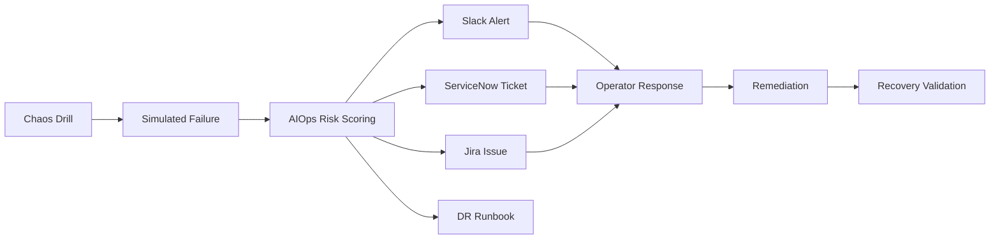

# Express Reliability Platform V9 — Operational Intelligence + ITSM Integration

## 1) Builds on V8

Before you start V9, copy your personal V8 repository to your local machine and rename it to V9:

```sh
git clone https://github.com/YOUR_USERNAME/express-reliability-platform-v08.git
mv express-reliability-platform-v08 express-reliability-platform-v09
cd express-reliability-platform-v09
```

Use the main class repository for scripts and canonical structure:

- https://github.com/Here2ServeU/express-reliability-platform-course

## 2) Version Purpose

V9 completes the operational intelligence loop. You detect incidents using AIOps, alert your team on Slack, open ITSM tickets automatically in ServiceNow and Jira, and run advanced chaos drills that exercise the full pipeline end-to-end.

## 3) Plain Language Context

**What is this version teaching you?**
When your system detects a problem, it should not wait for an engineer to notice — it should instantly send a Slack message to the team, open a ticket in the company's incident tracking system, and record everything. This is like a hospital paging system: the moment a patient monitor alarm fires, the right doctor gets paged AND the event is automatically logged in the patient record — all before anyone manually makes a phone call.

**How does a bank or hospital use this?**
Compliance regulations in banking (SOX, PCI-DSS) and healthcare (HIPAA, HITECH) require that every incident is logged in an auditable system within a specific timeframe. Manual ticket creation is slow and error-prone. Automated ITSM integration guarantees every incident is captured — even at 3am when no one is watching — and gives auditors a complete trail.

**Expected result at the end of this version:**
- `./chaos/run_chaos_drill.sh` runs four experiments and produces output for each pipeline stage.
- A Slack message appears in your chosen channel within seconds of an incident detection.
- A ServiceNow incident ticket and a Jira issue are both created automatically.
- Every step has `--dry-run` mode so you can test without actually posting or creating tickets.

## 4) Training Workflow (Understand -> Build -> Test -> Break -> Fix -> Explain -> Automate -> Improve)

1. Understand: Review the full pipeline — simulation → AIOps → Slack → ITSM → runbook.
2. Build: Configure Slack webhook, ITSM credentials, and chaos drill scripts.
3. Test: Run end-to-end chaos drills and validate every pipeline stage produces output.
4. Break: Trigger one controlled failure mode and watch alerts and tickets appear.
5. Fix: Apply recommended remediation and verify pipeline reaches recovery state.
6. Explain: Document what failed, why it failed, what the ITSM ticket captured, and what fixed it.
7. Automate: Wire chaos drills into CI/CD so every deployment is tested.
8. Improve: Tune detection thresholds and reduce false-positive ticket noise.

## 5) What You Will Build

- A real Slack webhook integration that fires rich alerts from AIOps evidence files.
- Automated ServiceNow incident ticket creation tied to AIOps risk scoring.
- Automated Jira issue creation with severity, labels, and structured description.
- An advanced chaos drill script that runs the full pipeline in one command.
- Telemetry simulation workflows covering latency, error rates, CPU stress, and pod kills.

## 6) Concepts Explained (Simple Language)

- **Slack Incoming Webhook**: a URL you paste into a curl or Python request; Slack posts the message to a channel. No bot token needed.
- **ITSM (IT Service Management)**: the practice of tracking incidents, changes, and requests in a ticketing system like ServiceNow or Jira so nothing is lost and every incident has an audit trail.
- **ServiceNow**: enterprise ticketing platform used heavily in regulated industries (finance, healthcare, government). incidents are tracked in the `incident` table via REST API.
- **Jira**: project and issue tracker used by engineering teams. REST API v3 creates issues with priority, labels, and rich text.
- **Chaos engineering**: intentionally injecting failures (latency, errors, crashes) in a controlled way to find weaknesses before customers do.
- **Blast radius**: the number of services or users affected when a failure spreads.
- **Full pipeline drill**: one command that injects a failure, scores it, alerts via Slack, and opens ITSM tickets — proving every layer is connected.

## 7) Architecture Diagram (Mermaid)



## 8) Project Structure

```text
express-reliability-platform-v09/
├── chaos/
│   └── run_chaos_drill.sh        <- full pipeline: inject -> score -> alert -> ticket
├── itsm/
│   ├── create_servicenow_ticket.py
│   └── create_jira_issue.py
├── scripts/
│   ├── aiops_score_and_summarize.sh
│   ├── simulate_latency.py
│   ├── simulate_500_error.py
│   ├── simulate_cpu_memory.py
│   ├── simulate_app_failure.py
│   └── terraform_init_apply.sh
├── slack/
│   └── send_slack_message.py     <- real Incoming Webhook implementation
├── dr/
│   └── runbook.txt
└── README.md
```

## 9) Step-by-Step Guide (Local and Cloud)

### Step A — Understand

Read the chaos drill script and ITSM scripts before running anything:

```sh
cat chaos/run_chaos_drill.sh
cat itsm/create_servicenow_ticket.py
cat itsm/create_jira_issue.py
cat slack/send_slack_message.py
```

What you should understand before building:

1. How `run_chaos_drill.sh` chains scoring → Slack → ITSM in one call.
2. What environment variables each integration requires.
3. What `--dry-run` mode does and why to use it first.

### Step B — Build: Configure Integrations

#### B1: Slack Incoming Webhook

1. Go to [https://api.slack.com/apps](https://api.slack.com/apps) → Create New App → From Scratch.
2. Enable **Incoming Webhooks** → Add New Webhook to Workspace → choose a channel.
3. Copy the webhook URL and export it:

```sh
export SLACK_WEBHOOK_URL=https://hooks.slack.com/services/YOUR/WEBHOOK/URL
```

Test it standalone:

```sh
python3 slack/send_slack_message.py --message "V9 Slack integration working"
```

Dry-run (no credentials needed):

```sh
python3 slack/send_slack_message.py --dry-run --message "test"
```

#### B2: ServiceNow (Personal Developer Instance)

1. Register at [https://developer.servicenow.com](https://developer.servicenow.com) and request a free PDI.
2. Note your instance name (format: `dev12345`).
3. Export credentials:

```sh
export SNOW_INSTANCE=dev12345
export SNOW_USER=admin
export SNOW_PASSWORD=your_pdi_password
```

Test standalone (dry-run first):

```sh
python3 itsm/create_servicenow_ticket.py --dry-run \
  --evidence-file artifacts/aiops/evidence/local/INC-001.json
```

#### B3: Jira (Free Cloud Instance)

1. Register at [https://www.atlassian.com/software/jira/free](https://www.atlassian.com/software/jira/free) and create a project (key: `OPS`).
2. Generate an API token at [https://id.atlassian.com/manage-profile/security/api-tokens](https://id.atlassian.com/manage-profile/security/api-tokens).
3. Export credentials:

```sh
export JIRA_BASE_URL=https://your-org.atlassian.net
export JIRA_USER=you@example.com
export JIRA_API_TOKEN=your_api_token
export JIRA_PROJECT=OPS
```

Test standalone (dry-run first):

```sh
python3 itsm/create_jira_issue.py --dry-run \
  --evidence-file artifacts/aiops/evidence/local/INC-001.json
```

### Step C — Test: Local Docker Gate

Run the mandatory local gate before any chaos drill:

```sh
cd ../express-reliability-platform-v04
docker compose up --build -d
curl http://localhost:8080/api/health
docker compose down
cd ../express-reliability-platform-v09
```

### Step D — Break: Run a Chaos Drill

Run the full pipeline with a single command:

```sh
chmod +x chaos/run_chaos_drill.sh scripts/aiops_score_and_summarize.sh
./chaos/run_chaos_drill.sh INC-CHAOS-001 node-api latency
```

Available experiments:

| Experiment | Simulates |
|---|---|
| `latency` | 1200ms API response time |
| `error_rate` | 8% HTTP 5xx error rate |
| `pod_kill` | Pod crash with multi-service fallout |
| `cpu_stress` | CPU saturation and elevated latency |

What the drill does in order:

1. Sets failure parameters for the chosen experiment.
2. Scores the incident using `scripts/aiops_score_and_summarize.sh`.
3. Sends a Slack alert (dry-run if `SLACK_WEBHOOK_URL` is not set).
4. Creates a ServiceNow ticket (dry-run if `SNOW_*` vars are not set).
5. Creates a Jira issue (dry-run if `JIRA_*` vars are not set).
6. Writes evidence to `artifacts/aiops/evidence/chaos/INC-CHAOS-001.json`.

Run simulations individually:

```sh
python3 scripts/simulate_latency.py
python3 scripts/simulate_500_error.py
python3 scripts/simulate_cpu_memory.py
python3 scripts/simulate_app_failure.py
```

Run AIOps checks separately:

```sh
python3 aiops/check_slo_sli.py
python3 aiops/predict_and_remediate.py
```

### Step E — Fix

Apply remediation steps from `dr/runbook.txt`. Verify recovery:

```sh
cd ../express-reliability-platform-v04
docker compose up --build -d
curl http://localhost:8080/api/health
cd ../express-reliability-platform-v09
```

### Step F — Explain

Document three answers after every drill:

1. What was injected?
2. What did AIOps detect and score?
3. What did the ITSM ticket capture, and what fixed it?

### Step G — Automate

The chaos drill is already a single script — wire it into CI/CD:

```sh
# In a GitHub Actions workflow:
- name: Chaos drill
  run: |
    chmod +x chaos/run_chaos_drill.sh scripts/aiops_score_and_summarize.sh
    ./chaos/run_chaos_drill.sh INC-CI-${{ github.run_number }} node-api latency
  env:
    SLACK_WEBHOOK_URL: ${{ secrets.SLACK_WEBHOOK_URL }}
```

### Step H — Improve

After each drill cycle:

- Adjust AIOps scoring thresholds to reduce false alerts.
- Improve ITSM ticket descriptions to capture all required triage fields.
- Add new chaos experiments for scenarios not yet covered.

### Step I — Cloud Deployment

1. Configure AWS access:

```sh
aws configure
aws sts get-caller-identity
```

2. Deploy shared environment:

```sh
terraform -chdir=environments/shared init
terraform -chdir=environments/shared apply -var-file=shared.tfvars
```

3. Deploy live environment:

```sh
terraform -chdir=environments/live init
terraform -chdir=environments/live apply -var-file=live.tfvars
```

4. Run chaos drill against cloud services:

```sh
./chaos/run_chaos_drill.sh INC-CLOUD-001 node-api error_rate
```

## 10) Validation Checklist

- [ ] All simulation scripts run without errors.
- [ ] AIOps scripts produce scored output.
- [ ] Chaos drill completes and writes evidence JSON.
- [ ] Slack dry-run output is visible (no credentials needed).
- [ ] Slack real alert fires with `SLACK_WEBHOOK_URL` set.
- [ ] ServiceNow dry-run shows correct ticket payload.
- [ ] ServiceNow ticket created on PDI with correct priority.
- [ ] Jira dry-run shows correct issue payload.
- [ ] Jira issue created with correct severity and labels.
- [ ] `dr/runbook.txt` steps were executed and documented.

## 11) Troubleshooting

- **Python package errors**: create a virtual environment (`python3 -m venv venv && source venv/bin/activate`).
- **Slack not sending**: verify `SLACK_WEBHOOK_URL` is exported and points to an active webhook. Run `--dry-run` first.
- **ServiceNow 401**: PDI credentials are wrong or the instance is hibernating. Wake it from the developer portal.
- **Jira 403**: API token may be expired or the project key is wrong. Verify `JIRA_PROJECT` matches an existing project key.
- **No evidence file**: confirm `scripts/aiops_score_and_summarize.sh` has execute permission and the output directory is writable.
- **Chaos drill exits early**: run each step manually to isolate which stage fails.

## 12) Cleanup

```sh
cd ../express-reliability-platform-v04
docker compose down
cd ../express-reliability-platform-v09
terraform -chdir=environments/live destroy -var-file=live.tfvars
terraform -chdir=environments/shared destroy -var-file=shared.tfvars
```

Archive all evidence files and document lessons learned.

## 13) Next Version Preview

In V10, you build post-book extension labs covering robotics simulation, quantum-augmented optimization, and full auto-remediation workflows that combine everything from V1 through V9.

---

## 14) Web UI Guide — `apps/web-ui/index.html`

### Platform Continuity

The V9 UI keeps the same V2 regulated readiness console and evolves it with ITSM, Slack, Jira, ServiceNow, chaos, and recovery validation checks. Students should experience this as the same platform growing, not as a separate app.

### What the V9 UI Does

The V9 `index.html` is the operational intelligence console. It evaluates the full incident workflow from signal to action:

- Chaos experiment or failure scenario.
- Slack alerting readiness.
- ServiceNow and Jira ITSM coverage.
- Recovery validation and audit evidence.

The page shows how AIOps becomes useful in a real enterprise workflow: detect the issue, alert the team, open tickets, run the drill, and prove recovery.

### What It Is Used For

Use the V9 UI to explain how regulated organizations make incidents auditable. Banks and hospitals cannot rely on informal chat messages or memory after an outage. Every incident needs a record, owner, severity, response path, and recovery proof.

This UI is useful for:

- Demonstrating Slack alert and ITSM readiness.
- Explaining ServiceNow and Jira incident records.
- Practicing chaos drill readiness conversations.
- Preparing students for V10 healthcare telemetry and predictive remediation.

### How to Read the Results

The UI generates an incident pipeline scorecard.

| Field | Meaning |
|---|---|
| `experiment` | The chaos or incident drill being evaluated. |
| `readiness_score` | Overall incident workflow readiness. |
| `readiness_band` | Plain-language status of the workflow. |
| `domains.reliability` | Drops when recovery validation is missing. |
| `domains.cost_efficiency` | Drops when alerting is missing or manual. |
| `domains.security_compliance` | Drops when ITSM coverage or recovery proof is weak. |
| `domains.intelligence_aiops_mlops` | Reflects how well AIOps connects to workflow automation. |

A strong V9 result should show configured alerting, ServiceNow and Jira coverage, and complete recovery validation.
