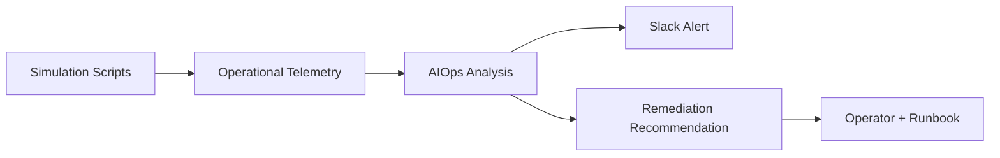

# Express Reliability Platform V9 — Cyber-Physical Reliability

## 1) Version Purpose

Apply reliability engineering to cyber-physical workflows using telemetry simulation, predictive checks, and automated response loops.

## 2) Chapters Covered

- Chapter 16: Robotics + IoMT Telemetry + Auto-Response (CPS workflows)

## 3) What You Will Build

- Incident simulation workflows across latency, errors, resource stress, and failures.
- AIOps checks plus Slack notifications for operations response.
- DR runbook practice tied to realistic failure scenarios.

## 4) Architecture Diagram (Mermaid)



## 5) Project Structure

```text
express-reliability-platform-v09/
├── aiops/
│   ├── check_slo_sli.py
│   └── predict_and_remediate.py
├── scripts/
│   ├── simulate_latency.py
│   ├── simulate_500_error.py
│   ├── simulate_cpu_memory.py
│   ├── simulate_app_failure.py
│   └── terraform_init_apply.sh
├── slack/
│   └── send_slack_message.py
├── dr/
│   └── runbook.txt
└── README.md
```

## 6) Run Steps

1. Install Python 3 and dependencies used by your scripts.
2. Run one failure simulation at a time:

	```sh
	python3 scripts/simulate_latency.py
	python3 scripts/simulate_500_error.py
	python3 scripts/simulate_cpu_memory.py
	python3 scripts/simulate_app_failure.py
	```

3. Run AIOps checks:

	```sh
	python3 aiops/check_slo_sli.py
	python3 aiops/predict_and_remediate.py
	```

4. Send/verify alert path:

	```sh
	python3 slack/send_slack_message.py
	```

5. Execute response steps from `dr/runbook.txt`.

## 7) Validation Checklist

- [ ] All simulation scripts run without syntax/runtime errors.
- [ ] AIOps scripts output prediction/check results.
- [ ] Slack alert path works (or dry-run output is validated).
- [ ] Runbook actions are executed and documented.

## 8) Troubleshooting

- Python package errors: create and activate a virtual environment.
- Slack failures: verify token/channel environment variables.
- No predicted incident: confirm simulation output is being produced before AIOps run.

## 9) Cleanup

- Stop any local processes and remove temporary test data/logs.

## 10) Next Version Preview

In V10, you extend into post-book labs with robotics and quantum-augmented optimization experiments.


