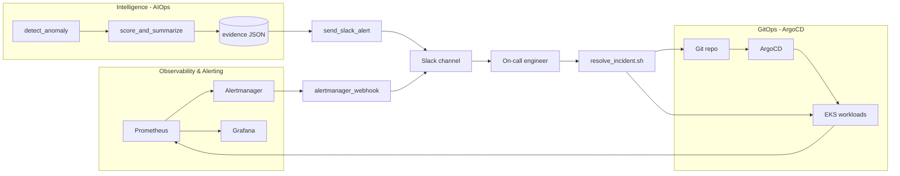

# Express Reliability Platform V10: AIOps, GitOps & Observability

## 1) Builds on V9

Before you start V10, copy your personal V9 repository to your local machine and rename it to V10:

```sh
git clone https://github.com/YOUR_USERNAME/express-reliability-platform-v09.git
mv express-reliability-platform-v09 express-reliability-platform-v10
cd express-reliability-platform-v10
```

Use the main class repository for scripts and canonical structure:

- https://github.com/Here2ServeU/express-reliability-platform-course

## 2) Version Purpose

V10 is the **operating brain** of the platform. It takes everything you built in
V1:V9 and wires it into a closed incident loop across three domains:

1. **Intelligence layer (AIOps)**: detect anomalies, score the risk, and summarize the incident.
2. **GitOps (ArgoCD)**: deploy and self-heal from Git; roll back to the last good revision automatically.
3. **Observability & Alerting**: Prometheus/Grafana/Alertmanager watch the golden signals and route
   alerts to **Slack**, where each alert names the **exact script the engineer runs to resolve the issue**.

The whole point of V10: a single signal travels from **detect → score → alert → resolve → self-heal**
without anyone hunting for the runbook.

> The capstone (the compilation of V1:V10) now lives in
> [`express-reliability-platform-capstone/`](../express-reliability-platform-capstone/). V10 is the
> focused technical build the capstone references for its intelligence, GitOps, and observability story.

## 3) Plain Language Context

**What is this version teaching you?**
When something breaks, three things must happen automatically: the system must *notice* (intelligence),
the system must *keep deploying and healing itself* (GitOps), and the right human must be *told exactly
what to do* (observability + alerting). V10 connects all three so an incident becomes a copy-paste fix
instead of a 2am investigation.

**How does a bank or hospital use this?**
Regulators expect detection, response, and recovery to be fast, consistent, and documented. AIOps removes
guesswork from triage, GitOps makes every change reversible and auditable through Git, and an alert that
names its own fix shrinks mean-time-to-recovery and removes tribal knowledge.

**Expected result at the end of this version:**
- `./scripts/run_intelligence_loop.sh latency node-api` runs detect → score → Slack alert end to end.
- The Slack alert names a runnable command, e.g. `./remediation/resolve_incident.sh latency node-api`.
- Prometheus + Alertmanager fire real alerts that reach Slack through the bridge.
- ArgoCD keeps the three services synced and self-healing from Git.
- Everything has a dry-run / no-credential path so you can practice safely.

## 4) The Three Domains

### Domain 1: Intelligence layer (AIOps)  `aiops/`

| File | What it does |
|---|---|
| `aiops/detect_anomaly.py` | Compares a measured signal to its SLO threshold and returns `ANOMALY`/`NORMAL`. |
| `aiops/score_and_summarize.py` | Scores risk (0:100), assigns severity, writes incident **evidence JSON**, and names the resolve command. |

### Domain 2: GitOps (ArgoCD)  `infrastructure/`, `policies/`, `.github/`

| Path | What it does |
|---|---|
| `infrastructure/argocd/project.yaml` | ArgoCD `AppProject` with RBAC and allowed namespaces. |
| `infrastructure/argocd/applicationsets/platform-services.yaml` | One ApplicationSet deploys node-api, flask-api, web-ui from Git. |
| `infrastructure/argocd/applications/node-api.yaml` | Single-app example with auto-sync, self-heal, and prune. |
| `infrastructure/helm/charts/*` | Helm charts ArgoCD renders and applies. |
| `infrastructure/terraform/*` | EKS + VPC the platform runs on. |
| `policies/opa/*` | OPA policies enforced in CI before sync. |
| `.github/workflows/ci-cd-pipeline.yaml` | Scan → build → push → **ArgoCD sync** → compliance check. |

### Domain 3: Observability & Alerting  `monitoring/`, `alerting/`, `remediation/`

| File | What it does |
|---|---|
| `monitoring/prometheus.yml` | Scrapes the services and loads the alert rules. |
| `monitoring/alert.rules.yml` | Golden-signal alerts; each carries a `resolve_command` annotation. |
| `monitoring/alertmanager/alertmanager.yml` | Routes firing alerts to the Slack bridge. |
| `monitoring/grafana-dashboard*.json` | Golden-signal dashboards. |
| `alerting/alertmanager_webhook.py` | Receives Alertmanager webhooks and posts Slack messages that name the resolve script. |
| `alerting/send_slack_alert.py` | Posts a rich AIOps alert from an evidence file (also names the resolve script). |
| `remediation/resolve_incident.sh` | **The script the engineer runs to resolve the incident.** |

## 5) Architecture Diagram (Mermaid)



## 6) Project Structure

```text
express-reliability-platform-v10/
├── aiops/
│   ├── detect_anomaly.py
│   └── score_and_summarize.py
├── alerting/
│   ├── alertmanager_webhook.py
│   └── send_slack_alert.py
├── remediation/
│   └── resolve_incident.sh
├── monitoring/
│   ├── prometheus.yml
│   ├── alert.rules.yml
│   ├── alertmanager/alertmanager.yml
│   ├── grafana-dashboard.json
│   └── grafana-dashboard-golden-signals.json
├── infrastructure/        <- GitOps: ArgoCD + Helm + Terraform
├── policies/opa/          <- policy-as-code enforced in CI
├── scripts/
│   ├── run_intelligence_loop.sh
│   ├── simulate_latency.py
│   ├── simulate_500_error.py
│   └── simulate_cpu_memory.py
├── apps/web-ui/index.html <- V10 readiness console (3 domains)
├── artifacts/evidence/    <- generated incident evidence JSON
├── docker-compose.observability.yml
├── .github/workflows/ci-cd-pipeline.yaml
└── README.md
```

## 7) Step-by-Step Guide

### Step A: Run the intelligence loop (no credentials needed)

```sh
chmod +x scripts/run_intelligence_loop.sh remediation/resolve_incident.sh
./scripts/run_intelligence_loop.sh latency node-api
```

This runs detect → score → Slack alert (dry-run unless `SLACK_WEBHOOK_URL` is set) and prints the
resolve command. Available signals: `latency`, `error_rate`, `cpu`, `pod_kill`.

Run the stages individually:

```sh
python3 scripts/simulate_latency.py
python3 aiops/detect_anomaly.py --signal latency --value 1200
python3 aiops/score_and_summarize.py --signal latency --service node-api
python3 alerting/send_slack_alert.py --evidence-file artifacts/evidence/INC-LATENCY.json
```

### Step B: Wire alerts to Slack for real

```sh
export SLACK_WEBHOOK_URL=https://hooks.slack.com/services/YOUR/WEBHOOK/URL
./scripts/run_intelligence_loop.sh error_rate flask-api
```

### Step C: Bring up observability and route real alerts

```sh
docker compose -f docker-compose.observability.yml up -d
# In a second terminal, start the Slack bridge (dry-runs without SLACK_WEBHOOK_URL):
python3 alerting/alertmanager_webhook.py
# Prometheus http://localhost:9090  |  Alertmanager http://localhost:9093  |  Grafana http://localhost:3000
```

When an alert fires, Alertmanager posts to the bridge, which sends a Slack message that ends with the
exact `resolve_command` from `monitoring/alert.rules.yml`.

### Step D: Resolve the incident with one script

Copy the command from the Slack alert and run it (dry-run first to preview the actions):

```sh
DRY_RUN=1 ./remediation/resolve_incident.sh latency node-api   # preview
./remediation/resolve_incident.sh latency node-api             # execute
```

### Step E: GitOps deploy (ArgoCD)

See [infrastructure/README.md](infrastructure/README.md) for the full Terraform → ArgoCD walkthrough.

```sh
kubectl apply -f infrastructure/argocd/project.yaml
kubectl apply -f infrastructure/argocd/applicationsets/platform-services.yaml
argocd app list
```

Because ArgoCD runs with `selfHeal: true`, the `error_rate` remediation prefers a **GitOps rollback**
(`argocd app rollback`) so the platform reconciles back to the last good revision automatically.

## 8) Validation Checklist

- [ ] `./scripts/run_intelligence_loop.sh latency node-api` completes and prints an evidence JSON.
- [ ] An evidence file appears under `artifacts/evidence/`.
- [ ] `send_slack_alert.py` dry-run shows the resolve command.
- [ ] With `SLACK_WEBHOOK_URL` set, a real Slack message arrives.
- [ ] `docker compose -f docker-compose.observability.yml up -d` starts Prometheus, Alertmanager, Grafana.
- [ ] `alertmanager_webhook.py` receives an alert and formats a Slack message naming the resolve script.
- [ ] `DRY_RUN=1 ./remediation/resolve_incident.sh latency node-api` prints the remediation plan.
- [ ] ArgoCD ApplicationSet syncs the three services.

## 9) Troubleshooting

- **Slack not sending**: confirm `SLACK_WEBHOOK_URL` is exported; run with `--dry-run` first.
- **Alertmanager can't reach the bridge**: the compose file maps `host.docker.internal`; on Linux the
  `extra_hosts: host-gateway` mapping handles it. Confirm the bridge is listening on `:5001`.
- **No evidence file**: ensure `artifacts/evidence/` is writable (the scorer creates it automatically).
- **ArgoCD app OutOfSync**: `argocd app sync <app> --prune`; check controller logs.

## 10) Web UI Guide: `apps/web-ui/index.html`

The V10 UI is the **Intelligence, GitOps & Observability console**. It keeps the same platform look
students have used since V2 and scores the platform across the three V10 domains: intelligence (AIOps),
GitOps (ArgoCD), and observability & alerting. Generate the scorecard to get a JSON readiness summary
with a band of `production ready`, `operationally solid`, `needs hardening`, or `not operational`.

## 11) Next Step: The Capstone

Once V10 is green, assemble the full story in
[`express-reliability-platform-capstone/`](../express-reliability-platform-capstone/): the compilation
of V1:V10 you present in interviews and to clients.
