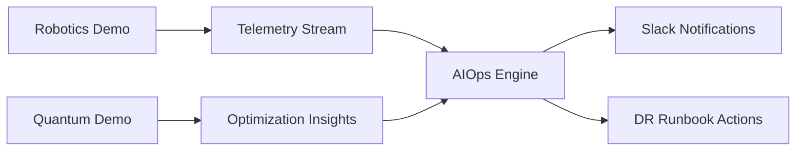

# Express Reliability Platform V10 — Quantum-Augmented Optimization (Post-Book Labs)

## 1) Version Purpose

Run extension labs that combine robotics simulation, AIOps workflows, and quantum-style optimization experiments.

## 2) Chapters Covered

- Bonus/Extension Labs: Quantum concepts applied to routing/scheduling (simulated)
- Integrated with Chapter 16 operational themes (CPS + auto-response)

## 3) What You Will Build

- A demo-ready lab environment for robotics and quantum experiments.
- End-to-end simulation flow: telemetry → analysis → alert → remediation.

## 4) Architecture Diagram (Mermaid)



## 5) Project Structure

```text
express-reliability-platform-v10/
├── robotics/
│   ├── demo_robotics.py
│   └── remediate_robot.py
├── quantum/
│   └── demo_quantum.py
├── aiops/
│   ├── check_slo_sli.py
│   └── predict_and_remediate.py
├── scripts/
│   ├── simulate_latency.py
│   ├── simulate_500_error.py
│   ├── simulate_cpu_memory.py
│   ├── simulate_app_failure.py
│   └── terraform_init_apply.sh
├── slack/
│   └── send_slack_message.py
├── dr/
│   └── runbook.txt
├── docs/
│   ├── onboarding.md
│   ├── demo_instructions.md
│   └── sre.md
└── README.md
```

## 6) Run Steps

1. Read docs first:

	```sh
	cat docs/onboarding.md
	cat docs/demo_instructions.md
	```

2. Run robotics labs:

	```sh
	python3 robotics/demo_robotics.py
	python3 robotics/remediate_robot.py
	```

3. Run quantum lab:

	```sh
	python3 quantum/demo_quantum.py
	```

4. Run reliability simulations and AIOps:

	```sh
	python3 scripts/simulate_latency.py
	python3 scripts/simulate_500_error.py
	python3 scripts/simulate_cpu_memory.py
	python3 scripts/simulate_app_failure.py
	python3 aiops/check_slo_sli.py
	python3 aiops/predict_and_remediate.py
	```

5. Send operational alerts:

	```sh
	python3 slack/send_slack_message.py
	```

## 7) Validation Checklist

- [ ] Robotics demo and remediation scripts execute.
- [ ] Quantum demo script executes.
- [ ] AIOps scripts produce outputs tied to simulated events.
- [ ] Slack alert path is validated.
- [ ] DR runbook is executed for at least one scenario.

## 8) Troubleshooting

- Import errors: install missing Python dependencies in a virtual environment.
- Script path errors: run commands from this version root folder.
- Alert failures: validate Slack configuration and required environment variables.

## 9) Cleanup

- Stop all active processes and archive demo output artifacts.

## 10) Next Version Preview

V10 is the final version in this course track. Next, package your final architecture, runbook set, and demo flow into a portfolio project and technical presentation.


